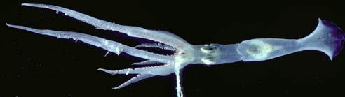
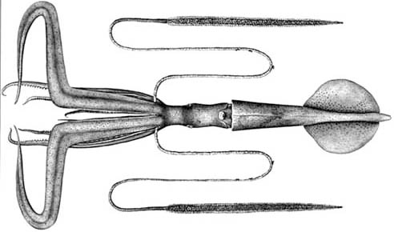
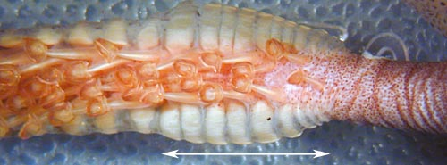

---
aliases:
  - picteti
title: Chiroteuthis picteti
---

## Phylogeny 

-   « Ancestral Groups  
    -  [Chiroteuthis](../Chiroteuthis.md) 
    -  [Chiroteuthidae](../../Chiroteuthidae.md) 
    -   [Chiroteuthid families](Chiroteuthid_families)
    -  [Oegopsida](../../../../Oegopsida.md) 
    -  [Decapodiformes](../../../../../Decapodiformes.md) 
    -  [Coleoidea](../../../../../../Coleoidea.md) 
    -  [Cephalopoda](../../../../../../../Cephalopoda.md) 
    -  [Mollusca](../../../../../../../../Mollusca.md) 
    -  [Bilateria](../../../../../../../../../Bilateria.md) 
    -  [Animals](../../../../../../../../../../Animals.md) 
    -  [Eukarya](../../../../../../../../../../../Eukarya.md) 
    -   [Tree of Life](../../../../../../../../../../../Tree_of_Life.md)

-   ◊ Sibling Groups of  Chiroteuthis
    -   [Chiroteuthis sp. B2](Chiroteuthis_sp._B2)
    -   [Chiroteuthis calyx](Chiroteuthis_calyx)
    -   [Chiroteuthis joubini](Chiroteuthis_joubini)
    -   [Chiroteuthis mega](Chiroteuthis_mega)
    -   Chiroteuthis picteti
    -   [Chiroteuthis spoeli](Chiroteuthis_spoeli)
    -   [Chiroteuthis veranyi](Chiroteuthis_veranyi)

-   » Sub-Groups 

# *Chiroteuthis picteti* [Joubin, 1894] 

[Clyde F. E. Roper and Richard E. Young]()

)

The holotype is deposited in the Oceanographic Museum of Monaco.

Containing group: [Chiroteuthis](../Chiroteuthis.md))*

## Introduction

***Chiroteuthis picteti*** is a medium-sized deep-sea squid with a broad
distribution in the Pacific and Indian Oceans. It is separated most
easily from most other members of the genus by its very long, slender,
tentacular clubs, a feature shared with ***C. mega***.\

Diagnosis

A Chiroteuthis \...

-   with three rows of individual, round photophores on each eyeball. 

### Characteristics

1.  Arms
    1.  Large suckers with 10-20 usually separate, pointed to blunt
        teeth on distal 2/3 of ring.
    2.  Largest suckers not globular.\
2.  Tentacular clubs
    1.  Suckers with central tooth enlarged.
    2.  Sucker stalks divided into two parts with flag-like lateral keel
        on proximal segment; stalks of suckers in lateral series about
        twice as long as those of medial series.
    3.  Protective membranes
        1.  Membranes in two sets with proximal set less than one tenth
            length of distal set and only slightly broader than distal
            set.\

           ){width="500"}
            **Figure**. Oral view of club base of ***C. picteti***
            showing short proximal section of the protective membrane
            (indicated by arrow). Photograph by R. Young.\

3.  Photophores
    1.  Eyeball- 3 series of round photophores: lateral series= 6 to 9;
        intermediate series = 8 to 11; medial series = 6 to 10; terminal
        photophores slightly larger.
    2.  Viscera: two photophores.\
4.  Pigmentation
    1.  Club sucker stalks without pigment.
    2.  Buccal membrane usually with dense epidermal pigment.

#### Comments

[More details of the description of ***C. picteti*** can be found here](http://www.tolweb.org/accessory/Chiroteuthis_picteti_Description?acc_id=711).

### Nomenclature

***C. picteti*** was originally described from Indonesian waters by
Joubin (1894). Shortly thereafter Goodrich (1896) described two species
from the Bay of Bengal, Indian Ocean. One, based on a large adult (360
mm ML) was named ***C. macrosoma***. The other, based on a doratopsis
paralarva, was named ***C. pellucida***. Both of these species appear to
be synonyms of ***C. picteti***. Chun (1908) described ***C.
imperator*** from off Sumatra, Indonesia, close to the type locality of
***C. picteti***. Our examination of the type of ***C. imperator***
showed no distinguishing features, and we consider this species to be a
synonym of ***C. picteti***. Salcedo-Vargas (1996) described a
subspecies, ***C. picteti somaliensis***, from the western Indian Ocean
that is distinguished by having more than the typical number of teeth on
the arm sucker rings (18-22) and the tentacle-club sucker rings (13-15).

### Life history

[Paralarval doratopsid stages](http://www.tolweb.org/accessory/Chiroteuthis_picteti_Paralarvae?acc_id=716)
have been described from Hawaiian waters (as ***C. imperator***) by
Young, 1991. The younger stages are unusual for a doratopsis in
virtually lacking a brachial pillar and, at later stages, having the
esophagus centrally located in the now present brachial pillar. The
advanced paralarva reaches a length of at least 45 mm ML.

Spent females are rarely found in the Chiroteuthididae. We describe one
observation here. A spent female ***C picteti***, dip-netted by a
fisherman off Oahu Hawaii, was seen swimming at the surface in
mid-afternoon over bottom depths of 2,000 m (8 mi. offshore). The squid
was 370 mm ML and the tissues were quite flaccid. No trace of discharged
spermatophores or spermathecae could be found. Virtually no trace of the
ovary remained except for a few spherical eggs measuring about 1.0 mm in
diameter. The squid was reddish-brown in color with most pigment in
chromatophores. One exception, however, was the oral surface of the
ventral arms (arms IV) including the oral surface of the tentacular
sheath. these surfaces had a very dark pigmentation with much of the
pigment in epithelial cells. The pigmentation here was much darker than
anywhere else on the squid. (The usually heavily pigmented buccal
membrane was not as dark as in immature squid).

A mature male that we examined, captured in a trawl, had no such
specialized pigment on the ventral arms. Considering the luminous organs
associated with the tentacles, perhaps the pigmentation acts as a
shutter over the retracted tentacles that are involved in some
luminescent reproductive behavior. The male (200 mm ML), which lacked
hectocotylization of the arms, had a large penis that extended well
outside the mantle cavity. A few spermatophores had been discharged,
apparently during capture. One of these was found attached inside but
near the tip of the funnel and suggests that normally the penis is
extended through the funnel.

### Distribution

We have observed considerable geographical variability in this species.
More careful study could indicate that this is a species complex. At
present, however, the data warrant recognition of only a single species.
This species is found in the tropical and subtropical Indo-West Pacific.

### References

Chun, C. 1908. Ueber Cephalopoden der Deutschen Tiefsee-Expedition,
Zoologischer Anzeiger, 33: 86-89.

Goodrich E. S. 1896. Report on a collection of Cephalopoda from the
Calcutta Museum. London, Transactions of the Linnean Society, series 2,
7: 1-24.

Joubin, L. 1894. Note p;reliminaire sur les Cephalopodes provenents des
campagnes du Yacht, L'Hirondelle. Memoires de la Societe Zoologique de
France, 7: 211-216.

Salcedo-Vargas, M. A. 1996. Cephalopods from the Netherlands Indian
Ocean Programme (NIOP) - I. *Chiroteuthis spoeli*, n. spec. and
*Chiroteuthis picteti somaliensis* n. subspec. Beaufortia, 46: 11-26.

Young, R. E. 1991. Chiroteuthid and related paralarvae from Hawaiian
waters. Bull. Mar. Sci., 49: 162-185.

## Title Illustrations

)

  -----------
  Scientific Name ::   Chiroteuthis picteti
  Location ::         Hawaii
  Life Cycle Stage ::   young subadult
  -----------
)

  ----------
  Scientific Name ::  Chiroteuthis picteti
  Location ::        Eltanin???
  Creator           J. Schroeder
  ----------

## Confidential Links & Embeds: 

### #is_/same_as :: [picteti](/_Standards/bio/bio~Domain/Eukarya/Animal/Bilateria/Mollusca/Cephalopoda/Coleoidea/Decapodiformes/Oegopsida/Chiroteuthid/Chiroteuthidae/Chiroteuthis/picteti.md) 

### #is_/same_as :: [picteti.public](/_public/bio/bio~Domain/Eukarya/Animal/Bilateria/Mollusca/Cephalopoda/Coleoidea/Decapodiformes/Oegopsida/Chiroteuthid/Chiroteuthidae/Chiroteuthis/picteti.public.md) 

### #is_/same_as :: [picteti.internal](/_internal/bio/bio~Domain/Eukarya/Animal/Bilateria/Mollusca/Cephalopoda/Coleoidea/Decapodiformes/Oegopsida/Chiroteuthid/Chiroteuthidae/Chiroteuthis/picteti.internal.md) 

### #is_/same_as :: [picteti.protect](/_protect/bio/bio~Domain/Eukarya/Animal/Bilateria/Mollusca/Cephalopoda/Coleoidea/Decapodiformes/Oegopsida/Chiroteuthid/Chiroteuthidae/Chiroteuthis/picteti.protect.md) 

### #is_/same_as :: [picteti.private](/_private/bio/bio~Domain/Eukarya/Animal/Bilateria/Mollusca/Cephalopoda/Coleoidea/Decapodiformes/Oegopsida/Chiroteuthid/Chiroteuthidae/Chiroteuthis/picteti.private.md) 

### #is_/same_as :: [picteti.personal](/_personal/bio/bio~Domain/Eukarya/Animal/Bilateria/Mollusca/Cephalopoda/Coleoidea/Decapodiformes/Oegopsida/Chiroteuthid/Chiroteuthidae/Chiroteuthis/picteti.personal.md) 

### #is_/same_as :: [picteti.secret](/_secret/bio/bio~Domain/Eukarya/Animal/Bilateria/Mollusca/Cephalopoda/Coleoidea/Decapodiformes/Oegopsida/Chiroteuthid/Chiroteuthidae/Chiroteuthis/picteti.secret.md)

