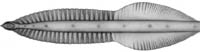
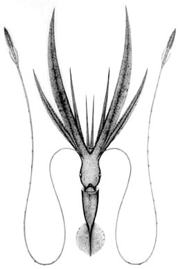
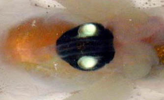
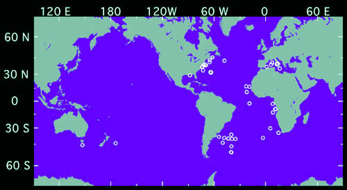

---
title: "Chiroteuthis veranyi"
---

## Phylogeny 

-   « Ancestral Groups  
    -  [Chiroteuthis](../Chiroteuthis.md))
    -  [Chiroteuthidae](../../Chiroteuthidae.md))
    -   [Chiroteuthid families](Chiroteuthid_families)
    -  [Oegopsida](../../../../Oegopsida.md))
    -  [Decapodiformes](../../../../../Decapodiformes.md))
    -  [Coleoidea](../../../../../../Coleoidea.md))
    -  [Cephalopoda](../../../../../../../Cephalopoda.md))
    -  [Mollusca](../../../../../../../../Mollusca.md))
    -  [Bilateria](../../../../../../../../../Bilateria.md))
    -  [Animals](../../../../../../../../../../Animals.md))
    -  [Eukarya](../../../../../../../../../../../Eukarya.md))
    -   [Tree of Life](../../../../../../../../../../../Tree_of_Life.md)

-   ◊ Sibling Groups of  Chiroteuthis
    -   [Chiroteuthis sp. B2](Chiroteuthis_sp._B2)
    -   [Chiroteuthis calyx](Chiroteuthis_calyx)
    -   [Chiroteuthis joubini](Chiroteuthis_joubini)
    -   [Chiroteuthis mega](Chiroteuthis_mega)
    -   [Chiroteuthis picteti](Chiroteuthis_picteti)
    -   [Chiroteuthis spoeli](Chiroteuthis_spoeli)
    -   Chiroteuthis veranyi

-   » Sub-Groups 

# *Chiroteuthis veranyi* [(Ferussac, 1835)] 

[Clyde F. E. Roper and Richard E. Young](http://www.tolweb.org/)
)

The holotype was deposited in the Museum of Natural History, Nice,
France, but it is no longer extant.

Containing group: [Chiroteuthis](../Chiroteuthis.md))*

## Introduction

***C. veranyi*** is the type species of the genus. It has a rich and
varied history (see Nomenclature), based in part on its description in
an era when few systematic characters were recognized and these were
poorly defined, and in part because of the unusual, large paralarval
stage that typifies the family. This species has a broad distributional
range and future studies may show that this is a complex of
closely-related species rather than the single species presently
recognized.

The title photograph shows a squid in an aquarium with the ventral arms
uppermost. This is reversed from what has been seen in situ from
submersibles (i.e., an oblique attitude with arms up but with the dorsal
arms uppermost).

#### Diagnosis

A ***Chiroteuthis*** \...

-   with short club divided into two nearly equal sections by protective
    membranes.
-   with trabeculae, in the proximal protective membrane of the club,
    fused at bases and undivided at tips.
-   with photophores on eyeball in strips and two photophores on
    viscera.

### Characteristics

1.  Arms
    1.  Largest arm suckers not globular nor greatly enlarged.
    2.  Large arm suckers with pointed teeth on distal margin of ring. \
2.  Tentacular clubs
    1.  Club suckers with central tooth enlarged.
    2.  Club sucker stalks in two distinct parts; stalks of lateral
        sucker series about twice as long as those of medial sucker
        series.
    3.  Club protective membranes
        1.  Membranes in two distinctive sets of nearly equal length.
3.  Photophores
    1.  Eyeball photophores: lateral series= stripe; intermediate series
        = 3 (2 posterior:large , small; 1 anterior); medial series =
        stripe.
    2.  Visceral photophores: Pair present.
4.  Pigmentation
    1.  Club sucker bases with pleats in short, well-defined region.
    2.  Buccal membrane unpigmented???.

#### Comments

[More details of the description of ***C. veranyi*** can be found here](http://www.tolweb.org/accessory/Chiroteuthis_veranyi_Description?acc_id=736).

The appearance of the visceral photophores are very different from those
of ***C. spoeli*** (see Life History on the *Chiroteuthis* page). In
***C. veranyi*** the photophores are more imbedded in the ink sac and
seem to have a different internal structure.
)

**Figure**. Ventral view of the visceral photophores of ***C.
veranyi***. Photograph by M. Vecchione.\

### Nomenclature

This species was originally described as ***Loligopsis veranyi*** by
Ferussac in 1835 for a specimen from the Mediterranean Sea. The genus
**Chiroteuthis** was erected for this species by Orbigny in 1841 \[In
Ferussac and Orbigny, 1834-1848\]. This remained the sole species in the
genus until 1881 when Verrill described ***Chiroteuthis lacertosa***
from the western Atlantic Ocean off Nova Scotia, followed shortly
thereafter by his ***Leptoteuthis diaphana*** in 1884, a juvenile from
off New Jersey, western Atlantic.

Although Ficalbi (1899) asserted that ***Doratopsis vermicularis***
Rochebrune, 1884 was the larval form and synonym of ***Chiroteuthis
veranyi***, this relationship was not generally accepted until confirmed
by Naef (1923). Naef also indicated that Verrill\'s ***Leptoteuthis
diaphana*** was a transitional stage between the doratopsis and subadult
of ***C. lacertosa***.

Pfeffer (1912) recognized two subspecies, ***C. veranyi veranyi***, from
the Mediterranean and eastern Atlantic and ***C. veranyi lacertosa***
from the western Atlantic from Nova Scotia to the Caribbean region.
Nesis (1982/87) concurred with the subspecific designations and expanded
the known geographical distribution of ***C.veranyi veranyi*** to
include southern subtropical areas of the Indian and Pacific Oceans. We
find no differences between ***C. veranyi*** and ***C. lacertosa*** at
the specific or subspecific levels. ***C. veranyi***, however, is a
broadly distributed species that exhibits considerable geographic
variation over its range. See Naef(1923) for complete synonomy.

The holotype of ***C. lacertosa*** (= synonym) is deposited in the
National Museum of Natural History in Washington. It is in its original
poor condition, with tentacles lacking, as when originally described.

### Life history

The early life-history stages have been described by Ficalbi, Verrill
and Naef. Nevertheless, separation of doratopsis stages from
co-occurring species has not been achieved. Little else is known of the
life history of ***C. veranyi***.

### Distribution

***C. veranyi*** is found throughout most of the Atlantic and the
southern subtropical areas of the Indian, and Pacific Ocean (Nesis,
1987). 
){width="500"}

**Figure**. Distribution map of ***C. veranyi*** based only on capture
data from specimens present in the collections of the U. S. National
Museum of Natural History. Map by R. Young.\

Little is known about the vertical distribution of this species. Roper
and Young (1975) report a single record of a subadult taken at a depth
of 400 m in the Mediterranean at night.

### References

Chun, C. 1910. Die Cephalopoden. Oegopsida. Wissenschaftliche Ergebnisse
der Deutschen Tiefsee-Expedition, \"Valdivia\" 1898-1899, 18: 1-522 +
Atlas.

Ferussac, A. d'. 1835. Sur deux genres de Cephalopodes encore peu connus
les genres *Calmaret* and *Cranchie* et sur une nouvelle espece for
remarquable de chacun de ces deus genres. Magsin de Zoologie, annee V,
classe V, 10 pp.

Ficalbi, E. 1899. Unicita di specie delle due forme di Cefalopodi
pelagici chiamate *Chiroteuthis veranyi* e *Doratopsis vermicularis*.
Monit. Zoologie Italia, 10.

Naef, A. (1921/23). Cephalopoda. Fauna e Flora del Golfo di Napoli.
Monograph, no. 35. English translation: A. Mercado (1972). Israel
Program for Scientific Translations Ltd., Jerusalem, Israel. 863pp.,
IPST Cat. No. 5110/1,2.

Nesis, K. N. 1982/87. Abridged key to the cephalopod mollusks of the
world\'s ocean. 385+ii pp. Light and Food Industry Publishing House,
Moscow. (In Russian.). Translated into English by B. S. Levitov, ed. by
L. A. Burgess (1987), Cephalopods of the world. T. F. H. Publications,
Neptune City, NJ, 351pp.

Pfeffer, G. 1912. Die Cephalopoden der Plankton-Expedition. Ergebniss
der Plankton-Expedition der Humboldt-Stiftung. 2: 1-815.

Roper, C. F. E. and R. E. Young. 1975. Vertical distribution of pelagic
cephalopods. Smithsonian Contributions to Zoolog, 209: 1-51.

Verrill, A.E. 1881. The cephalopods of the north-eastern coast of
America. Part II. The smaller cephalopods, including the "squids" and
the octopi, with other allied forms. Trans. Connecticut Acad. Sciences,
5: 259-446.

Verrill, A.E. 1884. Second catalogue of the Mollusca, recently added to
the fauna of the New England coast and the adjacent parts of the
Atlantic, consisting mostly of deep-sea species, with notes on others
previously recorded. Trans. connecticut Academy Scineces, 6: 133-294.

Young, R. E. (1972). The systematics and areal distribution of pelagic
cephalopods from the seas off Southern California. Smithson. Contr.
Zool., 97: 1-159.

## Title Illustrations



  ----------
  Scientific Name ::  Chiroteuthis veranyi
  Location ::        Antarctic waters
  Creator           E. McSweeny
  ----------
)

  ----------
  Scientific Name ::  Chiroteuthis veranyi
  Creator           A. D. Hart
  ----------

## Confidential Links & Embeds: 

### #is_/same_as ::[veranyi](veranyi.md)) 

### #is_/same_as :: [veranyi.public](/_public/bio/bio~Domain/Eukarya/Animal/Bilateria/Mollusca/Cephalopoda/Coleoidea/Decapodiformes/Oegopsida/Chiroteuthid/Chiroteuthidae/Chiroteuthis/veranyi.public.md) 

### #is_/same_as :: [veranyi.internal](/_internal/bio/bio~Domain/Eukarya/Animal/Bilateria/Mollusca/Cephalopoda/Coleoidea/Decapodiformes/Oegopsida/Chiroteuthid/Chiroteuthidae/Chiroteuthis/veranyi.internal.md) 

### #is_/same_as :: [veranyi.protect](/_protect/bio/bio~Domain/Eukarya/Animal/Bilateria/Mollusca/Cephalopoda/Coleoidea/Decapodiformes/Oegopsida/Chiroteuthid/Chiroteuthidae/Chiroteuthis/veranyi.protect.md) 

### #is_/same_as :: [veranyi.private](/_private/bio/bio~Domain/Eukarya/Animal/Bilateria/Mollusca/Cephalopoda/Coleoidea/Decapodiformes/Oegopsida/Chiroteuthid/Chiroteuthidae/Chiroteuthis/veranyi.private.md) 

### #is_/same_as :: [veranyi.personal](/_personal/bio/bio~Domain/Eukarya/Animal/Bilateria/Mollusca/Cephalopoda/Coleoidea/Decapodiformes/Oegopsida/Chiroteuthid/Chiroteuthidae/Chiroteuthis/veranyi.personal.md) 

### #is_/same_as :: [veranyi.secret](/_secret/bio/bio~Domain/Eukarya/Animal/Bilateria/Mollusca/Cephalopoda/Coleoidea/Decapodiformes/Oegopsida/Chiroteuthid/Chiroteuthidae/Chiroteuthis/veranyi.secret.md)

