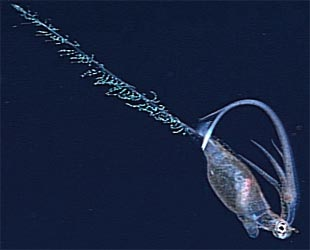
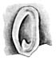
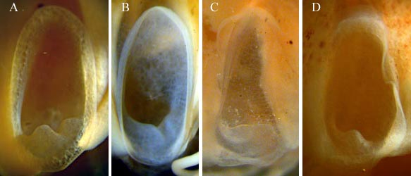

---
title: Planctoteuthis
---

# [[Planctoteuthis]] 
[Pfeffer, 1912] 

This genus contains five known species although *P. exopthalmica*, may
be a junior synonym of *P. levimana*.

## Introduction

[Richard E. Young, Michael Vecchione, and Clyde F. E. Roper](http://www.tolweb.org/) 

Species of ***Planctoteuthis*** are usually rather small and very
fragile deep-sea squids that are often badly damaged during capture. As
a result, few species have been described. Unlike other chiroteuthids,
the subadult retains the peculiar doratopsid paralarval tentacular club.
Roper and Young (1967) suggest that ***Planktoteuthis*** is a neotenic
doratopsis.

#### Diagnosis

A chiroteuthid \...

-   with antitragus only in oval funnel locking-apparatus.
-   with a compact club not divided into proximal and distal regions by
    structure of protective membranes.
-   without funnel valve.
-   without photophores.

### Characteristics

1.  Arms
    1.  Subequal in length in adults; arms IV much the longest in young.
    2.  Arms IV with relatively few suckers usually aligned in virtually
        single series.
2.  Tentacles
    1.  Club small, compact.
    2.  Low protective membranes along both boarders.
    3.  Not divided into proximal and distal regions by protective
        membranes.

       ){width="70"}
        **Figure**. Ventral view of funnel locking-apparatus of ***P.
        danae***, off California, 47 mm ML, showing posterior antitragus
        and no medial tragus. Drawing from Young (1972).

3.  Photophores
    1.  Absent.
4.  Tail
    1.  Tail present (usually lost during capture) with appendages.
        Appendages undescribed.

#### Comments

The exact form of the antitragus in the funnel locking-apparatus is
often a species-specific feature. Unfortunately this structure is
difficult to see and lighting and angle of view can often give different
apparent results. The character must be used cautiously. Compare the
locking apparatuses of the following species:
){width="583"}

**Figure**. Funnel component of the funnel/mantle locking apparatus of
various species of ***Planctoteuthis***. A - ***P. danae***. B - ***P.
levimana***, 60 mm ML. C - ***P. lippula***, 55 mm ML. D - ***P.
oligobessa***. Photographs by R. Young.

The species are compared in the following table.

  ------------------------------------ -------- ---------
                                               Arm IV suckers, number   Arm sucker dentition, arm I-III    Antitragus                            Fin length     Club shape            Club keel   Distribution
  ***P. danae***                               12-13                    7-9 distal truncated teeth         Double. Lobes nearly equal            52% ML         Symmetrical           No          Trop. Pacific
  ***P. exopthalmica*** = ***P. levimana***?   10                       ?                                  ?                                     width=36% ML   Symmetrical           No          S. Indian
  ***P. levimana***                            6-8                      Broad truncate teeth all around    Double. Lobes unequal                 40% ML         Long, symmetrical     No          N. Atlantic, Trop. Pacific
  ***P. lippula***                             25                       \>50 minute teeth, distal larger   Single or slight double. Low, broad   40-45% ML      Short, Asymmetrical   Yes         Atlantic, Trop. Pacific
  ***P. oligobessa***                          2-4                      25-35 blunt teeth, distal 2/3      Single. Slender                       23-33% ML      Symmetrical           No          Trop. Pacific
  ------------------------------------ -------- ---------

### Nomenclature

The type species, ***Planctoteuthis danae***, was originally placed in a
new genus, ***Valbyteuthis***, within a new family, Valbyteuthidae, by
Joubin (1931). Roper and Young (1967) placed ***Valbyteuthis*** in the
family Chiroteuthidae noting the similarity of ***Valbyteuthis***
paralarvae to those of ***Chiroteuthis***. Young (1991) recognized that
some paralarvae of ***Valbyteuthis*** had been previously descibed by
Pfeffer (1912) as members of his new genus, ***Planctoteuthis***, within
the Chiroteuthidae. ***Valbyteuthis***, therefore is a junior synonym of
***Planctoteuthis***.

### Life History

The doratopsis paralarva of ***Planctoteuthis*** can be recognized by:

1.  Strong ventral projection of eyes.
2.  Few suckers on arms, tentacles (young doratopsis).
3.  Relatively small, tapering tentacles (young doratopsis).
4.  Reduced vesicular region on mantle (young doratopsis).

Descriptions of paralarvae are found in pages on ***Planctoteuthis
lippula*** and ***P. danae***.

### Distribution

Lower mesopelagic to bathypelagic depth distribution within tropical to
temperate oceans of the world.

## Phylogeny 

-   « Ancestral Groups  
    -  [Chiroteuthidae](../Chiroteuthidae.md))
    -   [Chiroteuthid families](Chiroteuthid_families)
    -  [Oegopsida](../../../Oegopsida.md))
    -  [Decapodiformes](../../../../Decapodiformes.md))
    -  [Coleoidea](../../../../../Coleoidea.md))
    -  [Cephalopoda](../../../../../../Cephalopoda.md))
    -  [Mollusca](../../../../../../../Mollusca.md))
    -  [Bilateria](../../../../../../../../Bilateria.md))
    -  [Animals](../../../../../../../../../Animals.md))
    -  [Eukarya](../../../../../../../../../../Eukarya.md))
    -   [Tree of Life](../../../../../../../../../../Tree_of_Life.md)

-   ◊ Sibling Groups of  Chiroteuthidae
    -  [Asperoteuthis](Asperoteuthis.md))
    -  [Chiroteuthis](Chiroteuthis.md))
    -   [Grimalditeuthis         bonplandi](Grimalditeuthis_bonplandi)
    -   Planctoteuthis
    -   [New Genus B](New_Genus_B)
    -   [New Genus C](New_Genus_C)

-   » Sub-Groups
    -   [Planctoteuthis danae](Planctoteuthis_danae)
    -   [Planctoteuthis         exopthalmica](Planctoteuthis_exopthalmica)
    -   [Planctoteuthis levimana](Planctoteuthis_levimana)
    -   [Planctoteuthis lippula](Planctoteuthis_lippula)
    -   [Planctoteuthis         oligobessa](Planctoteuthis_oligobessa)

	-   *[Planctoteuthis     danae](Planctoteuthis_danae)*[
	    (Joubin 1931)]
	-   *[Planctoteuthis     exopthalmica](Planctoteuthis_exopthalmica)*[
	    (Chun 1910)]
	-   *[Planctoteuthis     levimana](Planctoteuthis_levimana)*[
	    (Lonnberg 1896)]
	-   *[Planctoteuthis     lippula](Planctoteuthis_lippula)*[
	    (Chun 1908)]
	-   *[Planctoteuthis     oligobessa](Planctoteuthis_oligobessa)*[
	    Young 1972]

## Title Illustrations

-----------------------------)
Scientific Name ::     Planctoteuthis oligobessa
Location ::           32° 52.29 N, 131° 17.49 W, North Pacific off California
Specimen Condition   Live Specimen
Copyright ::            © [Monterey Bay Aquarium Research Institute](http://www.mbari.org/rd/midwater)

## Confidential Links & Embeds: 

### #is_/same_as ::[Planctoteuthis](Planctoteuthis.md)) 

### #is_/same_as :: [Planctoteuthis.public](/_public/bio/bio~Domain/Eukarya/Animal/Bilateria/Mollusca/Cephalopoda/Coleoidea/Decapodiformes/Oegopsida/Chiroteuthid/Chiroteuthidae/Planctoteuthis.public.md) 

### #is_/same_as :: [Planctoteuthis.internal](/_internal/bio/bio~Domain/Eukarya/Animal/Bilateria/Mollusca/Cephalopoda/Coleoidea/Decapodiformes/Oegopsida/Chiroteuthid/Chiroteuthidae/Planctoteuthis.internal.md) 

### #is_/same_as :: [Planctoteuthis.protect](/_protect/bio/bio~Domain/Eukarya/Animal/Bilateria/Mollusca/Cephalopoda/Coleoidea/Decapodiformes/Oegopsida/Chiroteuthid/Chiroteuthidae/Planctoteuthis.protect.md) 

### #is_/same_as :: [Planctoteuthis.private](/_private/bio/bio~Domain/Eukarya/Animal/Bilateria/Mollusca/Cephalopoda/Coleoidea/Decapodiformes/Oegopsida/Chiroteuthid/Chiroteuthidae/Planctoteuthis.private.md) 

### #is_/same_as :: [Planctoteuthis.personal](/_personal/bio/bio~Domain/Eukarya/Animal/Bilateria/Mollusca/Cephalopoda/Coleoidea/Decapodiformes/Oegopsida/Chiroteuthid/Chiroteuthidae/Planctoteuthis.personal.md) 

### #is_/same_as :: [Planctoteuthis.secret](/_secret/bio/bio~Domain/Eukarya/Animal/Bilateria/Mollusca/Cephalopoda/Coleoidea/Decapodiformes/Oegopsida/Chiroteuthid/Chiroteuthidae/Planctoteuthis.secret.md)

