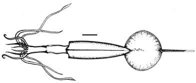
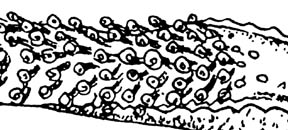
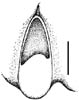

# *New Genus B* 

[Kir Nesis and Irene Nikitina]()

This unnamed species is based on two paralarvae.

Containing group:[Chiroteuthidae](../Planctoteuthis.md))

## Introduction

The doratopsid paralarvae (42 and 96 mm ML) were first described as
***Chiroteuthis*** n. sp. (Nesis, 1974) and later identified as
Chiroteuthidae n. gen. B (Nesis, 1982). These paralarvae are unusual in
having six series of suckers present on the developing adult club.
Although the importance of this feature is now uncertain, the structure
of the funnel locking-apparatus may also be unusual.\

### Characteristics

1.  Arms
    1.  Arms IV not thicker but longer then others.
    2.  Suckers on arms IV in one zigzag-like series.
    3.  Suckers with 8-9 long, blunt teeth distally; smooth proximally.
2.  Tentacular club
    1.  Developing adult club with suckers in six series.

       )
        Figure. Enlargement of base of club from previous drawing.

    2.  Doratopsid club (=distal portion of club) with aboral elongated
        yellowish swelling between keel and protective membrane
        (indicated by arrow).

       )
        **Figure**. Funnel component of the funnel-mantle locking
        apparatus, scale bar = ??, original.

#### Comments

The swelling on the doratopsid club was originally described as a
photophore (Nesis, 1974). Re-examination of the specimen shows that the
swelling has no pigment nor lens and is located under skin covered with
normal chromatophores. As a result, the function of this tissue is
uncertain. Eyes were absent from the paralarva illustrated and the
gladius was broken off at 22.5 mm beyond the fin. The total length of
the paralarva, with tentacles, is about 180 mm.

The peculiar arrangement of suckers on the presumptive adult club is
peculiar but does not necessarily indicate that the adult club will have
six sucker series. Naef (1923) noted a similar situation in a doratopsis
of ***C. veranyi*** from the Mediterranean. He states (p.389),
\"However, the longitudinal rows on the \[presumptive adult club\]
become zigzag rows because the oblique and transverse rows are slightly
displaced and alternating. This is thus not a simple quadriserial
arangement but a transition between a quadriserial and an octoserial
arrangement, which apparently later reverts to the basic quadriserial
type.\" Young (1991) noted numerous series of sucker buds on the
presumptive adult club of ***C. picteti*** doratopsis as had Sasaki
(1929) in his small ***C. borealis*** (= ***C. picteti***) doratopsis.
Whether or not the distinct hexiserial arrangement of suckers on the
presumptive adult club of this large doratopsis described here proves to
be different, remains to be determined.\

### Phylogenetic Position of New genus B

The extensive presumptive adult club and the possible presence of
photophores on the ink sac suggests that this species belongs to
***Chiroteuthis**.* The funnel locking-apparatus, however is unlike any
***Chiroteuthis*** species. Although the developmental history of the
locking-apparatus is not well known, Young (1991) stated that both
tragus and antitragus were present in a 12 mm ML doratopsis of
***Chiroteuthis picteti*** (=***C. imperator***).

### Distribution

The two paralarvae were taken in a single, open Isaacs-Kidd trawl that
fished at a depth of about 350m at 40°06.6\'S, 49°59\'W in the
southwestern Atlantic Ocean.

## Phylogeny 

-   « Ancestral Groups  
    -  [Chiroteuthidae](../../Chiroteuthidae.md))
    -   [Chiroteuthid families](Chiroteuthid_families)
    -  [Oegopsida](../../../../Oegopsida.md))
    -  [Decapodiformes](../../../../../Decapodiformes.md))
    -  [Coleoidea](../../../../../../Coleoidea.md))
    -  [Cephalopoda](../../../../../../../Cephalopoda.md))
    -  [Mollusca](../../../../../../../../Mollusca.md))
    -  [Bilateria](../../../../../../../../../Bilateria.md))
    -  [Animals](../../../../../../../../../../Animals.md))
    -  [Eukarya](../../../../../../../../../../../Eukarya.md))
    -   [Tree of Life](../../../../../../../../../../../Tree_of_Life.md)

-   ◊ Sibling Groups of  Chiroteuthidae
    -  [Asperoteuthis](../Asperoteuthis.md))
    -  [Chiroteuthis](../Chiroteuthis.md))
    -   [Grimalditeuthis         bonplandi](Grimalditeuthis_bonplandi)
    -  [Planctoteuthis](../Planctoteuthis.md))
    -   New Genus B
    -   [New Genus C](New_Genus_C)

-   » Sub-Groups 

### References

Nesis, K. N. 1974. Oceanic cephalopods of the southwestern Atlantic
Ocean. Trudy Inst. Okean. Shirshova Akad. Nauk SSSR, 98: 51-75.

Nesis, K. N. 1982. Abridged key to the cephalopod mollusks of the
world\'s ocean. 385+ii pp. Light and Food Industry Publishing House,
Moscow. (In Russian.). Translated into English by B. S. Levitov, ed. by
L. A. Burgess (1987), Cephalopods of the world. T. F. H. Publications,
Neptune City, NJ, 351pp.

## Title Illustrations

)

  --------------
  Scientific Name ::  New Genus B
  Comments          scale bar = 15 mm
  Size              96 mm ML
  Copyright ::         © 1999 K. Nesis and I. Nikitina
  --------------

## Confidential Links & Embeds: 

### #is_/same_as :: [Planctoteuthis_B](Planctoteuthis_B.md) 

### #is_/same_as :: [B.public](/_public/bio/bio~Domain/Eukarya/Animal/Bilateria/Mollusca/Cephalopoda/Coleoidea/Decapodiformes/Oegopsida/Chiroteuthid/Chiroteuthidae/Planctoteuthis/B.public.md) 

### #is_/same_as :: [B.internal](/_internal/bio/bio~Domain/Eukarya/Animal/Bilateria/Mollusca/Cephalopoda/Coleoidea/Decapodiformes/Oegopsida/Chiroteuthid/Chiroteuthidae/Planctoteuthis/B.internal.md) 

### #is_/same_as :: [B.protect](/_protect/bio/bio~Domain/Eukarya/Animal/Bilateria/Mollusca/Cephalopoda/Coleoidea/Decapodiformes/Oegopsida/Chiroteuthid/Chiroteuthidae/Planctoteuthis/B.protect.md) 

### #is_/same_as :: [B.private](/_private/bio/bio~Domain/Eukarya/Animal/Bilateria/Mollusca/Cephalopoda/Coleoidea/Decapodiformes/Oegopsida/Chiroteuthid/Chiroteuthidae/Planctoteuthis/B.private.md) 

### #is_/same_as :: [B.personal](/_personal/bio/bio~Domain/Eukarya/Animal/Bilateria/Mollusca/Cephalopoda/Coleoidea/Decapodiformes/Oegopsida/Chiroteuthid/Chiroteuthidae/Planctoteuthis/B.personal.md) 

### #is_/same_as :: [B.secret](/_secret/bio/bio~Domain/Eukarya/Animal/Bilateria/Mollusca/Cephalopoda/Coleoidea/Decapodiformes/Oegopsida/Chiroteuthid/Chiroteuthidae/Planctoteuthis/B.secret.md)

