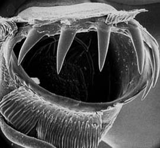

# *New Genus C* 

[Richard E. Young and Clyde F. E. Roper]()

This is an incompletely known species.

Containing group:[Chiroteuthidae](../Planctoteuthis.md))

## Introduction

This squid is known only from a badly damaged brachial crown. The
structure of the tentacular suckers is unusual and suggests that this
squid is distinct from all present species unless they are the
tentacular-club suckers of large ***Batoteuthis scolops*** which have
not been described. The only known specimen was taken from Antarctic
waters. We suspect that this damaged specimen belongs to an undescribed
chiroteuthid.

### Characteristics

1.  Suckers

    1.  Club suckers with ca. 8 slender, well separated teeth over
        distal half of ring merging into tiny teeth on proxomal margin;
        no enlarged central tooth.
    2.  Club sucker stalks appear to be uneven in length.
    3.  Club suckers appear to be in four series.
    4.  Arm suckers not globular, with ca. 14 pointed teeth on the
        distal 2/3 of the inner ring merging into very small, irregular
        teeth on the proximal margin.

    [Scanning electron micrographs of the suckers can be seen     here](http://www.tolweb.org/accessory/New_Genus_C_Suckers?acc_id=753)

#### Comments

The arm crown was badly stripped. Most protective membranes are missing
and no indication of club divisions remains. The lack of an enlarged
central tooth on the club sucker is similar to species in the
***Chiroteuthis joubini*** species group, but the slender nature of the
teeth and their broad separation from one another is unique.

### Distribution

The squid fragment was taken in an open trawl that fished to 2,000 m in
Antarctic waters at 57° 21\'S., 74° 43\'W.

## Phylogeny 

-   « Ancestral Groups  
    -  [Chiroteuthidae](../../Chiroteuthidae.md))
    -   [Chiroteuthid families](Chiroteuthid_families)
    -  [Oegopsida](../../../../Oegopsida.md))
    -  [Decapodiformes](../../../../../Decapodiformes.md))
    -  [Coleoidea](../../../../../../Coleoidea.md))
    -  [Cephalopoda](../../../../../../../Cephalopoda.md))
    -  [Mollusca](../../../../../../../../Mollusca.md))
    -  [Bilateria](../../../../../../../../../Bilateria.md))
    -  [Animals](../../../../../../../../../../Animals.md))
    -  [Eukarya](../../../../../../../../../../../Eukarya.md))
    -   [Tree of Life](../../../../../../../../../../../Tree_of_Life.md)

-   ◊ Sibling Groups of  Chiroteuthidae
    -  [Asperoteuthis](../Asperoteuthis.md))
    -  [Chiroteuthis](../Chiroteuthis.md))
    -   [Grimalditeuthis         bonplandi](Grimalditeuthis_bonplandi)
    -  [Planctoteuthis](../Planctoteuthis.md))
    -   [New Genus B](New_Genus_B)
    -   New Genus C

-   » Sub-Groups 

## Title Illustrations

)

  -------------------------
  Scientific Name ::  New Genus C
  Body Part         Distorted tentacular club sucker with outer ring partially removed
  -------------------------

## Confidential Links & Embeds: 

### #is_/same_as :: [Planctoteuthis_C](Planctoteuthis_C.md) 

### #is_/same_as :: [C.public](/_public/bio/bio~Domain/Eukarya/Animal/Bilateria/Mollusca/Cephalopoda/Coleoidea/Decapodiformes/Oegopsida/Chiroteuthid/Chiroteuthidae/Planctoteuthis/C.public.md) 

### #is_/same_as :: [C.internal](/_internal/bio/bio~Domain/Eukarya/Animal/Bilateria/Mollusca/Cephalopoda/Coleoidea/Decapodiformes/Oegopsida/Chiroteuthid/Chiroteuthidae/Planctoteuthis/C.internal.md) 

### #is_/same_as :: [C.protect](/_protect/bio/bio~Domain/Eukarya/Animal/Bilateria/Mollusca/Cephalopoda/Coleoidea/Decapodiformes/Oegopsida/Chiroteuthid/Chiroteuthidae/Planctoteuthis/C.protect.md) 

### #is_/same_as :: [C.private](/_private/bio/bio~Domain/Eukarya/Animal/Bilateria/Mollusca/Cephalopoda/Coleoidea/Decapodiformes/Oegopsida/Chiroteuthid/Chiroteuthidae/Planctoteuthis/C.private.md) 

### #is_/same_as :: [C.personal](/_personal/bio/bio~Domain/Eukarya/Animal/Bilateria/Mollusca/Cephalopoda/Coleoidea/Decapodiformes/Oegopsida/Chiroteuthid/Chiroteuthidae/Planctoteuthis/C.personal.md) 

### #is_/same_as :: [C.secret](/_secret/bio/bio~Domain/Eukarya/Animal/Bilateria/Mollusca/Cephalopoda/Coleoidea/Decapodiformes/Oegopsida/Chiroteuthid/Chiroteuthidae/Planctoteuthis/C.secret.md)

