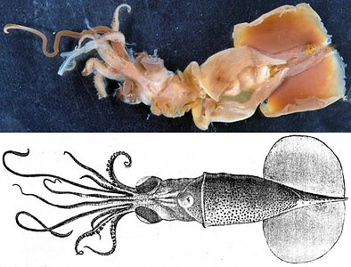
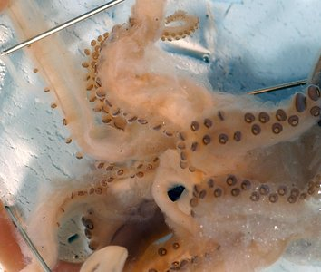
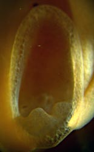
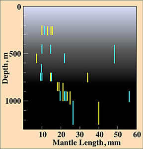

# Planctoteuthis [[danae]] 
[(Joubin 1931)] 

[Richard E. Young and Clyde F. E. Roper]()

The holotype is deposited in the Zoological Museum, University of
Copenhagen, Denmark.

Containing group: [Planctoteuthis](../Planctoteuthis.md))*

## Introduction

***Planctoteuthis*** ***dana******e*** is one of the more sturdy members
of the genus, and it is most easily recognized by its relatively large,
muscular fins.

#### Diagnosis

A ***Planctoteuthis*** with

-   Fin length more than 50% of mantle length.

### Characteristics

1.  Arms
    1.  Arms IV with 12-13 suckers each.\

       ){width="353"}\
        **Figure**. Oral view of ***P. danae***, holotype, showing arm
        IV suckers. Note the two enlarged suckers on arm II (upper right
        in photograph). Photograph by R. Young.

2.  Tentacular clubs
    1.  Clubs bilaterally symmetrical and lack keels.

    2.  Club length 12-18% of ML.\

       )

        **Figure**. Frontal view of the funnel locking-apparatus, ***P.
        danae***, subadult, eastern Pacific. Photograph by R. Young.
3.  Fins
    1.  Fin length 52% of ML.

#### Comments

[More details of the description of ***P. danae*** can be found here.](http://www.tolweb.org/notes/?note_id=4169 "P. danae description") 

### Nomenclature

This species was originally placed in the genus ***Valbyteuthis***
Joubin, 1931, which was subsequently synonomized with
***Planctoteuthis*** (Young, 1991).

### Life history

[Paralarval stages from Hawaiian waters are described here.](http://www.tolweb.org/accessory/Planctoteuthis_danae_Paralarvae?acc_id=764)

### Distribution

#### Vertical

In the eastern North Atlantic paralarvae are found mostly between 200
and 300 m (Clarke and Lu, 1974). Between about 10 and 15 mm ML they are
found between 200 and 800 m and at larger sizes they are found at depths
greater than 700 m during the day with some captures at depths of over
1000 m. In 1974 ***P. danae*** was in the genus ***Valbyteuthis*** which
contained only two species, ***P. danae*** and ***P. oligobessa***
Young, 1972, both from the Pacific Ocean. The identification of the
species upon which this vertical distribution is based needs
confirmation. We know of no other records of ***P. danae*** in the
Atlantic Ocean. The data could refer to ***P. lippula***.
)

**Figure**. Vertical distribution graph based on opening/closing nets
with tows at two localities, one at 11°N Lat. and the other at 18°N
Lat., North Atlantic. **Yellow** - Day capture. **Blue** - Night
capture. **Bar length** - fishing depth of net. Chart modified from
Clarke and Lu, 1975 and Lu and Clarke, 1975.

#### Geographical

The type locality is the Gulf of Panama, tropical eastern Pacific Ocean.
It has also been reported from off California and Hawaii (Young, 1972;
1978), off central Chile and the eastern Polynesian Islands (Nesis,
1982), and the eastern North Atlantic -see comments above- (Clarke and
Lu, 1975 and Lu and Clarke, 1975).

## Phylogeny 

-   « Ancestral Groups  
    -  [Planctoteuthis](../Planctoteuthis.md))
    -  [Chiroteuthidae](../../Chiroteuthidae.md))
    -   [Chiroteuthid families](Chiroteuthid_families)
    -  [Oegopsida](../../../../Oegopsida.md))
    -  [Decapodiformes](../../../../../Decapodiformes.md))
    -  [Coleoidea](../../../../../../Coleoidea.md))
    -  [Cephalopoda](../../../../../../../Cephalopoda.md))
    -  [Mollusca](../../../../../../../../Mollusca.md))
    -  [Bilateria](../../../../../../../../../Bilateria.md))
    -  [Animals](../../../../../../../../../../Animals.md))
    -  [Eukarya](../../../../../../../../../../../Eukarya.md))
    -   [Tree of Life](../../../../../../../../../../../Tree_of_Life.md)

-   ◊ Sibling Groups of  Planctoteuthis
    -   Planctoteuthis danae
    -   [Planctoteuthis         exopthalmica](Planctoteuthis_exopthalmica)
    -   [Planctoteuthis levimana](Planctoteuthis_levimana)
    -   [Planctoteuthis lippula](Planctoteuthis_lippula)
    -   [Planctoteuthis         oligobessa](Planctoteuthis_oligobessa)

-   » Sub-Groups 

## Title Illustrations

------------------------------------------------------------------------------)
Scientific Name ::     Planctoteuthis danae
Reference            Joubin, L. 1931. Notes preliminaires sur les cephalopodes des croiseires du "Dana" (1921-1922). Annales de l'Institut Oceanographique, 10: 169-211.
Specimen Condition   Preserved
View                 Ventral
Size                 ca. 65 mm ML
Type                 Holotype
Copyright ::            © [Richard E. Young](http://www.soest.hawaii.edu/%7Eryoung/rey.html) 

## Confidential Links & Embeds: 

### #is_/same_as :: [danae](/_Standards/bio/bio~Domain/Eukarya/Animal/Bilateria/Mollusca/Cephalopoda/Coleoidea/Decapodiformes/Oegopsida/Chiroteuthid/Chiroteuthidae/Planctoteuthis/danae.md) 

### #is_/same_as :: [danae.public](/_public/bio/bio~Domain/Eukarya/Animal/Bilateria/Mollusca/Cephalopoda/Coleoidea/Decapodiformes/Oegopsida/Chiroteuthid/Chiroteuthidae/Planctoteuthis/danae.public.md) 

### #is_/same_as :: [danae.internal](/_internal/bio/bio~Domain/Eukarya/Animal/Bilateria/Mollusca/Cephalopoda/Coleoidea/Decapodiformes/Oegopsida/Chiroteuthid/Chiroteuthidae/Planctoteuthis/danae.internal.md) 

### #is_/same_as :: [danae.protect](/_protect/bio/bio~Domain/Eukarya/Animal/Bilateria/Mollusca/Cephalopoda/Coleoidea/Decapodiformes/Oegopsida/Chiroteuthid/Chiroteuthidae/Planctoteuthis/danae.protect.md) 

### #is_/same_as :: [danae.private](/_private/bio/bio~Domain/Eukarya/Animal/Bilateria/Mollusca/Cephalopoda/Coleoidea/Decapodiformes/Oegopsida/Chiroteuthid/Chiroteuthidae/Planctoteuthis/danae.private.md) 

### #is_/same_as :: [danae.personal](/_personal/bio/bio~Domain/Eukarya/Animal/Bilateria/Mollusca/Cephalopoda/Coleoidea/Decapodiformes/Oegopsida/Chiroteuthid/Chiroteuthidae/Planctoteuthis/danae.personal.md) 

### #is_/same_as :: [danae.secret](/_secret/bio/bio~Domain/Eukarya/Animal/Bilateria/Mollusca/Cephalopoda/Coleoidea/Decapodiformes/Oegopsida/Chiroteuthid/Chiroteuthidae/Planctoteuthis/danae.secret.md)

