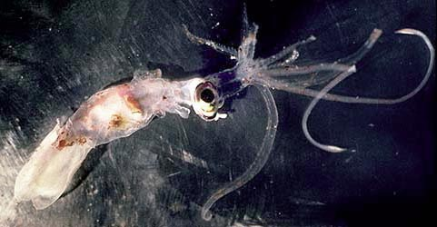
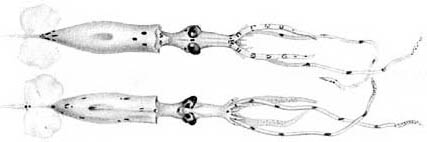
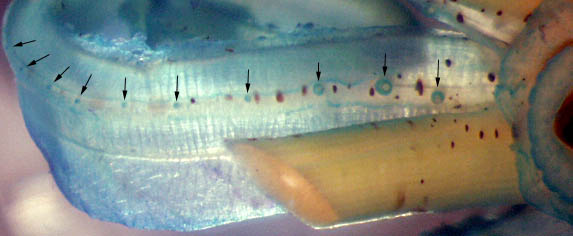
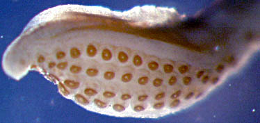
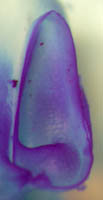
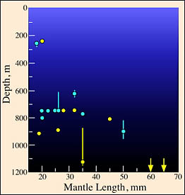

---
aliases:
  - lippula
title: Planctoteuthis lippula
---

## Phylogeny 

-   « Ancestral Groups  
    -  [Planctoteuthis](../Planctoteuthis.md) 
    -  [Chiroteuthidae](../../Chiroteuthidae.md) 
    -   [Chiroteuthid families](Chiroteuthid_families)
    -  [Oegopsida](../../../../Oegopsida.md) 
    -  [Decapodiformes](../../../../../Decapodiformes.md) 
    -  [Coleoidea](../../../../../../Coleoidea.md) 
    -  [Cephalopoda](../../../../../../../Cephalopoda.md) 
    -  [Mollusca](../../../../../../../../Mollusca.md) 
    -  [Bilateria](../../../../../../../../../Bilateria.md) 
    -  [Animals](../../../../../../../../../../Animals.md) 
    -  [Eukarya](../../../../../../../../../../../Eukarya.md) 
    -   [Tree of Life](../../../../../../../../../../../Tree_of_Life.md)

-   ◊ Sibling Groups of  Planctoteuthis
    -   [Planctoteuthis danae](Planctoteuthis_danae)
    -   [Planctoteuthis         exopthalmica](Planctoteuthis_exopthalmica)
    -   [Planctoteuthis levimana](Planctoteuthis_levimana)
    -   Planctoteuthis lippula
    -   [Planctoteuthis         oligobessa](Planctoteuthis_oligobessa)

-   » Sub-Groups 

# *Planctoteuthis lippula* [(Chun 1908)] 

[Richard E. Young and Clyde F. E. Roper]()

)

Containing group: [Planctoteuthis](../Planctoteuthis.md))*

## Introduction

The original description was based two paralarvae, one complete
individual and one detached head. Its distinguishing feature is the
shape of the club.

#### Diagnosis

A ***Planctoteuthis*** \...

-   with a short club bearing a distinct keel.

### Characteristics

1.  Arm suckers (from Chun, 1910 and remnants of holotype):
    1.  Suckers on arms I-III numerous, closely packed in two series.
    2.  Arm IV suckers in a virtual single series.
    3.  Total of 15 suckers on right arm IV, holotype; however, gaps
        indicate some suckers may have been lost. Over 25 suckers on
        each arm IV, Hawaiian specimen, 35 mm ML.
    4.  Proxmal 3-5 suckers of arm IV moderate in size; more distal
        suckers extremely smalll; suckers absent from absent from distal
        quarter of arm (Hawaiian squid).

       )
        **Figure**. Oral view of proximal region of arm IV of ***P.
        lippula***, 35 mm ML. Hawaiian waters, stained with methylene
        blue. Arrows indicate positions of suckers (not all distal
        suckers can be seen). Photograph by R. Young.

2.  Tentacular clubs
    1.  Short, broad.

    2.  Club suckers virtually smooth; may have a few rounded knobs
        (Hawaiian specimen).

    3.  Low, thick protective membranes along both borders.

    4.  Keel present.

       )
        **Figure**. Oblique-oral view of the club of ***P. lippul***a,
        35 mm ML, Hawaiian waters, preserved. Note the distinct keel and
        general similarity to the club above from the Atlantic specimen.
        Photograph by R. Young.

        [Scanning electron micrographs of the suckers can be seen         here.](http://www.tolweb.org/notes/?note_id=3123)
3.  Funnel
    1.  Funnel valve absent.
    2.  Locking apparatus broad with deep central groove and with a low,
        broad antitragus present.

       ){width="103"}
        **Figure**. Funnel locking-apparatus of ***P. lippula***.
        **Left** - 55 mm ML, 35.2°N, 49.1°W, preserved, unstained. Note
        the slight indication of a double nature of the antitragus.
        **Right** - 35 mm ML, Hawaiian waters, stained with methylene
        blue. Photographs by R. Young.

4.  Fins
    1.  Each fin circular in outline.
5.  Measurements and counts
      --------- ------
                        North Atlantic    Hawaiian waters
      Sex ::             Immature female    
      Mantle length     56 mm             35 mm
      Fin length        25 mm             14 mm
      Fin width         37 mm             25 mm
      Arm I, length     15 mm             9 mm
      Arm II, length    \-                14 mm
      Arm III, length   \-                18 mm
      Arm IV, length    40 mm             28 mm
      Tentacle length   88 mm              
      Club length\*     5.7                
      Arm IV, suckers   19+ / 22+         25
      --------- ------

    \*Measured from proximal sucker and without straightening club.

#### Comments

Chun\'s description is based on a 16 mm ML specimen and the head of a
second specimen, taken from the same tow, estimated to have a ML of 20
mm. The above description is based on a series of small specimens taken
from the central North Pacific and one larger (56 mm ML) squid taken
from the North Atlantic. We have not been able to recognize differrences
in specimens between oceans that would suggest they belong to separate
species. Arm IV sucker counts on the holotype were found in notes we had
taken of the holotype many years ago.

### Nomenclature

This species was originally described as ***Doratopsis lippula*** by
Chun (1908) but was transferred to ***Planktoteuthis*** by Pfeffer
(1912).

### Life history

[The doratopsis states have been described from Hawaiian waters.](http://www.tolweb.org/notes/?note_id=3122)

### Distribution

Type locality - Benguela Current, 11° 28\' N., 10° 24\' E.

#### Vertical distribution

In a study off Hawaii, Young (1978) captured 18 ***Planctoteuthis
lippula***. Two taken between 200 and 300 m were young squid that had
not descended from the shallow, paralarval habitat. Except for a single
night capture at 625 m, all other captures were from depths of over 700
m. The larger squid captured, sugest a further ontogenetic descent.
){height="275" width="262"}

**Figure**. Vertical distribution chart of ***P. lippula***, Hawaiian
waters. Captures were made with both open and opening/closing trawls.
**Bars** - Fishing depth-range of opening/closing trawl. Circle - Modal
fishing depth for either trawl. **Blue color** - Night captures.
**Yellow color** - Day captures. Arrows indicate that the trawl fishing
depth extended beyond the limits of the chart. Chart modified from Young
(1978).

#### Geographical distribution

This species is known only from the Atlantic and central Pacific Oceans.

### References

Chun, C. 1908. Ueber Cephalopoden der Deutschen Tiefsee-Expedition,
Zoologischer Anzeiger, 33: 86-89.

Chun, C. 1910. Die Cephalopoden. Oegopsida. Wissenschaftliche Ergebnisse
der Deutschen Tiefsee-Expedition, \"Valdivia\" 1898-1899, 18: 1-522 +
Atlas.

Pfeffer, G. 1912. Die Cephalopoden der Plankton-Expedition. Ergebniss
der Plankton-Expedition der Humboldt-Stiftung. 2: 1-815.

## Title Illustrations

)

  ------------------------------------------------------------------------------
  Scientific Name ::     Planctoteuthis lippula
  Location ::           Hawaiian waters
  Specimen Condition   Fresh
  View                 Side
  Size                 35 mm ML
  Copyright ::            © [Richard E. Young](http://www.soest.hawaii.edu/%7Eryoung/rey.html) 
 
  ------------------------------------------------------------------------------
)

  ------------
  Scientific Name ::     Planctoteuthis lippula
  Location ::           Tropical Atlantic
  Specimen Condition   Dead Specimen
  Life Cycle Stage ::     Paralarva
  View                 Ventral/dorsal
  Size                 16 mm ML
  Type                 Syntype
  ------------

## Confidential Links & Embeds: 

### #is_/same_as :: [lippula](/_Standards/bio/bio~Domain/Eukarya/Animal/Bilateria/Mollusca/Cephalopoda/Coleoidea/Decapodiformes/Oegopsida/Chiroteuthid/Chiroteuthidae/Planctoteuthis/lippula.md) 

### #is_/same_as :: [lippula.public](/_public/bio/bio~Domain/Eukarya/Animal/Bilateria/Mollusca/Cephalopoda/Coleoidea/Decapodiformes/Oegopsida/Chiroteuthid/Chiroteuthidae/Planctoteuthis/lippula.public.md) 

### #is_/same_as :: [lippula.internal](/_internal/bio/bio~Domain/Eukarya/Animal/Bilateria/Mollusca/Cephalopoda/Coleoidea/Decapodiformes/Oegopsida/Chiroteuthid/Chiroteuthidae/Planctoteuthis/lippula.internal.md) 

### #is_/same_as :: [lippula.protect](/_protect/bio/bio~Domain/Eukarya/Animal/Bilateria/Mollusca/Cephalopoda/Coleoidea/Decapodiformes/Oegopsida/Chiroteuthid/Chiroteuthidae/Planctoteuthis/lippula.protect.md) 

### #is_/same_as :: [lippula.private](/_private/bio/bio~Domain/Eukarya/Animal/Bilateria/Mollusca/Cephalopoda/Coleoidea/Decapodiformes/Oegopsida/Chiroteuthid/Chiroteuthidae/Planctoteuthis/lippula.private.md) 

### #is_/same_as :: [lippula.personal](/_personal/bio/bio~Domain/Eukarya/Animal/Bilateria/Mollusca/Cephalopoda/Coleoidea/Decapodiformes/Oegopsida/Chiroteuthid/Chiroteuthidae/Planctoteuthis/lippula.personal.md) 

### #is_/same_as :: [lippula.secret](/_secret/bio/bio~Domain/Eukarya/Animal/Bilateria/Mollusca/Cephalopoda/Coleoidea/Decapodiformes/Oegopsida/Chiroteuthid/Chiroteuthidae/Planctoteuthis/lippula.secret.md)

