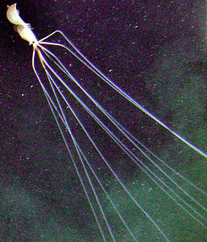
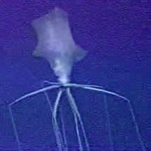

---
aliases:
  - Magnapinnidae
title: Magnapinna
---

## Magnapinnidae [Vecchione and Young, 1998] 

# *Magnapinna* [Vecchione and Young, 1998] 
 

Containing group:[Chiroteuthid families](../Chiroteuthid.md) 

## Introduction

The family Magnapinnidae was originally based on a single species,
***Magnapinna pacifica***. However, the discovery of a second species,
***M. atlantica***, and the realization that other known specimens and
species belong in the family indicate that this poorly known deep-sea
family may have as many as five species based on only eleven specimens.
However, as only two of the species are well-described, and four of them
are weakly separated from one another, we cannot infer yet that this is
a highly speciose family.\

Vecchione et al. (2002) described the occurrence of a strange, large
squid recorded only by submersible or ROV observations (see title
photograph). The authors suggested that these squid belong in the family
Magnapinnidae. With the discovery of more species, although based only
on small individuals, we are now confident that these large deep-sea
squid are magnapinnids, and we include them here. The title photograph
shows the thicker regions of the arms and tentacles that are often held
at nearly right angles to the body axis and the long, slender portions
of the arms and tentacles that trail the squid and are nearly parallel
to the body axis. Apparent counterparts for these regions of the
arms/tentacles are present in the juveniles. For ease of description we
give separate names to these two regions: the
**proximal-arms/tentacles** and the **distal-arms/tentacles**.

Based on similarity (cladistic analyses have not been made), this family
seems most closely related to the \"chiroteuthid families\" (Vecchione
and Young, 1998). These families include the Chiroteuthidae,
Mastigoteuthidae, Joubiniteuthidae, Batoteuthidae and Promachoteuthidae.
It shares the following characteristics with these families:

-   Buccal connectives attach to ventral margins of arms IV.
-   Gladius apparently with elongate secondary conus (except in
    Promachoteuthidae).
-   Absence of the \"teuthoid\" tentacular club.

A few additional characters are shared with the Chiroteuthidae and
Mastigoteuthidae:

-   Fins terminal (often large) extending well beyond the posterior end
    of the muscular mantle (this feature is also present in the
    Lepidoteuthidae).
-   Oval funnel-locking cartilage but without protrusions (this feature
    is also present in the Joubiniteuthidae and Promachoteuthidae).

#### Brief diagnosis:

One of the chiroteuthid families with \...

-   narrow, very elongate (vermiform) distal-arms and distal-tentacles.
-   very large fins.
-   an oval funnel locking-apparatus

### Characteristics

1.  Arms
    1.  Arms with two regions: short, proximal-arms with large suckers
        and long, very slender distal-arms covered with minute suckers.
    2.  Arms suckers with bi- to quadra-serial suckers on proximal-arms.
2.  Tentacles
    1.  Tentacles with two regions: short, proximal-tentacles that may
        or may not bear numerous suckers and long, very slender
        distal-tentacles covered with numerous minute suckers.
    2.  Tentacles without keels, terminal pads or locking apparatuses.\
        \
3.  Buccal crown
    1.  Buccal connectives attach to ventral margins of arms IV.\
        \
4.  Head
    1.  Eyes large.\
    2.  Head short without distinct neck or brachial pillar.\
        \
5.  Funnel
    1.  Funnel with oval locking-apparatus without tragus or
        antitragus.\
        \
6.  Fins
    1.  Fins terminal.
    2.  Fins large, ca. 70-90% of ML.
    3.  Muscular mantle restricted to the anterior 10-15% of the sessile
        region (fins without the free anterior fin lobes) of the fins.\
    4.  Short tail usually present. May represent drawn-out tip of fins
        that have been damaged.
7.  Photophores
    1.  Photophores absent.

#### Comments

Most described specimens are based on paralarvae or juveniles. The
adult/subadult squid, observed from submersibles or ROVs, have the
following features: The arms and tentacles typically are held in an
unusual position: They extend at sharp angles to the body axis then
abruptly (sometimes at a 90° angle) turn anteriorly. The \"elbow\" is,
roughly, two thirds of the length of the mantle away from the body axis.
This arm posture recalls the way in which the tentacles of
***Mastigoteuthis*** spp. are held apart although with the aid of the
ventral arms. Rough estimates from videos indicate total lengths up to 7
m (Vecchione, et al, 2001). Arms and tentacles are approximately equal
in thickness and length. The tentacles are usually not easily
recognizable in videos; the arms and tentacles, therefore, appear as 10
equal appendages. Length of the arms/tentacles of the squid pictured
below are about 10 times the ML although they are highly contractile.
Guerra et al (2002) estimated that an individual they observed had
arms/tentacles about 15-20 times the ML. The relative length of the
arms/tentacles is far greater than in any other squid. The head appears
to be small. Fin Length of the specimen pictured below is about 80% of
the ML. Guerra et al (2002) estimated the fin length of their specimen
at about two thirds of the ML. The fin position is terminal.
 

**Figure**. In-situ images of ***Magnapinna*** sp., Gulf of Mexico.
**Left** - Side view showing long appendages. **Right** - Dorsal view
showing common posture with proximal-arms/tentacles at nearly right
angles to the body axis. Video frames of taken by DSV Alvin, Woods Hole
Oceanographic Institution. Dives co-sponsored by NOAA Undersea Research
Program, Minerals Management Service and National Energy Technology Lab.

  -------- ---------- ------
                     Tentacle    Proximal-tentacle   Proximal-tentacle   Chromatophores   Habitat
                     base much   with numerous       with glandular      abundant\        
                     wider than  suckers             structures.                          
                     arm IV base                                                          

  ***M. pacifica***  Yes         Yes                 No                  Yes              North
                                                                                          Pacific,
                                                                                          North
                                                                                          Atlantic\

  ***M. atlantica*** No          No                  Yes                 Yes              North
                                                                                          Atlantic

  ***Magnapinna***   No          ?                   ?                   No               North
  sp. B                                                                                   Atlantic

  ***Magnapinna***   No          No                  ?                   Yes              South
  sp. C                                                                                   Atlantic

  ***M. talismani*** No          No                  ?                   Yes              North
                                                                                          Atlantic
  -------- ---------- ------

Due to the poor condition of the single specimens of ***Magnapinna***
spp. B and C and ***M. talismani***, our present understanding of the
species in the family may be flawed. ***M.*** **atlantica**, ***M.
talismani*** and ***Magnapinna*** sp. C could belong to the same
species. The feature that most clearly separates ***M. atlantica*** is
the presence of glandular structures on the proximal-tentacles. The
recent discovery that these structures become relatively smaller with
size and are easily lost due to damage indicates that these structures
may have been lost in ***M. talismani*** and ***Magnapinna*** spp. B and
C. ***Magnapinna*** sp. B, however, appears to differ from the others in
the longer free-of-the-fin mantle and the broader orifices of the
proximal-arm suckers.

### Nomenclature

[A list of all nominal genera and species in the Magnapinnidae can be found here](http://www.tolweb.org/accessory/Magnapinnidae_Taxa?acc_id=2327).
The list includes the current status and type species of all genera, and
the current status, type repository and type locality of all species and
all pertinent references.

## Phylogeny 

-   « Ancestral Groups  
    -   [Chiroteuthid families](Chiroteuthid_families)
    -  [Oegopsida](../../Oegopsida.md) 
    -  [Decapodiformes](../../../Decapodiformes.md) 
    -  [Coleoidea](../../../../Coleoidea.md) 
    -  [Cephalopoda](../../../../../Cephalopoda.md) 
    -  [Mollusca](../../../../../../Mollusca.md) 
    -  [Bilateria](../../../../../../../Bilateria.md) 
    -  [Animals](../../../../../../../../Animals.md) 
    -  [Eukarya](../../../../../../../../../Eukarya.md) 
    -   [Tree of Life](../../../../../../../../../Tree_of_Life.md)

-   ◊ Sibling Groups of  Chiroteuthid families
    -   [Batoteuthis skolops](Batoteuthis_skolops)
    -  [Chiroteuthidae](Chiroteuthidae.md) 
    -   [Joubiniteuthis portieri](Joubiniteuthis_portieri)
    -   Magnapinna
    -   [Mastigoteuthis](Mastigoteuthis)
    -   [Promachoteuthis](Promachoteuthis)

-   » Sub-Groups
    -   [Magnapinna atlantica](Magnapinna_atlantica)
    -   [Magnapinna sp. B](Magnapinna_sp._B)
    -   [Magnapinna sp. C](Magnapinna_sp._C)
    -   [Magnapinna pacifica](Magnapinna_pacifica)
    -   [Magnapinna talismani](Magnapinna_talismani)

### References

Guerra, A., Gonzalez, A. F., Rocha, F., Segonzac, M., Gracia, J. 2002.
Observations from submersibles of rare long-arm bathypelagic squids.
Sarsiae 87:189-192.

Vecchione, M., Young R. E. 1998. The Magnapinnidae, a newly discovered
family of oceanic squid (Cephalopoda: Oegopsida). South African Journal
of Marine Science, 20:429-437.

Vecchione, M., R.E. Young, A. Guerra, D.J. Lindsay, D.A. Clague, J.M.
Bernhard, W.W. Sager, A.F. Gonzalez, F.J. Rocha, and M. Segonzac. 2001.
Worldwide observations of remarkable deep-sea squids. Science 294:
2505-2506.

Vecchione, M. and R. E. Young. 2006. The squid family Magnapinnidae
(Mollusca; Cephalopoda) in the North Atlantic with a description of
Magnapinna atlantica, n. sp. Proc. Biol. Soc. Wash. 119 (3): 365-372.

## Title Illustrations

 

  ------------------------------------
  Scientific Name ::     Magnapinna sp.
  Location ::           Gulf of Mexico, 27°45\'N, 88°31\'W, at 1940 m depth
  Specimen Condition   Live Specimen
  View                 Side
  Size                 ca. 7 m
  Copyright ::            © NOAA Undersea Research Program, Minerals Management Service and National Energy Technology Lab.
  ------------------------------------

## Confidential Links & Embeds: 

### #is_/same_as :: [[/_Standards/bio/bio~Domain/Eukarya/Animal/Bilateria/Mollusca/Cephalopoda/Coleoidea/Decapodiformes/Oegopsida/Chiroteuthid/Magnapinnidae|Magnapinnidae]] 

### #is_/same_as :: [[/_public/bio/bio~Domain/Eukarya/Animal/Bilateria/Mollusca/Cephalopoda/Coleoidea/Decapodiformes/Oegopsida/Chiroteuthid/Magnapinnidae.public|Magnapinnidae.public]] 

### #is_/same_as :: [[/_internal/bio/bio~Domain/Eukarya/Animal/Bilateria/Mollusca/Cephalopoda/Coleoidea/Decapodiformes/Oegopsida/Chiroteuthid/Magnapinnidae.internal|Magnapinnidae.internal]] 

### #is_/same_as :: [[/_protect/bio/bio~Domain/Eukarya/Animal/Bilateria/Mollusca/Cephalopoda/Coleoidea/Decapodiformes/Oegopsida/Chiroteuthid/Magnapinnidae.protect|Magnapinnidae.protect]] 

### #is_/same_as :: [[/_private/bio/bio~Domain/Eukarya/Animal/Bilateria/Mollusca/Cephalopoda/Coleoidea/Decapodiformes/Oegopsida/Chiroteuthid/Magnapinnidae.private|Magnapinnidae.private]] 

### #is_/same_as :: [[/_personal/bio/bio~Domain/Eukarya/Animal/Bilateria/Mollusca/Cephalopoda/Coleoidea/Decapodiformes/Oegopsida/Chiroteuthid/Magnapinnidae.personal|Magnapinnidae.personal]] 

### #is_/same_as :: [[/_secret/bio/bio~Domain/Eukarya/Animal/Bilateria/Mollusca/Cephalopoda/Coleoidea/Decapodiformes/Oegopsida/Chiroteuthid/Magnapinnidae.secret|Magnapinnidae.secret]] 

