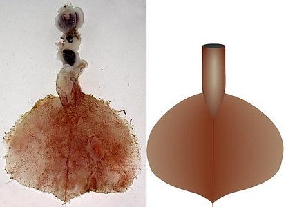

# [[Magnapinna_B]] 

# *Magnapinna sp. B* 

[Michael Vecchione and Richard E. Young]()
)

Containing group:[Magnapinnidae](../Magnapinnidae.md))

## Introduction

***Magnapinna*** sp. B (called ***Magnapinna*** sp. A in Vecchione and
Young, 2006) differs from all other species in the genus in its dark
epidermal pigmentation. Unfortunately this squid was also badly damaged
during capture but shares the presence of slender tentacles with the
other Atlantic ***Magnapinna*** spp. This species is known from a single
immature male (Bergen Museum cat. no. ZMBN 77634), 95 mm ML captured by
the R/V G.O. SARS (MAR-ECO cruise super station 46, local station 374)
at 42.8°N, 29.3°W on ll July 2004 (Vecchione and Young, 2006).

#### Brief diagnosis:

A ***Magnapinna*** without \...

-   chromatophores  (ie, pigment not in chromatophores).

### Characteristics

1.  Arms
    1.  Proximal-arms with biserial suckers.
    2.  Diameter of large proximal-arm suckers 0.5 mm (fleshy diameter)
        with smooth inner rings and broad aperatures.
    3.  Distal-arms unknown due to damage.
2.  Head
    1.  Head badly damaged.\
        \
3.  Funnel
    1.  Funnel locking-apparatus with elongate, oval depression.
4.  Measurements
    1.  Mantle length - 95 mm; fin length - 62 mm; fin width - 66 mm;
        tail - 6, mm; tentacle width at base - 2.9 mm; arm IV width at
        base - 5.6 mm; diameter large arm suckers - 0.5 mm.\

#### Comments

***Magnapinna*** sp. B is separated from other species of the genus with
narrow proximal-tentacles by the apparent absence of chromatophores, the
relatively long free-mantle and the relatively broad aperatures of the
proximal-arm suckers.

## Phylogeny 

-   « Ancestral Groups  
    -   [Magnapinna](Magnapinna)
    -   [Chiroteuthid families](Chiroteuthid_families)
    -  [Oegopsida](../../../Oegopsida.md))
    -  [Decapodiformes](../../../../Decapodiformes.md))
    -  [Coleoidea](../../../../../Coleoidea.md))
    -  [Cephalopoda](../../../../../../Cephalopoda.md))
    -  [Mollusca](../../../../../../../Mollusca.md))
    -  [Bilateria](../../../../../../../../Bilateria.md))
    -  [Animals](../../../../../../../../../Animals.md))
    -  [Eukarya](../../../../../../../../../../Eukarya.md))
    -   [Tree of Life](../../../../../../../../../../Tree_of_Life.md)

-   ◊ Sibling Groups of  Magnapinna
    -   [Magnapinna atlantica](Magnapinna_atlantica)
    -   Magnapinna sp. B
    -   [Magnapinna sp. C](Magnapinna_sp._C)
    -   [Magnapinna pacifica](Magnapinna_pacifica)
    -   [Magnapinna talismani](Magnapinna_talismani)

-   » Sub-Groups 

### References

Vecchione, M. and R. E. Young. 2006. The squid family Magnapinnidae
(Mollusca; Cephalopoda) in the North Atlantic with a description of
*Magnapinna atlantica*, n. sp. Proc. Biol. Soc. Wash. 119 (3): 365-372.

## Title Illustrations

)

  -----------------------------------------------------------------------
  Scientific Name ::     Magnapinna sp. B
  Specimen Condition   Preserved
  Sex ::                Male
  View                 Ventral
  Size                 95 mm ML
  Copyright ::            © [Michael Vecchione](mailto:vecchiom@si.edu) 
  -----------------------------------------------------------------------

## Confidential Links & Embeds: 

### #is_/same_as :: [Magnapinna_B](/_Standards/bio/bio~Domain/Eukarya/Animal/Bilateria/Mollusca/Cephalopoda/Coleoidea/Decapodiformes/Oegopsida/Chiroteuthid/Magnapinnidae/Magnapinna_B.md) 

### #is_/same_as :: [Magnapinna_B.public](/_public/bio/bio~Domain/Eukarya/Animal/Bilateria/Mollusca/Cephalopoda/Coleoidea/Decapodiformes/Oegopsida/Chiroteuthid/Magnapinnidae/Magnapinna_B.public.md) 

### #is_/same_as :: [Magnapinna_B.internal](/_internal/bio/bio~Domain/Eukarya/Animal/Bilateria/Mollusca/Cephalopoda/Coleoidea/Decapodiformes/Oegopsida/Chiroteuthid/Magnapinnidae/Magnapinna_B.internal.md) 

### #is_/same_as :: [Magnapinna_B.protect](/_protect/bio/bio~Domain/Eukarya/Animal/Bilateria/Mollusca/Cephalopoda/Coleoidea/Decapodiformes/Oegopsida/Chiroteuthid/Magnapinnidae/Magnapinna_B.protect.md) 

### #is_/same_as :: [Magnapinna_B.private](/_private/bio/bio~Domain/Eukarya/Animal/Bilateria/Mollusca/Cephalopoda/Coleoidea/Decapodiformes/Oegopsida/Chiroteuthid/Magnapinnidae/Magnapinna_B.private.md) 

### #is_/same_as :: [Magnapinna_B.personal](/_personal/bio/bio~Domain/Eukarya/Animal/Bilateria/Mollusca/Cephalopoda/Coleoidea/Decapodiformes/Oegopsida/Chiroteuthid/Magnapinnidae/Magnapinna_B.personal.md) 

### #is_/same_as :: [Magnapinna_B.secret](/_secret/bio/bio~Domain/Eukarya/Animal/Bilateria/Mollusca/Cephalopoda/Coleoidea/Decapodiformes/Oegopsida/Chiroteuthid/Magnapinnidae/Magnapinna_B.secret.md)

