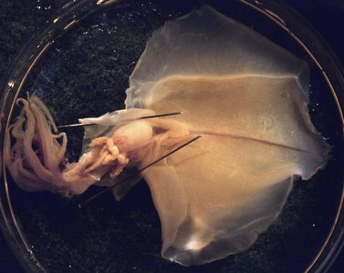
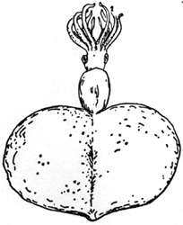
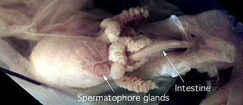

---
aliases:
  - Magnapinna_C
  - Magnapinna C
title: Magnapinna sp. C
---

# *Magnapinna sp. C* 

[Michael Vecchione and Richard E. Young]()

Containing group:[Magnapinnidae](../Magnapinnidae.md) 

## Introduction

A magnapinnid, illustrated by Hardy (1956) from the South Atlantic and
identified as ***Octopodoteuthopsis***, is deposited in the Natural
History Museum, London (BMNH). This squid was not recognized as a
magnapinnid prior to the work of Vecchione and Young (2006; they list
this species as ***Magnapinna*** sp.) due to the slender tentacles which
differed greatly from the previously only known species, ***M.
pacifica***.

#### Diagnosis

A Magnapinna \...

-   with proximal-tentacles more slender than arms IV.
-   with chromatophores.
-   without glandular regions on proximal-tentacles.

### Characteristics

1.  Arms
    1.  Proximal-arms approximately subequal in length (ca 40-45% of
        ML).
    2.  Proximal-arms with gelatinous consistency and thick protective
        membranes.
    3.  Arm tips stripped and damaged, distal-arms not recognizable.
    4.  Proximal-arm suckers closely spaced, in 2 series.
    5.  Proximal-arm suckers globular with smooth rings.\
        \
2.  Tentacles
    1.  Tentacles badly damaged, suckers absent.
    2.  Tentacle diameter at base less than arm diameter.

   )
    **Figure**. Ventral view of the viscera of ***Magnapinna*** sp. C.
    Photograph by Wen-Sung Chung.

#### Comments

We examined the specimen in the year 2000 before we realized that it
belongs to the Magnapinnidae. The brief description above is from some
notes we made at the time. The arms and tentacles were badly damaged in
capture. The squid is an immature male. The buccal mass is relatively
large and the buccal membrane is very reduced. We are uncertain at
present whether this represents a separate species or is conspecific
with ***M. atlantica*** and/or ***M. talismani***. This specimen needs
to be re-examined. 

## Phylogeny 

-   « Ancestral Groups  
    -   [Magnapinna](Magnapinna)
    -   [Chiroteuthid families](Chiroteuthid_families)
    -  [Oegopsida](../../../Oegopsida.md) 
    -  [Decapodiformes](../../../../Decapodiformes.md) 
    -  [Coleoidea](../../../../../Coleoidea.md) 
    -  [Cephalopoda](../../../../../../Cephalopoda.md) 
    -  [Mollusca](../../../../../../../Mollusca.md) 
    -  [Bilateria](../../../../../../../../Bilateria.md) 
    -  [Animals](../../../../../../../../../Animals.md) 
    -  [Eukarya](../../../../../../../../../../Eukarya.md) 
    -   [Tree of Life](../../../../../../../../../../Tree_of_Life.md)

-   ◊ Sibling Groups of  Magnapinna
    -   [Magnapinna atlantica](Magnapinna_atlantica)
    -   [Magnapinna sp. B](Magnapinna_sp._B)
    -   Magnapinna sp. C
    -   [Magnapinna pacifica](Magnapinna_pacifica)
    -   [Magnapinna talismani](Magnapinna_talismani)

-   » Sub-Groups 

### References

Vecchione, M. and R. E. Young. 2006. The squid family Magnapinnidae
(Mollusca; Cephalopoda) in the North Atlantic with a description of
Magnapinna atlantica, n. sp. Proc. Biol. Soc. Wash. 119 (3): 365-372.

## Title Illustrations

 

  ----------
  scientific_name ::     Magnapinna sp. C
  location ::           South Atlantic
  specimen_condition ::  Dead Specimen
  Sex ::                Male
  View                 Ventral
  Size                 79 mm ML
  copyright ::            © Wen-Sung Chung
  ----------
 

  ------------------------------------------
  scientific_name ::     Magnapinna sp. C
  location ::           South Atlantic
  Reference            Hardy, A. 1956. The Open Sea. Fisher, J., J. Gilmour, J. Huxley, M. Davies, and E. Hosking, Eds., Collins, London, 1956.
  specimen_condition ::  Dead Specimen
  View                 Dorsal
  ------------------------------------------

## Confidential Links & Embeds: 

### #is_/same_as :: [[/_Standards/bio/bio~Domain/Eukarya/Animal/Bilateria/Mollusca/Cephalopoda/Coleoidea/Decapodiformes/Oegopsida/Chiroteuthid/Magnapinnidae/Magnapinna_C|Magnapinna_C]] 

### #is_/same_as :: [[/_public/bio/bio~Domain/Eukarya/Animal/Bilateria/Mollusca/Cephalopoda/Coleoidea/Decapodiformes/Oegopsida/Chiroteuthid/Magnapinnidae/Magnapinna_C.public|Magnapinna_C.public]] 

### #is_/same_as :: [[/_internal/bio/bio~Domain/Eukarya/Animal/Bilateria/Mollusca/Cephalopoda/Coleoidea/Decapodiformes/Oegopsida/Chiroteuthid/Magnapinnidae/Magnapinna_C.internal|Magnapinna_C.internal]] 

### #is_/same_as :: [[/_protect/bio/bio~Domain/Eukarya/Animal/Bilateria/Mollusca/Cephalopoda/Coleoidea/Decapodiformes/Oegopsida/Chiroteuthid/Magnapinnidae/Magnapinna_C.protect|Magnapinna_C.protect]] 

### #is_/same_as :: [[/_private/bio/bio~Domain/Eukarya/Animal/Bilateria/Mollusca/Cephalopoda/Coleoidea/Decapodiformes/Oegopsida/Chiroteuthid/Magnapinnidae/Magnapinna_C.private|Magnapinna_C.private]] 

### #is_/same_as :: [[/_personal/bio/bio~Domain/Eukarya/Animal/Bilateria/Mollusca/Cephalopoda/Coleoidea/Decapodiformes/Oegopsida/Chiroteuthid/Magnapinnidae/Magnapinna_C.personal|Magnapinna_C.personal]] 

### #is_/same_as :: [[/_secret/bio/bio~Domain/Eukarya/Animal/Bilateria/Mollusca/Cephalopoda/Coleoidea/Decapodiformes/Oegopsida/Chiroteuthid/Magnapinnidae/Magnapinna_C.secret|Magnapinna_C.secret]] 

