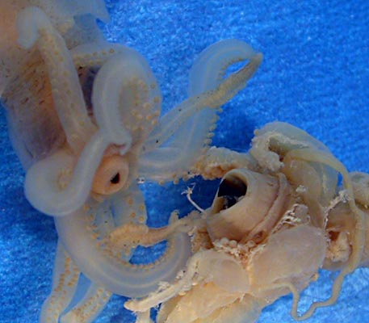

---
title: "Magnapinna atlantica"
---

## Phylogeny 

-   « Ancestral Groups  
    -   [Magnapinna](Magnapinna)
    -   [Chiroteuthid families](Chiroteuthid_families)
    -  [Oegopsida](../../../Oegopsida.md))
    -  [Decapodiformes](../../../../Decapodiformes.md))
    -  [Coleoidea](../../../../../Coleoidea.md))
    -  [Cephalopoda](../../../../../../Cephalopoda.md))
    -  [Mollusca](../../../../../../../Mollusca.md))
    -  [Bilateria](../../../../../../../../Bilateria.md))
    -  [Animals](../../../../../../../../../Animals.md))
    -  [Eukarya](../../../../../../../../../../Eukarya.md))
    -   [Tree of Life](../../../../../../../../../../Tree_of_Life.md)

-   ◊ Sibling Groups of  Magnapinna
    -   Magnapinna atlantica
    -   [Magnapinna sp. B](Magnapinna_sp._B)
    -   [Magnapinna sp. C](Magnapinna_sp._C)
    -   [Magnapinna pacifica](Magnapinna_pacifica)
    -   [Magnapinna talismani](Magnapinna_talismani)

-   » Sub-Groups 

# *Magnapinna atlantica* [Vecchione and Young 2006] 
)

Containing group:[Magnapinnidae](../Magnapinnidae.md))

## Introduction

***Magnapinna atlantica*** (formerly known as ***Magnapinna*** sp. A on
this page) was originally described from two specimens taken from the
North Atlantic.  The holotype (US National Museum of Natural History
cat. no. USNM 1086800) is a juvenile female, 59 mm ML, and was captured
intact with damage only to the tips of the appendages. The paratype
(Natural History Museum, London, cat. no. BMNH 20060134) is a juvenile
male, 53 mm ML and was captured in relatively good condition. [Recently subadult and adult males were captured and these are described here.](http://www.tolweb.org/articles/?article_id=4392)\

#### Brief diagnosis:

A magnapinnid with:

-   tentacle bases narrower than adjacent arm bases.
-   proximal tentacle without suckers but with glandular structures.
-   chromatophores.\

### Characteristics

\

1.  Arms
    1.  Arms short, thick, weakly muscled and decreasing abruptly in
        diameter distally to form sucker-bearing filaments (mostly lost
        due to damage)
    2.  Proximal-arms with suckers in two series (except at tips in some
        proximal-arms), ocasionally appearing slightly irregular.\
        \
2.  Tentacles
    1.  Proximal-tentacles more slender than arms IV.
    2.  Proximal- tentacles short, thin and without suckers;
        distal-tentacles (filaments) very narrow and bearing small
        suckers mostly around 0.08 mm in diameter.
    3.  Distal third of proximal-tentacle with large, apparently
        glandular, lobes.
3.  Fins and tail
    1.  Fins extremely large, about 90% of the mantle length.
    2.  Fins appear not to have been drawn-out into V-shaped point.
    3.  Tail presently a bare gladius with tip missing; extends at least
        4 mm beyond fins.

#### Comments

This description is based on the holotype.  [More details of the holotype\'s description can be found here.](http://www.tolweb.org/notes/?note_id=3127) The paratype is a
smaller specimen (53 mm ML) and in less perfect condition. [Information on the paratype can be found here.](http://www.tolweb.org/notes/?note_id=3982)

***M. atlantica*** is very different from ***M. pacifica***. (1) ***M.
pacifica*** has much broader proximal- tentacles than proximal-arms
while ***M. atlantica*** has much narrower proximal-tentacles than
proximal-arms. (2) ***M. pacifica*** has proximal-tentacles that are
covered with numerous suckers while ***M. atlantica*** has
proximal-tentacles that carry only a few or no suckers. (3) ***M.
pacifica*** has proximal-arm suckers in three or four series distally
while ***M. atlantica*** has proximal-arm suckers in two series. (4)
***M. pacifica***, unlike ***M. atlantica***, lacks glandular regions on
their proximal-tentacles.\

***M. atlantica*** is similar to ***M. talismani*** and ***Magnapinna***
sp. C. The latter is poorly known and there is still some uncertainties
concerning the identity of ***M. talismani***. The mantle length (61 mm)
and fin length (54 mm) of ***M. talismani*** holotype are nearly
identical with those of ***M.*** ***atlantica*** (59 mm, 53 mm) but the
diameter of the buccal mass, the size of the arm suckers and the
thickness of the arm basis all suggest that ***M. talismani*** either
had very different body proportions or, more likely, that it is actually
a much larger individual (see photograph below).  At present, the only
clear difference that separates ***M. atlantica*** from ***M.
talismani*** and **Magnapinna** sp. C is the presence of glandular
regions on the proximal-tentacles. While the tentacles of the holotype
of ***M. talismani*** where badly damaged, one recently described
specimen assigned to ***M. talismani*** (see the ***M. talismani*** page
on the ToL)  has proximal tentacles in in fairly good condition and they
show no trace of glandular regions. The absence could be size related
but this seems unlikely. 
){width="457"}

**Figure**. Oral-oblique views of the buccal region of the holotypes of
***Magnapinna atlantica*** (left) and ***M. talismani*** (right).
Photograph modified from Vecchione and Young (2006).
### Distribution

T**ype locality**. Gulf of Mexico, North Atlantic at 27°09'N, 86°07'W on
16 Sept., 1995. It was captured intact with damage only to the tips of
the appendages.

The paratype was captured over the mid-Atlantic Ridge near the Azores at
37°14\'N. 32°18\'W on June 21, 1997. The subadult male was taken by the
R/S ALVIN from the N.W. Gulf of Mexico (26°10\'51\"N, 94°37\'22\"W) at a
depth of 2739 m. The adult male was taken by theR/V R.S. CARNEY from the
N.W. Gulf of Mexico (26°05\'00\"N, 94°36\'30\"W) in a beam trawl that
fished at a depth of 2928-2849 m in May of 2006.\

##### ### References

Fischer, H. and L. Joubin. 1907. Expéditions scientifiques du
TRAVAILLEUR et du TALISMAN. Céphalopodes, 8: 313-353.

Hardy, A. 1956. The Open Sea. Fisher, J., J. Gilmour, J. Huxley, M.
Davies, and E. Hosking, Eds., Collins, London, 1956.

M. Vecchione, R.E. Young, A. Guerra, D.J. Lindsay, D.A. Clague, J.M.
Bernhard, W.W. Sager, A.F. Gonzalez, F.J. Rocha, and M. Segonzac. 2001.
Worldwide observations of remarkable deep-sea squids. Science, 294:
2505-2506.

Vecchione, M. and R. E. Young. 2006. The squid family Magnapinnidae
(Mollusca; Cephalopoda) in the North Atlantic with a description of
*Magnapinna atlantica*, n. sp. Proc. Biol. Soc. Wash. 119 (3): 365-372.

## Title Illustrations

)

  ------------------------------------------------------------------------------
  Scientific Name ::     Magnapinna atlantica
  Location ::           Gulf of Mexico, 27°45\'N, 88°31\'W, at 1940 m depth
  Reference            Vecchione, M. and R. E. Young. 2006. The squid family Magnapinnidae (Mollusca; Cephalopoda) in the North Atlantic with a description of Magnapinna atlantica, n. sp.. Proc. Biol. Soc. Wash. 119 (3): 365-372.
  Specimen Condition   Preserved
  Sex ::                Female
  View                 Ventral/dorsal
  Size                 59 mm ML
  Type                 Holotype
  Copyright ::            © [Richard E. Young](http://www.soest.hawaii.edu/%7Eryoung/rey.html) 
  ------------------------------------------------------------------------------

## Confidential Links & Embeds: 

### #is_/same_as ::[atlantica](atlantica.md)) 

### #is_/same_as :: [atlantica.public](/_public/bio/bio~Domain/Eukarya/Animal/Bilateria/Mollusca/Cephalopoda/Coleoidea/Decapodiformes/Oegopsida/Chiroteuthid/Magnapinnidae/atlantica.public.md) 

### #is_/same_as :: [atlantica.internal](/_internal/bio/bio~Domain/Eukarya/Animal/Bilateria/Mollusca/Cephalopoda/Coleoidea/Decapodiformes/Oegopsida/Chiroteuthid/Magnapinnidae/atlantica.internal.md) 

### #is_/same_as :: [atlantica.protect](/_protect/bio/bio~Domain/Eukarya/Animal/Bilateria/Mollusca/Cephalopoda/Coleoidea/Decapodiformes/Oegopsida/Chiroteuthid/Magnapinnidae/atlantica.protect.md) 

### #is_/same_as :: [atlantica.private](/_private/bio/bio~Domain/Eukarya/Animal/Bilateria/Mollusca/Cephalopoda/Coleoidea/Decapodiformes/Oegopsida/Chiroteuthid/Magnapinnidae/atlantica.private.md) 

### #is_/same_as :: [atlantica.personal](/_personal/bio/bio~Domain/Eukarya/Animal/Bilateria/Mollusca/Cephalopoda/Coleoidea/Decapodiformes/Oegopsida/Chiroteuthid/Magnapinnidae/atlantica.personal.md) 

### #is_/same_as :: [atlantica.secret](/_secret/bio/bio~Domain/Eukarya/Animal/Bilateria/Mollusca/Cephalopoda/Coleoidea/Decapodiformes/Oegopsida/Chiroteuthid/Magnapinnidae/atlantica.secret.md)

