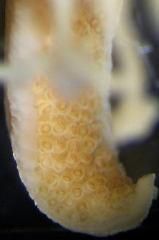
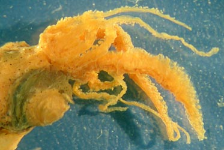
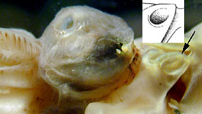
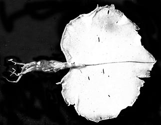
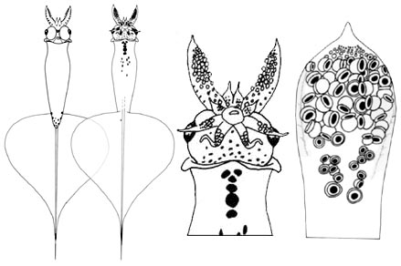

## Phylogeny 

-   « Ancestral Groups  
    -   [Magnapinna](Magnapinna)
    -   [Chiroteuthid families](Chiroteuthid_families)
    -  [Oegopsida](../../../Oegopsida.md))
    -  [Decapodiformes](../../../../Decapodiformes.md))
    -  [Coleoidea](../../../../../Coleoidea.md))
    -  [Cephalopoda](../../../../../../Cephalopoda.md))
    -  [Mollusca](../../../../../../../Mollusca.md))
    -  [Bilateria](../../../../../../../../Bilateria.md))
    -  [Animals](../../../../../../../../../Animals.md))
    -  [Eukarya](../../../../../../../../../../Eukarya.md))
    -   [Tree of Life](../../../../../../../../../../Tree_of_Life.md)

-   ◊ Sibling Groups of  Magnapinna
    -   [Magnapinna atlantica](Magnapinna_atlantica)
    -   [Magnapinna sp. B](Magnapinna_sp._B)
    -   [Magnapinna sp. C](Magnapinna_sp._C)
    -   Magnapinna pacifica
    -   [Magnapinna talismani](Magnapinna_talismani)

-   » Sub-Groups 

# *Magnapinna pacifica* [Vecchione and Young, 1998]

## Pacific bigfin squid 

[Michael Vecchione and Richard E. Young]()

)

Containing group:[Magnapinnidae](../Magnapinnidae.md))

## Introduction

***Magnapinna pacifica***, the type species of the family, was
originally described from three individuals (two juveniles about 50 mm
ML and a paralarva of 19 mm ML) from the North Pacific. Recently a
fourth specimen has been captured from the Gulf of Mexico, Atlantic
Ocean. [A brief description of the latter specimen can be seen here.](http://www.tolweb.org/notes/?note_id=4385 "Magnapinna pacifica: Atlantic specimen")\

#### Brief diagnosis:

A ***Magnapinna*** with \...

-   proximal-tentacles wider than adjacent arms.
-   numerous suckers on proximal-tentacles.

### Characteristics

1.  Arms.
    1.  Proximal-arm suckers biserial at base, in 3 to 4 series
        distally.

    2.  Distal-arms vermiform.

    3.  Inner sucker rings probably smooth.

       )\

        **Figure**. **Left** - Oral view of the brachial crown of ***M.
        pacifica***, holotype, showing sucker arrangement on proximal
        portion of the proximal-tentacles. Note the enlarged suckers at
        the tentacle base. **Right** - Oral view of the distal region of
        the proximal-tentacle of the holotype. Photographs by M.
        Vecchione.

    4.  Sucker dentition unknown.

    5.  Distal-tentacles vermiform.\

       ){width="373"}
        **Figure**. Dorsolateral view of the head and brachial crown of
        ***M. pacifica***, Berry specimen. This specimen had dried out
        and has been reconstituted. Note the large, broad tentacles and
        the elongate filaments of the arms which bear suckers in this,
        presumably, older individual.

2.  Head
    1.  Large eyes occupy most of head.\
        \
3.  Funnel
    1.  Funnel locking-apparatus with oval depression.

       ){width="339"}
        **Figure**. Funnel locking-apparatus of ***M. pacifica***,
        holotype. Arrow points to funnel lock, insert shows drawing of
        the same lock. Drawing from Vecchione and Young (1998).
        Photograph by R. Young.

4.  Fins
    1.  Fins very large: Length equal to or greater than squid length
        from posterior tip of muscular mantle to tip of tentacles.
    2.  Fins terminal.
    3.  Width approximates length.

       )
        **Figure**. Ventral view of ***M. pacifica***, Berry specimen,
        49 mm ML (USNM 885787). Photograph from Vecchione and
        Young (1998) which was found in the archives of S. S. Berry.

5.  Photophores
    1.  Photophores absent.\
        \
6.  Measurements, mm
      --------- ---------
                        Holotype          Berry specimen    **Atlantic
                                                            specimen **

      Mantle length     51                49                51 

      Muscular mantle   16                17                18 
      length                                                

      Gladius length\*  53                52                52\* 

      Fin length        39                40                47 

      Fin width         34                41                38 

      Head length       5                 4                 4 

      Head width        7                 5                 6 

      Eye diameter      4                 3                 4

      Arm I,            2.3 / 2.4         \-                \- / 3.4
      left/right, to                                        
      terminal sucker                                       

      Arm II,           3.9 / 3.5         \-                4.1 / 3.8 
      left/right, to                                        
      terminal sucker                                       

      Arm III,          2.9 / 2.7         \-                \- / 3.8\
      left/right, to                                        
      terminal sucker                                       

      Arm IV,           4.8 / 4.8         \-                \- / 3.8 
      left/right, to                                        
      terminal sucker                                       

      Tentacle,         7.1 / 7.4         \-                7.4 / 7.0 
      left/right, to                                        
      terminal sucker                                       

      Arm I,            2+ / 1.3+         \-                - 
      left/right,                                           
      terminal filament                                     
      length                                                

      Arm II,           2+ / 2.6          \-                - 
      left/right,                                           
      terminal filament                                     
      length                                                

      Arm III,          2.6+ / 2.9        \-                - 
      left/right,                                           
      terminal filament                                     
      length                                                

      Arm IV,           2.0 / 1.3+        \-                - 
      left/right,                                           
      terminal filament                                     
      length                                                

      Tentacle,         2.2 / -           \-                - 
      left/right,                                           
      terminal filament                                     
      length                                                
      --------- ---------

#### Comments

***M. pacifica*** is very different from ***M. atlantica*** and its
close relatives. (1) ***M. pacifica*** has much broader proximal-
tentacles than proximal-arms while the ***M. atlantica*** group of
species has much narrower proximal-tentacles than proximal-arms. (2)
***M. pacifica*** has proximal-tentacles that are covered with numerous
suckers while the ***M. atlantica*** group has proximal-tentacles that
carry only a few or no suckers. (3) ***M. pacifica*** has proximal-arm
suckers in three or four series distally while the ***M. atlantica***
group has proximal-arm suckers in two series. (4) ***M. pacifica***,
unlike ***M. atlantica*** but not other members of the group, lacks
glandular regions on their proximal-tentacles.\

### Life History

Only a single paralarva is known. It has the following characteristics:

1.  Arms
    1.  Arms short, with suckers in 3-4 series at bases of arms III and
        IV; otherwise in two series.
    2.  Arm tips bare and attenuate.

2.  Tentacles
    1.  Tentacles short, broad.
    2.  Suckers in 7-8 series distally, grades into buds.

3.  Fins

    1.  Muscular mantle overlaps anterior of fins by 15% of fin length.
    2.  Fins extend onto a tail posteriorly.

   ){height="292" width="439"}

    **Figure**. Paralarvae of ***M. pacifica***. **Left** - Ventral and
    dorsal views, 19.1 mm ML, Hawaiian waters. **Middle** - Dorsal view
    of head of same paralarva. **Right** - Tentacle of same paralarva.
    Drawings from Vecchione and Young (1998), modified.

### Distribution

The holotype was taken off the California coast at a depth between 0 and
200m in a Bongo plankton net. The other juvenile was found in the
stomach of the lancet fish ***Alepisaurus fero*x** and the paralarva was
taken off Hawaii at a depth between 0 and 300 m in a 4 m2 plankton net.
The Atlantic specimen was taken from the Gulf of Mexico in a 3 m^2^
opening/closing Tucker traw at a depth of 150-300 m over a bottom of
3613 m during 1700-2000 hrs.

The capture localities are:

-   Holotype, 51 mm ML: 33° 49\'N, 121° 51\'W.
-   Juvenile, 49 mm ML; 30° 22\'N, 129° 45\'W.
-   Paralarva, 19.1 mm ML; 21° 20\'N, 158° 20\'W.
-   Atlantic specimen, 51 mm ML: 26°52\'N, 85°52\"W.\
)

**Figure**. Distribution chart of ***M. pacifica***. White dots indicate
capture localities. Chart modified from Vecchione and Young (1998).
### References

Vecchione, M. and R. E. Young. 1998. The Magnapinnidae, a newly
discovered family of oceanic squids (Cephalopoda; Oegopsida). South
African Journal of Marine Science, 20: 429-437.

## Title Illustrations

)

  -------------------------------------------------------------------------
  Scientific Name ::     Magnapinna pacifica
  Reference            Vecchione, M. and R. E. Young. 1998. The Magnapinnidae, a newly discovered family of oceanic squids (Cephalopoda; Oegopsida). South African Journal of Marine Science, 20: 429-437.
  Specimen Condition   Dead Specimen
  View                 Ventral and dorsal
  Size                 51 mm ML
  Type                 Holotype
  Copyright ::            © 1998 [Michael Vecchione](mailto:vecchiom@si.edu) 
  -------------------------------------------------------------------------
)

  ------------------------------------------------------------------------
  Scientific Name ::  Magnapinna pacifica
  Reference         Vecchione, M. and R. E. Young. 1998. The Magnapinnidae, a newly discovered family of oceanic squids (Cephalopoda; Oegopsida). South African Journal of Marine Science, 20: 429-437.
  Creator           K. Hiratsuka Moore
  View              Ventral and dorsal
  Size              51 mm ML
  Type              Holotype
  Copyright ::         © 2004 [Michael Vecchione](mailto:vecchiom@si.edu) 
  ------------------------------------------------------------------------

## Confidential Links & Embeds: 

### #is_/same_as :: [pacifica](/_Standards/bio/bio~Domain/Eukarya/Animal/Bilateria/Mollusca/Cephalopoda/Coleoidea/Decapodiformes/Oegopsida/Chiroteuthid/Magnapinnidae/pacifica.md) 

### #is_/same_as :: [pacifica.public](/_public/bio/bio~Domain/Eukarya/Animal/Bilateria/Mollusca/Cephalopoda/Coleoidea/Decapodiformes/Oegopsida/Chiroteuthid/Magnapinnidae/pacifica.public.md) 

### #is_/same_as :: [pacifica.internal](/_internal/bio/bio~Domain/Eukarya/Animal/Bilateria/Mollusca/Cephalopoda/Coleoidea/Decapodiformes/Oegopsida/Chiroteuthid/Magnapinnidae/pacifica.internal.md) 

### #is_/same_as :: [pacifica.protect](/_protect/bio/bio~Domain/Eukarya/Animal/Bilateria/Mollusca/Cephalopoda/Coleoidea/Decapodiformes/Oegopsida/Chiroteuthid/Magnapinnidae/pacifica.protect.md) 

### #is_/same_as :: [pacifica.private](/_private/bio/bio~Domain/Eukarya/Animal/Bilateria/Mollusca/Cephalopoda/Coleoidea/Decapodiformes/Oegopsida/Chiroteuthid/Magnapinnidae/pacifica.private.md) 

### #is_/same_as :: [pacifica.personal](/_personal/bio/bio~Domain/Eukarya/Animal/Bilateria/Mollusca/Cephalopoda/Coleoidea/Decapodiformes/Oegopsida/Chiroteuthid/Magnapinnidae/pacifica.personal.md) 

### #is_/same_as :: [pacifica.secret](/_secret/bio/bio~Domain/Eukarya/Animal/Bilateria/Mollusca/Cephalopoda/Coleoidea/Decapodiformes/Oegopsida/Chiroteuthid/Magnapinnidae/pacifica.secret.md)

