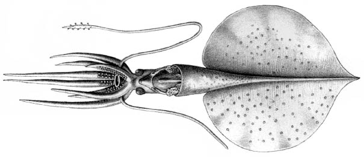

---
aliases:
  - talismani
title: Magnapinna talismani
---

## Phylogeny 

-   « Ancestral Groups  
    -   [Magnapinna](Magnapinna)
    -   [Chiroteuthid families](Chiroteuthid_families)
    -  [Oegopsida](../../../Oegopsida.md) 
    -  [Decapodiformes](../../../../Decapodiformes.md) 
    -  [Coleoidea](../../../../../Coleoidea.md) 
    -  [Cephalopoda](../../../../../../Cephalopoda.md) 
    -  [Mollusca](../../../../../../../Mollusca.md) 
    -  [Bilateria](../../../../../../../../Bilateria.md) 
    -  [Animals](../../../../../../../../../Animals.md) 
    -  [Eukarya](../../../../../../../../../../Eukarya.md) 
    -   [Tree of Life](../../../../../../../../../../Tree_of_Life.md)

-   ◊ Sibling Groups of  Magnapinna
    -   [Magnapinna atlantica](Magnapinna_atlantica)
    -   [Magnapinna sp. B](Magnapinna_sp._B)
    -   [Magnapinna sp. C](Magnapinna_sp._C)
    -   [Magnapinna pacifica](Magnapinna_pacifica)
    -   Magnapinna talismani

-   » Sub-Groups 

# *Magnapinna talismani* [(Fischer and Joubin, 1907)] 

[Michael Vecchione and Richard E. Young]()

Containing group:[Magnapinnidae](../Magnapinnidae.md) 

## Introduction

***Magnapinna talismani*** was originally described from a single
damaged specimen that came from south of the Azores, North Atlantic very
near the capture site of ***Magnapinna*** sp. B and the paratype of
***M. atlantica***. On this page we will summarize the original text,
include illustrations that accompanied the text along with photographs
and comments from our examination of the holotype. Then we present the
text of the original description of ***M. talismani***, first described
as ***Chiroteutopsis talismani***. The identy of ***M. talismani*** is
uncertain. It is similar to ***M. atlantica*** and ***Magnapinna*** sp.
C and may ultimately prove to be conspecific with these species.\

#### Brief diagnosis:

A ***Magnapinna*** with \...

-   slender proximal-tentacles that lack suckers and glandular
    structures.

### Characteristics

1.  Arms
    1.  Suckers on proximal-arm in two series and closely packed.
    2.  Proximal-arm suckers with smooth inner rings.
    3.  Arms badly damaged.
2.  Funnel
    1.  Funnel locking-apparatus with oval depression and possible
        tragus (from F&J). Both funnel locking-cartilages are distorted
        in the holotype and the presence or absence of a weak tragus is
        uncertain but unlikely.
    2.  Gladius
        1.  Gladius not removed. The length of the gladius cannot be
            determined as the anterior end is frayed indicating that
            some of it may be missing.

#### Comments

Very little new information can be derived from our examination of the
holotype. Information from the original description that we did not
confirm is marked \"from F&J\" above. This squid was badly damaged when
captured and has not survived well in preservation. The poor condition
of the holotype which has lost most species-level characters makes
comparisons with other species difficult.

 

### Nomenclature

This ***M. talismani*** was originally placed in the genus
***Chiroteuthopsis*** which is a junior synonym of ***Mastigoteuthis***.
***Mastigoteuthis talismani*** was placed in ***Magnapinna*** by
Vecchione and Young (2006).

### Distribution

Type locality: 34°46\'N, 36°11\'W (south of the Azores, North Atlantic).
The holotype was caught in an open bottom trawl, that fished to a depth
of 3175 m.

### Text of the Original Description

TT 78-55121

From: Exped. Scient. du Travailleur & Talisman. Vol. 8, 1907 pp.
342-345.

#### CEPHALOPODS 

By: Fischer, H. and L. Joubin

Translated from French by: Margaret Saidi

Edited by: Azzedine Azzouz

Translated for The National Science Foundation, Washington, D.C. and The
Smithsonian Institution by The Agence Tunisienne de Public-Relations
Tunis-Tunissie.

-1979-

SUBFAMILY CHIROTEUTHIDAE GRAY, 1849 (l9)\
GENUS *CHIROTEUTHOPSIS* PFEFFER. 1900 (47).\
17. *Chiroteuthopsis Talismani*, nov. sp.\
(Pl. XXV, figs. 1 to 4)\
**Talisman**. - Dr. 118. August 10, 1883. Depth 3175 m.\
Lat. N. 34°46\'. Long. W, 36° 11\'. - South of the Azores. -\
Bottom of pumice stone.

**Observations**. A single specimen of this singular species has been
caught; it is probable that it does not come from the bottom, but that
it was caught between two waters when the trawl-net was raised, as it is
a distinctly bathypelagic cephalopod. It was unfortunately greatly
damaged by its stay in the net, and we can therefore give only a very
incomplete description of it. The tentacles have, among other things,
been twisted and broken, and it is impossible to measure their length.
The ends of the arms have undergone the same fate; only their bases are
more or less intact.

What characterizes this animal right from the first examination is the
enormity of its fin, approximately round, slightly pointed at the
posterior extremity of the body. In proportion to the general size of
the body, this fin is larger than in any other cephalopod of the family
of the Chiroteuthidae. The visceral sac, on the other hand, is very
small. It has the form of a very pointed cone, three-fourths of the
length of which lie against the fin. This cone is surmounted by the
upper part of the body, which projects, in the form of a semitransparent
cylinder, directly into the head. The latter is not distinct from the
body; it has two eyes at its summit. They do not appear to have been
large, but their bad condition makes it impossible to be clear.

The crystalline lenses of these eyes formed the two upper angles of the
head, and it is between them, through a very narrow very low neck, that
the tentacular and brachial crown is attached.

This crown seems to have had the general form of that of all the
Chiroteuthidae; what remains is not sufficient to enable us to give a
table of measurement of the arms. Figure 1 of plate XXV is a
reconstruction of the animal, the length of the arms being indicated
approximately, according to the debris which remained attached to the
stumps. The skin of the arm bases, on their buccal face, and the
membranes surrounding the lip, are dark purple in color. It is still
possible to see, on two rows, some suckers, which appear to have been
yellow. The circular lip, with a wide opening, surrounds relatively
large mandibles; this lip is yellow, tending toward the violet tint of
the membranes which surround it.

The tentacles formed a twisted mass from which it was possible to
isolate only fragments. We were nonetheless able to find the tentacular
plate of one of these, still bearing a few excessively small suckers,
posed on a lang, thin peduncle; these suckers appear to have been very
numerous.

We give below the measurements it was possible to take from this
specimen; they are very incomplete because of the almost total
destruction of the appendages. It is probable that the long period spent
in alcohol has reduced the animal\'s size; there exists, in fact, a
sketch made immediately after its capture by C. Brongniarf. This sketch,
which is larger than the sample represented, gives, after deduction of
the indicated enlargement, a decrease of approximately one-quarter.

Distance from the tip of the fin to the mouth \-- 90 mm\
Height of the fin \-- 54\
Width of the fin \-- 53\
Distance from the palleal edge to the tip of the fin \-- 61\
Distance from the neck to the upper edge of the fin \-- 26\
Diameter of the head at the level of the eyes \-- 9

According to Brongniarf's sketch, the general color of the body and of
the fin is pale fleshy rose; that of the inner surface of the arm is
dark purple, while that of the outline of the mouth is yellowish brown.

We shall now review certain details of this cephalopod. The fin is
approximately round, soft, scattered with large isolated chromatophores;
a few whitish nodules on the ventral face may be the remains of light
organs; it is impossible to be certain because of the state of the
specimen. These chromatophores are abundant on the dorsal face, rarer on
the central face, The fin ends on the bottom in a short point determined
by the extremity of the plume. On the top, behind the insertion of the
body, there is a deep notch in the fin. The musculature of this organ is
powerful, and this cephalopod must be a strong swimmer.

The body can be broken down into two parts. One is an upper, cylindrical
part extending from the brachiai crown to the palleal edge; the other is
conical, extending from the palleal edge to the tip of the fin.

The upper part is smooth dorsally; ventrally the eyes lie in the upper
part, the funnel in the middle, and at the bottom the visceral mass,
including the rectum, the ink sac, and the tip of the female genital
glands, particularly two white, oval, slanted nidamentary glands.

The gullet is well developed. It bears, on both sides of its lower
opening, deep, projecting, very highly developed adhesive pits. Their
lower edge is formed of a rounded cartilage with a well-delineated
contour. The contour or the upper edge is less distinct, blending
gradually into the skin of the siphon. A strong ligament attaches the
bottom of the pit to the visceral mass. Outside and above this ligament,
the lateral valve of the gullet is well developed. It was impossible to
see exactly the inner structure of the oval pit. It appears, however, to
contain a tragus. Similarly, it is impossible to say whether there is a
valvule in the gullet.

The palleal edge is soft; its contour appears to be circular, without
sinuosity, on the ventral edge. On the back, it rises slightly higher,
but bears no nuchal cartilage.

The conical part of the body is short; it exceeds the edge of the fin by
about nine millimeters. Beyond, it thins rapidly and lies so completely
against the fin that it appears to be a part of it. The upper part of
this conical region is attached to the notched region of the fin by two
well-developed triangular membranes.

The eyes are in bad condition; they seem to be little-developed, It is
impossible to say whether they possessed light organs.

The arms are in a regular crown; only the bases are more or less intact.
They appear to have been of approximately the same size. It is
impossible to measure their length, since most of them are now no more
than debris, They bear two rows of suckers which can be seen in place at
the bases of two or three arms. They are ovoid, pierced with an orifice
surrounded by a well-developed cornate circle with platelets disposed
over three or four rows, each surmounted by a small tubercle. The
peduncle is very short; the suckers appear to have been very close to
one another.

The tentacles are thin and cylindrical. They seem to have been eight to
ten centimeters long, in so far as can be judged by assembling their
fragments. They end in a narrow paddle, eight to ten millimeters long,
bearing a large number of very small suckers, with a very long peduncle.
They are approximately spherical, with two projecting heels around the
insertion of the peduncle, which is embedded between them. The circular
orifice is provided with three rows of plates, the smallest at the edge,
provided, with a tubercle, and the larger within without tubercle. The
bright yellow chitinous coating covers the entire interior of the cavity
of the sucker.

This cephalopod belongs distinctly to the Chiroteuthidae; it belongs
more particularly to the genus *Chiroteuthopsis*, created specially by
Pfeffer for a species, *Ch. Grimaldii* Joubin (30), initially placed by
the author in the genus *Chiroteuthis* (47), The genus of Pfeffer now
therefore Includes two species.

### References

Fischer, H. and L. Joubin (1907). Expéditions scientifiques du
TRAVAILLEUR et du TALISMAN. Céphalopodes, 8: 313-353.

Vecchione, M. and R. E. Young. 2006. The squid family Magnapinnidae
(Mollusca; Cephalopoda) in the North Atlantic with a description of
*Magnapinna atlantica*, n. sp. Proc. Biol. Soc. Wash. 119 (3): 365-372.

## Title Illustrations

 

  ------------------------------------------
  scientific_name ::     Magnapinna talismani
  location ::           North Atlantic Ocean
  Reference            Fischer, H. and L. Joubin (1907). Expéditions scientifiques du TRAVAILLEUR et du TALISMAN. Céphalopodes, 8: 313-353.
  specimen_condition ::  Dead Specimen
  View                 Ventral/dorsal
  Size                 61 mm ML
  Type                 Holotype
  ------------------------------------------

## Confidential Links & Embeds: 

### #is_/same_as :: [[/_Standards/bio/bio~Domain/Eukarya/Animal/Bilateria/Mollusca/Cephalopoda/Coleoidea/Decapodiformes/Oegopsida/Chiroteuthid/Magnapinnidae/talismani|talismani]] 

### #is_/same_as :: [[/_public/bio/bio~Domain/Eukarya/Animal/Bilateria/Mollusca/Cephalopoda/Coleoidea/Decapodiformes/Oegopsida/Chiroteuthid/Magnapinnidae/talismani.public|talismani.public]] 

### #is_/same_as :: [[/_internal/bio/bio~Domain/Eukarya/Animal/Bilateria/Mollusca/Cephalopoda/Coleoidea/Decapodiformes/Oegopsida/Chiroteuthid/Magnapinnidae/talismani.internal|talismani.internal]] 

### #is_/same_as :: [[/_protect/bio/bio~Domain/Eukarya/Animal/Bilateria/Mollusca/Cephalopoda/Coleoidea/Decapodiformes/Oegopsida/Chiroteuthid/Magnapinnidae/talismani.protect|talismani.protect]] 

### #is_/same_as :: [[/_private/bio/bio~Domain/Eukarya/Animal/Bilateria/Mollusca/Cephalopoda/Coleoidea/Decapodiformes/Oegopsida/Chiroteuthid/Magnapinnidae/talismani.private|talismani.private]] 

### #is_/same_as :: [[/_personal/bio/bio~Domain/Eukarya/Animal/Bilateria/Mollusca/Cephalopoda/Coleoidea/Decapodiformes/Oegopsida/Chiroteuthid/Magnapinnidae/talismani.personal|talismani.personal]] 

### #is_/same_as :: [[/_secret/bio/bio~Domain/Eukarya/Animal/Bilateria/Mollusca/Cephalopoda/Coleoidea/Decapodiformes/Oegopsida/Chiroteuthid/Magnapinnidae/talismani.secret|talismani.secret]] 

