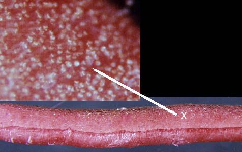
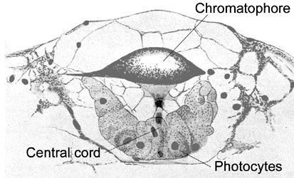
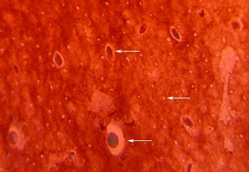

## Phylogeny 

-   « Ancestral Groups  
    -   [Chiroteuthid families](Chiroteuthid_families)
    -  [Oegopsida](../../Oegopsida.md))
    -  [Decapodiformes](../../../Decapodiformes.md))
    -  [Coleoidea](../../../../Coleoidea.md))
    -  [Cephalopoda](../../../../../Cephalopoda.md))
    -  [Mollusca](../../../../../../Mollusca.md))
    -  [Bilateria](../../../../../../../Bilateria.md))
    -  [Animals](../../../../../../../../Animals.md))
    -  [Eukarya](../../../../../../../../../Eukarya.md))
    -   [Tree of Life](../../../../../../../../../Tree_of_Life.md)

-   ◊ Sibling Groups of  Chiroteuthid families
    -   [Batoteuthis skolops](Batoteuthis_skolops)
    -  [Chiroteuthidae](Chiroteuthidae.md))
    -   [Joubiniteuthis portieri](Joubiniteuthis_portieri)
    -   [Magnapinna](Magnapinna)
    -   Mastigoteuthis
    -   [Promachoteuthis](Promachoteuthis)

-   » Sub-Groups
    -   [Mastigoteuthis tyroi](Mastigoteuthis_tyroi)
    -   [Mastigoteuthis schmidti](Mastigoteuthis_schmidti)
    -   [Mastigoteuthis pyrodes](Mastigoteuthis_pyrodes)
    -   [Mastigoteuthis         psychrophila](Mastigoteuthis_psychrophila)
    -   [Mastigoteuthis magna](Mastigoteuthis_magna)
    -   [Mastigoteuthis hjorti](Mastigoteuthis_hjorti)
    -   [Mastigoteuthis         glaukopis](Mastigoteuthis_glaukopis)
    -   [Mastigoteuthis         grimaldii](Mastigoteuthis_grimaldii)
    -   [Mastigoteuthis flammea](Mastigoteuthis_flammea)
    -   [Mastigoteuthis famelica](Mastigoteuthis_famelica)
    -   [Mastigoteuthis dentata](Mastigoteuthis_dentata)
    -   [Mastigoteuthis danae](Mastigoteuthis_danae)
    -   [Mastigoteuthis         cordiformis](Mastigoteuthis_cordiformis)
    -   [Mastigoteuthis         atlantica](Mastigoteuthis_atlantica)
    -   [Mastigoteuthis         agassizii](Mastigoteuthis_agassizii)

## Mastigoteuthidae [Verrill, 1881] 

# *Mastigoteuthis* [Verrill, 1881]

## Whip-lash squid 

[Michael Vecchione, Richard E. Young, and Mario Alejandro Salcedo-Vargas]()

This family contains a single genus, *Mastigoteuthis* Verrill, 1881,
with 14 nominal species, many of which are poorly known.

Containing group:[Chiroteuthid families](../Chiroteuthid.md))

## Introduction

Mastigoteuthids are deep water pelagic or benthopelagic squids that are
morphologically distinctive. They are weakly muscled and reddish in
color and have elongate fourth arms. Much of the red pigment is not in
chromatophore organs but dispersed in other integumental cells, although
chromatophores are present. The Mastigoteuthidae, however, is among the
most taxonomically confused families of all deep-sea squid. The reason
for the taxonomic confusion within the family is that many characters
are based on the structure of the tentacles and photophores in the skin.
Tentacles are often lost and the skin abraded during capture.

The tentacles are elongate and whip-like with tentacular clubs that are
little differentiated from the tentacular stalks except that they are
covered with thousands of extremely small suckers; depending on the
species, the suckers may be invisible to the naked eye. The photograph
below shows the midregion of a tentacular club with the sucker-bearing
portion marked by an X. The arrow points to a microscope enlargment
showing the small suckers. The tentacles appear, in freshly dead
specimens, to function much like \"fly paper\": anything that touches
them sticks.
){width="476"}

**Figure**. Side view of a portion of the tentacle club (bottom) of
***Mastigoteuthis*** sp., Hawaiian waters, showing the club covering the
top half of the cyclindrical tentacle. **Insert** - Portion of the club,
marked by an \"X\", as seen through a microscope. Photographs by R.
Young.

[Histological sections through the tentacle can be seen here.](http://www.tolweb.org/accessory/Histological_Sections_of_Mastigoteuthis_Tentacle?acc_id=795)

Fins are usually very large and positioned mostly posterior to the
muscular part of the mantle. No well-developed system of giant nerve
fibers is present, which reflects the absence of rapid jet propulsion
(Dilly, *et al*., 1977).

#### Diagnosis

Member of the chiroteuthid families \...

-   with arms IV longest.
-   with cyclindrical, whip-like tentacular clubs bearing small suckers
    in numerous irregular series.
-   with oval funnel locking-appartus usually bearing various knobs or
    lobes (often a tragus and antitragus) affecting the shape of the
    groove.

### Characteristics

1.  Arms
    1.  Arms IV longest, thickest and with expanded lateral membranes
        which form tentacular sheaths.\
        \
2.  Tentacles
    1.  Tentacular clubs elongate, virtually cyclindrical; with suckers
        in many irregular series (30 or more in some species).\
        \
3.  Funnel
    1.  Funnel locking-apparatus oval, usually with knobs (tragus,
        antitragus) affecting the shape of the depression in the funnel
        component in different species; specific shape varies with
        species.\
        \
4.  Fins
    1.  Fins large (ca. 50% of ML) to very large (ca. 90% of ML).
    2.  Fins with terminal position.\
        \
5.  Tail
    1.  Short tail present (often absent due to damage during capture).
    2.  Tail supported by secondary conus.\
        \
6.  Photophores
    1.  Photophores present on eyeball or eyelid and/or integument or
        absent.

#### Comments

Integumental photophores are found in many species and seem have a
similar structure. The photophore has a large covering chromatophore, a
thick donut-shaped cup of photocytes and a central cord of cells that
passes through the hole in the photocyte donut to the chromatophore.
){width="413"}

**Figure**. Composite longitudinal section through an integumental
photophore of ***M. flammea***. Drawing modified from Chun (1910).

The integument of most species (***M. pyrodes*** is an exception) with
integumental photophores is complex and contains two elements in
addition to the integumental photophores: (1) very small, whitish balls
and (2) whitish rings surrounding chromatophores. Since the function of
these two structures is unknown, we call the first \"white balls\" and
the second \"ringed chromatophores\" for descriptive purposes.
)

**Figure**. Ventral view of the head integument of ***M. flammea***,
Gulf of Mexico. Note that much of the pigmentation does not lie within
chromatophores. **Bottom arrow** - A typical integumental photophore.
**Middle arrow** - A very small, light colored ball (a \"white ball\").
**Top arrow** - A chromatophore surrounded by a light-colored band (a
\"ringed chromatophore\"). The band is not a shrinkage space around the
chromatophore nor is the combination of the band and chromatophore a
developmental stage of a typical integumental photophore. Photograph by
R. Young.

#### Comparison of species

The following list distinguishes species or species groups:

1.  ***M. famelica*** group \[***M. atlantica*** (Atlantic Ocean), ***M.
    famelica*** (N. E. Pacific Ocean), ***M. glaukopis*** (Indian
    Ocean)\].
    1.  Photophores in eyelid only.
    2.  Funnel locking-apparatus with tragus but antitragus low or
        absent.
    3.  Tubercules absent in subadults.
2.  ***M. magna*** (circumglobal)
    1.  Photophores absent.
    2.  Funnel locking-apparatus with flask-shaped depression.
    3.  Tubercules absent in subadults.
3.  ***M. cordiformis*** (West Pacific Ocean)
    1.  Photophores absent.
    2.  Funnel locking-apparatus with tragus and antitragus.
    3.  Tubercules present in subadults.
4.  ***M. hjorti*** (circumglobal)
    1.  Photophores on eyeball only.
    2.  Funnel locking-apparatus with tragus and antitragus.
    3.  Tubercules present in subadults.
5.  ***M. agassizii*** group (***M. agassizii***, ***M. dentata***,
    ***M. grimaldii***, ****M. flammea***, ******M. psychrophila***, M.
    schmidti****)
    1.  Integumental photophores present but not on ventral surface of
        fins.
    2.  Funnel locking-apparatus with tragus and with or without
        antitragus.
    3.  Tubercules absent in subadults.
    4.  Small eyelid photophores.
6.  ****M. pyrodes**** (North Pacific Ocean)
    1.  Integumental photophores present, including ventral surface of
        fins.
    2.  Funnel locking-apparatus with tragus and without antitragus.
    3.  Tubercules absent in subadults.
    4.  Moderate eyelid photophores.
7.  Paralarvae (****M. danae***, ***M. tyroi****) - probably represent
    the young of known species.*\
    *

### Nomenclature

Salcedo-Vargas and Okutani (1994) proposed a generic and subgeneric
classification based on morphological similarity rather than a cladistic
analysis of polarized characters. Considerable modification of this
classification subsequently was proposed by Salcedo-Vargas (1997) and
formal subgeneric names were dropped. The classification of this
speciose group which includes many poorly known species, unfortunately,
still cannot be confidently divided at the generic level and we, here,
recognize only the single genus ***Mastigoteuthis***.

[A list of all nominal genera and species in the Mastigoteuthidae can be found here.](http://www.tolweb.org/accessory/Taxa_of_Mastigoteuthidae?acc_id=2413)
The list includes the current status and type species of all genera, and
the current status, type repository and type locality of all species and
all pertinent references.

[Species of doubtful validity or uncertain status are described here.](http://www.tolweb.org/notes/?note_id=2643) These species are:
***Mastigoteuthis latipinna***, ***Mastigoteuthis islini***,
***Mastigoteuthis inermis***, ***Mastigoteuthis okutanii*** and
***Chiroteuthoides hastula***.

### Behavior

Two species (***M. hjorti*, *M. magna***) have been observed from
submersibles drifting just above the ocean floor and dangling tentacles
within a few mm of the bottom, presumably, to capture copepods and other
small plankters of the epibenthic zooplankton (Roper and Vecchione,
1997). The photograph below shows the same behavior in a species off
Hawaii. The arrow points to the place where the tentacle emerges from
the tentacular sheath of the left arm IV. This posture where the
extended tentacles emerge from the lateral membranes (tentacular
sheaths) of the ventral arms and are held apart by these arms is called
the \"tuning fork\" posture (Roper and Vecchione, 1997). Vesiculate
tissue in the squid, especially in the ventral arms, reduces negative
buoyancy. Complex actions of large fins maintain the head-down posture
in spite of the concentration of bouyant tissue at the anterior end. [An AVI format video clip of this behavior is available at Cephalopods in Action](http://www.mnh.si.edu/cephs/rv97/rv97.html#mastigo1).
){width="173"}

**Figure**. Ventral view of ***Mastigoteuthis*** sp. hanging in the
water just above the ocean floor, submersible photograph, Hawaiian
waters. Photograph modified from Young, *et al*. (1999), courtesy of the
Hawaii Undersea Research Laboratory.
### References

Dilly, P. N., M. Nixon and J. Z. Young. 1977. *Mastigoteuthis*\--the
whip-lash squid. J. Zool., Lond., 181: 527-559.

Nesis, K.N. 1977. *Mastigoteuthis psychrophila* sp. n. (Cephalopoda,
Mastigoteuthidae) from the Southern Ocean. Zoologichesky Zhurnal,
65(6):835-842.

Roper, C. F. E. and M. Vecchione, 1997. In-situ observations test
hypotheses of functional morphology in Mastigoteuthis (Cephalopoda,
Oegopsida). Vie Milieu 47:87-93.

Salcedo-Vargas, M. A. and T. Okutani. 1994. New classification of the
squid family Mastigoteuthidae (Cephalopoda: Oegopsida). Venus 53:
119-127.

Salcedo-Vargas, M. A. 1997. Cephalopods from the Netherlands Indian
Ocean Programme (NIOP) - II. Mastigoteuthid lineage and related forms.
Beaufortia, 47: 91-108.

Young, R. E., M. Vecchione and D. Donovan. 1999. The evolution of
coleoid cephalopods and their present biodiversity and ecology. South
African Jour. Mar. Sci., 20: 393-420.

## Title Illustrations

)

  ------------------------------------------------
  Scientific Name ::     Mastigoteuthis agassizii
  Location ::           Oceanographer Canyon, off New England, USA
  Acknowledgements     Photographed in a shipboard aquarium on an NSF cruise under the direction of Marsh Youngbluth, Harbor Branch Oceanographic Institution.
  Specimen Condition   Live Specimen
  Identified By        M. Vecchione
  Copyright ::            © 2004 David Shale
  ------------------------------------------------

## Confidential Links & Embeds: 

### #is_/same_as :: [Mastigoteuthidae](/_Standards/bio/bio~Domain/Eukarya/Animal/Bilateria/Mollusca/Cephalopoda/Coleoidea/Decapodiformes/Oegopsida/Chiroteuthid/Mastigoteuthidae.md) 

### #is_/same_as :: [Mastigoteuthidae.public](/_public/bio/bio~Domain/Eukarya/Animal/Bilateria/Mollusca/Cephalopoda/Coleoidea/Decapodiformes/Oegopsida/Chiroteuthid/Mastigoteuthidae.public.md) 

### #is_/same_as :: [Mastigoteuthidae.internal](/_internal/bio/bio~Domain/Eukarya/Animal/Bilateria/Mollusca/Cephalopoda/Coleoidea/Decapodiformes/Oegopsida/Chiroteuthid/Mastigoteuthidae.internal.md) 

### #is_/same_as :: [Mastigoteuthidae.protect](/_protect/bio/bio~Domain/Eukarya/Animal/Bilateria/Mollusca/Cephalopoda/Coleoidea/Decapodiformes/Oegopsida/Chiroteuthid/Mastigoteuthidae.protect.md) 

### #is_/same_as :: [Mastigoteuthidae.private](/_private/bio/bio~Domain/Eukarya/Animal/Bilateria/Mollusca/Cephalopoda/Coleoidea/Decapodiformes/Oegopsida/Chiroteuthid/Mastigoteuthidae.private.md) 

### #is_/same_as :: [Mastigoteuthidae.personal](/_personal/bio/bio~Domain/Eukarya/Animal/Bilateria/Mollusca/Cephalopoda/Coleoidea/Decapodiformes/Oegopsida/Chiroteuthid/Mastigoteuthidae.personal.md) 

### #is_/same_as :: [Mastigoteuthidae.secret](/_secret/bio/bio~Domain/Eukarya/Animal/Bilateria/Mollusca/Cephalopoda/Coleoidea/Decapodiformes/Oegopsida/Chiroteuthid/Mastigoteuthidae.secret.md)

