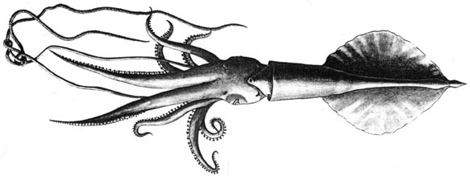
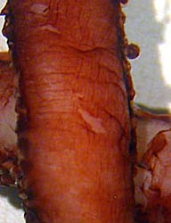

---
aliases:
  - Mastigoteuthis_atlantica
  - Mastigoteuthis atlantica
title: Mastigoteuthis atlantica
---

# *Mastigoteuthis atlantica* [Joubin, 1933] 

[Michael Vecchione and Richard E. Young]()
 

Containing group:[Mastigoteuthidae](../Mastigoteuthidae.md) 

## Introduction

***M. atlantica*** was described from a single large specimen.

#### Diagnosis

A Mastigoteuthis \...

-   with large eyelid photophores but no other photophores.
-   with well-developed trabeculate protective membrane on tentacular
    club.

### Characteristics

1.  Arms
    1.  Arm suckers about 1.5 mm in longest diameter (Joubin, 1933).

       ){width="192"}

        **Figure**. Pigmentation of ***M. atlantica***, 105 mm ML,
        NMNH 884059. **Left** - Ventral view of a portion of the mantle
        at the level of the fins. **Right** - Aboral view of a portion
        of the tentacular club. Photographs by R. Young.
2.  Measurements

#### Comments

We examined two large specimens of ***M. atlantica*** in the NMNH but
they were badly damaged and the sucker rings had deteriorated. ***M.
atlantica*** is very similar to ***M. famelica*** from the central North
Pacific in having large eyelid photophores, absence of all other
photophores and fins that are slightly longer than wide. These two
species clearly differ, however, in the size of the protective membrane
on the tentacular clubs (well developed in **M. atlantica** and nearly
absent in ***M. famelica***). The small ***M. glaukopis*** from the
Indian Ocean as described by Chun (1910) is very similar except for
differences in the size and dentition of the club suckers. Since these
latter features change with size, we can find no differences that
separate ***M. glaukopis*** Chun, 1908 and it is probably synonymus with
***M. atlantica*** Joubin, 1933 or ***M. famelica*** Berry, 1909, but
has priority over both. Until larger specimens of ***M. glaukopis*** are
available from the Indian Ocean, we maintain all three species. We
suspect, however, on the basis of the distinct protective membrane on
the tentacular club in the illustrations of Chun (1910) that ***M.
glaukopis*** and ***M. atlantica*** may be synonymous.

### Distribution

Type locality: 46°28\'N, 08°01\'W near the Bay of Biscay, NE Atlantic.

## Phylogeny 

-   « Ancestral Groups  
    -   [Mastigoteuthis](Mastigoteuthis)
    -   [Chiroteuthid families](Chiroteuthid_families)
    -  [Oegopsida](../../../Oegopsida.md) 
    -  [Decapodiformes](../../../../Decapodiformes.md) 
    -  [Coleoidea](../../../../../Coleoidea.md) 
    -  [Cephalopoda](../../../../../../Cephalopoda.md) 
    -  [Mollusca](../../../../../../../Mollusca.md) 
    -  [Bilateria](../../../../../../../../Bilateria.md) 
    -  [Animals](../../../../../../../../../Animals.md) 
    -  [Eukarya](../../../../../../../../../../Eukarya.md) 
    -   [Tree of Life](../../../../../../../../../../Tree_of_Life.md)

-   ◊ Sibling Groups of  Mastigoteuthis
    -   [Mastigoteuthis tyroi](Mastigoteuthis_tyroi)
    -   [Mastigoteuthis schmidti](Mastigoteuthis_schmidti)
    -   [Mastigoteuthis pyrodes](Mastigoteuthis_pyrodes)
    -   [Mastigoteuthis         psychrophila](Mastigoteuthis_psychrophila)
    -   [Mastigoteuthis magna](Mastigoteuthis_magna)
    -   [Mastigoteuthis hjorti](Mastigoteuthis_hjorti)
    -   [Mastigoteuthis         glaukopis](Mastigoteuthis_glaukopis)
    -   [Mastigoteuthis         grimaldii](Mastigoteuthis_grimaldii)
    -   [Mastigoteuthis flammea](Mastigoteuthis_flammea)
    -   [Mastigoteuthis famelica](Mastigoteuthis_famelica)
    -   [Mastigoteuthis dentata](Mastigoteuthis_dentata)
    -   [Mastigoteuthis danae](Mastigoteuthis_danae)
    -   [Mastigoteuthis         cordiformis](Mastigoteuthis_cordiformis)
    -   Mastigoteuthis atlantica
    -   [Mastigoteuthis         agassizii](Mastigoteuthis_agassizii)

-   » Sub-Groups 

### References

Joubin, L. 1933. Notes préliminaires sur les Céphalopodes des croisières
du Dana (1921-1922). 4e Partie. Annales de l\'Institut Océanographique,
new series, 13: 1-49.

## Title Illustrations

 

  ---------------------------------------------------------
  scientific_name ::  Mastigoteuthis atlantica
  Reference         Joubin, L. 1933. Notes préliminaires sur les Céphalopodes des croisières du Dana (1921-1922). 4e Partie. Annales de l\'Institut Océanographique, new series, 13: 1-49.
  View              Ventral
  Size              112 mm ML
  Type              Holotype
  ---------------------------------------------------------

## Confidential Links & Embeds: 

### #is_/same_as :: [[/_Standards/bio/bio~Domain/Eukarya/Animal/Bilateria/Mollusca/Cephalopoda/Coleoidea/Decapodiformes/Oegopsida/Chiroteuthid/Mastigoteuthidae/Mastigoteuthis_atlantica|Mastigoteuthis_atlantica]] 

### #is_/same_as :: [[/_public/bio/bio~Domain/Eukarya/Animal/Bilateria/Mollusca/Cephalopoda/Coleoidea/Decapodiformes/Oegopsida/Chiroteuthid/Mastigoteuthidae/Mastigoteuthis_atlantica.public|Mastigoteuthis_atlantica.public]] 

### #is_/same_as :: [[/_internal/bio/bio~Domain/Eukarya/Animal/Bilateria/Mollusca/Cephalopoda/Coleoidea/Decapodiformes/Oegopsida/Chiroteuthid/Mastigoteuthidae/Mastigoteuthis_atlantica.internal|Mastigoteuthis_atlantica.internal]] 

### #is_/same_as :: [[/_protect/bio/bio~Domain/Eukarya/Animal/Bilateria/Mollusca/Cephalopoda/Coleoidea/Decapodiformes/Oegopsida/Chiroteuthid/Mastigoteuthidae/Mastigoteuthis_atlantica.protect|Mastigoteuthis_atlantica.protect]] 

### #is_/same_as :: [[/_private/bio/bio~Domain/Eukarya/Animal/Bilateria/Mollusca/Cephalopoda/Coleoidea/Decapodiformes/Oegopsida/Chiroteuthid/Mastigoteuthidae/Mastigoteuthis_atlantica.private|Mastigoteuthis_atlantica.private]] 

### #is_/same_as :: [[/_personal/bio/bio~Domain/Eukarya/Animal/Bilateria/Mollusca/Cephalopoda/Coleoidea/Decapodiformes/Oegopsida/Chiroteuthid/Mastigoteuthidae/Mastigoteuthis_atlantica.personal|Mastigoteuthis_atlantica.personal]] 

### #is_/same_as :: [[/_secret/bio/bio~Domain/Eukarya/Animal/Bilateria/Mollusca/Cephalopoda/Coleoidea/Decapodiformes/Oegopsida/Chiroteuthid/Mastigoteuthidae/Mastigoteuthis_atlantica.secret|Mastigoteuthis_atlantica.secret]] 

