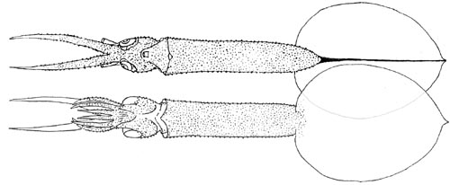

---
aliases:
  - Mastigoteuthis_danae
  - Mastigoteuthis danae
title: Mastigoteuthis danae
---

# *Mastigoteuthis danae* [(Joubin, 1933)] 

[Michael Vecchione and Richard E. Young]()

Containing group:[Mastigoteuthidae](../Mastigoteuthidae.md))

## Introduction

Joubin (1933) collected 18 young squid of this species but based his
description on three specimens, 61 (arm tip to tail), 45 and 17 mm
(tentacle tip to tail). All specimens, in spite of the rather large
size, apparently are paralarval.

------------------------

#### Diagnosis

A mastigoteuthid \...

-   with large tubercules in advanced paralarvae.
-   with a fin that is longer than wide.

### Characteristics

1.  Arms
    1.  Arm suckers without teeth.
2.  Photophores
    1.  Photophores absent.
3.  Pigmentation
    1.  Few chromatophores present.
4.  Measurements
      ---------------------
      Total length                   61 mm to tip of arm IV   45 mm to tip of tentacle
      Mantle length (without fins)   25 mm                     
      Mantle length (with fins)\*    46 mm                     
      Head width                     17 mm                     
      Head length                    7 mm                      
      Fin length                     25 mm                    11 mm\*
      Fin width                      17 mm                    7 mm
      Arm I, length                  3 mm                      
      Arm II, length                 5 mm                      
      Arm III, length                4 mm                      
      Arm IV, length                 14 mm                     
      Tail                           \< 1 mm\*                9 mm
      Tentacle length                \--                      45 mm
      ---------------------

\*Estimated from drawing.

#### Comments

This description is taken from Joubin (1933). ***M. danae*** is known
only from paralarvae and may represent the young stage of a known
species.

### Distribution

Type locality: North Atlantic; 34°40\'N, 33°16\'W, SE of the Azores;
16°03\'N, 62°29\'W near the Antilles; 30°51\'N, 21°00\'W east of the
Canary Islands.

Salcedo-Vargas (1997) described four specimens (15-30 mm ML) from off
Somalia, western Indian Ocean.

## Phylogeny 

-   « Ancestral Groups  
    -   [Mastigoteuthis](Mastigoteuthis)
    -   [Chiroteuthid families](Chiroteuthid_families)
    -  [Oegopsida](../../../Oegopsida.md))
    -  [Decapodiformes](../../../../Decapodiformes.md))
    -  [Coleoidea](../../../../../Coleoidea.md))
    -  [Cephalopoda](../../../../../../Cephalopoda.md))
    -  [Mollusca](../../../../../../../Mollusca.md))
    -  [Bilateria](../../../../../../../../Bilateria.md))
    -  [Animals](../../../../../../../../../Animals.md))
    -  [Eukarya](../../../../../../../../../../Eukarya.md))
    -   [Tree of Life](../../../../../../../../../../Tree_of_Life.md)

-   ◊ Sibling Groups of  Mastigoteuthis
    -   [Mastigoteuthis tyroi](Mastigoteuthis_tyroi)
    -   [Mastigoteuthis schmidti](Mastigoteuthis_schmidti)
    -   [Mastigoteuthis pyrodes](Mastigoteuthis_pyrodes)
    -   [Mastigoteuthis         psychrophila](Mastigoteuthis_psychrophila)
    -   [Mastigoteuthis magna](Mastigoteuthis_magna)
    -   [Mastigoteuthis hjorti](Mastigoteuthis_hjorti)
    -   [Mastigoteuthis         glaukopis](Mastigoteuthis_glaukopis)
    -   [Mastigoteuthis         grimaldii](Mastigoteuthis_grimaldii)
    -   [Mastigoteuthis flammea](Mastigoteuthis_flammea)
    -   [Mastigoteuthis famelica](Mastigoteuthis_famelica)
    -   [Mastigoteuthis dentata](Mastigoteuthis_dentata)
    -   Mastigoteuthis danae
    -   [Mastigoteuthis         cordiformis](Mastigoteuthis_cordiformis)
    -   [Mastigoteuthis         atlantica](Mastigoteuthis_atlantica)
    -   [Mastigoteuthis         agassizii](Mastigoteuthis_agassizii)

-   » Sub-Groups 

### References

Joubin, L. 1933. Notes préliminaires sur les Céphalopodes des croisières
du Dana (1921-1922). 4e Partie. Annales de l\'Institut Océanographique,
new series, 13: 1-49.

Salcedo-Vargas, M. A. 1997. Cephalopods from the Netherlands Indian
Ocean Programme (NIOP) - II. Mastigoteuthid lineage and related forms.
Beaufortia, 47: 91-108.

## Title Illustrations

)

  ---------------------------------------------------------
  Scientific Name ::  Mastigoteuthis danae
  Location ::        34°40\'N, 33°16\'W
  Reference         Joubin, L. 1933. Notes préliminaires sur les Céphalopodes des croisières du Dana (1921-1922). 4e Partie. Annales de l\'Institut Océanographique, new series, 13: 1-49.
  View              Ventral and dorsal.
  Type              Type series.
  ---------------------------------------------------------

## Confidential Links & Embeds: 

### #is_/same_as :: [Mastigoteuthis_danae](/_Standards/bio/bio~Domain/Eukarya/Animal/Bilateria/Mollusca/Cephalopoda/Coleoidea/Decapodiformes/Oegopsida/Chiroteuthid/Mastigoteuthidae/Mastigoteuthis_danae.md) 

### #is_/same_as :: [Mastigoteuthis_danae.public](/_public/bio/bio~Domain/Eukarya/Animal/Bilateria/Mollusca/Cephalopoda/Coleoidea/Decapodiformes/Oegopsida/Chiroteuthid/Mastigoteuthidae/Mastigoteuthis_danae.public.md) 

### #is_/same_as :: [Mastigoteuthis_danae.internal](/_internal/bio/bio~Domain/Eukarya/Animal/Bilateria/Mollusca/Cephalopoda/Coleoidea/Decapodiformes/Oegopsida/Chiroteuthid/Mastigoteuthidae/Mastigoteuthis_danae.internal.md) 

### #is_/same_as :: [Mastigoteuthis_danae.protect](/_protect/bio/bio~Domain/Eukarya/Animal/Bilateria/Mollusca/Cephalopoda/Coleoidea/Decapodiformes/Oegopsida/Chiroteuthid/Mastigoteuthidae/Mastigoteuthis_danae.protect.md) 

### #is_/same_as :: [Mastigoteuthis_danae.private](/_private/bio/bio~Domain/Eukarya/Animal/Bilateria/Mollusca/Cephalopoda/Coleoidea/Decapodiformes/Oegopsida/Chiroteuthid/Mastigoteuthidae/Mastigoteuthis_danae.private.md) 

### #is_/same_as :: [Mastigoteuthis_danae.personal](/_personal/bio/bio~Domain/Eukarya/Animal/Bilateria/Mollusca/Cephalopoda/Coleoidea/Decapodiformes/Oegopsida/Chiroteuthid/Mastigoteuthidae/Mastigoteuthis_danae.personal.md) 

### #is_/same_as :: [Mastigoteuthis_danae.secret](/_secret/bio/bio~Domain/Eukarya/Animal/Bilateria/Mollusca/Cephalopoda/Coleoidea/Decapodiformes/Oegopsida/Chiroteuthid/Mastigoteuthidae/Mastigoteuthis_danae.secret.md)

