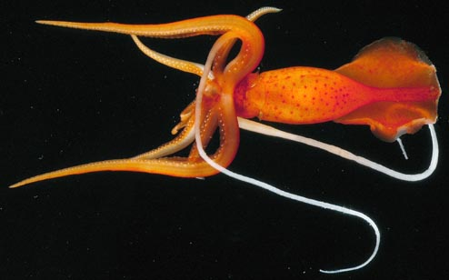
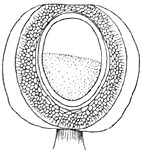
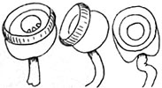
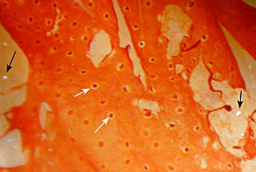

---
aliases:
  - agassizii
title: Mastigoteuthis agassizii
---

# *Mastigoteuthis agassizii* [Verrill, 1881] 

[Michael Vecchione and Richard E. Young]()
)

Containing group:[Mastigoteuthidae](../Mastigoteuthidae.md))

## Introduction

***M. agassizii*** is the type species of the genus.

------------------------

#### Diagnosis

A mastigoteuthid \...

-   with integumental photophores.
-   with smooth-ringed arm suckers.

### Characteristics

1.  Arms
    1.  Arm suckers with oblique aperatures on inner rings and smooth
        inner margins.

       )

        **Figure**. Oral view of sucker of ***M. agassizii*** from
        middle of a lateral arm. Drawing from Verrill (1881b).
2.  Tentacles
    1.  Tentacles shaped like \"whip-lash.\" Club covers half of
        tentacle length. Club base with scattered suckers mostly in two
        series for some distance. (Verrill, 1881b).

    2.  Club suckers with circular aperature often with 2-3 teeth on one
        side (Verrill, 1881b).

       )

        **Figure**. Tentacular club of ***M. agassizii***. **Left** -
        Aboral view of a portion of the club. **Right** - Various views
        of club suckers. Drawings from Verrill (1881b).
3.  Funnel locking-apparatus
    1.  Funnel locking apparatus: \"\...earshaped, elevated cartilage,
        on each side, fitting into corresponding deep, circumscribed
        pits\...\" (Verrill, 1881b).
4.  Mantle
    1.  Tubercules absent from mantle and other integument.
5.  Photophores
    1.  Integumental photophores on dorsal and ventral mantle, dorsal
        fin, head and arms (Verrill, 1881b).

    2.  Eyelid photophores present (Young, 1972).

       )

        **Figure**. External view of a portion of the mantle skin of
        ***M. agassizii*** showing bare photophores (black arrows) and
        photophores with their covering chromatophores (white arrows),
        fresh squid, off N.E. coast of USA. Photograph by M. Vecchione.
6.  Fins
    1.  Fin length about half combined head and body.
7.  Measurements
      -------- ------
      Source            Verrill, 1881b   Verrill, 1881b
      Sex ::             Male             Male
      Mantle length     46               99
      Mantle width      15               23
      Fin length        30               60
      Fin width         42               75
      Eye diameter      7.5              9
      Arm I, length     24               45
      Arm II, length    33               60
      Arm III, length   34               60
      Arm IV, length    80               112
      Tentacle length   \--              312
      -------- ------

#### Comments

This is the only species of ***Mastigoteuthis*** that has integumental
photophores but smooth arm sucker rings.

### Distribution

Type locality: Off northeast coast of the United States at 33°25\'N,
76°W and 34°28\'N, 75°23\'W.

## Phylogeny 

-   « Ancestral Groups  
    -   [Mastigoteuthis](Mastigoteuthis)
    -   [Chiroteuthid families](Chiroteuthid_families)
    -  [Oegopsida](../../../Oegopsida.md))
    -  [Decapodiformes](../../../../Decapodiformes.md))
    -  [Coleoidea](../../../../../Coleoidea.md))
    -  [Cephalopoda](../../../../../../Cephalopoda.md))
    -  [Mollusca](../../../../../../../Mollusca.md))
    -  [Bilateria](../../../../../../../../Bilateria.md))
    -  [Animals](../../../../../../../../../Animals.md))
    -  [Eukarya](../../../../../../../../../../Eukarya.md))
    -   [Tree of Life](../../../../../../../../../../Tree_of_Life.md)

-   ◊ Sibling Groups of  Mastigoteuthis
    -   [Mastigoteuthis tyroi](Mastigoteuthis_tyroi)
    -   [Mastigoteuthis schmidti](Mastigoteuthis_schmidti)
    -   [Mastigoteuthis pyrodes](Mastigoteuthis_pyrodes)
    -   [Mastigoteuthis         psychrophila](Mastigoteuthis_psychrophila)
    -   [Mastigoteuthis magna](Mastigoteuthis_magna)
    -   [Mastigoteuthis hjorti](Mastigoteuthis_hjorti)
    -   [Mastigoteuthis         glaukopis](Mastigoteuthis_glaukopis)
    -   [Mastigoteuthis         grimaldii](Mastigoteuthis_grimaldii)
    -   [Mastigoteuthis flammea](Mastigoteuthis_flammea)
    -   [Mastigoteuthis famelica](Mastigoteuthis_famelica)
    -   [Mastigoteuthis dentata](Mastigoteuthis_dentata)
    -   [Mastigoteuthis danae](Mastigoteuthis_danae)
    -   [Mastigoteuthis         cordiformis](Mastigoteuthis_cordiformis)
    -   [Mastigoteuthis         atlantica](Mastigoteuthis_atlantica)
    -   Mastigoteuthis agassizii

-   » Sub-Groups 

### References

Verrill, A.E. 1881a. Report on the Cephalopods, and on Some Additional
Species Dredged by the U.S. Fish Commission Steamer \"Fish Hawk\",
During the Season of 1880. Bulletin of the Museum of Comparative
Zoology, 8(5):99-116.

Verrill, A.E. 1881b. The Cephalopods of the North-eastern Coast of
America. Part II. The Smaller Cephalopods, Including the \"Squids\" and
the Octopi, with Other Allied Forms. Transactions of the Connecticut
Academy of Sciences, 5: 259-446.

## Title Illustrations

)

  -----------------------------------------------
  Scientific Name ::     Mastigoteuthis agassizii
  Location ::           Oceanographer Canyon, off New England, USA
  Comments             Photographed in a shipboard aquarium on an NSF cruise under the direction of Marsh Youngbluth, Harbor Branch Oceanographic Institution
  Specimen Condition   Live Specimen
  Identified By        M. Vecchione
  Copyright ::            © 2004 David Shale
  -----------------------------------------------

## Confidential Links & Embeds: 

### #is_/same_as :: [agassizii](/_Standards/bio/bio~Domain/Eukarya/Animal/Bilateria/Mollusca/Cephalopoda/Coleoidea/Decapodiformes/Oegopsida/Chiroteuthid/Mastigoteuthidae/agassizii.md) 

### #is_/same_as :: [agassizii.public](/_public/bio/bio~Domain/Eukarya/Animal/Bilateria/Mollusca/Cephalopoda/Coleoidea/Decapodiformes/Oegopsida/Chiroteuthid/Mastigoteuthidae/agassizii.public.md) 

### #is_/same_as :: [agassizii.internal](/_internal/bio/bio~Domain/Eukarya/Animal/Bilateria/Mollusca/Cephalopoda/Coleoidea/Decapodiformes/Oegopsida/Chiroteuthid/Mastigoteuthidae/agassizii.internal.md) 

### #is_/same_as :: [agassizii.protect](/_protect/bio/bio~Domain/Eukarya/Animal/Bilateria/Mollusca/Cephalopoda/Coleoidea/Decapodiformes/Oegopsida/Chiroteuthid/Mastigoteuthidae/agassizii.protect.md) 

### #is_/same_as :: [agassizii.private](/_private/bio/bio~Domain/Eukarya/Animal/Bilateria/Mollusca/Cephalopoda/Coleoidea/Decapodiformes/Oegopsida/Chiroteuthid/Mastigoteuthidae/agassizii.private.md) 

### #is_/same_as :: [agassizii.personal](/_personal/bio/bio~Domain/Eukarya/Animal/Bilateria/Mollusca/Cephalopoda/Coleoidea/Decapodiformes/Oegopsida/Chiroteuthid/Mastigoteuthidae/agassizii.personal.md) 

### #is_/same_as :: [agassizii.secret](/_secret/bio/bio~Domain/Eukarya/Animal/Bilateria/Mollusca/Cephalopoda/Coleoidea/Decapodiformes/Oegopsida/Chiroteuthid/Mastigoteuthidae/agassizii.secret.md)

