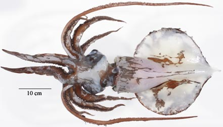
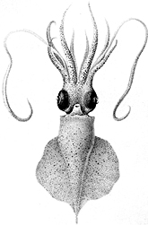

## Phylogeny 

-   « Ancestral Groups  
    -   [Mastigoteuthis](Mastigoteuthis)
    -   [Chiroteuthid families](Chiroteuthid_families)
    -  [Oegopsida](../../../Oegopsida.md))
    -  [Decapodiformes](../../../../Decapodiformes.md))
    -  [Coleoidea](../../../../../Coleoidea.md))
    -  [Cephalopoda](../../../../../../Cephalopoda.md))
    -  [Mollusca](../../../../../../../Mollusca.md))
    -  [Bilateria](../../../../../../../../Bilateria.md))
    -  [Animals](../../../../../../../../../Animals.md))
    -  [Eukarya](../../../../../../../../../../Eukarya.md))
    -   [Tree of Life](../../../../../../../../../../Tree_of_Life.md)

-   ◊ Sibling Groups of  Mastigoteuthis
    -   [Mastigoteuthis tyroi](Mastigoteuthis_tyroi)
    -   [Mastigoteuthis schmidti](Mastigoteuthis_schmidti)
    -   [Mastigoteuthis pyrodes](Mastigoteuthis_pyrodes)
    -   [Mastigoteuthis         psychrophila](Mastigoteuthis_psychrophila)
    -   [Mastigoteuthis magna](Mastigoteuthis_magna)
    -   [Mastigoteuthis hjorti](Mastigoteuthis_hjorti)
    -   [Mastigoteuthis         glaukopis](Mastigoteuthis_glaukopis)
    -   [Mastigoteuthis         grimaldii](Mastigoteuthis_grimaldii)
    -   [Mastigoteuthis flammea](Mastigoteuthis_flammea)
    -   [Mastigoteuthis famelica](Mastigoteuthis_famelica)
    -   [Mastigoteuthis dentata](Mastigoteuthis_dentata)
    -   [Mastigoteuthis danae](Mastigoteuthis_danae)
    -   Mastigoteuthis cordiformis
    -   [Mastigoteuthis         atlantica](Mastigoteuthis_atlantica)
    -   [Mastigoteuthis         agassizii](Mastigoteuthis_agassizii)

-   » Sub-Groups 

# *Mastigoteuthis cordiformis* [Chun, 1908] 

[Richard E. Young and Michael Vecchione]()
))

Containing group:[Mastigoteuthidae](../Mastigoteuthidae.md))

## Introduction

The original description of ***M. cordiformis*** is based on a single
male squid, 80 mm ML with intact tentacles, taken in the Indian Ocean
near Sumatra. It has been subsequently described from Japan (Sasaki,
1929) and the Philippines (Voss, (1963). This is the largest of the
mastigoteuthids reaching a size of 100 cm ML (A. Salcedo-Vargas,
personnal communication).

#### Diagnosis

A mastigoteuthid \...

-   without photophores.
-   with club bearing very large suckers (ca. 0.5 mm) at proximal end.
-   with skin tubercules.

### Characteristics

1.  Tentacles
    1.  Tentacular club not expanded (slightly expanded according to
        Sasaki, 1929, and Voss, 1963), with narrow, trabeculate
        protective membranes (Chun, 1910).
    2.  Club suckers gradually decrease in size toward tip (Chun, 1910);
        very large suckers (for a mastigoteuthid club) present at
        proximal end of club.
2.  Photophores
    1.  Photophores absent
3.  Fins
    1.  Fin length (anterior extent to insertion on tail) 75% of ML; fin
        width 72% of ML (Chun, 1910).

#### Comments

[More details of the description can be found here.](http://www.tolweb.org/notes/?note_id=2440)

The descriptions of Chun, Sasaki and Voss contain differences in the
shape of the funnel locking-apparatus and the structure of the suckers.
The significance of these differences remains to be determined. ***M.
latipinna*** Sasaki, 1916 (see description under \"Species of doubtful
validity\...\" in the Nomenclature section of the family page) is
probably a junior synonym of ***M. cordiformis***.

***M. cordiformis*** is most similar to ***M. hjorti*** but differs in
the absence of ocular photophores and the presence of enlarged proximal
club suckers among other features.

### Distribution

Type locality: Indian Ocean south of Sumatra at 0°15\'N, 98°8\'E. Also
known from southern Japanese (Sasaki, 1929) and Philippine (Voss, 1963)
waters.

### References

Chun, C. 1910. Die Cephalopoden. Oegopsida. Wissenschaftliche Ergebnisse
der Deutschen Tiefsee Expedition auf dem Dampfer \"Valdivia\" 1898-1899,
18(1):1-401.

Roper, C.F.E. and C.C. Lu 1990. Comparative morphology and function of
dermal structures in oceanic squids (Cephalopoda). Smithson. Contr.
Zool., No. 493: 1-40.

Sasaki, M. 1929. A Monograph of the Dibranchiate Cephalopods of the
Japanese and Adjacent Waters. Journal of the College of Agriculture,
Hokkaido Imperial University, 20(supplement):357 pages.

Voss, G. L. 1963. Cephalopoda of the Philippine Islands. Bull. U. S.
Nat. Mus., 234: 1-180.

## Title Illustrations

)

  ------------
  Scientific Name ::  Mastigoteuthis cordiformis
  Location ::        South Pacific
  View              Ventral
  Size              325 mm ML
  Copyright ::         © 2004 Mark Norman
  ------------
)

  ------------------------------------------------------
  Scientific Name ::  Mastigoteuthis cordiformis
  Reference         Chun, C. 1910. Die Cephalopoden. Oegopsida. Wissenschaftliche Ergebnisse der Deutschen Tiefsee Expedition auf dem Dampfer \"Valdivia\" 1898-1899, 18(1):1-401.
  View              Ventral
  Size              83 mm ML (including tail).
  Type              Holotype
  ------------------------------------------------------

## Confidential Links & Embeds: 

### #is_/same_as :: [cordiformis](/_Standards/bio/bio~Domain/Eukarya/Animal/Bilateria/Mollusca/Cephalopoda/Coleoidea/Decapodiformes/Oegopsida/Chiroteuthid/Mastigoteuthidae/cordiformis.md) 

### #is_/same_as :: [cordiformis.public](/_public/bio/bio~Domain/Eukarya/Animal/Bilateria/Mollusca/Cephalopoda/Coleoidea/Decapodiformes/Oegopsida/Chiroteuthid/Mastigoteuthidae/cordiformis.public.md) 

### #is_/same_as :: [cordiformis.internal](/_internal/bio/bio~Domain/Eukarya/Animal/Bilateria/Mollusca/Cephalopoda/Coleoidea/Decapodiformes/Oegopsida/Chiroteuthid/Mastigoteuthidae/cordiformis.internal.md) 

### #is_/same_as :: [cordiformis.protect](/_protect/bio/bio~Domain/Eukarya/Animal/Bilateria/Mollusca/Cephalopoda/Coleoidea/Decapodiformes/Oegopsida/Chiroteuthid/Mastigoteuthidae/cordiformis.protect.md) 

### #is_/same_as :: [cordiformis.private](/_private/bio/bio~Domain/Eukarya/Animal/Bilateria/Mollusca/Cephalopoda/Coleoidea/Decapodiformes/Oegopsida/Chiroteuthid/Mastigoteuthidae/cordiformis.private.md) 

### #is_/same_as :: [cordiformis.personal](/_personal/bio/bio~Domain/Eukarya/Animal/Bilateria/Mollusca/Cephalopoda/Coleoidea/Decapodiformes/Oegopsida/Chiroteuthid/Mastigoteuthidae/cordiformis.personal.md) 

### #is_/same_as :: [cordiformis.secret](/_secret/bio/bio~Domain/Eukarya/Animal/Bilateria/Mollusca/Cephalopoda/Coleoidea/Decapodiformes/Oegopsida/Chiroteuthid/Mastigoteuthidae/cordiformis.secret.md)

