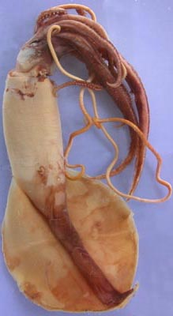
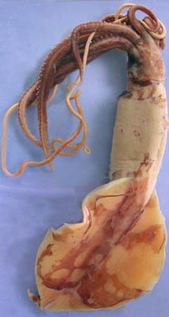
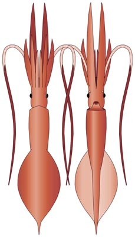
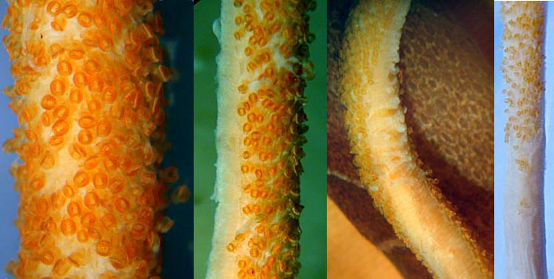
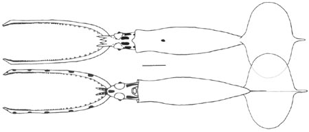
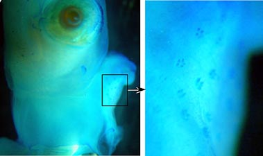
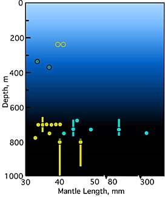

---
title: "Mastigoteuthis famelica"
---

## Phylogeny 

-   « Ancestral Groups  
    -   [Mastigoteuthis](Mastigoteuthis)
    -   [Chiroteuthid families](Chiroteuthid_families)
    -  [Oegopsida](../../../Oegopsida.md))
    -  [Decapodiformes](../../../../Decapodiformes.md))
    -  [Coleoidea](../../../../../Coleoidea.md))
    -  [Cephalopoda](../../../../../../Cephalopoda.md))
    -  [Mollusca](../../../../../../../Mollusca.md))
    -  [Bilateria](../../../../../../../../Bilateria.md))
    -  [Animals](../../../../../../../../../Animals.md))
    -  [Eukarya](../../../../../../../../../../Eukarya.md))
    -   [Tree of Life](../../../../../../../../../../Tree_of_Life.md)

-   ◊ Sibling Groups of  Mastigoteuthis
    -   [Mastigoteuthis tyroi](Mastigoteuthis_tyroi)
    -   [Mastigoteuthis schmidti](Mastigoteuthis_schmidti)
    -   [Mastigoteuthis pyrodes](Mastigoteuthis_pyrodes)
    -   [Mastigoteuthis         psychrophila](Mastigoteuthis_psychrophila)
    -   [Mastigoteuthis magna](Mastigoteuthis_magna)
    -   [Mastigoteuthis hjorti](Mastigoteuthis_hjorti)
    -   [Mastigoteuthis         glaukopis](Mastigoteuthis_glaukopis)
    -   [Mastigoteuthis         grimaldii](Mastigoteuthis_grimaldii)
    -   [Mastigoteuthis flammea](Mastigoteuthis_flammea)
    -   Mastigoteuthis famelica
    -   [Mastigoteuthis dentata](Mastigoteuthis_dentata)
    -   [Mastigoteuthis danae](Mastigoteuthis_danae)
    -   [Mastigoteuthis         cordiformis](Mastigoteuthis_cordiformis)
    -   [Mastigoteuthis         atlantica](Mastigoteuthis_atlantica)
    -   [Mastigoteuthis         agassizii](Mastigoteuthis_agassizii)

-   » Sub-Groups 

# *Mastigoteuthis famelica* [(Berry, 1909)] 

[Richard E. Young]()
)
)

Containing group:[Mastigoteuthidae](../Mastigoteuthidae.md))

## Introduction

***M. famelica*** is one of two common ***Mastigoteuthis*** species in
the region of the Hawaiian Archipelago.

#### Diagnosis

A ***Mastigoteuthis*** \...

-   with large eyelid photophores but no other photophores.
-   with protective membrane on tentacular club nearly absent.

### Characteristics

1.  Tentacles

    1.  Club with barely detectable protective membranes.
    2.  Club suckers uniform in size over club until club diameter
        diminishes near tip where suckers become smaller.

       ){height="350" width="695"}
        **Figure**. Four views of club of ***M. familica***, preserved,
        neotype. **Left** - Oral view in midregion of club. **Left
        middle** - Side view in midregion of club at lower
        magnification. **Right middle** - Aboral view in midregion of
        club. The distnctive mantle pigmentation is seen in the
        background.**Right** - Oral view of club base. The separate
        sucker patches on the latter may be an artifact of damage. The
        tentacle is a bit shriveled from long preservation. Photographs
        by R. Young.

    3.  Club suckers slightly elongate, 0.36 mm in length, with 2-3
        large, blunt knobs on each side of outer ring that project into
        aperature. Inner ring with 2 or 3 tiny rounded teeth on distal
        margin.

    [Scanning electron micrographs of the suckers can be found     here.](http://www.tolweb.org/notes/?note_id=2439)

2.  Fins
    1.  Fins longer than broad.
    2.  Anterior and posterior fin lobes absent.

    \

3.  Photophores
    1.  Eyelid photophore present; other photophores absent.

#### Comments

[More details of the description can found here.](http://www.tolweb.org/notes/?note_id=2411)

***M. famelica*** is very similar to ***M. atlantica*** from the central
North Pacific in having large eyelid photophores, absence of all other
photophores and fins that are slightly longer than wide. These two
species clearly differ, however, in the size of the protective membrane
on the tentacular clubs (well developed in ***M. atlantica*** and nearly
absent in ***M. famelica***). The small (37 mm ML, holotype) ***M.
glaukopis*** from the Indian Ocean as described by Chun (1910) is very
similar except for differences in the size and dentition of the club
suckers. Since these latter features change with size, we can find no
differences that separate ***M. glaukopis*** Chun, 1908 and it is
probably synonymus with ***M. atlantica*** Joubin, 1933 or ***M.
famelica*** Berry, 1909, but has priority over both. Until larger
specimens of ***M. glaukopis*** are available from the Indian Ocean, we
maintain all three species. We suspect, however, on the basis of the
distinct protective membrane on the tentacular club in the illustrations
of Chun (1910) that ***M. glaukopis*** and ***M. atlantica*** may be
synonymus.

### Nomenclature

The holotype is no longer extant (Sweeney, *et al*., 1988) and we
designate the specimen described here (immature female, 241 mm ML),
Museum No.xxx, as the neotype. Nesis (1980) incorrectly synonymized this
species (it had been incompletely described at the time as
***Chiroteuthis famelica***) Berry, 1909 with ***Chiroteuthis (=
Asperoteuthis) acanthoderma***.

### Life History

Two paralarval stages have been described. The slender shape and
lobeless fins are easily recognizable by 7 mm ML.
){width="450"}

**Figure**. Paralarval stages of ***M. famelica*. Left**: Ventral
(bottom) and dorsal (top) views of 4.8 mm ML paralarva, Hawaiian waters.
Drawings from Young (1991). **Right**: Ventral (bottom)and dorsal (top)
views of 6.9 mm ML paralarva, Hawaiian waters. Drawings from Young
(1991).The scale bar is l mm. At 7-9 mm ML (essentially drawings above,
right): arm III a papilla; mantle very slender; fin length 1/3 of ML
without anterior or posterior fin lobes; eye with silvery rostrum
projecting ventrally or anteriorly. Funnel organ with tragus and
antitragus recognizable at 25 mm ML. Data from Young (1991).

Small multicuspid tubercles on mantle, funnel, head and aboral surface
of arms seen in young of 17 - 40 mm ML. Most of the head tubercules are
not visible in the photograph at the right but some on the funnel and
its enlargement are visible.
)

**Figure**. **Left** - Lateral view of preserved head and funnel of a
paralarva of ***M. famelica***, 35 mm ML, Hawaiian waters. **Right** -
enlargement of a portion of the funnel, 35 mm ML, Hawaiian waters.
Paralarva stained with methylene blue. Photographs by R. Young.

### Distribution

Type locality: Vicinity of Kauai Island, Hawaiian Islands. Known only
from the central north Pacific Ocean.

#### Vertical distribution

According to Young (1978), most specimens captured in his study were
taken at depths between 675 and 800 m, both day and night. The two
presummed contaminants were taken at 240 m during the day; the previous
tow had fished at 700 m and captured three specimens.
)

**Figure**. Vertical distribution chart of ***M. famelica***. Captures
were made with both open and opening/closing trawls. Bar - fishing
depth-range of opening/closing trawl. Circle - Modal fishing depth for
either trawl. Blue-filled circle - Night capture. Yellow-filled circle -
Day capture. Unfilled circle - probable contaminant from previous tow.
Note the breaks in the x-axis. Chart modified from Young (1978).

### References

Nesis, K. N. 1980. Taxonomic position of *Chiroteuthis famelica* Berry.
Bull. Moscow Obslich. Ispyt. Prirody, Section Biology, 85: 59-66. \[In
Russian\]

Sweeney, M.J., C.F.E. Roper, and F.G. Hochberg. 1988. Catalog of the
type specimens of Recent Cephalopoda described by S. Stillman Berry.
Malacologia, 29(1):7-19.

Young, R. E. 1978. Vertical distribution and photosensitive vesicles of
pelagic cephalopods from Hawaiian waters. Fish. Bull., 76: 583-615.

## Title Illustrations

)

  ------------
  Scientific Name ::  *Mastigoteuthis famelica*
  Comments          Neotype
  Sex ::             Female
  View              Ventral
  Size              241 mm ML
  Copyright ::         © 2004 Richard E. Young
  ------------
)

  ------------
  Scientific Name ::  *Mastigoteuthis famelica*
  Comments          Neotype
  Sex ::             Female
  View              Dorsal
  Size              241 mm ML
  Copyright ::         © 2004 Richard E. Young
  ------------
)

  ------------
  Scientific Name ::  *Mastigoteuthis famelica*
  Comments          Drawing of neotype.
  Sex ::             Female
  View              Dorsal and ventral
  Size              241 mm ML
  Copyright ::         © 2004 Richard E. Young
  ------------

## Confidential Links & Embeds: 

### #is_/same_as ::[famelica](famelica.md)) 

### #is_/same_as :: [famelica.public](/_public/bio/bio~Domain/Eukarya/Animal/Bilateria/Mollusca/Cephalopoda/Coleoidea/Decapodiformes/Oegopsida/Chiroteuthid/Mastigoteuthidae/famelica.public.md) 

### #is_/same_as :: [famelica.internal](/_internal/bio/bio~Domain/Eukarya/Animal/Bilateria/Mollusca/Cephalopoda/Coleoidea/Decapodiformes/Oegopsida/Chiroteuthid/Mastigoteuthidae/famelica.internal.md) 

### #is_/same_as :: [famelica.protect](/_protect/bio/bio~Domain/Eukarya/Animal/Bilateria/Mollusca/Cephalopoda/Coleoidea/Decapodiformes/Oegopsida/Chiroteuthid/Mastigoteuthidae/famelica.protect.md) 

### #is_/same_as :: [famelica.private](/_private/bio/bio~Domain/Eukarya/Animal/Bilateria/Mollusca/Cephalopoda/Coleoidea/Decapodiformes/Oegopsida/Chiroteuthid/Mastigoteuthidae/famelica.private.md) 

### #is_/same_as :: [famelica.personal](/_personal/bio/bio~Domain/Eukarya/Animal/Bilateria/Mollusca/Cephalopoda/Coleoidea/Decapodiformes/Oegopsida/Chiroteuthid/Mastigoteuthidae/famelica.personal.md) 

### #is_/same_as :: [famelica.secret](/_secret/bio/bio~Domain/Eukarya/Animal/Bilateria/Mollusca/Cephalopoda/Coleoidea/Decapodiformes/Oegopsida/Chiroteuthid/Mastigoteuthidae/famelica.secret.md)

