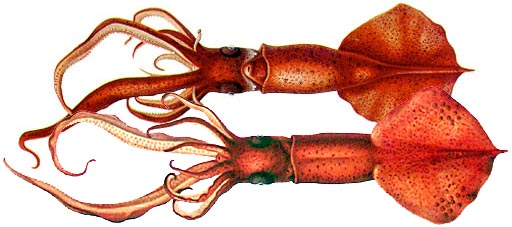

---
aliases:
  - flammea
title: Mastigoteuthis flammea
---

## Phylogeny 

-   « Ancestral Groups  
    -   [Mastigoteuthis](Mastigoteuthis)
    -   [Chiroteuthid families](Chiroteuthid_families)
    -  [Oegopsida](../../../Oegopsida.md) 
    -  [Decapodiformes](../../../../Decapodiformes.md) 
    -  [Coleoidea](../../../../../Coleoidea.md) 
    -  [Cephalopoda](../../../../../../Cephalopoda.md) 
    -  [Mollusca](../../../../../../../Mollusca.md) 
    -  [Bilateria](../../../../../../../../Bilateria.md) 
    -  [Animals](../../../../../../../../../Animals.md) 
    -  [Eukarya](../../../../../../../../../../Eukarya.md) 
    -   [Tree of Life](../../../../../../../../../../Tree_of_Life.md)

-   ◊ Sibling Groups of  Mastigoteuthis
    -   [Mastigoteuthis tyroi](Mastigoteuthis_tyroi)
    -   [Mastigoteuthis schmidti](Mastigoteuthis_schmidti)
    -   [Mastigoteuthis pyrodes](Mastigoteuthis_pyrodes)
    -   [Mastigoteuthis         psychrophila](Mastigoteuthis_psychrophila)
    -   [Mastigoteuthis magna](Mastigoteuthis_magna)
    -   [Mastigoteuthis hjorti](Mastigoteuthis_hjorti)
    -   [Mastigoteuthis         glaukopis](Mastigoteuthis_glaukopis)
    -   [Mastigoteuthis         grimaldii](Mastigoteuthis_grimaldii)
    -   Mastigoteuthis flammea
    -   [Mastigoteuthis famelica](Mastigoteuthis_famelica)
    -   [Mastigoteuthis dentata](Mastigoteuthis_dentata)
    -   [Mastigoteuthis danae](Mastigoteuthis_danae)
    -   [Mastigoteuthis         cordiformis](Mastigoteuthis_cordiformis)
    -   [Mastigoteuthis         atlantica](Mastigoteuthis_atlantica)
    -   [Mastigoteuthis         agassizii](Mastigoteuthis_agassizii)

-   » Sub-Groups 

# *Mastigoteuthis flammea* [Chun, 1908] 

[Michael Vecchione and Richard E. Young]()

Containing group:[Mastigoteuthidae](../Mastigoteuthidae.md) 

## Introduction

The type description of ***M. flammea*** is based on two small squid (27
and 35 mm ML) from the eastern Equatorial Atlantic, both of which had
lost their tentacles. This species is unique among mastigoteuthids in
having small eyes.

------------------------

#### Diagnosis

A mastigoteuthid \...

-   with small eyes.
-   with integumental photophores.

### Characteristics

1.  Arms
    1.  Arm suckers with 3-5 teeth on distal side.
    2.  Larger arm suckers 0.4 mm wide.
2.  Tentacles
    1.  Lost during capture.
3.  Head
    1.  Eyes small (8-11% of ML); much smaller than head length.
    2.  Nuchal cartilage illustrated by Chun, 1910.
4.  Funnel locking-apparatus
    1.  Funnel locking-apparatus with both tragus and antitragus. The
        drawing at the right shows the locking-apparatus of the two type
        specimens.
5.  Mantle
    1.  Tubercules absent on mantle and elsewhere.
6.  Fins
    1.  Fin length about half the ML.
    2.  Fins slightly longer than wide when measured to the tip of the
        tail, rhomboidal to elliptical.
7.  Photophores
    1.  Widely separated integumental photophores present on ventral
        side of mantle and head, dorsal side of fins and outer surface
        of arms IV (see title illustration). A cross-section of the
        integumental photophore is seen on the family page.
8.  Pigmentation
    1.  Live animal dark red from numerous chromatophores and
        integumental pigment (Chun, 1910).
    2.  Oral surface of arms with only sparse chromatophores; nearly
        colorless in live animal (Chun, 1910).
    3.  Coloration disappeared almost completely after preservation
        (Chun, 1910).
9.  Measurements
      ----------- -----
      Source                        Chun, 1910   Chun, 1910
      Sex ::                         Female       Female
      Mantle length                 27           35
      Fin length along base         13           21
      Fin width                     18           ?
      Head length                   5            ?
      Head width                    5.5          8
      Eye diameter                  2.2          3.8
      Arm I, length: Left / Right   7            14 / 10.5
      Arm II, length                12           15
      Arm III, length               10.5         11
      Arm IV, length                45           40
      ----------- -----

#### Comments

The above information is taken from the type description (Chun, 1910).

### Distribution

Type localities: Gulf of Guinea, near San Thomé Island at 0°25\'N,
7°0\'E (35 mm ML) and further west at 1°14\'N, 2°10\'W (27 mm ML).

### References

Chun, C. 1910. Die Cephalopoden. Oegopsida. Wissenschaftliche Ergebnisse
der Deutschen Tiefsee Expedition auf dem Dampfer \"Valdivia\" 1898-1899,
18(1):1-401.

## Title Illustrations

 

  ------------------------------------------------------
  scientific_name ::  Mastigoteuthis flammea
  Comments          Ventral (top) and dorsal views.
  Reference         Chun, C. 1910. Die Cephalopoden. Oegopsida. Wissenschaftliche Ergebnisse der Deutschen Tiefsee Expedition auf dem Dampfer \"Valdivia\" 1898-1899, 18(1):1-401.
  Size              35 mm ML
  Type              Type series
  ------------------------------------------------------

## Confidential Links & Embeds: 

### #is_/same_as :: [[/_Standards/bio/bio~Domain/Eukarya/Animal/Bilateria/Mollusca/Cephalopoda/Coleoidea/Decapodiformes/Oegopsida/Chiroteuthid/Mastigoteuthidae/flammea|flammea]] 

### #is_/same_as :: [[/_public/bio/bio~Domain/Eukarya/Animal/Bilateria/Mollusca/Cephalopoda/Coleoidea/Decapodiformes/Oegopsida/Chiroteuthid/Mastigoteuthidae/flammea.public|flammea.public]] 

### #is_/same_as :: [[/_internal/bio/bio~Domain/Eukarya/Animal/Bilateria/Mollusca/Cephalopoda/Coleoidea/Decapodiformes/Oegopsida/Chiroteuthid/Mastigoteuthidae/flammea.internal|flammea.internal]] 

### #is_/same_as :: [[/_protect/bio/bio~Domain/Eukarya/Animal/Bilateria/Mollusca/Cephalopoda/Coleoidea/Decapodiformes/Oegopsida/Chiroteuthid/Mastigoteuthidae/flammea.protect|flammea.protect]] 

### #is_/same_as :: [[/_private/bio/bio~Domain/Eukarya/Animal/Bilateria/Mollusca/Cephalopoda/Coleoidea/Decapodiformes/Oegopsida/Chiroteuthid/Mastigoteuthidae/flammea.private|flammea.private]] 

### #is_/same_as :: [[/_personal/bio/bio~Domain/Eukarya/Animal/Bilateria/Mollusca/Cephalopoda/Coleoidea/Decapodiformes/Oegopsida/Chiroteuthid/Mastigoteuthidae/flammea.personal|flammea.personal]] 

### #is_/same_as :: [[/_secret/bio/bio~Domain/Eukarya/Animal/Bilateria/Mollusca/Cephalopoda/Coleoidea/Decapodiformes/Oegopsida/Chiroteuthid/Mastigoteuthidae/flammea.secret|flammea.secret]] 

