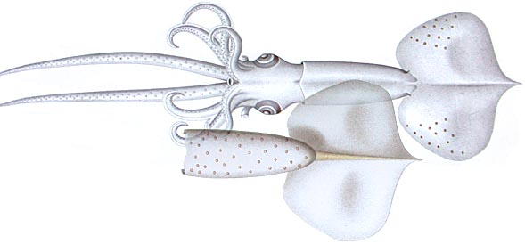

## Phylogeny 

-   « Ancestral Groups  
    -   [Mastigoteuthis](Mastigoteuthis)
    -   [Chiroteuthid families](Chiroteuthid_families)
    -  [Oegopsida](../../../Oegopsida.md))
    -  [Decapodiformes](../../../../Decapodiformes.md))
    -  [Coleoidea](../../../../../Coleoidea.md))
    -  [Cephalopoda](../../../../../../Cephalopoda.md))
    -  [Mollusca](../../../../../../../Mollusca.md))
    -  [Bilateria](../../../../../../../../Bilateria.md))
    -  [Animals](../../../../../../../../../Animals.md))
    -  [Eukarya](../../../../../../../../../../Eukarya.md))
    -   [Tree of Life](../../../../../../../../../../Tree_of_Life.md)

-   ◊ Sibling Groups of  Mastigoteuthis
    -   [Mastigoteuthis tyroi](Mastigoteuthis_tyroi)
    -   [Mastigoteuthis schmidti](Mastigoteuthis_schmidti)
    -   [Mastigoteuthis pyrodes](Mastigoteuthis_pyrodes)
    -   [Mastigoteuthis         psychrophila](Mastigoteuthis_psychrophila)
    -   [Mastigoteuthis magna](Mastigoteuthis_magna)
    -   [Mastigoteuthis hjorti](Mastigoteuthis_hjorti)
    -   [Mastigoteuthis         glaukopis](Mastigoteuthis_glaukopis)
    -   Mastigoteuthis grimaldii
    -   [Mastigoteuthis flammea](Mastigoteuthis_flammea)
    -   [Mastigoteuthis famelica](Mastigoteuthis_famelica)
    -   [Mastigoteuthis dentata](Mastigoteuthis_dentata)
    -   [Mastigoteuthis danae](Mastigoteuthis_danae)
    -   [Mastigoteuthis         cordiformis](Mastigoteuthis_cordiformis)
    -   [Mastigoteuthis         atlantica](Mastigoteuthis_atlantica)
    -   [Mastigoteuthis         agassizii](Mastigoteuthis_agassizii)

-   » Sub-Groups 

# *Mastigoteuthis grimaldii* [(Joubin, 1895)] 

[Michael Vecchione and Richard E. Young]()

Containing group:[Mastigoteuthidae](../Mastigoteuthidae.md))

## Introduction

***M. grimaldii*** was described from a single, small (ca. 38 mm ML) and
damaged specimen. Joubin described the squid as being transparent
although slightly bluish, presumably because it was young although it
possessed integumental photophores.

------------------------

#### Diagnosis

A mastigoteuthid of the ***M. grimaldii*** group (integumental
photophores, no eyelid photophores, toothed arm suckers) \...

-   with a temperate Central North Atlantic habitat.

### Characteristics

1.  Arms
    a.  Arm suckers with long, pointed slender teeth on distal half of
        inner ring, \"gradually diminishing towards the sides until they
        disappear at the \[proximal\] margin\" (Joubin, 1985).
    b.  Suckers approximately 0.33 mm in diameter (Joubin, 1985).
2.  Tentacles
    a.  Missing in the holotype.
3.  Funnel locking-apparatus
    a.  Judging from Joubins illustration (below), a tragus is present
        and an antitragus is absent.
4.  Mantle
    a.  Tubercules absent from mantle and elsewhere.
5.  Fins
    a.  Rhomboidal (Joubin, 1985).
6.  Photophores
    a.  Integumental photophores present at least on ventral mantle and
        dorsal margin of fins (Joubin, 1895).
    b.  Eyelid photophore not reported by Joubin\*.
7.  Measurements
    a.  Measurements not given by Joubin.

#### Comments

This juvenile ***Mastigoteuthis*** is not clearly differentiated from
the North Atlantic ***M. schmidti***. The eyes and eyelids, apparently,
were intact (see title drawing here) and the animal was transparent. As
a result, large eyelid photophores, if present, would probably have been
noted by Joubin but we don\'t know at what size the photophores develop.
In both species eyelid photophores about the same size as the
integumental photophores could have been overlooked. The mantle extends
to the anterior third of the fins.

### Distribution

The type locality is near Corvo Island in the Azores at 39°43\'N,
33°22\'W.

### References

Joubin, L. 1895. Contribution a l\'étude des Céphalopodes de
l\'Atlantique Nord. Résultats des Campagnes scientifiques accomplies sur
son yacht par Albert I Prince souverain de Monaco, 9:1-63.

## Title Illustrations

)

  -----------------------------------------------------------------
  Scientific Name ::  Mastigoteuthis grimaldii
  Reference         Joubin, L. 1895. Contribution a l\'étude des Céphalopodes de l\'Atlantique Nord. Résultats des Campagnes scientifiques accomplies sur son yacht par Albert I Prince souverain de Monaco, 9:1-63.
  Size              ca. 38 mm ML
  Type              Holotype
  -----------------------------------------------------------------

## Confidential Links & Embeds: 

### #is_/same_as :: [grimaldii](/_Standards/bio/bio~Domain/Eukarya/Animal/Bilateria/Mollusca/Cephalopoda/Coleoidea/Decapodiformes/Oegopsida/Chiroteuthid/Mastigoteuthidae/grimaldii.md) 

### #is_/same_as :: [grimaldii.public](/_public/bio/bio~Domain/Eukarya/Animal/Bilateria/Mollusca/Cephalopoda/Coleoidea/Decapodiformes/Oegopsida/Chiroteuthid/Mastigoteuthidae/grimaldii.public.md) 

### #is_/same_as :: [grimaldii.internal](/_internal/bio/bio~Domain/Eukarya/Animal/Bilateria/Mollusca/Cephalopoda/Coleoidea/Decapodiformes/Oegopsida/Chiroteuthid/Mastigoteuthidae/grimaldii.internal.md) 

### #is_/same_as :: [grimaldii.protect](/_protect/bio/bio~Domain/Eukarya/Animal/Bilateria/Mollusca/Cephalopoda/Coleoidea/Decapodiformes/Oegopsida/Chiroteuthid/Mastigoteuthidae/grimaldii.protect.md) 

### #is_/same_as :: [grimaldii.private](/_private/bio/bio~Domain/Eukarya/Animal/Bilateria/Mollusca/Cephalopoda/Coleoidea/Decapodiformes/Oegopsida/Chiroteuthid/Mastigoteuthidae/grimaldii.private.md) 

### #is_/same_as :: [grimaldii.personal](/_personal/bio/bio~Domain/Eukarya/Animal/Bilateria/Mollusca/Cephalopoda/Coleoidea/Decapodiformes/Oegopsida/Chiroteuthid/Mastigoteuthidae/grimaldii.personal.md) 

### #is_/same_as :: [grimaldii.secret](/_secret/bio/bio~Domain/Eukarya/Animal/Bilateria/Mollusca/Cephalopoda/Coleoidea/Decapodiformes/Oegopsida/Chiroteuthid/Mastigoteuthidae/grimaldii.secret.md)

