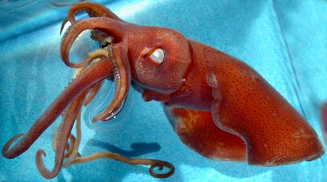
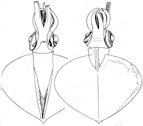
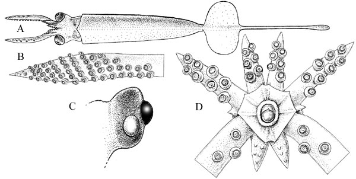

---
title: "Mastigoteuthis hjorti"
---

## Phylogeny 

-   « Ancestral Groups  
    -   [Mastigoteuthis](Mastigoteuthis)
    -   [Chiroteuthid families](Chiroteuthid_families)
    -  [Oegopsida](../../../Oegopsida.md))
    -  [Decapodiformes](../../../../Decapodiformes.md))
    -  [Coleoidea](../../../../../Coleoidea.md))
    -  [Cephalopoda](../../../../../../Cephalopoda.md))
    -  [Mollusca](../../../../../../../Mollusca.md))
    -  [Bilateria](../../../../../../../../Bilateria.md))
    -  [Animals](../../../../../../../../../Animals.md))
    -  [Eukarya](../../../../../../../../../../Eukarya.md))
    -   [Tree of Life](../../../../../../../../../../Tree_of_Life.md)

-   ◊ Sibling Groups of  Mastigoteuthis
    -   [Mastigoteuthis tyroi](Mastigoteuthis_tyroi)
    -   [Mastigoteuthis schmidti](Mastigoteuthis_schmidti)
    -   [Mastigoteuthis pyrodes](Mastigoteuthis_pyrodes)
    -   [Mastigoteuthis         psychrophila](Mastigoteuthis_psychrophila)
    -   [Mastigoteuthis magna](Mastigoteuthis_magna)
    -   Mastigoteuthis hjorti
    -   [Mastigoteuthis         glaukopis](Mastigoteuthis_glaukopis)
    -   [Mastigoteuthis         grimaldii](Mastigoteuthis_grimaldii)
    -   [Mastigoteuthis flammea](Mastigoteuthis_flammea)
    -   [Mastigoteuthis famelica](Mastigoteuthis_famelica)
    -   [Mastigoteuthis dentata](Mastigoteuthis_dentata)
    -   [Mastigoteuthis danae](Mastigoteuthis_danae)
    -   [Mastigoteuthis         cordiformis](Mastigoteuthis_cordiformis)
    -   [Mastigoteuthis         atlantica](Mastigoteuthis_atlantica)
    -   [Mastigoteuthis         agassizii](Mastigoteuthis_agassizii)

-   » Sub-Groups 

# *Mastigoteuthis hjorti* [(Chun, 1913)] 

[Michael Vecchione and Richard E. Young]()

Containing group:[Mastigoteuthidae](../Mastigoteuthidae.md))

## Introduction

***M. hjorti*** was originally described from five badly damaged
specimens from the North Atlantic, then redescribed by Rancurel (1973)
from three squid from the Gulf of Guinea. The species is distinctive and
widely distributed but uncertainty exists on the taxonomic status of
populations in other oceans.

------------------------

#### Diagnosis

A ***Mastigoteuthis*** \...

-   with two photophores on each eyeball.
-   with very large fins (length ca 90% of ML).

### Characteristics

1.  Funnel
    1.  Funnel locking-apparatus with oval, slightly curved depression,
        posterolateral sides protude; without tragus or antitragus.
        Depression undercuts posterior margin.
2.  Mantle and Skin
    1.  Large tubercules cover mantle, head, funnel and aboral surface
        of arms in subadults (tubercules are often lost during capture).
3.  Fins
    1.  Fins large, nearly the full length of the mantle. (see title
        photograph).
4.  Photophores
    1.  Two large circular photophores on ventral surface of eyeball; no
        other photophores present.

#### Comments

[More information on the description of ***M. hjorti*** can be found here.](http://www.tolweb.org/notes/?note_id=3144)

***M. hjorti*** bears resemblance to ***M. cordiformis*** in the
presence of large fins, skin tubercules, lack of a pocket between the
bridles and the large trabeculate protective membranes on the tentacular
clubs but differs in the presence of ocular photophores among other
features.

### Life History

Vecchione, et al. (2001) described a 6 mm ML paralarvae which they
assummed belonged to ***M. hjorti*** on the basis of a single large
photophore on each eyeball. They described the paralarva as follows:

Mantle narrow, inserts on anterior end of fins. Fins ca. 25% of ML
(excluding tail). Long, spike-like tail, nearly 3 times fin length. Skin
mostly missing but fragments with scattered tubercules present. One
light organ on ventral surface of each eye. Arm formula:
II\>I\>IV\>\>III (arms III are minute buds). Tentacles long, thick,
about 4 times length of arms II. Clubs with about 54 small suckers in 2
series proximally grading to 6 along \"manus.\" Suckers end abruptly;
tip with sucker anlagen.
){width="600"}

**Figure**. Paralarva of ***M. hjorti***. **A** - dorsal view of
paralarva, 6.0 mm ML, USNM 730521. **B** - oral view of tentacular club,
same specimen. **C** - ventral view of eye with ocular light organ, same
specimen. **D** - oral view of brachial crown, same specimen; note small
arms III. Drawings from Vecchione, et al. (2001).
### Distribution

Type locality: North Atlantic at 36°N, 40°W; 32°N, 33°W; 36°05\'N,
43°58\'W. The species is also known from the central Pacific (pers.
obs.), off South Africa (Roper and Lu, 1990) and the Indian Ocean
(Nesis, 1987).

### References

Chun, C. 1913. Cephalopoda. Report on the Scientific Results of the
\"Michael Sars\" North Atlantic Deep-sea Expedition 1910, 3(1).
Reprinted by Bergen Museum, 1933, 21 pages.

Nesis, K. N. 1982/87. Abridged key to the cephalopod mollusks of the
world\'s ocean. 385+ii pp. Light and Food Industry Publishing House,
Moscow. (In Russian.). Translated into English by B. S. Levitov, ed. by
L. A. Burgess (1987), Cephalopods of the world. T. F. H. Publications,
Neptune City, NJ, 351pp.

Rancurel, P. 1973. *Mastigoteuthis hjorti* Chun 1913 description de
trois échantillons proventant du Golfe de Guinée. Cah. O.R.S.T.O.M.,
ser. Océanogr., 11: 27-32.

Roper, C.F.E. and C.C. Lu 1990. Comparative morphology and function of
dermal structures in oceanic squids (Cephalopoda). Smithson. Contr.
Zool., No. 493: 1-40.

Vecchione, M., C. F. E. Roper, M. J. Sweeney and C. C. Lu. 2001.
Distribution, relative abundance and developmental morphology of
paralarval cephalopods in the western north Atlantic Ocean. NOAA
Technical Report NMFS 152: 1-58.

## Title Illustrations

)

  --------------------------------------------------------------------------------
  Scientific Name ::     Mastigoteuthis hjorti
  Comments             Lateral view.
  Specimen Condition   Dead Specimen
  Copyright ::            © 2004 [Richard E. Young](http://www.soest.hawaii.edu/%7Eryoung/rey.html) 
  --------------------------------------------------------------------------------
)

  -------------------------------------------------------
  Scientific Name ::  Mastigoteuthis hjorti
  Location ::        Gulf of Guinea
  Comments          Ventral and dorsal views.
  Reference         Rancurel, P. 1973. Mastigoteuthis hjorti Chun 1913 description de trois échantillons proventant du Golfe de Guinée. Cah. O.R.S.T.O.M., ser. Océanogr., 11: 27-32.
  Size              44 mm ML
  -------------------------------------------------------

## Confidential Links & Embeds: 

### #is_/same_as ::[hjorti](hjorti.md)) 

### #is_/same_as :: [hjorti.public](/_public/bio/bio~Domain/Eukarya/Animal/Bilateria/Mollusca/Cephalopoda/Coleoidea/Decapodiformes/Oegopsida/Chiroteuthid/Mastigoteuthidae/hjorti.public.md) 

### #is_/same_as :: [hjorti.internal](/_internal/bio/bio~Domain/Eukarya/Animal/Bilateria/Mollusca/Cephalopoda/Coleoidea/Decapodiformes/Oegopsida/Chiroteuthid/Mastigoteuthidae/hjorti.internal.md) 

### #is_/same_as :: [hjorti.protect](/_protect/bio/bio~Domain/Eukarya/Animal/Bilateria/Mollusca/Cephalopoda/Coleoidea/Decapodiformes/Oegopsida/Chiroteuthid/Mastigoteuthidae/hjorti.protect.md) 

### #is_/same_as :: [hjorti.private](/_private/bio/bio~Domain/Eukarya/Animal/Bilateria/Mollusca/Cephalopoda/Coleoidea/Decapodiformes/Oegopsida/Chiroteuthid/Mastigoteuthidae/hjorti.private.md) 

### #is_/same_as :: [hjorti.personal](/_personal/bio/bio~Domain/Eukarya/Animal/Bilateria/Mollusca/Cephalopoda/Coleoidea/Decapodiformes/Oegopsida/Chiroteuthid/Mastigoteuthidae/hjorti.personal.md) 

### #is_/same_as :: [hjorti.secret](/_secret/bio/bio~Domain/Eukarya/Animal/Bilateria/Mollusca/Cephalopoda/Coleoidea/Decapodiformes/Oegopsida/Chiroteuthid/Mastigoteuthidae/hjorti.secret.md)

