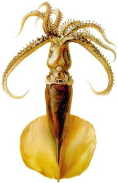
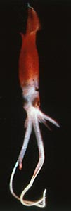
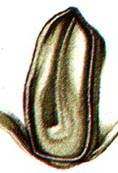

---
aliases:
  - magna
title: Mastigoteuthis magna
---

## Phylogeny 

-   « Ancestral Groups  
    -   [Mastigoteuthis](Mastigoteuthis)
    -   [Chiroteuthid families](Chiroteuthid_families)
    -  [Oegopsida](../../../Oegopsida.md) 
    -  [Decapodiformes](../../../../Decapodiformes.md) 
    -  [Coleoidea](../../../../../Coleoidea.md) 
    -  [Cephalopoda](../../../../../../Cephalopoda.md) 
    -  [Mollusca](../../../../../../../Mollusca.md) 
    -  [Bilateria](../../../../../../../../Bilateria.md) 
    -  [Animals](../../../../../../../../../Animals.md) 
    -  [Eukarya](../../../../../../../../../../Eukarya.md) 
    -   [Tree of Life](../../../../../../../../../../Tree_of_Life.md)

-   ◊ Sibling Groups of  Mastigoteuthis
    -   [Mastigoteuthis tyroi](Mastigoteuthis_tyroi)
    -   [Mastigoteuthis schmidti](Mastigoteuthis_schmidti)
    -   [Mastigoteuthis pyrodes](Mastigoteuthis_pyrodes)
    -   [Mastigoteuthis         psychrophila](Mastigoteuthis_psychrophila)
    -   Mastigoteuthis magna
    -   [Mastigoteuthis hjorti](Mastigoteuthis_hjorti)
    -   [Mastigoteuthis         glaukopis](Mastigoteuthis_glaukopis)
    -   [Mastigoteuthis         grimaldii](Mastigoteuthis_grimaldii)
    -   [Mastigoteuthis flammea](Mastigoteuthis_flammea)
    -   [Mastigoteuthis famelica](Mastigoteuthis_famelica)
    -   [Mastigoteuthis dentata](Mastigoteuthis_dentata)
    -   [Mastigoteuthis danae](Mastigoteuthis_danae)
    -   [Mastigoteuthis         cordiformis](Mastigoteuthis_cordiformis)
    -   [Mastigoteuthis         atlantica](Mastigoteuthis_atlantica)
    -   [Mastigoteuthis         agassizii](Mastigoteuthis_agassizii)

-   » Sub-Groups 

# *Mastigoteuthis magna* [Joubin, 1913] 

[Michael Vecchione and Richard E. Young]()
))

Containing group:[Mastigoteuthidae](../Mastigoteuthidae.md) 

## Introduction

Joubin 1913 (as redescribed in 1920) based ***M. magna*** on a single
specimen of 160 mm ML from the Sargasso Sea. It appears now to be one of
the more common species of ***Mastigoteuthis*** in the North Atlantic
(personal observations).

------------------------

#### Diagnosis

A mastigoteuthid \...

-   without photophores.
-   with flask-shaped funnel locking-groove.
-   with fin length equal to fin width.

### Characteristics
)

**Figure**. Ventral view of the funnel component of the funnel
locking-apparatus of ***M. magna***, holotype . Drawing from Joubin
(1920).

1.  Arms
    1.  Arm suckers with smooth inner rings.
2.  Tentacles
    1.  Club length 80% of tentacle length (Joubin, 1920).
    2.  Proximally suckers in narrow band that gradually broadens; at
        mid-club suckers cover 3/4 of tentacle (Joubin, 1920).
    3.  Club suckers minute with smooth inner rings (Joubin, 1920).
3.  Funnel
    1.  Mantle component of the funnel locking-apparatus a \"rectilinear
        ridge narrow anteriorly and slightly wider posteriorly\"
        (Joubin, 1920).
    2.  Funnel component an \"auricular-like groove\" (Joubin, 1920).
        This is a flask-shaped groove.
4.  Mantle
    1.  Skin tubecules absent from mantle and elsewhere.
5.  Fins (Joubin, 1920)
    1.  Fin length (without tail) 66% of ML.
    2.  Fin width 79% if ML (without tail); assumming a 20 mm tail the
        FW becomes 71% of ML
    3.  Fin width 120% of fin length (without tail).
6.  Photophores
    1.  Photophores absent.
7.  Measurements
      ----------
      Source                Joubin, 1920
      Sex ::                 ?
      Mantle length         160
      Mantle width          54
      Head length           42
      Head width            43
      Fin length            105 (without tail)
      Fin width             127
      Arm I, length         80
      Arm II, length        105
      Arm III, length       82
      Arm IV, length        172
      Arm I, sucker no.     135
      Arm II, sucker no.    120+
      Arm III, sucker no.   112
      Arm IV, sucker no.    109
      Tentacle length       480
      Club length           390
      ----------

#### Comments

This description is taken from Joubin (1920). This species is very
similar to ***M. inermis*** but differs in the greater width of the fins
and the fewer arm suckers. The differences between these species,
however, requires confirmation. The flask-shaped groove in the funnel
organ, the tiny club suckers and absence of photophores distinguishes
***M. magna*** and ***M. inermis*** from all other members of the genus.

### Distribution

Type locality: Sargasso Sea of the North Atlantic at 31°45\'N, 42°39\'W.

### References

Joubin, L. 1920. Céphalopodes provenant des Campagnes de la Princesse
Alice (1898-1910). 3e Serie. Monaco.

## Title Illustrations

)

  -------------------------------------
  Scientific Name ::  Mastigoteuthis magna
  Comments          Ventral view.
  Reference         Joubin, L. 1920. Céphalopodes provenant des Campagnes de la Princesse Alice (1898-1910). 3e Serie. Monaco.
  Size              160 mm ML
  Type              Holotype
  -------------------------------------
)

  -------------------------------
  Scientific Name ::  Mastigoteuthis magna
  Comments          Ventrolateral view of a squid thought to be M. magna that was taken from a submersible
  -------------------------------

## Confidential Links & Embeds: 

### #is_/same_as :: [[/_Standards/bio/bio~Domain/Eukarya/Animal/Bilateria/Mollusca/Cephalopoda/Coleoidea/Decapodiformes/Oegopsida/Chiroteuthid/Mastigoteuthidae/magna|magna]] 

### #is_/same_as :: [[/_public/bio/bio~Domain/Eukarya/Animal/Bilateria/Mollusca/Cephalopoda/Coleoidea/Decapodiformes/Oegopsida/Chiroteuthid/Mastigoteuthidae/magna.public|magna.public]] 

### #is_/same_as :: [[/_internal/bio/bio~Domain/Eukarya/Animal/Bilateria/Mollusca/Cephalopoda/Coleoidea/Decapodiformes/Oegopsida/Chiroteuthid/Mastigoteuthidae/magna.internal|magna.internal]] 

### #is_/same_as :: [[/_protect/bio/bio~Domain/Eukarya/Animal/Bilateria/Mollusca/Cephalopoda/Coleoidea/Decapodiformes/Oegopsida/Chiroteuthid/Mastigoteuthidae/magna.protect|magna.protect]] 

### #is_/same_as :: [[/_private/bio/bio~Domain/Eukarya/Animal/Bilateria/Mollusca/Cephalopoda/Coleoidea/Decapodiformes/Oegopsida/Chiroteuthid/Mastigoteuthidae/magna.private|magna.private]] 

### #is_/same_as :: [[/_personal/bio/bio~Domain/Eukarya/Animal/Bilateria/Mollusca/Cephalopoda/Coleoidea/Decapodiformes/Oegopsida/Chiroteuthid/Mastigoteuthidae/magna.personal|magna.personal]] 

### #is_/same_as :: [[/_secret/bio/bio~Domain/Eukarya/Animal/Bilateria/Mollusca/Cephalopoda/Coleoidea/Decapodiformes/Oegopsida/Chiroteuthid/Mastigoteuthidae/magna.secret|magna.secret]] 

