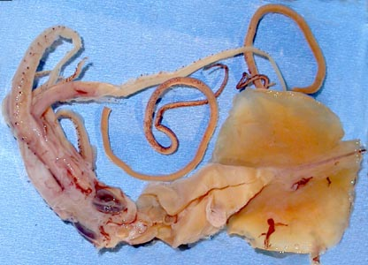

---
title: "Mastigoteuthis psychrophila"
---

## Phylogeny 

-   « Ancestral Groups  
    -   [Mastigoteuthis](Mastigoteuthis)
    -   [Chiroteuthid families](Chiroteuthid_families)
    -  [Oegopsida](../../../Oegopsida.md))
    -  [Decapodiformes](../../../../Decapodiformes.md))
    -  [Coleoidea](../../../../../Coleoidea.md))
    -  [Cephalopoda](../../../../../../Cephalopoda.md))
    -  [Mollusca](../../../../../../../Mollusca.md))
    -  [Bilateria](../../../../../../../../Bilateria.md))
    -  [Animals](../../../../../../../../../Animals.md))
    -  [Eukarya](../../../../../../../../../../Eukarya.md))
    -   [Tree of Life](../../../../../../../../../../Tree_of_Life.md)

-   ◊ Sibling Groups of  Mastigoteuthis
    -   [Mastigoteuthis tyroi](Mastigoteuthis_tyroi)
    -   [Mastigoteuthis schmidti](Mastigoteuthis_schmidti)
    -   [Mastigoteuthis pyrodes](Mastigoteuthis_pyrodes)
    -   Mastigoteuthis psychrophila
    -   [Mastigoteuthis magna](Mastigoteuthis_magna)
    -   [Mastigoteuthis hjorti](Mastigoteuthis_hjorti)
    -   [Mastigoteuthis         glaukopis](Mastigoteuthis_glaukopis)
    -   [Mastigoteuthis         grimaldii](Mastigoteuthis_grimaldii)
    -   [Mastigoteuthis flammea](Mastigoteuthis_flammea)
    -   [Mastigoteuthis famelica](Mastigoteuthis_famelica)
    -   [Mastigoteuthis dentata](Mastigoteuthis_dentata)
    -   [Mastigoteuthis danae](Mastigoteuthis_danae)
    -   [Mastigoteuthis         cordiformis](Mastigoteuthis_cordiformis)
    -   [Mastigoteuthis         atlantica](Mastigoteuthis_atlantica)
    -   [Mastigoteuthis         agassizii](Mastigoteuthis_agassizii)

-   » Sub-Groups 

# *Mastigoteuthis psychrophila* [Nesis, 1977] 

[Richard E. Young and Michael Vecchione]()
)

Containing group:[Mastigoteuthidae](../Mastigoteuthidae.md))

## Introduction

Nesis (1977) described ***M. psychrophila*** from Antarctic waters on
the basis of four specimens, the largest of which was a nearly mature
male of 143 mm ML. Critical details of the photophore pattern remain
unknown.

#### Diagnosis

A mastigoteuthid of the ***M. agassizii*** group \...

-   without large, lateral pegs on outer rings of club suckers.
-   with large tragus and distinct antitragus on funnel
    locking-apparatus.

### Characteristics

Tentacles

1.  Club suckers small (diameter ca. 0.15 mm) (Nesis, 1977).
2.  Club suckers circular without large inward directed knobs; outer
    rings with 12-15 short, blunt-rounded knobs around entire perimeter
    (Nesis, 1977).
3.  Photophores
    1.  Mantle, head, arms and fins (dorsal and ventral surfaces) with
        small integumental photophores (Nesis, 1977).
    2.  Closely spaced photophores in the transverse surface on arms IV
        suggest that more than two series exist.

#### Comments

[More details of the description can be found here.](http://www.tolweb.org/notes/?note_id=2441)

***M. psychrophila*** is very similar to other species in the ***M.
agassizii*** species-group. Its most distinctive features are the shape
of the funnel locking-apparatus and the apparent lack of tentacular
suckers with pronounced lateral pegs on the outer sucker rings.
Unfortunately the pattern of photophores on arms IV is unknown other
than that it appears to differ from most members of the group in having
more than two series of photophores.

### Life History

Paralarvae and mature adults unknown.

### Distribution

Type locality: 59°26\'S, 158°36\'E, Antarctic waters south of eastern
Australia in an open midwater trawl that fished mostly at 500 m depth at
night. Nesis (1977) also reports a record in the same region at 55°S and
in South Atlantic Antarctic waters at 57°S, 26°W. He states that they
were taken from water of Antarctic and Subantarctic structure. The NMNH
[817317] squid came from 58°S, 77°W just into the Pacific
Antarctic waters. The NMNH 884836 squid came from 62°50\'S and
114°30\'W. The distribution appears to be circumantarctic occurring both
north and south of the Antarctic Convergence (Nesis, 1977). [Additional records are found at the British Antarctic Survey](http://www.nerc-bas.ac.uk/public/mlsd/squid-atlas/mastigoteuthisb.jpeg)
.

### References

Nesis, K.N. 1977. *Mastigoteuthis psychrophila* sp. n. (Cephalopoda,
Mastigoteuthidae) from the Southern Ocean. Zoologichesky Zhurnal,
65(6):835-842.

## Title Illustrations

)

  -----------------------------------------------------------------------
  Scientific Name ::     Mastigoteuthis psychrophila
  Location ::           59°26\'S, 158°36\'E
  Specimen Condition   Dead Specimen
  Sex ::                Male
  View                 Ventral
  Size                 84 mm ML
  Type                 Holotype
  Copyright ::            © [Michael Vecchione](mailto:vecchiom@si.edu) 
  -----------------------------------------------------------------------

## Confidential Links & Embeds: 

### #is_/same_as ::[psychrophila](psychrophila.md)) 

### #is_/same_as :: [psychrophila.public](/_public/bio/bio~Domain/Eukarya/Animal/Bilateria/Mollusca/Cephalopoda/Coleoidea/Decapodiformes/Oegopsida/Chiroteuthid/Mastigoteuthidae/psychrophila.public.md) 

### #is_/same_as :: [psychrophila.internal](/_internal/bio/bio~Domain/Eukarya/Animal/Bilateria/Mollusca/Cephalopoda/Coleoidea/Decapodiformes/Oegopsida/Chiroteuthid/Mastigoteuthidae/psychrophila.internal.md) 

### #is_/same_as :: [psychrophila.protect](/_protect/bio/bio~Domain/Eukarya/Animal/Bilateria/Mollusca/Cephalopoda/Coleoidea/Decapodiformes/Oegopsida/Chiroteuthid/Mastigoteuthidae/psychrophila.protect.md) 

### #is_/same_as :: [psychrophila.private](/_private/bio/bio~Domain/Eukarya/Animal/Bilateria/Mollusca/Cephalopoda/Coleoidea/Decapodiformes/Oegopsida/Chiroteuthid/Mastigoteuthidae/psychrophila.private.md) 

### #is_/same_as :: [psychrophila.personal](/_personal/bio/bio~Domain/Eukarya/Animal/Bilateria/Mollusca/Cephalopoda/Coleoidea/Decapodiformes/Oegopsida/Chiroteuthid/Mastigoteuthidae/psychrophila.personal.md) 

### #is_/same_as :: [psychrophila.secret](/_secret/bio/bio~Domain/Eukarya/Animal/Bilateria/Mollusca/Cephalopoda/Coleoidea/Decapodiformes/Oegopsida/Chiroteuthid/Mastigoteuthidae/psychrophila.secret.md)

