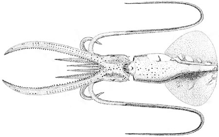
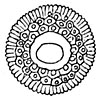

---
aliases:
  - schmidti
title: Mastigoteuthis schmidti
---

## Phylogeny 

-   « Ancestral Groups  
    -   [Mastigoteuthis](Mastigoteuthis)
    -   [Chiroteuthid families](Chiroteuthid_families)
    -  [Oegopsida](../../../Oegopsida.md) 
    -  [Decapodiformes](../../../../Decapodiformes.md) 
    -  [Coleoidea](../../../../../Coleoidea.md) 
    -  [Cephalopoda](../../../../../../Cephalopoda.md) 
    -  [Mollusca](../../../../../../../Mollusca.md) 
    -  [Bilateria](../../../../../../../../Bilateria.md) 
    -  [Animals](../../../../../../../../../Animals.md) 
    -  [Eukarya](../../../../../../../../../../Eukarya.md) 
    -   [Tree of Life](../../../../../../../../../../Tree_of_Life.md)

-   ◊ Sibling Groups of  Mastigoteuthis
    -   [Mastigoteuthis tyroi](Mastigoteuthis_tyroi)
    -   Mastigoteuthis schmidti
    -   [Mastigoteuthis pyrodes](Mastigoteuthis_pyrodes)
    -   [Mastigoteuthis         psychrophila](Mastigoteuthis_psychrophila)
    -   [Mastigoteuthis magna](Mastigoteuthis_magna)
    -   [Mastigoteuthis hjorti](Mastigoteuthis_hjorti)
    -   [Mastigoteuthis         glaukopis](Mastigoteuthis_glaukopis)
    -   [Mastigoteuthis         grimaldii](Mastigoteuthis_grimaldii)
    -   [Mastigoteuthis flammea](Mastigoteuthis_flammea)
    -   [Mastigoteuthis famelica](Mastigoteuthis_famelica)
    -   [Mastigoteuthis dentata](Mastigoteuthis_dentata)
    -   [Mastigoteuthis danae](Mastigoteuthis_danae)
    -   [Mastigoteuthis         cordiformis](Mastigoteuthis_cordiformis)
    -   [Mastigoteuthis         atlantica](Mastigoteuthis_atlantica)
    -   [Mastigoteuthis         agassizii](Mastigoteuthis_agassizii)

-   » Sub-Groups 

# *Mastigoteuthis schmidti* [Degner, 1925] 

[Michael Vecchione and Richard E. Young]()
 

Containing group:[Mastigoteuthidae](../Mastigoteuthidae.md) 

## Introduction

Degner described ***M. schmidti*** from a single squid, 46 mm ML, with
tentacles.

#### Diagnosis

A mastigoteuthid of the ***M. grimaldii*** group (integumental
photophores, no eyelid photophores, toothed arm suckers) \...

-   with a temperate Eastern North Atlantic habitat.

### Characteristics
 

**Figure**. Oral view of a club sucker of ***M. schmidti***. Drawing
from Degner (1925).

1.  Arms
    1.  Inner rings of arm suckers with 13-14 slender teeth distally;
        11-12 broad, short teeth proximally (Degner, 1925) (drawing at
        near right).
    2.  Arm sucker 0.15 mm in diameter (Degner, 1925).\
2.  Tentacles
    1.  Club length 60% of tentacle length (Degner, 1925).
    2.  Proximally suckers in 7 series; become 20-23 series by distal
        third of club (Degner, 1925).
    3.  Club suckers with smooth inner rings; outer rings with 13 placks
        medially; long pegs (3-4 times others) on distal placks (Degner,
        1925).
    4.  Club sucker 0.05 mm diameter (Degner, 1925).
3.  Funnel
    1.  Funnel locking-apparatus with tragus and antitragus (Degner,
        1925).
4.  Mantle
    1.  Tubercules absent from mantle and elsewhere.
5.  Fins
    1.  Fin length (without tail) 65% of ML (without tail); fin width
        79% of ML (without tail) (Degner, 1925).
6.  Photophores
    1.  Integumental photophores present over entire body, including
        dorsal surface of fins (Degner, 1925).
    2.  Eyelid photophores absent.
7.  Pigmentation
    1.  Color in alcohol pale brownish with dark scattered
        chromatophores.
8.  Measurements
      ---------
      Source                Degner, 1925
      Sex ::                 ?
      Mantle length         46
      Mantle width          16
      Fin length            30
      Fin width             37
      Arm I, length         18
      Arm II, length        27
      Arm III, length       28
      Arm I, sucker no.     62
      Arm II, sucker no.    80
      Arm III, sucker no.   76-80
      Arm IV, sucker no.    80-84
      Arm IV, length        56
      Tentacle length       135
      Club length           86
      ---------

#### Comments

***M. schmidt*** is not clearly differentiated from ***M. grimaldii***.
In both species eyelid photophores about the same size as the
integumental photophores could have been overlooked.

### Distribution

Type locality: North Atlantic, Bay of Biscay at 46°30\'N, 7°00\'W.

## Title Illustrations

 

  ------------------------------------------------
  scientific_name ::  Mastigoteuthis schmidti
  Comments          Ventral view.
  Reference         Degner, E. 1925. Cephalopoda. Report on the Danish Oceanographical Expeditions 1908-10 to the Mediterranean and Adjacent Seas, 2(9):1-94.
  Size              46 mm ML
  Type              Holotype
  ------------------------------------------------

## Confidential Links & Embeds: 

### #is_/same_as :: [[/_Standards/bio/bio~Domain/Eukarya/Animal/Bilateria/Mollusca/Cephalopoda/Coleoidea/Decapodiformes/Oegopsida/Chiroteuthid/Mastigoteuthidae/schmidti|schmidti]] 

### #is_/same_as :: [[/_public/bio/bio~Domain/Eukarya/Animal/Bilateria/Mollusca/Cephalopoda/Coleoidea/Decapodiformes/Oegopsida/Chiroteuthid/Mastigoteuthidae/schmidti.public|schmidti.public]] 

### #is_/same_as :: [[/_internal/bio/bio~Domain/Eukarya/Animal/Bilateria/Mollusca/Cephalopoda/Coleoidea/Decapodiformes/Oegopsida/Chiroteuthid/Mastigoteuthidae/schmidti.internal|schmidti.internal]] 

### #is_/same_as :: [[/_protect/bio/bio~Domain/Eukarya/Animal/Bilateria/Mollusca/Cephalopoda/Coleoidea/Decapodiformes/Oegopsida/Chiroteuthid/Mastigoteuthidae/schmidti.protect|schmidti.protect]] 

### #is_/same_as :: [[/_private/bio/bio~Domain/Eukarya/Animal/Bilateria/Mollusca/Cephalopoda/Coleoidea/Decapodiformes/Oegopsida/Chiroteuthid/Mastigoteuthidae/schmidti.private|schmidti.private]] 

### #is_/same_as :: [[/_personal/bio/bio~Domain/Eukarya/Animal/Bilateria/Mollusca/Cephalopoda/Coleoidea/Decapodiformes/Oegopsida/Chiroteuthid/Mastigoteuthidae/schmidti.personal|schmidti.personal]] 

### #is_/same_as :: [[/_secret/bio/bio~Domain/Eukarya/Animal/Bilateria/Mollusca/Cephalopoda/Coleoidea/Decapodiformes/Oegopsida/Chiroteuthid/Mastigoteuthidae/schmidti.secret|schmidti.secret]] 

