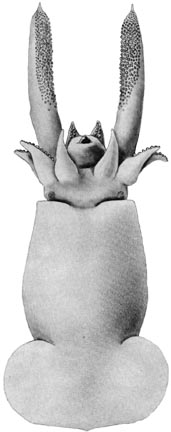
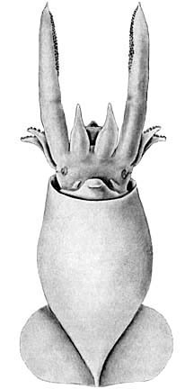
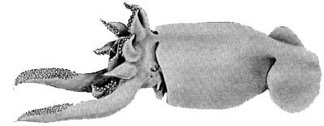
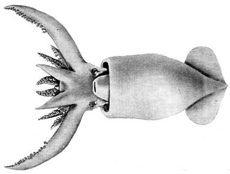

---
aliases:
  - Promachoteuthis_B
  - Promachoteuthis B
title: Promachoteuthis sp. B
---

## [[Promachoteuthis_B]] 
# *Promachoteuthis sp. B* 

[Richard E. Young and Michael Vecchione]()

Containing group:[Promachoteuthidae](../Promachoteuthidae.md) 

## Introduction

***Promachoteuthis*** sp. B is known mostly from three, very small
specimens (10.5, 16.4 and 17 mm ML) and from one larger (50 mm ML)
squid, recently described by Salcedo-Vargas and Guerrero-Kommrits (2000)
as *Promachoteuthis* sp., that probably belongs to this species. If this
latter identification is correct, then this species is the only member
of the genus with a distribution in both the Atlantic and Pacific
Oceans.

### Diagnosis

A promachoteuthid\...

-   with nuchal fusion between head and mantle.
-   with arm suckers about equal in size to club suckers.
-   with tentacle base wider than arm III base.
-   with extremely small eyes.

### Characteristics

1.  Arms
    1.  Arms short (20-25% of ML).\
        \
2.  Tentacles
    1.  Short, thick (length \< ML); base wider than arms III.

    2.  Proximal club boundary with tentacle stalk marked by distinct
        reduction in tentacle diameter.

    3.  Club bears about 20 series of suckers.

    4.  Large club suckers approximately the same size as large arm
        suckers (judging from drawings).

    5.  No dark pigment band near base; stalk lightly pigmented.

       )

        **Figure**. Side view of ***Promachoteuthis*** sp. B showing
        nuchal fusion, 17 mm ML. Drawing from Roper and Young (1968).

    6.  Head fused to mantle in nuchal region.

    7.  Eyes very small (0.8 mm in 17 mm ML squid).

#### Comments

The above discription is taken from Roper and Young (1968). [More details of the description can be found here.](http://www.tolweb.org/notes/?note_id=815)

### Life History

The smallest known specimen (see drawing) is 10.5 mm ML and looks much
like the larger specimen except that the fins are relatively smaller.
 

**Figure**. Ventral view of ***Promachoteuthis.*** sp. B, 10.5 mm ML.
Drawing from Roper and Young (1968).

### Distribution

***Promachoteuthis*** sp. B was originally described from two locations
in the eastern South Pacific at 33°18\'S, 72°27\'W (0-1800 m) and
56°06\'S, 79°04\'W (ca. 0-1400 m). Toll (1982) described the gladius of
another specimen from the same general area at 34°11\'S, 80°46°W (0-2972
m) which was subsequently illustrated in Voss (1992). Voss (1992)
reported a forth, undescribed, specimen from about 57°S, 170°E, in the
western South Pacific, south of New Zealand. A fifth squid, that we
tentatively identify to this species, was described by Salcedo-Vargas
and Guerrero-Kommritz (2000) from the western North Atlantic at
42°44\'N, 13°29.W (depth not given). If these are all correct
identifications, this species has the broadest distribution of any
species in the genus.

## Phylogeny 

-   « Ancestral Groups  
    -   [Promachoteuthis](Promachoteuthis)
    -   [Chiroteuthid families](Chiroteuthid_families)
    -  [Oegopsida](../../../Oegopsida.md) 
    -  [Decapodiformes](../../../../Decapodiformes.md) 
    -  [Coleoidea](../../../../../Coleoidea.md) 
    -  [Cephalopoda](../../../../../../Cephalopoda.md) 
    -  [Mollusca](../../../../../../../Mollusca.md) 
    -  [Bilateria](../../../../../../../../Bilateria.md) 
    -  [Animals](../../../../../../../../../Animals.md) 
    -  [Eukarya](../../../../../../../../../../Eukarya.md) 
    -   [Tree of Life](../../../../../../../../../../Tree_of_Life.md)

-   ◊ Sibling Groups of  Promachoteuthis
    -   [Promachoteuthis         megaptera](Promachoteuthis_megaptera)
    -   [Promachoteuthis sloani](Promachoteuthis_sloani)
    -   Promachoteuthis sp. B
    -   [Promachoteuthis sulcus](Promachoteuthis_sulcus)
    -   [Promachoteuthis sp. D](Promachoteuthis_sp._D)

-   » Sub-Groups 

### References

Okutani, T. 1983. Rare and interesting squid from Japan. VIII.
Rediscovery of *Promachoteuthis megaptera* Hoyle, 1885 (Oegopsida:
Promachoteuthidae). Venus 42: 241-247.

Roper, C. F. E. and R. E. Young. 1968. The family Promachoteuthidae
(Cephalopoda: Oegopsida). I. A re-evaluation of its systematic position
based on new material from Antarctic and adjacent waters. Ant. Res. Ser.
11: 203-214.

Salcedo-Vargas, M. A. and J. Guerrero-Kommritz. 2000. Three new
cephalopods from the Atlantic Ocean. Mitt. Hamb. Zool. Mus. Inst., 97:
31-44.

Voss N. A. 1992. Family Promachoteuthidae. Smithson. Contr. Zool., 513:
183-185.

## Title Illustrations

 

  -----------------------------------------------------------------------------
  Scientific Name ::  Promachoteuthis sp. B
  Reference         from Roper, C. F. E. and R. E. Young. 1968. The family Promachoteuthidae (Cephalopoda: Oegopsida). I. A re-evaluation of its systematic position based on new material from Antarctic and adjacent waters. Ant. Res. Ser. 11:203-214.
  View              Dorsal
  Size              17 mm ML
  Copyright ::         © 1968 [Clyde F. E. Roper](mailto:roper.clyde@nmnh.si.edu) 
 
  -----------------------------------------------------------------------------
 

  -----------------------------------------------------------------------------
  Scientific Name ::  Promachoteuthis sp. B
  Reference         from Roper, C. F. E. and R. E. Young. 1968. The family Promachoteuthidae (Cephalopoda: Oegopsida). I. A re-evaluation of its systematic position based on new material from Antarctic and adjacent waters. Ant. Res. Ser. 11:203-214.
  View              Ventral
  Size              17 mm ML
  Copyright ::         © 1968 [Clyde F. E. Roper](mailto:roper.clyde@nmnh.si.edu) 
 
  -----------------------------------------------------------------------------

## Confidential Links & Embeds: 

### #is_/same_as :: [[/_Standards/bio/bio~Domain/Eukarya/Animal/Bilateria/Mollusca/Cephalopoda/Coleoidea/Decapodiformes/Oegopsida/Chiroteuthid/Promachoteuthidae/Promachoteuthis_B|Promachoteuthis_B]] 

### #is_/same_as :: [[/_public/bio/bio~Domain/Eukarya/Animal/Bilateria/Mollusca/Cephalopoda/Coleoidea/Decapodiformes/Oegopsida/Chiroteuthid/Promachoteuthidae/Promachoteuthis_B.public|Promachoteuthis_B.public]] 

### #is_/same_as :: [[/_internal/bio/bio~Domain/Eukarya/Animal/Bilateria/Mollusca/Cephalopoda/Coleoidea/Decapodiformes/Oegopsida/Chiroteuthid/Promachoteuthidae/Promachoteuthis_B.internal|Promachoteuthis_B.internal]] 

### #is_/same_as :: [[/_protect/bio/bio~Domain/Eukarya/Animal/Bilateria/Mollusca/Cephalopoda/Coleoidea/Decapodiformes/Oegopsida/Chiroteuthid/Promachoteuthidae/Promachoteuthis_B.protect|Promachoteuthis_B.protect]] 

### #is_/same_as :: [[/_private/bio/bio~Domain/Eukarya/Animal/Bilateria/Mollusca/Cephalopoda/Coleoidea/Decapodiformes/Oegopsida/Chiroteuthid/Promachoteuthidae/Promachoteuthis_B.private|Promachoteuthis_B.private]] 

### #is_/same_as :: [[/_personal/bio/bio~Domain/Eukarya/Animal/Bilateria/Mollusca/Cephalopoda/Coleoidea/Decapodiformes/Oegopsida/Chiroteuthid/Promachoteuthidae/Promachoteuthis_B.personal|Promachoteuthis_B.personal]] 

### #is_/same_as :: [[/_secret/bio/bio~Domain/Eukarya/Animal/Bilateria/Mollusca/Cephalopoda/Coleoidea/Decapodiformes/Oegopsida/Chiroteuthid/Promachoteuthidae/Promachoteuthis_B.secret|Promachoteuthis_B.secret]] 

