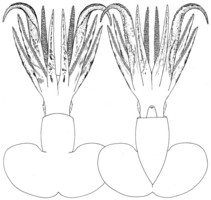

---
aliases:
  - sloani
title: Promachoteuthis sloani
---

## Phylogeny 

-   « Ancestral Groups  
    -   [Promachoteuthis](Promachoteuthis)
    -   [Chiroteuthid families](Chiroteuthid_families)
    -  [Oegopsida](../../../Oegopsida.md) 
    -  [Decapodiformes](../../../../Decapodiformes.md) 
    -  [Coleoidea](../../../../../Coleoidea.md) 
    -  [Cephalopoda](../../../../../../Cephalopoda.md) 
    -  [Mollusca](../../../../../../../Mollusca.md) 
    -  [Bilateria](../../../../../../../../Bilateria.md) 
    -  [Animals](../../../../../../../../../Animals.md) 
    -  [Eukarya](../../../../../../../../../../Eukarya.md) 
    -   [Tree of Life](../../../../../../../../../../Tree_of_Life.md)

-   ◊ Sibling Groups of  Promachoteuthis
    -   [Promachoteuthis         megaptera](Promachoteuthis_megaptera)
    -   Promachoteuthis sloani
    -   [Promachoteuthis sp. B](Promachoteuthis_sp._B)
    -   [Promachoteuthis sulcus](Promachoteuthis_sulcus)
    -   [Promachoteuthis sp. D](Promachoteuthis_sp._D)

-   » Sub-Groups 

# *Promachoteuthis sloani* [Young, Vecchione & Piatkowski 2006] 

[Richard E. Young and Michael Vecchione]()

 

Containing group:[Promachoteuthidae](../Promachoteuthidae.md) 

## Introduction

***Promachoteuthis sloani*** is known from two specimens: the smaller
holotype, an immature female 58 mm ML and a paratype, an immature
female, 102 mm ML. The paratype was captured by the R/V WALTER HERWIG in
1973 while the holotype was captured by the R/V G.O. SARS in 2004 and
was in near-perfect condition. Both were taken from the North Atlantic
in nets that fished to depths greater than 2,000 m. Virtually nothing is
known of their biology.

#### Diagnosis

A ***Promachoteuthis*** \...

-   without nuchal fusion between head and mantle.
-   with mostly 3-4 series of suckers on arms.
-   with papillae on tentacles.

### Characteristics

1.  Arms
    1.  Arms with three or four rather irregular suckers series in
        mid-region sometimes appearing as up to six series.

2.  Tentacles
    1.  Tentacles thick at base (slightly thicker than adjacent arms);
        club not flattened; club) about 60% of tentacle length.
    2.  Each tentacle with two series of long papillae near oral midline
        at tentacle base but diverging to be lateral to club; papillae
        often with stubby branches in holotype but become flattened,
        highly branching or merge into a complex membrane in the
        paratype.
    3.  Darkly pigmented ridges present along the lateral margins of the
        aboral surface of each tentacle; distally the ridge breaks into
        small papillae. Pigmented ridges in paratype less prominent and
        restricted to middle third of tentacle.

3.  Head
    1.  Head extremely small with very small eyes buldging laterally
        from reduced head.
    2.  Eyelid forming a small, circular opening.
    3.  Eyelid over lens opaque but with, apparently, a somewhat clearer
        central region.

4.  Mantle
    1.  Anterior mantle-margin free from the head. A nuchal cartilage is
        present.

5.  #### Fins

    1.  Fins large; large anterior lobes present; posterior lobes absent
        in holotype but small, distinct posterior lobes present in
        paratype.

#### Comments

[More information on the description can be found here.](http://www.tolweb.org/notes/?note_id=807)

***Promachoteuthis*** ***sloani*** is very distinctive and easily
separated from other members of the genus by the peculiar tentacles
among many other features.

### Distribution

Type locality - Central North Atlantic at 53°05'N, 36°46'W (R/V G.O.SARS
MARECO cruise super station 14, local station 341)in an trawl that
fished to a maximum depth of 2792 m in 2004. Paratype came from the
Eastern North Atlantic at 46°00\'N, 15°49\'W (R/V WALTER HERWIG station
714) in a trawl that fished to 2650 m.

### References

Toll, R. B. 1998. The gladius is teuthoid systematics. Smithson. Contr.
Zool., No. 586: 55-68.

## Title Illustrations

 

  ------------------------------------------------------------------------------
  scientific_name ::     Promachoteuthis sloani
  location ::           Central North Atlantic
  specimen_condition ::  Fresh
  Sex ::                Female
  View                 Ventral
  Size                 58 mm ML
  Type                 Holotype
  copyright ::            © [Richard E. Young](http://www.soest.hawaii.edu/%7Eryoung/rey.html) 
 
  ------------------------------------------------------------------------------
 

  -----------------------------------------------------------------------
  scientific_name ::     Promachoteuthis sloani
  location ::           North Atlantic Ocean
  Creator              Keiko Hiratsuka Moore, National Marine Fisheries Service.
  specimen_condition ::  Dead Specimen
  Sex ::                Female
  View                 Dorsal, ventral
  Size                 102 mm ML
  Type                 Paratype
  copyright ::            © [Michael Vecchione](mailto:vecchiom@si.edu) 
 
  -----------------------------------------------------------------------

## Confidential Links & Embeds: 

### #is_/same_as :: [[/_Standards/bio/bio~Domain/Eukarya/Animal/Bilateria/Mollusca/Cephalopoda/Coleoidea/Decapodiformes/Oegopsida/Chiroteuthid/Promachoteuthidae/sloani|sloani]] 

### #is_/same_as :: [[/_public/bio/bio~Domain/Eukarya/Animal/Bilateria/Mollusca/Cephalopoda/Coleoidea/Decapodiformes/Oegopsida/Chiroteuthid/Promachoteuthidae/sloani.public|sloani.public]] 

### #is_/same_as :: [[/_internal/bio/bio~Domain/Eukarya/Animal/Bilateria/Mollusca/Cephalopoda/Coleoidea/Decapodiformes/Oegopsida/Chiroteuthid/Promachoteuthidae/sloani.internal|sloani.internal]] 

### #is_/same_as :: [[/_protect/bio/bio~Domain/Eukarya/Animal/Bilateria/Mollusca/Cephalopoda/Coleoidea/Decapodiformes/Oegopsida/Chiroteuthid/Promachoteuthidae/sloani.protect|sloani.protect]] 

### #is_/same_as :: [[/_private/bio/bio~Domain/Eukarya/Animal/Bilateria/Mollusca/Cephalopoda/Coleoidea/Decapodiformes/Oegopsida/Chiroteuthid/Promachoteuthidae/sloani.private|sloani.private]] 

### #is_/same_as :: [[/_personal/bio/bio~Domain/Eukarya/Animal/Bilateria/Mollusca/Cephalopoda/Coleoidea/Decapodiformes/Oegopsida/Chiroteuthid/Promachoteuthidae/sloani.personal|sloani.personal]] 

### #is_/same_as :: [[/_secret/bio/bio~Domain/Eukarya/Animal/Bilateria/Mollusca/Cephalopoda/Coleoidea/Decapodiformes/Oegopsida/Chiroteuthid/Promachoteuthidae/sloani.secret|sloani.secret]] 

