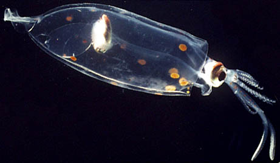
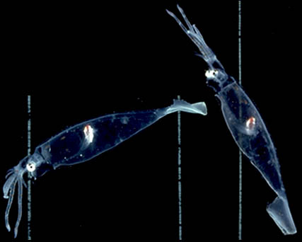

---
aliases:
  - Cranchiidae
title: Cranchiidae
---

## Phylogeny 

-   « Ancestral Groups  
    -  [Oegopsida](../Oegopsida.md) 
    -  [Decapodiformes](../../Decapodiformes.md) 
    -  [Coleoidea](../../../Coleoidea.md) 
    -  [Cephalopoda](../../../../Cephalopoda.md) 
    -  [Mollusca](../../../../../Mollusca.md) 
    -  [Bilateria](../../../../../../Bilateria.md) 
    -  [Animals](../../../../../../../Animals.md) 
    -  [Eukarya](../../../../../../../../Eukarya.md) 
    -   [Tree of Life](../../../../../../../../Tree_of_Life.md)

-   ◊ Sibling Groups of  Oegopsida
    -   [Architeuthis](Architeuthis)
    -  [Brachioteuthidae](Brachioteuthidae.md) 
    -   [Chiroteuthid families](Chiroteuthid_families)
    -   Cranchiidae
    -  [Cycloteuthidae](Cycloteuthidae.md) 
    -   [Enoploteuthid families](Enoploteuthid_families)
    -   [Histioteuthid families](Histioteuthid_families)
    -  [Gonatidae](Gonatidae.md) 
    -   [Lepidoteuthid families](Lepidoteuthid_families)
    -  [Neoteuthidae](Neoteuthidae.md) 
    -  [Ommastrephidae](Ommastrephidae.md) 
    -  [Onychoteuthidae](Onychoteuthidae.md) 
    -   [Thysanoteuthis rhombus](Thysanoteuthis_rhombus)

-   » Sub-Groups
    -   [Cranchiinae](Cranchiinae)
    -   [Taoniinae](Taoniinae)

# Cranchiidae [Prosch, 1847]

## Bathyscaphoid squids 

[Richard E. Young and Katharina M. Mangold (1922-2003)]()

This family contains 13 genera with approximately 60 species.

Containing group:[Oegopsida](../Oegopsida.md) 

## Introduction

Cranchiids are small *(**Helicocranchia**:* ca. 100 mm mantle length
\[ML\]) to large *(**Mesonychoteuthis**:* ca. 2000 mm ML) squids that
[possess a large buoyancy chamber](http://www.tolweb.org/notes/?note_id=835) and, hence, the
common name \"bathyscaphoid squid.\" In general appearance they often
appear to have bloated bodies and short arms. The mantle is generally
thin but muscular. Several species have been observed in deep water from
submersibles to exhibit a peculiar posture (cockatoo posture) with the
arms and tentacles folded back over the head (Vecchione and Roper,
1991). Cranchiid paralarvae are common in near-surface waters and many
remain in this habitat until reaching a rather large size (ca. 50-100 mm
ML). Most species occupy progressively deeper waters as they grow larger
(ontogenetic descent). This is one of the more speciose families of
squids with about 60 species, many of which are undescribed (Voss, *et
al.*, 1992).

#### Diagnosis

An oegopsid \...

-   with head fused to mantle at funnel and nuchal locking-apparatuses.
-   with coelom modified into a large buoyancy chamber.

### Characteristics

1.  Arms
    1.  Armature of suckers or hooks in two series.
    2.  Buccal connectives attach to ventral borders of arms IV.\
2.  Head
    1.  Fused to mantle at nuchal cartilage.\
3.  Funnel
    1.  Both funnel locking-apparatuses fused to mantle components;
        often traces of original locking apparatus absent.
    2.  Funnel retractor muscles form broad, horizontal membrane
        dividing mantle cavity into ventral and dorsal chambers.\
4.  Viscera
    1.  [Large buoyancy chamber extends full length of         mantle.](http://www.tolweb.org/accessory/Cranchiid_Buoyancy?acc_id=835)
    2.  Digestive gland generally spindle-shaped and situated well
        posterior to cephalic cartilage.\
5.  Paralarvae
    1.  Most paralarvae with eyes on stalks.

### Nomenclature

[A list of all nominal genera and species in the Cranchiidae can be found here](http://www.tolweb.org/accessory/Cranchiidae_Taxa?acc_id=2320). The
list includes the current status and type species of all genera, and the
current status, type repository and type locality of all species and all
pertinent references.

### Discussion of Phylogenetic Relationships

The phylogenetic relationships shown above are from Voss (1988). An
earlier study (N. Voss and R. Voss, 1983) was the first cladistic study
undertaken on cephalopods.

### Behavior

Many cranchiids spend much of their life in the upper depths of the
ocean in partially sunlit waters. For concealment under these
conditions, they are often transparent except for the eyes and the
visceral nucleus. The visceral nucleus is generally spindle-shaped and
maintains a vertical orientation to minimize the shadow that it casts
(Seapy and Young, 1986). The eyes, often with ventral photophores, also
maintain a constant orientation not only for concealment but, as in most
cephalopods, as a visual aid to assist interpretation of objects in the
environment. The ability of cranchiids to maintain the digestive gland
in a vertical orientation can be seen the the photographs below. Squid
were photographed in a shipboard aquarium with vertical lines placed on
the back of the tank. Note the vertical orientation of the visceral
nucleus of this squid when its body is in two different postures.
 

**Figure**. Side views of ***Leachia pacifica*** in different attitudes.
Photographs by R. Young.

### Life History

Probably all species have paralarvae in near surface waters. Some
paralarvae reach a large size (ca. 50-100 mm ML) before descending into
deep water as juveniles. Paralarvae of most species are easily
recognized as belonging to this family by their long eyestalks. This is
especially pronounced in paralarval ***Bathothauma**.* Many species go
through marked morphological change with growth and at maturity. These
can involve changing eye shape and position, changing fin shape,
increased pigmentation, development of photophores on arm tips, various
modifications of arm structure and, apparently, loss of tentacles. These
changes have led to many developmental stages being named as separate
species or genera.

Based on slim evidence, females seem to be semelparous (terminal
spawners).

### References

Seapy, R. R. and R. E. Young 1986. Concealment in epipelagic
pterotracheid heteropods (Gastropoda) and cranchiid squids
(Cephalopoda). J. Zool., Lond. (A), 210: 137-147.

Vecchione, Michael and Clyde F.E. Roper. 1991 Cephalopods observed from
submersibles in the western North Atlantic. Bulletin of Marine Science,
49(1-2):433-445.

Voss, N. A. 1980. A generic revision of the Cranchiidae (Cephalopoda;
Oegopsida). Bull. Mar. Sci. 30: 365-412.

Voss, N. A. and R. S. Voss. 1983. Phylogenetic relationships in the
cephalopod family Cranchiidae (Oegopsida). Malacologia 23: 397-426.

Voss, N. A. 1988. Evolution of the cephalopod family Cranchiidae
(Oegopsida). P. 293-314. In: (M. R. Clarke and E. R. Trueman, eds.),
Paleontology and Neontology of Cephalopods; The Mollusca, 12, Academic
Press, Inc., New York, 355pp.

Voss N. A., S. J. Stephen and Zh. Dong 1992. Family Cranchiidae Prosch,
1849. Smithson. Contr. Zool., 513: 187-210.

## Title Illustrations

 

  ------------
  Scientific Name ::   Megalocranchia fisheri
  Location ::         off Hawaii
  Life Cycle Stage ::   young
  ------------

## Confidential Links & Embeds: 

### #is_/same_as :: [[/_Standards/bio/bio~Domain/Eukarya/Animal/Bilateria/Mollusca/Cephalopoda/Coleoidea/Decapodiformes/Oegopsida/Cranchiidae|Cranchiidae]] 

### #is_/same_as :: [[/_public/bio/bio~Domain/Eukarya/Animal/Bilateria/Mollusca/Cephalopoda/Coleoidea/Decapodiformes/Oegopsida/Cranchiidae.public|Cranchiidae.public]] 

### #is_/same_as :: [[/_internal/bio/bio~Domain/Eukarya/Animal/Bilateria/Mollusca/Cephalopoda/Coleoidea/Decapodiformes/Oegopsida/Cranchiidae.internal|Cranchiidae.internal]] 

### #is_/same_as :: [[/_protect/bio/bio~Domain/Eukarya/Animal/Bilateria/Mollusca/Cephalopoda/Coleoidea/Decapodiformes/Oegopsida/Cranchiidae.protect|Cranchiidae.protect]] 

### #is_/same_as :: [[/_private/bio/bio~Domain/Eukarya/Animal/Bilateria/Mollusca/Cephalopoda/Coleoidea/Decapodiformes/Oegopsida/Cranchiidae.private|Cranchiidae.private]] 

### #is_/same_as :: [[/_personal/bio/bio~Domain/Eukarya/Animal/Bilateria/Mollusca/Cephalopoda/Coleoidea/Decapodiformes/Oegopsida/Cranchiidae.personal|Cranchiidae.personal]] 

### #is_/same_as :: [[/_secret/bio/bio~Domain/Eukarya/Animal/Bilateria/Mollusca/Cephalopoda/Coleoidea/Decapodiformes/Oegopsida/Cranchiidae.secret|Cranchiidae.secret]] 

