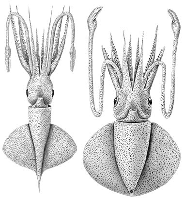
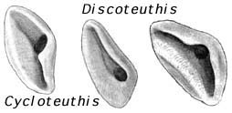

---
title: Cycloteuthidae
---

## Phylogeny 

-   « Ancestral Groups  
    -  [Oegopsida](../Oegopsida.md))
    -  [Decapodiformes](../../Decapodiformes.md))
    -  [Coleoidea](../../../Coleoidea.md))
    -  [Cephalopoda](../../../../Cephalopoda.md))
    -  [Mollusca](../../../../../Mollusca.md))
    -  [Bilateria](../../../../../../Bilateria.md))
    -  [Animals](../../../../../../../Animals.md))
    -  [Eukarya](../../../../../../../../Eukarya.md))
    -   [Tree of Life](../../../../../../../../Tree_of_Life.md)

-   ◊ Sibling Groups of  Oegopsida
    -   [Architeuthis](Architeuthis)
    -  [Brachioteuthidae](Brachioteuthidae.md))
    -   [Chiroteuthid families](Chiroteuthid_families)
    -  [Cranchiidae](Cranchiidae.md))
    -   Cycloteuthidae
    -   [Enoploteuthid families](Enoploteuthid_families)
    -   [Histioteuthid families](Histioteuthid_families)
    -  [Gonatidae](Gonatidae.md))
    -   [Lepidoteuthid families](Lepidoteuthid_families)
    -  [Neoteuthidae](Neoteuthidae.md))
    -  [Ommastrephidae](Ommastrephidae.md))
    -  [Onychoteuthidae](Onychoteuthidae.md))
    -   [Thysanoteuthis rhombus](Thysanoteuthis_rhombus)

-   » Sub-Groups
    -   [Cycloteuthis sirventyi](Cycloteuthis_sirventyi)
    -   [Discoteuthis](Discoteuthis)

# Cycloteuthidae [Naef, 1923] 

[Richard E. Young]()

The Cycloteuthidae contains two rather dissimilar genera.

Containing group:[Oegopsida](../Oegopsida.md))

## Introduction

These are mesopelagic squids of moderate size, the largest reaches about
60 cm ML, with a cosmopolitan distribution in tropical and subtropical
waters (Nesis, 1982). In ***Cycloteuthis*** the mantle and fins are
drawn-out into a slender tail. A tail is lacking in ***Discoteuthis***
and the large, oval (disc-like) combined fins extend virtually the full
length of the mantle. Very little is known about the biology of any
species in the family.

#### Diagnosis

An oegopsid \...

-   with triangular funnel locking-apparatus.

### Characteristics

1.  Arms
    1.  Arm suckers biserial.
    2.  Buccal-crown connectives attach to ventral borders of Arms IV.\
        \
2.  Tentacles
    1.  Tentacular club with quadraserial suckers.\
        \
3.  Funnel/mantle locking apparatus
    1.  Funnel component with sub-triangular groove.
    2.  Mantle component does not reach anterior mantle margin.

   ){width="254"}
    **Figure**. Ventral views of the funnel locking-apparatus of ***C.
    serventyi*** (left) and the two species of ***Discoteuthis***
    (right).

#### Comments

The genera are easily separated by body and fin shape (see title
illustrations).  In addition the presence of a large visceral photophore
only in ***Cycloteuthis*** allows genera to be separated when badly
damaged.\

### Nomenclature

[A list of all nominal genera and species in the Cycloteuthidae can be found here](http://www.tolweb.org/accessory/Cycloteuthidae_Taxa?acc_id=2318).
The list includes the current status and type species of all genera, and
the current status, type repository and type locality of all species and
all pertinent references.

### Discussion of Phylogenetic Relationships

The feature that unites these two genera is the similar triangular shape
of the funnel locking-apparatus. Other than this unusual feature, there
is little morphological evidence for their close relationship. Molecular
evidence (Carlini, 1998), however, supports their close relationship.

### References

Carlini, D. B. 1998. The phylogeny of coleoid cephalopods inferred from
molecular evolutionary analyses of the cytochrome oxidase I, muscle
actin, and cytoplasmic actin genes. Ph.D. diss. Coll. William and Mary,
273 pp.

Nesis, K. N. 1982. Abridged key to the cephalopod mollusks of the
world\'s ocean. 385+ii pp. Light and Food Industry Publishing House,
Moscow. (In Russian.). Translated into English by B. S. Levitov, ed. by
L. A. Burgess (1987), Cephalopods of the world. T. F. H. Publications,
Neptune City, NJ, 351pp.

Young, R. E. and C. F. E. Roper. 1969. A monograph of the Cephalopoda of
the North Atlantic: The family Cycloteuthidae. Smithsonian Contributions
to Zoology No. 5:1-24.

## Title Illustrations

)

  ------------------------------------------------------------------------------
  Scientific Name ::  Cycloteuthis serventyi, Discoteuthis discus (2)
  Reference         Young, R. E. and C. F. E. Roper. 1969. A monograph of the Cephalopoda of the North Atlantic: The family Cycloteuthidae. Smithsonian Contributions to Zoology No. 5:1-24.
  View              Ventral
  Size              42, 53 mm ML
  Copyright ::         © [Richard E. Young](http://www.soest.hawaii.edu/%7Eryoung/rey.html) 
  ------------------------------------------------------------------------------

## Confidential Links & Embeds: 

### #is_/same_as ::[Cycloteuthidae](Cycloteuthidae.md)) 

### #is_/same_as :: [Cycloteuthidae.public](/_public/bio/bio~Domain/Eukarya/Animal/Bilateria/Mollusca/Cephalopoda/Coleoidea/Decapodiformes/Oegopsida/Cycloteuthidae.public.md) 

### #is_/same_as :: [Cycloteuthidae.internal](/_internal/bio/bio~Domain/Eukarya/Animal/Bilateria/Mollusca/Cephalopoda/Coleoidea/Decapodiformes/Oegopsida/Cycloteuthidae.internal.md) 

### #is_/same_as :: [Cycloteuthidae.protect](/_protect/bio/bio~Domain/Eukarya/Animal/Bilateria/Mollusca/Cephalopoda/Coleoidea/Decapodiformes/Oegopsida/Cycloteuthidae.protect.md) 

### #is_/same_as :: [Cycloteuthidae.private](/_private/bio/bio~Domain/Eukarya/Animal/Bilateria/Mollusca/Cephalopoda/Coleoidea/Decapodiformes/Oegopsida/Cycloteuthidae.private.md) 

### #is_/same_as :: [Cycloteuthidae.personal](/_personal/bio/bio~Domain/Eukarya/Animal/Bilateria/Mollusca/Cephalopoda/Coleoidea/Decapodiformes/Oegopsida/Cycloteuthidae.personal.md) 

### #is_/same_as :: [Cycloteuthidae.secret](/_secret/bio/bio~Domain/Eukarya/Animal/Bilateria/Mollusca/Cephalopoda/Coleoidea/Decapodiformes/Oegopsida/Cycloteuthidae.secret.md)

