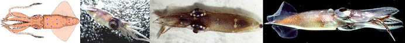

---
aliases:
  - Enoploteuthid
title: Enoploteuthid families
---

## Phylogeny 

-   « Ancestral Groups  
    -  [Oegopsida](../Oegopsida.md) 
    -  [Decapodiformes](../../Decapodiformes.md) 
    -  [Coleoidea](../../../Coleoidea.md) 
    -  [Cephalopoda](../../../../Cephalopoda.md) 
    -  [Mollusca](../../../../../Mollusca.md) 
    -  [Bilateria](../../../../../../Bilateria.md) 
    -  [Animals](../../../../../../../Animals.md) 
    -  [Eukarya](../../../../../../../../Eukarya.md) 
    -   [Tree of Life](../../../../../../../../Tree_of_Life.md)

-   ◊ Sibling Groups of  Oegopsida
    -   [Architeuthis](Architeuthis)
    -  [Brachioteuthidae](Brachioteuthidae.md) 
    -   [Chiroteuthid families](Chiroteuthid_families)
    -  [Cranchiidae](Cranchiidae.md) 
    -  [Cycloteuthidae](Cycloteuthidae.md) 
    -   Enoploteuthid families
    -   [Histioteuthid families](Histioteuthid_families)
    -  [Gonatidae](Gonatidae.md) 
    -   [Lepidoteuthid families](Lepidoteuthid_families)
    -  [Neoteuthidae](Neoteuthidae.md) 
    -  [Ommastrephidae](Ommastrephidae.md) 
    -  [Onychoteuthidae](Onychoteuthidae.md) 
    -   [Thysanoteuthis rhombus](Thysanoteuthis_rhombus)

-   » Sub-Groups
    -   [Ancistrocheirus         lesueurii](Ancistrocheirus_lesueurii)
    -   [Enoploteuthidae](Enoploteuthidae)
    -   [Lycoteuthidae](Lycoteuthidae)
    -   [Pyroteuthidae](Pyroteuthidae)

# Enoploteuthid families 

[Richard E. Young and Michael Vecchione]()
)

Containing group:[Oegopsida](../Oegopsida.md) 

## Introduction

Four families show close relationships and are placed here in a clade
\"enoploteuthid families.\" A formal name is premature, however, until
the position of the clade within the Oegopsida and confirmation of the
monophyletic nature of the group at this position can be confirmed.

Members of this clade are small squids that occupy the mesopelagic zone
of the ocean and have an abundance of photophores. Three of the four
families have hooks on the arms and, usually, tentacles.

#### Diagnosis

An oegopsid \...

-   with eight or remnants of eight buccal supports.

### Characteristics

1.  Arms
    1.  Armature in two series.
    2.  Arm hooks present except in Lycoteuthididae.
        1.  Aperature absent (except for small aperature in
            ***Enoploteuthis***).
        2.  Belly of hook with ridge (except in ***Pterygioteuthis***).
        3.  Margin of hook base with 2 large lateral lobes and 1
            proximal lip.
        4.  Skirt absent.
        5.  Accessory hooks absent.

        \*\*See [Cephalopod         Hooks](http://www.tolweb.org/accessory/Cephalopod_Hooks?acc_id=1983)
        for hook terminology.\
2.  Tentacles
    1.  Armature on tentacular clubs in four series in young but may be
        reduced on manus in subadults.
    2.  Club hooks present except in Lycoteuthidae and
        ***Pterygioteuthis***.
    3.  Proximal (= carpal) locking-apparatus of tentacle compact, often
        circular.\
3.  Buccal crown
    1.  Buccal crown with eight or remnants of eight buccal supports.
    2.  Buccal-crown connectives attach to dorsal margins of arms IV.\
4.  Photophores
    1.  Numerous photophores present but distribution varies between
        families.\
5.  Spermatangia attachment-sites
    1.  Spermatangia attach to specialized tissue in nuchal region
        (except ***Enoploteuthis***).\
6.  Gladius
    1.  Gladius with conus and elongate conus field.

### Discussion of Phylogenetic Relationships

Young and Harman (1998) in a morphological, cladistic study demonstrated
that the relationship between the Lycoteuthididae and the
Pyroteuthididae was closer than the relationship between the
Pyroteuthididae and the Enoploteuthididae. This conclusion favored the
breakup, as proposed by Clarke (1988), of the former Enoploteuthididae
which had included the subfamilies Pryoteuthidinae, Ancistrocheiridinae
and Enoploteuthidinae. Among the features that support a sister-group
relationship between the Pyroteuthididae and Lycoteuthididae is the
remarkable similarity in the structure and the position of the
photophores (first noted by Herring *et al.*, 1985).

Support for a Enoploteuthidid-Lycoteuthidid-Pyroteuthidid clade was
provided by the shared presence of:

-   Buccal membrane papillae.
-   Collagen light-guides in photophores.

The sister-group relationship of the Lycoteuthidae and Pyroteuthidae was
supported by:

-   Ring-canal connects buccal pockets.
-   Photophores structure unique (i.e., double nature of certain
    tentacular photophores; microvillous blood vessels within photogenic
    tissue).
-   Photophores arrangement (i.e., tentacular, ocular, anal, branchial,
    abdominal photophores).

The study suffers primarily from polarization uncertainities due to poor
understanding of outgroup relationships. The study suggests that the
pyroteuthids have diverged strongly in morphology from their nearest
relatives.

### References

Clarke, M. R. 1988. Evolution of recent cephalopods \-- A brief review.
P. 331-313. In: Clarke, M. R. and E. R. Trueman (Eds.). The Mollusca.
Vol. 12. Paleontology and Neontology of Cephalopods. Academic Press, New
York. 355pp.

Herring, P. J., P. N. Dilly and C. Cope. 1985. The photophore morphology
of *Selenoteuthis scintillans* Voss and other lycoteuthids. J. Zool.
Lond., 206: 567-589.

Young, R. E. and R. Harman. 1998. The phylogeny of the \"enoploteuthid
families.\" Smithson. Contr. Zool., No. 586: 257-270.

## Title Illustrations

)

  -------------------------------------------------------------------------------
  Scientific Name ::  *Ancistrocheirus lesueurii, Abralia trigonura, Selenoteuthis scintillans, Pyroteuthis addolux*
  Comments          *Ancistrocheirus lesueurii*, drawing modified from Okutani, 1974. *Selenoteuthis scintillans* photograph by M. Vecchione. *Abralia trigonura* and *Pyroteuthis addolux* photographs by R. Young
  Reference         Ancistrocheirus lesueurii, drawing modified from Okutani, 1974.
  Copyright ::         © 1996 [Richard E. Young](http://www.soest.hawaii.edu/%7Eryoung/rey.html) 
 
  -------------------------------------------------------------------------------

## Confidential Links & Embeds: 

### #is_/same_as :: [Enoploteuthid](/_Standards/bio/bio~Domain/Eukarya/Animal/Bilateria/Mollusca/Cephalopoda/Coleoidea/Decapodiformes/Oegopsida/Enoploteuthid.md) 

### #is_/same_as :: [Enoploteuthid.public](/_public/bio/bio~Domain/Eukarya/Animal/Bilateria/Mollusca/Cephalopoda/Coleoidea/Decapodiformes/Oegopsida/Enoploteuthid.public.md) 

### #is_/same_as :: [Enoploteuthid.internal](/_internal/bio/bio~Domain/Eukarya/Animal/Bilateria/Mollusca/Cephalopoda/Coleoidea/Decapodiformes/Oegopsida/Enoploteuthid.internal.md) 

### #is_/same_as :: [Enoploteuthid.protect](/_protect/bio/bio~Domain/Eukarya/Animal/Bilateria/Mollusca/Cephalopoda/Coleoidea/Decapodiformes/Oegopsida/Enoploteuthid.protect.md) 

### #is_/same_as :: [Enoploteuthid.private](/_private/bio/bio~Domain/Eukarya/Animal/Bilateria/Mollusca/Cephalopoda/Coleoidea/Decapodiformes/Oegopsida/Enoploteuthid.private.md) 

### #is_/same_as :: [Enoploteuthid.personal](/_personal/bio/bio~Domain/Eukarya/Animal/Bilateria/Mollusca/Cephalopoda/Coleoidea/Decapodiformes/Oegopsida/Enoploteuthid.personal.md) 

### #is_/same_as :: [Enoploteuthid.secret](/_secret/bio/bio~Domain/Eukarya/Animal/Bilateria/Mollusca/Cephalopoda/Coleoidea/Decapodiformes/Oegopsida/Enoploteuthid.secret.md)

