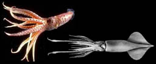
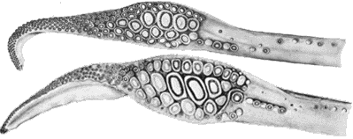

---
title: "Histioteuthid families"
---

## Phylogeny 

-   « Ancestral Groups  
    -  [Oegopsida](../Oegopsida.md))
    -  [Decapodiformes](../../Decapodiformes.md))
    -  [Coleoidea](../../../Coleoidea.md))
    -  [Cephalopoda](../../../../Cephalopoda.md))
    -  [Mollusca](../../../../../Mollusca.md))
    -  [Bilateria](../../../../../../Bilateria.md))
    -  [Animals](../../../../../../../Animals.md))
    -  [Eukarya](../../../../../../../../Eukarya.md))
    -   [Tree of Life](../../../../../../../../Tree_of_Life.md)

-   ◊ Sibling Groups of  Oegopsida
    -   [Architeuthis](Architeuthis)
    -  [Brachioteuthidae](Brachioteuthidae.md))
    -   [Chiroteuthid families](Chiroteuthid_families)
    -  [Cranchiidae](Cranchiidae.md))
    -  [Cycloteuthidae](Cycloteuthidae.md))
    -   [Enoploteuthid families](Enoploteuthid_families)
    -   Histioteuthid families
    -  [Gonatidae](Gonatidae.md))
    -   [Lepidoteuthid families](Lepidoteuthid_families)
    -  [Neoteuthidae](Neoteuthidae.md))
    -  [Ommastrephidae](Ommastrephidae.md))
    -  [Onychoteuthidae](Onychoteuthidae.md))
    -   [Thysanoteuthis rhombus](Thysanoteuthis_rhombus)

-   » Sub-Groups
    -   [Histioteuthidae](Histioteuthidae)
    -   [Psychroteuthis         glacialis](Psychroteuthis_glacialis)

# Histioteuthid families 

[Richard E. Young and Michael Vecchione]()
)

-   *[Histioteuthidae](Histioteuthidae)*[
    Verrill, 1881]
-   *[Psychroteuthidae](Psychroteuthis_glacialis)*[
    Thiele 1920]

Containing group:[Oegopsida](../Oegopsida.md))

## Introduction

The histioteuthid families consist of two families that superficially
appear very different but share virtually identical tentacular clubs.

#### Diagnosis

An oegopsid \...

-   with a distinctive \"histioteuthid\" club.

### Characteristics

1.  Arms
    1.  Arm suckers in two series.\
        \
2.  Tentacles
    1.  Tentacular club expanded.
    2.  Suckers not in uniform series.
    3.  Maximum number of suckers in transverse row greater than 4.
    4.  Large suckers with stalks lacking a neck constriction.
    5.  Proximal (= carpal) locking-apparatus in linear series,
        generally in segments arranged dorsally, medially and/or
        ventrally.

       ){width="399"}
        **Figure**. Oral views of tentacular clubs. **Top** -
        ***Psychroteuthis glacialis*** (Psychroteuthidae). **Bottom** -
        ***Stigmatoteuthis hoylei*** (Histioteuthidae). Both drawings
        from Roper, et al. (1969).

3.  Buccal crown
    1.  Buccal-crown connectives attach to dorsal margins of arms IV.

### References

Roper, C. F. E., R. E. Young and G. L. Voss (1969). An illustrated key
to the families of the order Teuthoidea. Smiths. contr. zool., 13:1-32.

## Title Illustrations

)

  -------------------------------------------------------------------------------
  Scientific Name ::  Histioteuthis hoylei, Psychroteuthis glacialis (2)
  Location ::        Hawaii, Antarctic waters (2)
  Reference         drawing from rom Roper, et al., 1969 (2)
  Copyright ::         © 1996 [Richard E. Young](http://www.soest.hawaii.edu/%7Eryoung/rey.html) 
  -------------------------------------------------------------------------------

## Confidential Links & Embeds: 

### #is_/same_as ::[Histioteuthid](Histioteuthid.md)) 

### #is_/same_as :: [Histioteuthid.public](/_public/bio/bio~Domain/Eukarya/Animal/Bilateria/Mollusca/Cephalopoda/Coleoidea/Decapodiformes/Oegopsida/Histioteuthid.public.md) 

### #is_/same_as :: [Histioteuthid.internal](/_internal/bio/bio~Domain/Eukarya/Animal/Bilateria/Mollusca/Cephalopoda/Coleoidea/Decapodiformes/Oegopsida/Histioteuthid.internal.md) 

### #is_/same_as :: [Histioteuthid.protect](/_protect/bio/bio~Domain/Eukarya/Animal/Bilateria/Mollusca/Cephalopoda/Coleoidea/Decapodiformes/Oegopsida/Histioteuthid.protect.md) 

### #is_/same_as :: [Histioteuthid.private](/_private/bio/bio~Domain/Eukarya/Animal/Bilateria/Mollusca/Cephalopoda/Coleoidea/Decapodiformes/Oegopsida/Histioteuthid.private.md) 

### #is_/same_as :: [Histioteuthid.personal](/_personal/bio/bio~Domain/Eukarya/Animal/Bilateria/Mollusca/Cephalopoda/Coleoidea/Decapodiformes/Oegopsida/Histioteuthid.personal.md) 

### #is_/same_as :: [Histioteuthid.secret](/_secret/bio/bio~Domain/Eukarya/Animal/Bilateria/Mollusca/Cephalopoda/Coleoidea/Decapodiformes/Oegopsida/Histioteuthid.secret.md)

