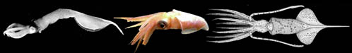
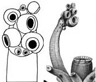

---
aliases:
  - Lepidoteuthid
title: Lepidoteuthid families
---

## Phylogeny 

-   « Ancestral Groups  
    -  [Oegopsida](../Oegopsida.md) 
    -  [Decapodiformes](../../Decapodiformes.md) 
    -  [Coleoidea](../../../Coleoidea.md) 
    -  [Cephalopoda](../../../../Cephalopoda.md) 
    -  [Mollusca](../../../../../Mollusca.md) 
    -  [Bilateria](../../../../../../Bilateria.md) 
    -  [Animals](../../../../../../../Animals.md) 
    -  [Eukarya](../../../../../../../../Eukarya.md) 
    -   [Tree of Life](../../../../../../../../Tree_of_Life.md)

-   ◊ Sibling Groups of  Oegopsida
    -   [Architeuthis](Architeuthis)
    -  [Brachioteuthidae](Brachioteuthidae.md) 
    -   [Chiroteuthid families](Chiroteuthid_families)
    -  [Cranchiidae](Cranchiidae.md) 
    -  [Cycloteuthidae](Cycloteuthidae.md) 
    -   [Enoploteuthid families](Enoploteuthid_families)
    -   [Histioteuthid families](Histioteuthid_families)
    -  [Gonatidae](Gonatidae.md) 
    -   Lepidoteuthid families
    -  [Neoteuthidae](Neoteuthidae.md) 
    -  [Ommastrephidae](Ommastrephidae.md) 
    -  [Onychoteuthidae](Onychoteuthidae.md) 
    -   [Thysanoteuthis rhombus](Thysanoteuthis_rhombus)

-   » Sub-Groups
    -   [Lepidoteuthis grimaldii](Lepidoteuthis_grimaldii)
    -   [Octopoteuthidae](Octopoteuthidae)
    -   [Pholidoteuthis](Pholidoteuthis)

# Lepidoteuthid families 

[Michael Vecchione and Richard E. Young]()
)

-   *[Lepidoteuthidae](Lepidoteuthis_grimaldii)*[
    Pfeffer 1912]
-   *[Octopoteuthidae](Octopoteuthidae)*[
    Berry 1912]
-   *[Pholidoteuthidae](Pholidoteuthis)*[
    Adam, 1950]

Containing group:[Oegopsida](../Oegopsida.md) 

## Introduction

This group contains three families that appear quite different from one
another yet they are grouped together because each shows strong
similarities in certain features to one of the other families. These are
moderate to large squid that live in midwaters when young and probably
associate with the ocean floor as adults.

### Characteristics

1.  Arms
    1.  Suckers or hooks in two series.
    2.  Hectocotylization absent.\
        \
2.  Buccal crown
    1.  Buccal connectives attach to ventral borders of arms IV.\
        \
3.  Gladius
    1.  Secondary conus present.

#### Comments

There are no unique features that define this group and few features
that are common to all three families.

### Discussion of Phylogenetic Relationships

***Lepidoteuthis*** (Lepidoteuthididae) shares with ***Pholidoteuthis
adami*** (Pholidoteuthididae) the presence of dermal cushions with the
same histological structure (Roper and Lu, 1990). ***Pholidoteuthis***
is often placed as a genus within the Lepidoteuthididae rather than in
its own family (e.g., Roper and Lu, 1989; Sweeney and Roper, 1998).
However, ***Lepidoteuthis*** also shows apparent relationship to the
Octopoteuthidae in the similarity of their paralarval clubs, the loss of
tentacles in the subadult and the form of their subadult beaks. Until
relationships are better resolved we agree with Nesis and Nikitina
(1990) that the Lepidoteuthididae and the Pholidoteuthididae should be
regarded as separate families. The monophyly of the lepidoteuthidid
families gains support from molecular studies (Carlini, 1998). Carlini
(1998) suggests that the Pholidoteuthididae and Octopoteuthididae may
have been derived from a ***Pholidoteuthis***-like ancestor.
){height="141" width="165"}

**Figure**. Oral views of tentacular clubs. **Left** - ***Lepidoteuthis
grimaldii***, paralarva, 9.7 mm ML. Drawing from Young (1991).
**Right** - ***Octopoteuthis*** sp., paralarva, 2 mm ML. Drawing from
Chun, 1910.

.

### References

Carlini, D. B. 1998. The phylogeny of coleoid cephalopods inferred from
molecular evolutionary analyses of the cytochrome oxidase I, muscle
actin, and cytoplasmic actin genes. Ph.D. diss. Coll. William and Mary,
273 pp.

Chun, C. 1910. Die Cephalopoden. Oegopsida. Wissenschaftliche Ergebnisse
der Deutschen Tiefsee-Expedition, \"Valdivia\" 1898-1899, 18: 1-522 +
Atlas.

Clarke, M. R. 1964. Young stages of *Lepidoteuthis grimaldii*
(Cephalopoda, Decapoda). Proc. Malac. Soc. Lond., 36: 69-78.

Clarke, M. R. (1988). Evolution of recent cephalopods \-- A brief
review. P. 331-313. In: Clarke, M. R. and E. R. Trueman (Eds.). The
Mollusca. Vol. 12. Paleontology and Neontology of Cephalopods. Academic
Press, New York. 355pp.

Goldman, D. A. 1995. A juvenile of the scaled squid, *Pholidoteuthis
adami* Voss, 1956 (Cephalopoda: Oegopsida), from the Florida Keys. Proc.
Biol. Soc. Wash., 108: 136-146.

Nesis, K.N. and I.V. Nikitina 1990. Revision of the squid family
Lepidoteuthidae. Zool. Zhurnal, 69: 39-49.

Roper, C.F.E. and C.C. Lu 1989. Systematic status of *Lepidoteuthis*,
*Pholidoteuthis* and *Tetronychoteuthis* (Cephalopoda: Oegopsida). Proc.
Biol. Soc. Wash., 102: 805-807.

Roper, C.F.E. and C.C. Lu 1990. Comparative morphology and function of
dermal structures in oceanic squids (Cephalopoda). Smithson. Contr.
Zool., No. 493: 1-40.

Sweeney, M. J. and C. F. E. Roper. Classification, type localities and
type repositories of Recent Cephalopoda. Smithson. Contr. Zool., No. 586
(vol. II): 561-599.

Young, R. E. (1991). Chiroteuthid and related paralarvae from Hawaiian
waters. Bull. Mar. Sci., 49: 162-185.

## Title Illustrations

)

  ---------------------------------------------------------------------------------------------------------------------
  Scientific Name ::  Lepidoteuthis grimaldii, Octopoteuthis neilseni, Pholidoteuthis adami
  Reference         Lepidoteuthis grimaldii image from Clarke, M. R. 1964. Young stages of Lepidoteuthis grimaldii (Cephalopoda, Decapoda). Proc. Malac. Soc. Lond. 36:69-78. Pholidoteuthis adami image from Goldman, D. A. 1995. A juvenile of the scaled squid, Pholidoteuthis adami Voss, 1956 (Cephalopoda: Oegopsida), from the Florida Keys. Proc. Biol. Soc. Wash. 108:136-146. (3)
  Creator           Octopoteuthis neilseni photograph by R. E. Young
  Copyright ::         © 1999 [Richard E. Young](http://www.soest.hawaii.edu/%7Eryoung/rey.html) 
 
  ---------------------------------------------------------------------------------------------------------------------

## Confidential Links & Embeds: 

### #is_/same_as :: [Lepidoteuthid](/_Standards/bio/bio~Domain/Eukarya/Animal/Bilateria/Mollusca/Cephalopoda/Coleoidea/Decapodiformes/Oegopsida/Lepidoteuthid.md) 

### #is_/same_as :: [Lepidoteuthid.public](/_public/bio/bio~Domain/Eukarya/Animal/Bilateria/Mollusca/Cephalopoda/Coleoidea/Decapodiformes/Oegopsida/Lepidoteuthid.public.md) 

### #is_/same_as :: [Lepidoteuthid.internal](/_internal/bio/bio~Domain/Eukarya/Animal/Bilateria/Mollusca/Cephalopoda/Coleoidea/Decapodiformes/Oegopsida/Lepidoteuthid.internal.md) 

### #is_/same_as :: [Lepidoteuthid.protect](/_protect/bio/bio~Domain/Eukarya/Animal/Bilateria/Mollusca/Cephalopoda/Coleoidea/Decapodiformes/Oegopsida/Lepidoteuthid.protect.md) 

### #is_/same_as :: [Lepidoteuthid.private](/_private/bio/bio~Domain/Eukarya/Animal/Bilateria/Mollusca/Cephalopoda/Coleoidea/Decapodiformes/Oegopsida/Lepidoteuthid.private.md) 

### #is_/same_as :: [Lepidoteuthid.personal](/_personal/bio/bio~Domain/Eukarya/Animal/Bilateria/Mollusca/Cephalopoda/Coleoidea/Decapodiformes/Oegopsida/Lepidoteuthid.personal.md) 

### #is_/same_as :: [Lepidoteuthid.secret](/_secret/bio/bio~Domain/Eukarya/Animal/Bilateria/Mollusca/Cephalopoda/Coleoidea/Decapodiformes/Oegopsida/Lepidoteuthid.secret.md)

