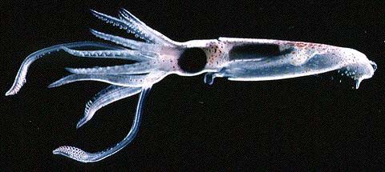
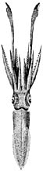
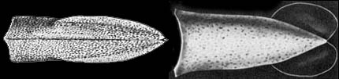
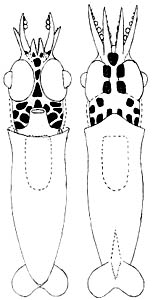

---
aliases:
  - Neoteuthidae
title: Neoteuthidae
---

## Phylogeny 

-   « Ancestral Groups  
    -  [Oegopsida](../Oegopsida.md))
    -  [Decapodiformes](../../Decapodiformes.md))
    -  [Coleoidea](../../../Coleoidea.md))
    -  [Cephalopoda](../../../../Cephalopoda.md))
    -  [Mollusca](../../../../../Mollusca.md))
    -  [Bilateria](../../../../../../Bilateria.md))
    -  [Animals](../../../../../../../Animals.md))
    -  [Eukarya](../../../../../../../../Eukarya.md))
    -   [Tree of Life](../../../../../../../../Tree_of_Life.md)

-   ◊ Sibling Groups of  Oegopsida
    -   [Architeuthis](Architeuthis)
    -  [Brachioteuthidae](Brachioteuthidae.md))
    -   [Chiroteuthid families](Chiroteuthid_families)
    -  [Cranchiidae](Cranchiidae.md))
    -  [Cycloteuthidae](Cycloteuthidae.md))
    -   [Enoploteuthid families](Enoploteuthid_families)
    -   [Histioteuthid families](Histioteuthid_families)
    -  [Gonatidae](Gonatidae.md))
    -   [Lepidoteuthid families](Lepidoteuthid_families)
    -   Neoteuthidae
    -  [Ommastrephidae](Ommastrephidae.md))
    -  [Onychoteuthidae](Onychoteuthidae.md))
    -   [Thysanoteuthis rhombus](Thysanoteuthis_rhombus)

-   » Sub-Groups
    -   [Alluroteuthis         antarcticus](Alluroteuthis_antarcticus)
    -   [Neoteuthis thielei](Neoteuthis_thielei)
    -   [Nototeuthis         dimegacotyle](Nototeuthis_dimegacotyle)
    -   [Narrowteuthis nesisi](Narrowteuthis_nesisi)

# Neoteuthidae [Naef, 1921] 

[Michael Vecchione and Richard E. Young]()
)

This family has four genera, each with a single species.

-   *[Alluroteuthis](Alluroteuthis_antarcticus)*[
    Odhner, 1923]
-   *[Neoteuthis](Neoteuthis_thielei)*[
    Naef, 1921]
-   *[Nototeuthis](Nototeuthis_dimegacotyle)*[
    Nesis & Nikitina, 1986]
-   *[Narrowteuthis](Narrowteuthis_nesisi)*[
    Young and Vecchione, 2005]

Containing group:[Oegopsida](../Oegopsida.md))

## Introduction

The Neoteuthidae contains weakly muscled species of small to moderate
size (up to 27 cm). They are distinctive in having peculiar fins in
which free posterior fin lobes are present and anterior lobes are
absent. In addition, the fins attach laterally on the mantle muscle. The
tentacular club is unusual in having the manus divided into two distinct
regions: a proximal-manus carrying numerous small suckers in irregular
series and a distal-manus mostly carring four regular series (may be
slightly more suckers in initial portion) of larger suckers. The
appearance of the club is similar to that of some species of
brachioteuthids. Little is known about the biology of this group.

#### Diagnosis

An oegopsid \...

-   with more than 10 irregular series of suckers on proximal manus of
    tentacular club.
-   with anterior attachments of fins to the sides of the mantle rather
    than on gladius.
-   with free posterior lobes on fins.

### Characteristics

1.  Arms
    1.  Arms with biserial suckers.
    2.  Buccal connectives attach to the dorsal margins of arms IV.\
2.  Tentacles
    1.  Suckers mostly in four series over distal manus and dactylus.
        (The number of series may be slightly more at the interface
        between the proximal and distal manus and, in NewGenus, somewhat
        less on the distal portion of the dactylus.) Proximal manus with
        more than 10 irregular series.
    2.  Club locking apparatus extends, at least, along the length of
        the proximal manus.

       ){height="101" width="430"}
        **Figure**. **Left** - Dorsal view of mantle of ***Neoteuthis***
        sp., 83 mm ML, off California (from Young, 1972). **Right** -
        Ventral view of mantle of ***Alluroteuthis antarctica*** (from
        Roper et al., 1969).

3.  Photophores
    1.  Photophores absent.\
4.  Skin
    1.  Outer surfaces of arms, head and mantle with thick white tissue
        (presumably silver in life) in most genera.

#### Comments

The genera are compared in the following table:

  ------- ---------------------------------------------------
  Genus             Club length   Proximal-manus length relative to remaining distal club length   tentacle locking apparatus   Manal sucker laterally compressed   Two greatly enlarged suckers on distal manus   Arm sucker dentition   Fin length
  *Alluroteuthis*   33% ML        \<1/3 X                                                          Manus, stalk                 No                                  No                                             Single large tooth     35-40% ML
  *Neoteuthis*      60% ML        4.8 X                                                            Manus                        No                                  No                                             Truncated teeth        70% ML
  *Nototeuthis*     37% ML        3/4 X                                                            Manus, stalk                 No                                  Yes                                            Truncated teeth        60% ML
  *Narrowteuthis*   20% ML        1.1 X                                                            Manus, stalk                 Yes                                 No                                             Smooth                 35% ML
  ------- ---------------------------------------------------

### Nomenclature

[A list of all nominal genera and species in the Neoteuthidae can be found here](http://www.tolweb.org/accessory/Neoteuthidae_Taxa?acc_id=2323).
The list includes the current status and type species of all genera, and
the current status, type repository and type locality of all species and
all pertinent references.

### Life History

The paralarva of any ***Neoteuthis*** species has not been positively
identified. However, a paralarva off Hawaii was tentatively identified
to this genus by a process of elimination rather than the more reliable
process of following a size series to identifiable juveniles. One of the
keys to identification is the position of the digestive gland in an
anterior postion adjacent to the cephalic cartilage. This feature is
usually characteristic of families with buccal connectives that attach
to the dorsal borders of arms IV.
){height="300" width="153"}

**Figure**. Ventral and dorsal views of a paralarva tentatively
identified as ***Neoteuthis*** sp., 5.9 mm ML, Hawaiian waters

### References

Nesis, K. N. and I. V. Nikitina. 1986. New genus and species of squid of
the family Neoteuthidae (Cephalopoda: Oegopsida) from the south-eastern
part of the Pacific Ocean. Zool. Zhurnal, Mos. 65: 290-294.

Roper, C. F. E., R. E. Young and G. L. Voss (1969). An illustrated key
to the families of the order Teuthoidea. Smiths. contr. zool., 13:1-32.

Young, R. E. 1972. The systematics and areal distribution of pelagic
cephalopods from the seas off Southern California. Smithson. Contr.
Zool., 97: 1-159.

## Title Illustrations

)

  ------------
  Scientific Name ::   Neoteuthis
  Location ::         Bahamas
  Comments           collected by submersible
  Life Cycle Stage ::   juvenile
  Copyright ::          © 1996 Ron Gilmer
  ------------
)

  ------------------------------------------------------------------------------
  Scientific Name ::  Neoteuthis thielei
  Location ::        off California, USA
  Reference         Young, R. E. 1972. The systematics and areal distribution of pelagic cephalopods from the seas off Southern California. Smithson. Contr. Zool., 97: 1-159.
  View              dorsal
  Size              83 mm ML
  Copyright ::         © [Richard E. Young](http://www.soest.hawaii.edu/%7Eryoung/rey.html) 
  ------------------------------------------------------------------------------

## Confidential Links & Embeds: 

### #is_/same_as :: [Neoteuthidae](/_Standards/bio/bio~Domain/Eukarya/Animal/Bilateria/Mollusca/Cephalopoda/Coleoidea/Decapodiformes/Oegopsida/Neoteuthidae.md) 

### #is_/same_as :: [Neoteuthidae.public](/_public/bio/bio~Domain/Eukarya/Animal/Bilateria/Mollusca/Cephalopoda/Coleoidea/Decapodiformes/Oegopsida/Neoteuthidae.public.md) 

### #is_/same_as :: [Neoteuthidae.internal](/_internal/bio/bio~Domain/Eukarya/Animal/Bilateria/Mollusca/Cephalopoda/Coleoidea/Decapodiformes/Oegopsida/Neoteuthidae.internal.md) 

### #is_/same_as :: [Neoteuthidae.protect](/_protect/bio/bio~Domain/Eukarya/Animal/Bilateria/Mollusca/Cephalopoda/Coleoidea/Decapodiformes/Oegopsida/Neoteuthidae.protect.md) 

### #is_/same_as :: [Neoteuthidae.private](/_private/bio/bio~Domain/Eukarya/Animal/Bilateria/Mollusca/Cephalopoda/Coleoidea/Decapodiformes/Oegopsida/Neoteuthidae.private.md) 

### #is_/same_as :: [Neoteuthidae.personal](/_personal/bio/bio~Domain/Eukarya/Animal/Bilateria/Mollusca/Cephalopoda/Coleoidea/Decapodiformes/Oegopsida/Neoteuthidae.personal.md) 

### #is_/same_as :: [Neoteuthidae.secret](/_secret/bio/bio~Domain/Eukarya/Animal/Bilateria/Mollusca/Cephalopoda/Coleoidea/Decapodiformes/Oegopsida/Neoteuthidae.secret.md)

