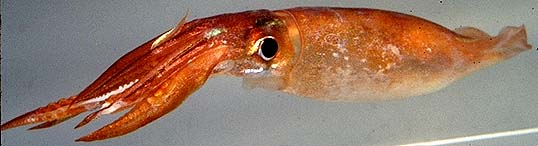
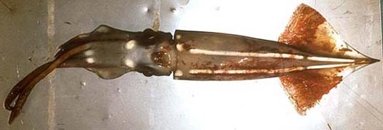
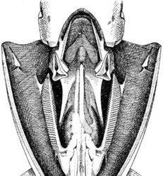
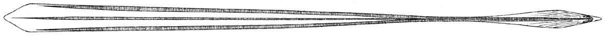

## Phylogeny 

-   « Ancestral Groups  
    -  [Oegopsida](../Oegopsida.md))
    -  [Decapodiformes](../../Decapodiformes.md))
    -  [Coleoidea](../../../Coleoidea.md))
    -  [Cephalopoda](../../../../Cephalopoda.md))
    -  [Mollusca](../../../../../Mollusca.md))
    -  [Bilateria](../../../../../../Bilateria.md))
    -  [Animals](../../../../../../../Animals.md))
    -  [Eukarya](../../../../../../../../Eukarya.md))
    -   [Tree of Life](../../../../../../../../Tree_of_Life.md)

-   ◊ Sibling Groups of  Oegopsida
    -   [Architeuthis](Architeuthis)
    -  [Brachioteuthidae](Brachioteuthidae.md))
    -   [Chiroteuthid families](Chiroteuthid_families)
    -  [Cranchiidae](Cranchiidae.md))
    -  [Cycloteuthidae](Cycloteuthidae.md))
    -   [Enoploteuthid families](Enoploteuthid_families)
    -   [Histioteuthid families](Histioteuthid_families)
    -  [Gonatidae](Gonatidae.md))
    -   [Lepidoteuthid families](Lepidoteuthid_families)
    -  [Neoteuthidae](Neoteuthidae.md))
    -   Ommastrephidae
    -  [Onychoteuthidae](Onychoteuthidae.md))
    -   [Thysanoteuthis rhombus](Thysanoteuthis_rhombus)

-   » Sub-Groups
    -   [Illex](Illex)
    -   [Ommastrephinae](Ommastrephinae)
    -   [Todarodinae](Todarodinae)

# Ommastrephidae [Steenstrup 1857] 

[Richard E. Young, Michael Vecchione, and Martina A. Compagno Roeleveld (ca. 1946-2006)]()
))

This family is generally divided into three subfamilies and eleven
genera that contain 22 species.

Containing group:[Oegopsida](../Oegopsida.md))

## Introduction

Members of the Ommastrephidae are small (about 10 cm ML) to large (about
100 cm ML), muscular squids that are often the dominant large squids in
oceanic and, occasionally, neritic waters.  A number of species are
fished commercially. Although the family is very well characterized,
placement of species with genera and subfamilies has, in some cases,
been controversial. These controversies have often revolved around the
importance of absence of a character (e. g., absence of foveola and side
pockets from the funnel groove of *Todaropsis*, a featured shared with
*Illex*) which, without adequate polarization, could be interpreted as a
synapomorphy, a symplesiomorphy, or a convergent loss.

#### Brief diagnosis

An oegopsid squid \...

-   with an inverted T-shaped funnel/mantle locking-apparatus.\
-   with fused tentacles in paralarvae.

### Characteristics

1.  Funnel/mantle locking-apparatus with an inverted T-shape.\

   ){height="250" width="231"}
    **Figure**. Frontal views of the funnel/mantle locking apparatus.
    **Left** - Funnel component of ***Illex illecebrosus***.
    **Middle** - Mantle component of ***Illex illecebrosus***.
    Photographs by M. Vecchione. **Right** - Opened mantle cavity
    showing the funnel/mantle locking apparatus of ***Todaropsis
    eblanae***. Drawing from Naef (1921-23).\

2.  Funnel adductor muscles
    1.  Thick lateral funnel-adductor muscles connect lateral edges of
        funnel with head near its ventral surface. \[These muscles are
        not homologous with the more superficial muscles of the
        Sepioidea which bear the same name.\]\

   )\
    **Figure**. Ventral view of the gladius of ***Todarodes
    sagittatus***, immature, 120 mm ML. Drawing from Naef (1921-23).

**Comparison of subfamilies:**

  ------- ---- ------ ---------
                    Photophores   Dactylus   Funnel-    Funnel-    Distal          Carpal locking
                    present^1^    suckers    groove     groove     protective      apparatus^2^ 
                    **\                      foveola    side       membranes on    
                    **                                  pockets    hectocotylus    

  Illicinae         No            8 series\  No         No         Absent          Absent 

  Ommastrephinae    Yes           4 series   Yes        Yes        Ventral         Present except
                                                                   membrane        ***Ornithoteuthis***\
                                                                   enlarged        
                                                                   subdistally     

  Todarodinae       No            4 series   Yes/No     No         Ventral         Absent 
                                                                   membrane with   
                                                                   thickened       
                                                                   trabeculae      
  ------- ---- ------ ---------

[ ^1^Photophores difficult to detect in some species.\
^2^Defined as presence of knobs and corresponding suckers with smooth
sucker rings.]

### Nomenclature

[A list of all nominal genera and species in the Ommastrephidae can be found here](http://www.tolweb.org/accessory/Ommastrephidae_Taxa?acc_id=2336).
The list includes the current status and type species of all genera, and
the current status, type repository and type locality of all species and
all pertinent references.

### Discussion of Phylogenetic Relationships

The relationships presented here are from the phylogenetic study by
Roeleveld (1988). The relationships are based on a number of different
structures but rely heavily on the structure of the hectocotylus. The
lack of known relationships among outgroups makes rooting of the tree
difficult. Not all workers agree with the subfamial placement of genera
(e.g. Nesis, 1982/7; Wormuth, *et al.*, 1998).

### References

Nesis, K. N. 1982. Abridged key to the cephalopod mollusks of the
world\'s ocean. 385+ii pp. Light and Food Industry Publishing House,
Moscow. (In Russian.). Translated into English by B. S. Levitov, ed. by
L. A. Burgess (1987), Cephalopods of the world. T. F. H. Publications,
Neptune City, NJ, 351pp.

Roeleveld, M. A. 1988. Generic interrelationships within the
Ommastrephidae (Cephalopoda). P.277-314. In: M. R. Clarke and E. R.
Trueman (eds.). The Mollusca. Vol. 12. Paleontology and Neontology of
Cephalopods. Academic Press, N.Y., 355pp.

Wormuth, J. 1998 Workshop deliberations on the Ommastrephidae; a brief
history of their systematics; and a review of the systematics,
distribution and biology of the genera *Martialia* Rochebrune and
Mabille, 1889, *Todaropsis* Girard, 1890, *Dosidicus* Steenstrup, 1857,
*Hyaloteuthis* Gray, 1849, and *Eucleoteuthis* Berry, 1916. Smithson.
Contr. Zool., No. 586:373-384..

## Title Illustrations

)

  -------------------------------------------------------------------------------
  Scientific Name ::  Nototodarus hawaiiensis
  Location ::        off Hawaii
  Copyright ::         © 1996 [Richard E. Young](http://www.soest.hawaii.edu/%7Eryoung/rey.html) 
  -------------------------------------------------------------------------------
)

  ------------------------------------------------------------------------
  Scientific Name ::  Eucleoteuthis luminosa
  Location ::        off Hawaii
  Copyright ::         © 1996 [Michael Vecchione](mailto:vecchiom@si.edu) 
  ------------------------------------------------------------------------

## Confidential Links & Embeds: 

### #is_/same_as :: [Ommastrephidae](/_Standards/bio/bio~Domain/Eukarya/Animal/Bilateria/Mollusca/Cephalopoda/Coleoidea/Decapodiformes/Oegopsida/Ommastrephidae.md) 

### #is_/same_as :: [Ommastrephidae.public](/_public/bio/bio~Domain/Eukarya/Animal/Bilateria/Mollusca/Cephalopoda/Coleoidea/Decapodiformes/Oegopsida/Ommastrephidae.public.md) 

### #is_/same_as :: [Ommastrephidae.internal](/_internal/bio/bio~Domain/Eukarya/Animal/Bilateria/Mollusca/Cephalopoda/Coleoidea/Decapodiformes/Oegopsida/Ommastrephidae.internal.md) 

### #is_/same_as :: [Ommastrephidae.protect](/_protect/bio/bio~Domain/Eukarya/Animal/Bilateria/Mollusca/Cephalopoda/Coleoidea/Decapodiformes/Oegopsida/Ommastrephidae.protect.md) 

### #is_/same_as :: [Ommastrephidae.private](/_private/bio/bio~Domain/Eukarya/Animal/Bilateria/Mollusca/Cephalopoda/Coleoidea/Decapodiformes/Oegopsida/Ommastrephidae.private.md) 

### #is_/same_as :: [Ommastrephidae.personal](/_personal/bio/bio~Domain/Eukarya/Animal/Bilateria/Mollusca/Cephalopoda/Coleoidea/Decapodiformes/Oegopsida/Ommastrephidae.personal.md) 

### #is_/same_as :: [Ommastrephidae.secret](/_secret/bio/bio~Domain/Eukarya/Animal/Bilateria/Mollusca/Cephalopoda/Coleoidea/Decapodiformes/Oegopsida/Ommastrephidae.secret.md)

