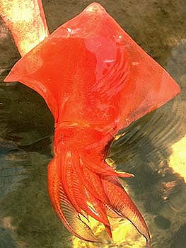
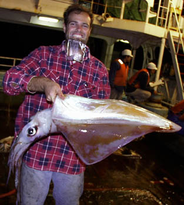
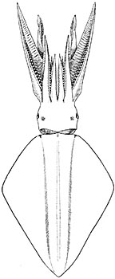
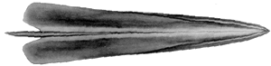
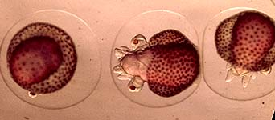
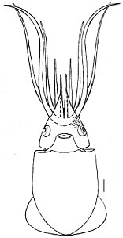

---
aliases:
  - Thysanoteuthidae
title: Thysanoteuthis rhombus
---

## Phylogeny 

-   « Ancestral Groups  
    -  [Oegopsida](../Oegopsida.md) 
    -  [Decapodiformes](../../Decapodiformes.md) 
    -  [Coleoidea](../../../Coleoidea.md) 
    -  [Cephalopoda](../../../../Cephalopoda.md) 
    -  [Mollusca](../../../../../Mollusca.md) 
    -  [Bilateria](../../../../../../Bilateria.md) 
    -  [Animals](../../../../../../../Animals.md) 
    -  [Eukarya](../../../../../../../../Eukarya.md) 
    -   [Tree of Life](../../../../../../../../Tree_of_Life.md)

-   ◊ Sibling Groups of  Oegopsida
    -   [Architeuthis](Architeuthis)
    -  [Brachioteuthidae](Brachioteuthidae.md) 
    -   [Chiroteuthid families](Chiroteuthid_families)
    -  [Cranchiidae](Cranchiidae.md) 
    -  [Cycloteuthidae](Cycloteuthidae.md) 
    -   [Enoploteuthid families](Enoploteuthid_families)
    -   [Histioteuthid families](Histioteuthid_families)
    -  [Gonatidae](Gonatidae.md) 
    -   [Lepidoteuthid families](Lepidoteuthid_families)
    -  [Neoteuthidae](Neoteuthidae.md) 
    -  [Ommastrephidae](Ommastrephidae.md) 
    -  [Onychoteuthidae](Onychoteuthidae.md) 
    -   Thysanoteuthis rhombus

-   » Sub-Groups 

## Thysanoteuthidae [Keferstein, 1866] 

# *Thysanoteuthis rhombus* [Troschel, 1857]

## The diamondback squid 

[Richard E. Young and Michael Vecchione]()
)))

***Thysanoteuthis*** contains a single species.

Containing group:[Oegopsida](../Oegopsida.md) 

## Introduction

***T. rhombus*** is a large, muscular squid (ca. 100 cm ML max.) found
throughout tropical and subtropical regions of the world\'s oceans. It
occupies near-surface waters during the night and midwaters during the
day. It has rather short arms and large triangular fins that extend the
full length of the mantle. It is fished commercially in the Sea of Japan
and off Okinawa.

#### Diagnosis

An oegopsid \...

-   with \"lazy T\"-shaped groove of funnel locking-apparatus.
-   with very muscular mantle.

### Characteristics

1.  Arms
    1.  Arm suckers in two series.
    2.  Buccal crown connectives attach to ventral margins of arms IV.\
2.  Tentacles
    1.  Tentacular clubs with four series of suckers.\
3.  Head
    1.  Nuchal (dorsal head-mantle) locking-apparatus with two mantle
        hook-like knobs\
        and opposing nuchal knobs and pits.

       )
        **Figure**. Ventral view of the ***T. rhombus*** gladius, 188 mm
        GL. In addition to the anteriorly projecting vanes, note the
        conus field but the absence of a conus. Drawing from Toll
        (1998).

### Nomenclature

[A list of all nominal genera and species in the Thysanoteuthidae can be found here](http://www.tolweb.org/accessory/Thysanoteuthidae_Taxa?acc_id=2333).
The list includes the current status and type species of all genera, and
the current status, type repository and type locality of all species and
all pertinent references.

### Life history

***T. rhombus*** lays sausage-shaped egg masses that float just beneath
the surface of the ocean (Suzuki, *et al*., 1979). Eggs lie in a double
strand that winds helically around a large gelatinous core. Embryos near
to hatching bear large numbers of chromatophores. This is the most
commonly observed egg mass of any oceanic squid.
){width="342"}

**Figure**. **Left** - ***T. rhombus*** egg mass with pink egg strands
visible around the periphery of the egg mass. Photograph by Alberto
Romeo with his wife, Lucia, in the background. Photograph was taken in
the south Tirreno Sea within the Mediterranean Sea. **Right** - Advanced
embryos from a ***T. rhombus*** egg mass, off Florida. Photograph by T.
LaRoe. The dense arrangement of chromatophores on the mantle provide the
pink color of the left photograph.

The paralarvae of ***T. rhombus*** are distinctive. The small eyes and
the numerous chromatophores (incompletely shown below) are
characteristic as are the attenuate arm tips in the larger paralarvae.
In large paralarvae, the third arms also have long slender trabeculae
which are not shown in the drawing.
){width="156"}

**Figure**. Ventral view of paralaravae of ***T. rhombus***, Hawaiian
waters. Left - 2.3 mm ML. Right - 7.5 mm ML. The scale bar is 1 mm.
Drawings by R. Young.
### References

Suzuki, S., H. Misaki and T. Okutani. 1979. Studies on early life
history of decapodan Mollusca. VIII. A supplementary note on floating
egg mass of *Thysanoteuthis rhombus* Troschel in Japan - The first
underwater photography. Venus 38: 153-155.

Naef, A. 1921-23. Cephalopoda. Fauna e Flora de Golfo di Napoli.
Monograph, no. 35, 863 pp.

Nigmatullin, C. M. and A. I. Arkhipkin. 1998. A review of the biology of
the diamond back squid, *Thysanoteuthis rhombus* (Oegopsida:
Thysanoteuthidae).p. 155-181. In: (T. Okutani, Ed.) Contributed Papers
to International Symposium on Large Pelagic Squids. Japan Marine Fishery
Resources Research Center, Tokyo.

Toll, R. B. 1998. The gladius in teuthoid systematics. Smithson. Contr.
Zool., No. 586: 55-68.

## Title Illustrations

)

  ------------
  Scientific Name ::     Thysanoteuthis rhombus
  Location ::           off Philippines
  Specimen Condition   Live Specimen
  Life Cycle Stage ::     young
  View                 Dorsal
  Copyright ::            © 1996 John Arnold
  ------------
)

  --------------------------------------------------------------------------------
  Scientific Name ::   Thysanoteuthis rhombus
  Location ::         Hawaiian waters
  Comments           M. Parry holding
  Sex ::              Female
  Life Cycle Stage ::   immature
  View               Side
  Copyright ::          © 1996 [Richard E. Young](http://www.soest.hawaii.edu/%7Eryoung/rey.html) 
 
  --------------------------------------------------------------------------------
)

  ----------------------------------
  Scientific Name ::  Thysanoteuthis rhombus
  Location ::        Mediterranean
  Reference         from Naef, A. 1921-23. Cephalopoda. Fauna e Flora de Golfo di Napoli. Monograph, no. 35, 863 pp.
  View              dorsal
  ----------------------------------

## Confidential Links & Embeds: 

### #is_/same_as :: [[/_Standards/bio/bio~Domain/Eukarya/Animal/Bilateria/Mollusca/Cephalopoda/Coleoidea/Decapodiformes/Oegopsida/Thysanoteuthidae|Thysanoteuthidae]] 

### #is_/same_as :: [[/_public/bio/bio~Domain/Eukarya/Animal/Bilateria/Mollusca/Cephalopoda/Coleoidea/Decapodiformes/Oegopsida/Thysanoteuthidae.public|Thysanoteuthidae.public]] 

### #is_/same_as :: [[/_internal/bio/bio~Domain/Eukarya/Animal/Bilateria/Mollusca/Cephalopoda/Coleoidea/Decapodiformes/Oegopsida/Thysanoteuthidae.internal|Thysanoteuthidae.internal]] 

### #is_/same_as :: [[/_protect/bio/bio~Domain/Eukarya/Animal/Bilateria/Mollusca/Cephalopoda/Coleoidea/Decapodiformes/Oegopsida/Thysanoteuthidae.protect|Thysanoteuthidae.protect]] 

### #is_/same_as :: [[/_private/bio/bio~Domain/Eukarya/Animal/Bilateria/Mollusca/Cephalopoda/Coleoidea/Decapodiformes/Oegopsida/Thysanoteuthidae.private|Thysanoteuthidae.private]] 

### #is_/same_as :: [[/_personal/bio/bio~Domain/Eukarya/Animal/Bilateria/Mollusca/Cephalopoda/Coleoidea/Decapodiformes/Oegopsida/Thysanoteuthidae.personal|Thysanoteuthidae.personal]] 

### #is_/same_as :: [[/_secret/bio/bio~Domain/Eukarya/Animal/Bilateria/Mollusca/Cephalopoda/Coleoidea/Decapodiformes/Oegopsida/Thysanoteuthidae.secret|Thysanoteuthidae.secret]] 

