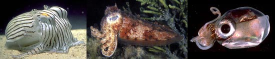
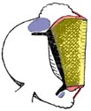
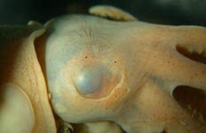
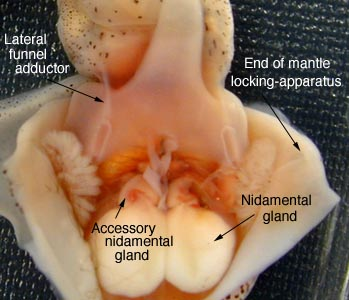
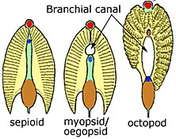

---
aliases:
- Mątwowate
- Seepialased
- Sepiidae
- Sepioidea
- sipe
- Sépidos
- sépiovití
- törpeszépiák
- דיונוניים
- سپیداجان
- コウイカ科
- 墨斗魚
- 갑오징어과
title: Sepioidea
has_id_wikidata: Q135119
dv_has_:
  name_:
    an: Sepiidae
    ast: Sepiidae
    bg: Sepiidae
    ca: Sepiidae
    ceb: Sepiidae
    cs: sépiovití
    de: Sepiidae
    el: Sepiidae
    en: Sepiidae
    eo: Sepiidae
    es: Sepiidae
    et: Seepialased
    eu: Sepiidae
    ext: Sepiidae
    fa: سپیداجان
    fi: Sepiidae
    fr: Sepiidae
    ga: Sepiidae
    gl: Sépidos
    he: דיונוניים
    hu: törpeszépiák
    ia: Sepiidae
    ie: Sepiidae
    io: Sepiidae
    it: Sepiidae
    ja: コウイカ科
    ko: 갑오징어과
    la: Sepiidae
    mul: Sepiidae
    nl: Sepiidae
    oc: Sepiidae
    pl: Mątwowate
    pt: Sepiidae
    pt_br: Sepiidae
    ro: Sepiidae
    ru: Sepiidae
    sl: sipe
    sq: Sepiidae
    sv: Sepiidae
    tr: Sepiidae
    uk: Sepiidae
    vi: Sepiidae
    vls: Sepiidae
    vo: Sepiidae
    war: Sepiidae
    zh: 墨斗魚
---
# [[Sepioidea]] 
 

## #has_/text_of_/abstract 

> Cuttlefish, or cuttles, are marine molluscs of the suborder Sepiina. 
> They belong to the class Cephalopoda which also includes squid, octopuses, and nautiluses. 
> Cuttlefish have a unique internal shell, the cuttlebone, which is used for control of buoyancy.
>
> Cuttlefish have large, W-shaped pupils, eight arms, 
> and two tentacles furnished with denticulated suckers, with which they secure their prey. 
> 
> They generally range in size from 15 to 25 cm (6 to 10 in), with the largest species, 
> the giant cuttlefish (Sepia apama), reaching 50 cm (20 in) in mantle length and over 10.5 kg (23 lb) in mass.
>
> Cuttlefish eat small molluscs, crabs, shrimp, fish, octopuses, worms, and other cuttlefish. 
> Their predators include dolphins, larger fish (including sharks), seals, seabirds, and other cuttlefish. 
> 
> The typical life expectancy of a cuttlefish is about 1–2 years. Studies are said to indicate cuttlefish to be among the most intelligent invertebrates. Cuttlefish also have one of the largest brain-to-body size ratios of all invertebrates.
>
> The Greco-Roman world valued the cuttlefish as a source of the unique brown pigment the creature releases from its siphon when it is alarmed. The word for the cuttlefish in both Greek and Latin, sepia, now refers to the reddish-brown color sepia in English.
>
> [Wikipedia](https://en.wikipedia.org/wiki/Cuttlefish) 

## Introduction

[Michael Vecchione and Richard E. Young]() 

We place three families in the sepioid clade: Sepiidae, Sepiadariidae
and Sepiolidae. The latter two families are related and placed in the
suborder Sepiolida. Two additional families (Idiosepiidae, Spirulidae)
have often been included in the Order Sepioidea. However considerable
uncertainty exists concerning the relationships of the Idiospiidae in
general and the closeness of the relationship of the Spirulidae to the
sepioid families. Members of the sepioidea are mostly neritic and upper
slope benthic species although one group (Heteroteuthinae) is pelagic.\

#### Diagnosis

A decapodiform \...

-   with corneal membranes covering eye lenses.
-   without branchial canals in gills.
-   with circularis muscles in suckers.

### Characteristics

1.  Arms
    1.  Suckers with circularis muscles.\
        \
2.  Tentacles
    1.  Tentacular club without proximal (= carpal) locking-apparatus.
    2.  Suckers with circularis muscles.

       ){height="126" width="103"}
        **Figure**. Sections through the club suckers. **Left** -
        ***Sepia officinalis***, arrow points to circularis muscle which
        encircles the sucker. **Middle** - **Ommastrephes bartramii**.
        Note absence of a circularis muscle. **Right** - **Sepia
        officinalis**, section at right angles to left figure,
        circularis muscle in blue; the asymmetry in the muscle is
        revealed by the angle of section. Histological sections made by
        Barbara Littman; photographed by R. Young. Drawing modified from
        Naef (1921-23).

3.  Buccal crown
    1.  Buccal supports with or without suckers.\
        \
4.  Head
    1.  Head with tentacle pocket.
    2.  Eyes with corneal membranes covering lenses.
    3.  Eyes with secondary (= ventral) eyelid (except in some
        Sepiolidae).

       ){height="150" width="232"}
        **Figure**. Lateral view of head of ***Rossia*** sp., 19 mm ML,
        preserved, showing secondary eyelid covering the ventral region
        of the transparent cornea. Photograph by R. Young.

5.  Funnel
    1.  Funnel with lateral adductor muscles (except in some
        Sepiolidae).

       ){width="349"}
        **Figure**. Ventral view of mantle cavity of ***Semirossia
        tenera*** (Sepiolidae). Photograph by M. Vecchione.

6.  Mantle
    1.  Mantle locking-apparatus does not reach anterior mantle margin
        (see short arrow in above photograph which marks the anterior
        end of the mantle locking-apparatus) except in some Sepiolidae.\
    2.  Interstellate connective absent (ie, no direct nerve connective
        passes directly from one stellate ganglion to the other).\
7.  Fins
    1.  Fins completely separate from one another; usually with
        posterior lobes.\
8.  Shell
    1.  Shell a flattened phragmocone (=cuttlebone), a gladius or
        absent.\
9.  Viscera
    1.  Gills without branchial canal.

       ){height="175" width="222"}
        **Figure**. Diagramatic cross-section through gills. Drawing
        modified from Naef (1921-23).

    2.  Right oviduct absent.
    3.  Females with accessory nidamental glands.\
10. Eggs
    1.  Eggs, where known, attached to substrate singly or in
        unorganized groups.

#### Synapomorphies

Many of the above characteristics of the Sepioidea are shared with the
Myopsida. The characters that unite the Sepiidae and the Sepiolida and
are considered to be apomorphic (newly derived) characters are
(characters 3 and 5 seem to be independently derived in a few Myopsida):

1.  Eyes with secondary eyelids.
2.  Funnel with lateral adductor muscles.
3.  Mantle locking-apparatus that does not reach the mantle margin.
4.  Absence of an interstellate connective.
5.  Gills without a branchial canal

## Phylogeny 

-   « Ancestral Groups  
    -  [Decapodiformes](../Decapodiformes.md) 
    -  [Coleoidea](../../Coleoidea.md) 
    -  [Cephalopoda](../../../Cephalopoda.md) 
    -  [Mollusca](../../../../Mollusca.md) 
    -  [Bilateria](../../../../../Bilateria.md) 
    -  [Animals](../../../../../../Animals.md) 
    -  [Eukarya](../../../../../../../Eukarya.md) 
    -   [Tree of Life](../../../../../../../Tree_of_Life.md)

-   ◊ Sibling Groups of  Decapodiformes
    -  [Bathyteuthoida](Bathyteuthoida.md) 
    -  [Idiosepiidae](Idiosepiidae.md) 
    -  [Myopsida](Myopsida.md) 
    -  [Oegopsida](Oegopsida.md) 
    -   Sepioidea
    -   [Spirula spirula](Spirula_spirula)

-   » Sub-Groups
    -  [Sepiidae](Sepioidea/Sepiidae.md) 
    -  [Sepiolida](Sepioidea/Sepiolida.md) 

## Title Illustrations

 

---------------------
scientific_name ::  Sepioloidea lineolata, Sepia apama, Iridoteuthis iris
copyright ::         © 2004 Mark Norman, Thomas burch
---------------------

## Confidential Links & Embeds: 

### #is_/same_as :: [[/_Standards/bio/bio~Domain/Eukarya/Animal/Bilateria/Mollusca/Cephalopoda/Coleoidea/Decapodiformes/Sepioidea|Sepioidea]] 

### #is_/same_as :: [[/_public/bio/bio~Domain/Eukarya/Animal/Bilateria/Mollusca/Cephalopoda/Coleoidea/Decapodiformes/Sepioidea.public|Sepioidea.public]] 

### #is_/same_as :: [[/_internal/bio/bio~Domain/Eukarya/Animal/Bilateria/Mollusca/Cephalopoda/Coleoidea/Decapodiformes/Sepioidea.internal|Sepioidea.internal]] 

### #is_/same_as :: [[/_protect/bio/bio~Domain/Eukarya/Animal/Bilateria/Mollusca/Cephalopoda/Coleoidea/Decapodiformes/Sepioidea.protect|Sepioidea.protect]] 

### #is_/same_as :: [[/_private/bio/bio~Domain/Eukarya/Animal/Bilateria/Mollusca/Cephalopoda/Coleoidea/Decapodiformes/Sepioidea.private|Sepioidea.private]] 

### #is_/same_as :: [[/_personal/bio/bio~Domain/Eukarya/Animal/Bilateria/Mollusca/Cephalopoda/Coleoidea/Decapodiformes/Sepioidea.personal|Sepioidea.personal]] 

### #is_/same_as :: [[/_secret/bio/bio~Domain/Eukarya/Animal/Bilateria/Mollusca/Cephalopoda/Coleoidea/Decapodiformes/Sepioidea.secret|Sepioidea.secret]] 

