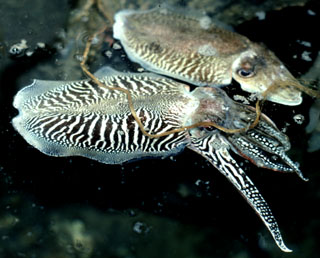
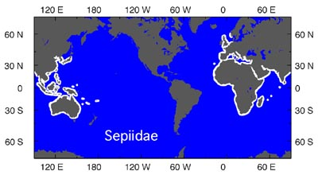

---
aliases:
  - Sepiidae
title: Sepiidae
---

## Phylogeny 

-   « Ancestral Groups  
    -  [Sepioidea](../Sepioidea.md))
    -  [Decapodiformes](../../Decapodiformes.md))
    -  [Coleoidea](../../../Coleoidea.md))
    -  [Cephalopoda](../../../../Cephalopoda.md))
    -  [Mollusca](../../../../../Mollusca.md))
    -  [Bilateria](../../../../../../Bilateria.md))
    -  [Animals](../../../../../../../Animals.md))
    -  [Eukarya](../../../../../../../../Eukarya.md))
    -   [Tree of Life](../../../../../../../../Tree_of_Life.md)

-   ◊ Sibling Groups of  Sepioidea
    -   Sepiidae
    -  [Sepiolida](Sepiolida.md))

-   » Sub-Groups
    -  [Metasepia](Sepiidae/Metasepia.md))
    -  [Sepia](Sepiidae/Sepia.md))
    -  [Sepiella](Sepiidae/Sepiella.md))

# [[Sepiidae]] 

 

This family has 3 genera with more than 100 species.

-   [Metasepia](Sepiidae/Metasepia.md "go to ToL page"))*
-   [Sepia](Sepiidae/Sepia.md "go to ToL page"))*
-   [Sepiella](Sepiidae/Sepiella.md "go to ToL page"))*

## #has_/text_of_/abstract 

> **Sepiidae** is a family of cephalopods in the order Sepiida, 
> comprising the large-bodied species of cuttlefish, including the type genus, Sepia. 
> It includes 116 recognized species according to WoRMS, a number of which need further verification.
>
> A 2023 paper revived several genera and elevated some subgenera to full genus level; 
> this classification scheme has been accepted by WoRMS. 
> As a consequence, multiple species have been split out of genus Sepia, 
> many of them assigned to revived genera.
>
> [Wikipedia](https://en.wikipedia.org/wiki/Sepiidae) 

## Introduction

[Katharina M. Mangold (1922-2003)]() 

The long, oval body is flattened dorsoventrally and bordered all along
by narrow fins that do not connect at the posterior end. The internal
shell (i.e. sepion or cuttlebone) lies dorsally in the body beneath the
skin. The shell is a thick, oval, lanceolate or rhomboidal calcareous
structure containing numerous gas and/or water filled chambers. The
shell enables buoyancy control (Denton and Gilpin-Brown, 1973; Denton,
1974; see Mangold and Bidder, 1989). The eye lenses are covered by a
protective cornea. The ventral arms are generally the longest and
broadest; the left ventral is hectocotylized in males. The arms bear
suckers in 2 to 4 series. The tentacles are completely retractile into
pockets.

#### Diagnosis

A sepioid \...

-   with a cuttlebone.
-   with body somewhat flattened dorsoventrally.

### Characteristics

1.  Arms
    1.  Arms IV flattened ventrally with broad lateral margins extending
        onto head.
    2.  Left arm IV hectocotylized.
2.  Tentacles
    1.  Tentacles, including clubs, completely retractile into pockets
        occupying ventral region of head.
3.  Head
    1.  Eye pore inside of ventral eyelid.
4.  Funnel
    1.  Funnel locking-apparatus short, oval to ear-shaped.
5.  Mantle
    1.  Dorsal mantle margin free from head.
    2.  Mantle adductor absent.
6.  Fins
    1.  Fins narrow (length ca. 4 or more times individual fin width),
        extend almost full length of mantle.
    2.  Attachment of posterior fin-lobes adjacent.
7.  Shell
    1.  Shell a cuttlebone.

### Nomenclature

[A list of all nominal genera and species in the Sepiidae can be found here](http://www.tolweb.org/accessory/Sepiidae_Taxa?acc_id=2321). The
list includes the current status and type species of all genera, and the
current status, type repository and type locality of all species and all
pertinent references.

### Life History

The sepiids are benthic or benthopelagic. The young resemble the adults
when they hatch and are also benthic. The sepiids have large eggs which
are stored in the oviduct. During spawning the eggs are coated with
oviducal gland secretion, then with nidamental gland secretion and the
female deposits them singly on a substrate (see Boletzky, 1983). The
duration of embryonic development depends upon temperature.

The young hatch with a yolk reserve that allows them to survive for a
few days in the absence of food. When food, especially mysids, is
available, the hatchlings begin to attack immediately. Swimming prey are
seized by the tentacular clubs. Benthic prey, such as crabs, are pounced
upon and seized with the arms. While crustacea are the main prey in
younger ***Sepia**,* subadults and adults also eat fishes (Guerra, 1985;
Castro and Guerra, 1989, 11990).

Growth is fast. The conversion rate is 30 to 40% (Pascual, 1978). In
warm waters, animals grow faster and mature at a smaller size than those
living in cold (temperate) waters. The shell or cuttlebone grows by
adding new chambers bounded by lamellae (the septa of the striated zone)
which are visble on the posterior ventral surface of the cuttlebone. In
tropical species, a chamber may be formed daily so that the number of
septa corresponds to the age in days. In temperate water however, it
takes two to three days for a new chamber to be completed. ***Sepia
officinals*** hatches with a cuttlebone of about 10 septa (Boletzky,
1983).

Spawning takes place over a prolonged period of time or throughout the
year. Spawning is intermittent (Boletzky, 1975; Mangold et al., 1993).
The number of mature eggs found in the ovary at any one time is not an
indicator of fecundity. In ***Sepia officinalis*** the total of laid
eggs surpasses by several times the holding capacity of the ovary. The
endocrine and nervous control mechanisms of reproduction, are
complicated (Boucaud-Camou et al., 1994).

Spawning migrations exist in temperate water species but are often
absent in tropical ones. The European cuttlefish, ***Sepia
officinalis*** migrates south-north (Atlantic Ocean, North Sea) or
offshore-inshore (Mediterranean) for spawning. The life-span of sepiids
varies between a few months and 1 to 2 or 3 years according to the adult
size and the environment (temperature, food availability).

### Habitat

The genus ***Sepia*** includes numerous species (more than 100) that
live in tropical, subtropical and temperate waters in all oceans and
seas except the coasts of the Americas (for geographic distribution of
the different species see Adam, 1979; Adam and Rees, 1966; Boletzky et
al., 1996; Nesis, 1982; Roeleveld, 1972).

The two other genera of the family, ***Metasepius*** and ***Sepiella**,*
occur only in South African waters and in the Western Pacific.

The members of this family are benthic and inhabit primarily coastal
waters but are also found on the slope to a depth of about 500 meters.

### Behavior

Hatching occurs at nighttime (Paulij *et al*., 1991). The hatchlings
hide during the day and actively seek prey in the water column during
the night, as do the adults. Laboratory reared hatchlings of ***Sepia
officinalis*** released into the sea are difficult to locate as their
camouflage is very effective (Hanlon and Messenger, 1988; Roper &
Hochberg, 1988). The chromatophoric system, as well as the chromatophore
lobes of the brain, are well developed in hatchlings. In hatchlings
there are 400 to 500 chromatophores per mm2 of skin; in large adults,
ahowever, there are only 35 to 50 per mm2 of skin (Hanlon & Messenger,
1988). During daytime hatchlings bury in the sand or they fix themselves
on a substrate by means of a \"sucker\" formed by the antero-ventral
surface of the mantle and the postero-ventral surface of the large
ventral arms (Boletzky, 1974; Hanlon and Messenger, 1988) as do the
adults.

Wells (1958, 1962) has shown in learning experiments that hatchlings
attack mysids presented behind a glass, although there is no reward.
Prey recognition is innate which gives the hatchlings a
built-in-mechanism that assures attacks on mysids. Also, like the
adults, hatchlings do not follow a prawn that passes out of sight
(Messenger, 1973). There is no evidence of learning in hatchlings and
very young animals. At two months of age there is improvement but
retention is still poor. At four months of age, learning, retention and
hunting behaviour are exhibited (Messenger, 1973, 1977). The vertical
lobe system which is concerned with learning and memory (see Young,
1965) is less developed in hatchlings that it is in adults (Froesch,
1971; Wirz, 1959).

### Fisheries

The sepiids are commercially fished in many areas of the world (e. g.
the Mediterranean and the west coast of Africa).

### Distribution

The Sepiidae have a tropical/temperate distribution. They are mostly
shallow-water animals although they are known from depths of about 600 m
(Lu and Roper, 1991). They have an unusual biogeographic pattern (seen
on the right, in white) in which they are absent from the Americas.
Young, et al. (1998) suggest that by the time the family evolved in the
Old World, the northern migration bridge across the Atlantic was closed
to these warm water species.
){width="400"}

**Figure**. Chart showing the distribution of the Sepiidae (white
areas). Chart modified from Young et al. (1998).\

## Title Illustrations 

------------

Scientific Name ::  Sepia officinalis
Location ::        Banyuls-sur-Mer, France
Copyright ::         © 1996 M. Vecchione

## Confidential Links & Embeds: 

### #is_/same_as :: [Sepiidae](/_Standards/bio/bio~Domain/Eukarya/Animal/Bilateria/Mollusca/Cephalopoda/Coleoidea/Decapodiformes/Sepioidea/Sepiidae.md) 

### #is_/same_as :: [Sepiidae.public](/_public/bio/bio~Domain/Eukarya/Animal/Bilateria/Mollusca/Cephalopoda/Coleoidea/Decapodiformes/Sepioidea/Sepiidae.public.md) 

### #is_/same_as :: [Sepiidae.internal](/_internal/bio/bio~Domain/Eukarya/Animal/Bilateria/Mollusca/Cephalopoda/Coleoidea/Decapodiformes/Sepioidea/Sepiidae.internal.md) 

### #is_/same_as :: [Sepiidae.protect](/_protect/bio/bio~Domain/Eukarya/Animal/Bilateria/Mollusca/Cephalopoda/Coleoidea/Decapodiformes/Sepioidea/Sepiidae.protect.md) 

### #is_/same_as :: [Sepiidae.private](/_private/bio/bio~Domain/Eukarya/Animal/Bilateria/Mollusca/Cephalopoda/Coleoidea/Decapodiformes/Sepioidea/Sepiidae.private.md) 

### #is_/same_as :: [Sepiidae.personal](/_personal/bio/bio~Domain/Eukarya/Animal/Bilateria/Mollusca/Cephalopoda/Coleoidea/Decapodiformes/Sepioidea/Sepiidae.personal.md) 

### #is_/same_as :: [Sepiidae.secret](/_secret/bio/bio~Domain/Eukarya/Animal/Bilateria/Mollusca/Cephalopoda/Coleoidea/Decapodiformes/Sepioidea/Sepiidae.secret.md)

