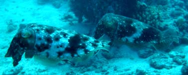

---
aliases:
  - Sepia
title: Sepia
---

## Phylogeny 

-   « Ancestral Groups  
    -  [Sepiidae](../Sepiidae.md))
    -  [Sepioidea](../../Sepioidea.md))
    -  [Decapodiformes](../../../Decapodiformes.md))
    -  [Coleoidea](../../../../Coleoidea.md))
    -  [Cephalopoda](../../../../../Cephalopoda.md))
    -  [Mollusca](../../../../../../Mollusca.md))
    -  [Bilateria](../../../../../../../Bilateria.md))
    -  [Animals](../../../../../../../../Animals.md))
    -  [Eukarya](../../../../../../../../../Eukarya.md))
    -   [Tree of Life](../../../../../../../../../Tree_of_Life.md)

-   ◊ Sibling Groups of  Sepiidae
    -  [Metasepia](Metasepia.md))
    -   Sepia
    -  [Sepiella](Sepiella.md))

-   » Sub-Groups 

# Sepia [Linne, 1758] 

[Katharina M. Mangold (1922-2003) and Richard E. Young]()

This genus contains 95 nominal species.

Containing group:[Sepiidae](../Sepiidae.md))

## Introduction

This genus is probably the most speciose in the Cephalopoda. Because of
the great variability among species, the genus is best defined by the
other two genera; that is, ***Sepia*** is the sepiid that doesn\'t have
the major characters that define ***Metasepia*** and ***Sepiella***.

#### Diagnosis

-   without pore at posterior end of mantle.
-   with cuttlebone length approximately the same as mantle length.

### Characteristics

1.  Funnel
    1.  Funnel component of locking apparatus without pit-like
        depression at midpoint of groove.\
2.  Mantle
    1.  Mantle without posterior gland and pore (see ***Sepiella***).\
3.  Shell
    1.  Cuttlebone length approximately the same as mantle length.
    2.  Cuttlebone usually with a posterior spine between fins.

### References

Adam, W. and W. J. Rees. 1966. A review of the cephalopod family
Sepiidae. Sci. Rep. John Murray Exped. 11: 1-165.

Khromov, D. N., C. C. Lu, A. Guerra, Zh. Dong and S. v. Boletzky. 1998.
A synopsis of Sepiidae outside Australian waters. Smithson. Contr.
Zool., 586: 77-156.

Lu, C. C. A synopsis of Sepiidae in Australian waters. 1998. Smithson.
Contr. Zool., 586:159-190.

## Title Illustrations

)

  ---------------
  Scientific Name ::  Sepia latimanus, Sepia latimanus (2)
  Location ::        off Australia
  Comments          mate guarding, female on left
  Sex ::             f, m (2)
  Copyright ::         © 1996 Mark Norman
  ---------------

## Confidential Links & Embeds: 

### #is_/same_as :: [Sepia](/_Standards/bio/bio~Domain/Eukarya/Animal/Bilateria/Mollusca/Cephalopoda/Coleoidea/Decapodiformes/Sepioidea/Sepiidae/Sepia.md) 

### #is_/same_as :: [Sepia.public](/_public/bio/bio~Domain/Eukarya/Animal/Bilateria/Mollusca/Cephalopoda/Coleoidea/Decapodiformes/Sepioidea/Sepiidae/Sepia.public.md) 

### #is_/same_as :: [Sepia.internal](/_internal/bio/bio~Domain/Eukarya/Animal/Bilateria/Mollusca/Cephalopoda/Coleoidea/Decapodiformes/Sepioidea/Sepiidae/Sepia.internal.md) 

### #is_/same_as :: [Sepia.protect](/_protect/bio/bio~Domain/Eukarya/Animal/Bilateria/Mollusca/Cephalopoda/Coleoidea/Decapodiformes/Sepioidea/Sepiidae/Sepia.protect.md) 

### #is_/same_as :: [Sepia.private](/_private/bio/bio~Domain/Eukarya/Animal/Bilateria/Mollusca/Cephalopoda/Coleoidea/Decapodiformes/Sepioidea/Sepiidae/Sepia.private.md) 

### #is_/same_as :: [Sepia.personal](/_personal/bio/bio~Domain/Eukarya/Animal/Bilateria/Mollusca/Cephalopoda/Coleoidea/Decapodiformes/Sepioidea/Sepiidae/Sepia.personal.md) 

### #is_/same_as :: [Sepia.secret](/_secret/bio/bio~Domain/Eukarya/Animal/Bilateria/Mollusca/Cephalopoda/Coleoidea/Decapodiformes/Sepioidea/Sepiidae/Sepia.secret.md)

