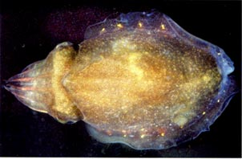
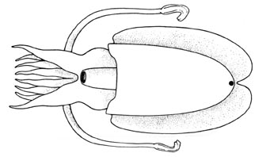

---
aliases:
  - Sepiella
title: Sepiella
---

## Phylogeny 

-   « Ancestral Groups  
    -  [Sepiidae](../Sepiidae.md) 
    -  [Sepioidea](../../Sepioidea.md) 
    -  [Decapodiformes](../../../Decapodiformes.md) 
    -  [Coleoidea](../../../../Coleoidea.md) 
    -  [Cephalopoda](../../../../../Cephalopoda.md) 
    -  [Mollusca](../../../../../../Mollusca.md) 
    -  [Bilateria](../../../../../../../Bilateria.md) 
    -  [Animals](../../../../../../../../Animals.md) 
    -  [Eukarya](../../../../../../../../../Eukarya.md) 
    -   [Tree of Life](../../../../../../../../../Tree_of_Life.md)

-   ◊ Sibling Groups of  Sepiidae
    -  [Metasepia](Metasepia.md) 
    -  [Sepia](Sepia.md) 
    -   Sepiella

-   » Sub-Groups 

# Sepiella [Gray, 1849] 

[Katharina M. Mangold (1922-2003) and Richard E. Young]()

 

This genus contains the following six species:

-   *Sepiella ornata*
-   *Sepiella cyanea*
-   *Sepiella inermis*
-   *Sepiella japonica*
-   *Sepiella ocellata*
-   *Sepiella weberi*

Containing group:[Sepiidae](../Sepiidae.md) 

## Introduction

The most distinctive feature of the genus is the presence of a large
subcutaneous gland that opens by a pore at the posterior end of the
mantle between the fins.

#### Diagnosis

A sepiid \...

-   with a pore posteriorly between the fins.

### Characteristics

1.  Funnel
    1.  Funnel component of locking apparatus with pit-like depression
        at midpoint of groove.\
2.  Mantle
    1.  Duct from large gland beneath skin on posterodorsal mantle opens
        posteriorly between fins.
3.  Shell
    1.  Shell length approximately equal to mantle length.
    2.  Cuttlebone with posterior spine between fins absent.

#### Comments

The function of the secretion from the posterior gland is unknown.

### References

Adam, W. and W. J. Rees. 1966. A review of the cephalopod family
Sepiidae. Sci. Rep. John Murray Exped. 11: 1-165.

Khromov, D. N., C. C. Lu, A. Guerra, Zh. Dong and S. v. Boletzky. 1998.
A synopsis of Sepiidae outside Australian waters. Smithson. Contr.
Zool., 586: 77-156.

Lu, C. C. A synopsis of Sepiidae in Australian waters. 1998. Smithson.
Contr. Zool., 586:159-190.

Roeleveld, M.A. 1972. A Review of the Sepiidae (Cephalopoda) of Southern
Africa. Annals of the South African Museum, 59(10):193-313.

## Title Illustrations

 

  ----------
  scientific_name ::     Sepiella inermis
  location ::           Singapore
  specimen_condition ::  Live Specimen
  View                 Dorsal
  Size                 130 mm ML
  copyright ::            © 2004 Mark Norman
  ----------
 

  ---------------------------------------------
  scientific_name ::  Sepiella sp.
  location ::        South African waters
  Reference         Roeleveld, M.A. 1972. A Review of the Sepiidae (Cephalopoda) of Southern Africa. Annals of the South African Museum, 59(10):193-313.
  View              Ventral
  copyright ::         © 2004 Martina Roeleveld
  ---------------------------------------------

## Confidential Links & Embeds: 

### #is_/same_as :: [[/_Standards/bio/bio~Domain/Eukarya/Animal/Bilateria/Mollusca/Cephalopoda/Coleoidea/Decapodiformes/Sepioidea/Sepiidae/Sepiella|Sepiella]] 

### #is_/same_as :: [[/_public/bio/bio~Domain/Eukarya/Animal/Bilateria/Mollusca/Cephalopoda/Coleoidea/Decapodiformes/Sepioidea/Sepiidae/Sepiella.public|Sepiella.public]] 

### #is_/same_as :: [[/_internal/bio/bio~Domain/Eukarya/Animal/Bilateria/Mollusca/Cephalopoda/Coleoidea/Decapodiformes/Sepioidea/Sepiidae/Sepiella.internal|Sepiella.internal]] 

### #is_/same_as :: [[/_protect/bio/bio~Domain/Eukarya/Animal/Bilateria/Mollusca/Cephalopoda/Coleoidea/Decapodiformes/Sepioidea/Sepiidae/Sepiella.protect|Sepiella.protect]] 

### #is_/same_as :: [[/_private/bio/bio~Domain/Eukarya/Animal/Bilateria/Mollusca/Cephalopoda/Coleoidea/Decapodiformes/Sepioidea/Sepiidae/Sepiella.private|Sepiella.private]] 

### #is_/same_as :: [[/_personal/bio/bio~Domain/Eukarya/Animal/Bilateria/Mollusca/Cephalopoda/Coleoidea/Decapodiformes/Sepioidea/Sepiidae/Sepiella.personal|Sepiella.personal]] 

### #is_/same_as :: [[/_secret/bio/bio~Domain/Eukarya/Animal/Bilateria/Mollusca/Cephalopoda/Coleoidea/Decapodiformes/Sepioidea/Sepiidae/Sepiella.secret|Sepiella.secret]] 

