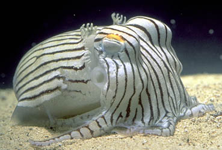
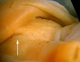

## Phylogeny 

-   « Ancestral Groups  
    -  [Sepiolida](../Sepiolida.md))
    -  [Sepioidea](../../Sepioidea.md))
    -  [Decapodiformes](../../../Decapodiformes.md))
    -  [Coleoidea](../../../../Coleoidea.md))
    -  [Cephalopoda](../../../../../Cephalopoda.md))
    -  [Mollusca](../../../../../../Mollusca.md))
    -  [Bilateria](../../../../../../../Bilateria.md))
    -  [Animals](../../../../../../../../Animals.md))
    -  [Eukarya](../../../../../../../../../Eukarya.md))
    -   [Tree of Life](../../../../../../../../../Tree_of_Life.md)

-   ◊ Sibling Groups of  Sepiolida
    -  [Sepiolidae](Sepiolidae.md))
    -   Sepiadariidae

-   » Sub-Groups 

# Sepiadariidae [Naef 1912] 

[Richard E. Young]()

)

This family has two genera with the following seven species:

-   *Sepioloidea pacifica*
-   *Sepioloidea lineolata*
-   *Sepiadarium nipponianum*
-   *Sepiadarium kochii*
-   *Sepiadarium auritum*
-   *Sepiadarium gracilis*
-   *Sepiadarium austrinum*

Containing group:[Sepiolida](../Sepiolida.md))

## Introduction

Species of the Sepiadariidae are short (2 - 4 cm ML), broad cephalopods
with a rounded posterior mantle. They are benthic, may have striking
fixed color patterns, and inhabit shallow waters of tropical and
subtropical seas of the Indo-West Pacific.\
\

#### Diagnosis

A Sepiolida \...

-   with funnel locking-apparatus fused or with two depressions.

### Characteristics

1.  Arms
    1.  Left arm IV hectocotylized.\
2.  Funnel
    1.  Funnel locking-apparatus with two depressions
        *(**Sepioloidea**)* or fused *(**Sepiadarium**).*

       ){width="157"}
        **Figure**. **Left** - Ventral view of the funnel
        locking-apparatus of ***Sepioloidea pacifica***, 12 mm ML, 43°S,
        167°E. **Right** - Ventral view of the funnel base with the
        mantle  reflected backward showing the strong fusion of the
        funnel locking-apparatus (arrow) of ***Sepiadarium*** sp.
        Photographs by R. Young.

3.  Mantle
    1.  Dorsal margin fused to head.\
4.  Shell
    1.  Shell absent.

### Nomenclature

[A list of all nominal genera and species in the Sepiadariidae can be found here](http://www.tolweb.org/accessory/Sepiadariidae_Taxa?acc_id=2325).
The list includes the current status and type species of all genera, and
the current status, type repository and type locality of all species and
all pertinent references.

### References

Lu, C. C., A. Guerra, F. Palumbo and W. C. Summers. 1992. Order
Sepioidea Naef, 1916. In: Sweeney, M. J., C. F. E. Roper, K. M. Mangold,
M. R. Clarke and S. V. Boletzky (eds.). \"Larval\" and juvenile
cephalopods: a manual for their identification. Smithson. Contr. Zool.
No. 513: 1-282.

## Title Illustrations

)

  -----------
  Scientific Name ::  Sepioloidea lineolata
  Location ::        off south Australia
  Copyright ::         © 1998 Mark Norman
  -----------
)

  -----------
  Scientific Name ::  Sepiadarium austrinum
  Location ::        off south Australia
  -----------

## Confidential Links & Embeds: 

### #is_/same_as :: [Sepiadariidae](/_Standards/bio/bio~Domain/Eukarya/Animal/Bilateria/Mollusca/Cephalopoda/Coleoidea/Decapodiformes/Sepioidea/Sepiolida/Sepiadariidae.md) 

### #is_/same_as :: [Sepiadariidae.public](/_public/bio/bio~Domain/Eukarya/Animal/Bilateria/Mollusca/Cephalopoda/Coleoidea/Decapodiformes/Sepioidea/Sepiolida/Sepiadariidae.public.md) 

### #is_/same_as :: [Sepiadariidae.internal](/_internal/bio/bio~Domain/Eukarya/Animal/Bilateria/Mollusca/Cephalopoda/Coleoidea/Decapodiformes/Sepioidea/Sepiolida/Sepiadariidae.internal.md) 

### #is_/same_as :: [Sepiadariidae.protect](/_protect/bio/bio~Domain/Eukarya/Animal/Bilateria/Mollusca/Cephalopoda/Coleoidea/Decapodiformes/Sepioidea/Sepiolida/Sepiadariidae.protect.md) 

### #is_/same_as :: [Sepiadariidae.private](/_private/bio/bio~Domain/Eukarya/Animal/Bilateria/Mollusca/Cephalopoda/Coleoidea/Decapodiformes/Sepioidea/Sepiolida/Sepiadariidae.private.md) 

### #is_/same_as :: [Sepiadariidae.personal](/_personal/bio/bio~Domain/Eukarya/Animal/Bilateria/Mollusca/Cephalopoda/Coleoidea/Decapodiformes/Sepioidea/Sepiolida/Sepiadariidae.personal.md) 

### #is_/same_as :: [Sepiadariidae.secret](/_secret/bio/bio~Domain/Eukarya/Animal/Bilateria/Mollusca/Cephalopoda/Coleoidea/Decapodiformes/Sepioidea/Sepiolida/Sepiadariidae.secret.md)

