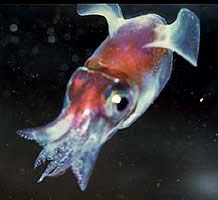

---
aliases:
  - Sepiolidae
title: Sepiolidae
---

## Phylogeny 

-   « Ancestral Groups  
    -  [Sepiolida](../Sepiolida.md) 
    -  [Sepioidea](../../Sepioidea.md) 
    -  [Decapodiformes](../../../Decapodiformes.md) 
    -  [Coleoidea](../../../../Coleoidea.md) 
    -  [Cephalopoda](../../../../../Cephalopoda.md) 
    -  [Mollusca](../../../../../../Mollusca.md) 
    -  [Bilateria](../../../../../../../Bilateria.md) 
    -  [Animals](../../../../../../../../Animals.md) 
    -  [Eukarya](../../../../../../../../../Eukarya.md) 
    -   [Tree of Life](../../../../../../../../../Tree_of_Life.md)

-   ◊ Sibling Groups of  Sepiolida
    -   Sepiolidae
    -  [Sepiadariidae](Sepiadariidae.md) 

-   » Sub-Groups
    -   [Choneteuthis tongaensis](Choneteuthis_tongaensis)
    -   [Rossiinae](Rossiinae)
    -   [Heteroteuthinae](Heteroteuthinae)
    -   [New Genus](New_Genus)
    -   [Sepiolinae](Sepiolinae)

# Sepiolidae [Leach 1817] 

[Richard E. Young]()

This family is divided into three subfamilies and 13 genera and contains
about 55 species.

Containing group:[Sepiolida](../Sepiolida.md) 

## Introduction

Sepiolids are small (ca. 1-10 cm ML), broad cephalopods with a rounded
posterior mantle and ear-like fins. Species of the Rossinae and
Sepiolinae are benthic while those of the Heteroteuthinae are pelagic.
The most distinctive group is the Heteroteuthinae in which the ventral
mantle margin extends beneath the head and the photophores are fused
into a single large organ. All sepiolids, where known, lay large benthic
eggs and the young hatch out at an advanced stage of development and
their lenght may be one quarter of that of the adult female (Naef,
1921-23).

#### Diagnosis

A Sepiolida \...

-   with funnel locking-apparatus with a single depression.

### Characteristics

1.  Arms
    1.  Any or all of the dorsal six arms may be hectocotylized.\
        \
2.  Funnel
    1.  Funnel locking-apparatus often with an elongate-oval groove but
        considerable variability may exist.\
        \
3.  Mantle
    1.  Dorsal margin fused to or free from head.\
        \
4.  Shell
    1.  Shell a thin or rudimentary gladius or absent.

#### Comments

The following table compares the three subfamilies.

  -------- ------ ------
                        Mantle      Head with   Mantle with Extensive web  Lateral
                        fused to    nuchal      ventral     between arms   funnel
                        head        cartilage   shield      I-III          adductor
                                                                           muscles 

  ***Choneteuthis***    Yes         Yes         Yes\        No             Yes 

  Heteroteuthinae       Yes/No      Yes/No      Yes         Yes            Yes 

  NewSubFamily          Yes\        No\         No\         Moderate\      No\

  Rossinae              No          Yes         No          No             Yes 

  Sepiolinae            Yes         No          No          Moderarte/No   Yes 
  -------- ------ ------

The NewSubFamily does not fit well in the Order Sepioidea as two basic
sepioid characters (eyes with secondary eyelids; funnel with lateral
adductor muscles) are missing. Our first impression was that the
NewSubFamily was more closely related to the Myopsida. However, many
features commonly associated with the Sepioidea (absence of an
interstellate connective, gills apparently without a branchial canal)
and the Sepiolidae (globular sucker rings, general shape, fusion of the
head and mantle in the nuchal region) convince us that its closest
relationships belong within the Sepiolidae. The most convincing
character is the presence of a ventral mantle adductor muscle which is
common to members of the Sepiolida. The ventral mantle adductor in
NewSubFamily is very weak and barely recognizable. This condition has
led us to suspect that the absence of the two basic Sepioid
characteristics listed above is due to loss. At present, the
phylogenetic position of the NewSubFamily is guesswork since the
phylogeny of the Sepiolida is in flux.\

 

### Nomenclature

[A list of all nominal genera and species in the Sepiolidae can be found here](http://www.tolweb.org/accessory/Sepiolidae_Taxa?acc_id=2335). The
list includes the current status and type species of all genera, and the
current status, type repository and type locality of all species and all
pertinent references.

### Discussion of Phylogenetic Relationships

Naef (1921-3) divided the Sepiolidae into three subfamilies and placed
***Sepiolina*** in the Sepiolinae. We place it in the Heteroteuthinae.
As Naef (1921-23) recognized, characteristics of this genus place it
right between the two subfamilies. ***Choneteuthis*** which is presently
not placed in any subfamily shows strong similarities to ***Sepiolina***
especially in having a large visceral photophore and ventral shield and
lacking a tentacular organ. The latter feature is  primarily responsible
for separating ***Sepiolina*** from the remainder of the
Heteroteuthinae.   ***Choneteuthis*** further confuses the boundries of
the Heteroteuthinae.\

A cladistic analysis has not been made on this family but one is badly
needed as much disagreement exists over classification. Clarke (1988)
includes this family and the Idiosepiidae in the Order Sepiolida.
Fioroni (1981) includes this family in the Order Sepioloidea and
includes the Idiosepiidae as a subfamily of the Sepiolidae.

### References

Clarke, M. R. 1988. Evolution of recent cephalopods \-- A brief review.
P. 331-313. In: Clarke, M. R. and E. R. Trueman (Eds.). The Mollusca.
Vol. 12. Paleontology and Neontology of Cephalopods. Academic Press, New
York. 355pp.

Fioroni, P. 1981. Die Sonderstellund der Sepioliden, ein Vergleich der
Ordnungen der rezenten Cephalopoden. Zool. Jahrb., 108: 178-228.

Lu, C. C., A. Guerra, F. Palumbo and W. C. Summers. 1992. Order
Sepioidea Naef, 1916. In: Sweeney, M. J., C. F. E. Roper, K. M. Mangold,
M. R. Clarke and S. V. Boletzky (eds.). \"Larval\" and juvenile
cephalopods: a manual for their identification. Smithson. Contr. Zool.
No. 513: 1-282.

Naef, A. 1921/23. Cephalopoda. Fauna e Flora del Golfo di Napoli.
Monograph, no. 35. English translation: A. Mercado (1972). Israel
Program for Scientific Translations Ltd., IPST Cat. No. 5110/1,2.

Nesis, K. N. 1982. Abridged dey to the cephalopod mollusks of the
world\'s ocean. 385+ii pp. Light and Food Industry Publishing House,
Moscow. (In Russian.). Translated into English by B. S. Levitov, ed. by
L. A. Burgess (1987), Cephalopods of the world. T. F. H. Publications,
Neptune City, NJ, 351pp.

## Title Illustrations

)

  --------------------------------------------------------------------------------
  Scientific Name ::     Heteroteuthis hawaiiensis
  Location ::           off Hawaii
  Specimen Condition   Live Specimen
  Copyright ::            © 1996 [Richard E. Young](http://www.soest.hawaii.edu/%7Eryoung/rey.html) 
 
  --------------------------------------------------------------------------------

## Confidential Links & Embeds: 

### #is_/same_as :: [Sepiolidae](/_Standards/bio/bio~Domain/Eukarya/Animal/Bilateria/Mollusca/Cephalopoda/Coleoidea/Decapodiformes/Sepioidea/Sepiolida/Sepiolidae.md) 

### #is_/same_as :: [Sepiolidae.public](/_public/bio/bio~Domain/Eukarya/Animal/Bilateria/Mollusca/Cephalopoda/Coleoidea/Decapodiformes/Sepioidea/Sepiolida/Sepiolidae.public.md) 

### #is_/same_as :: [Sepiolidae.internal](/_internal/bio/bio~Domain/Eukarya/Animal/Bilateria/Mollusca/Cephalopoda/Coleoidea/Decapodiformes/Sepioidea/Sepiolida/Sepiolidae.internal.md) 

### #is_/same_as :: [Sepiolidae.protect](/_protect/bio/bio~Domain/Eukarya/Animal/Bilateria/Mollusca/Cephalopoda/Coleoidea/Decapodiformes/Sepioidea/Sepiolida/Sepiolidae.protect.md) 

### #is_/same_as :: [Sepiolidae.private](/_private/bio/bio~Domain/Eukarya/Animal/Bilateria/Mollusca/Cephalopoda/Coleoidea/Decapodiformes/Sepioidea/Sepiolida/Sepiolidae.private.md) 

### #is_/same_as :: [Sepiolidae.personal](/_personal/bio/bio~Domain/Eukarya/Animal/Bilateria/Mollusca/Cephalopoda/Coleoidea/Decapodiformes/Sepioidea/Sepiolida/Sepiolidae.personal.md) 

### #is_/same_as :: [Sepiolidae.secret](/_secret/bio/bio~Domain/Eukarya/Animal/Bilateria/Mollusca/Cephalopoda/Coleoidea/Decapodiformes/Sepioidea/Sepiolida/Sepiolidae.secret.md)

