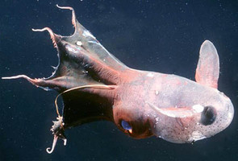
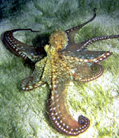
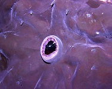
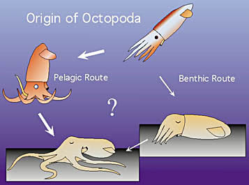

---
aliases:
  - Octopodiformes
title: Octopodiformes
---

## Phylogeny 

-   « Ancestral Groups  
    -  [Coleoidea](../Coleoidea.md) 
    -  [Cephalopoda](../../Cephalopoda.md) 
    -  [Mollusca](../../../Mollusca.md) 
    -  [Bilateria](../../../../Bilateria.md) 
    -  [Animals](../../../../../Animals.md) 
    -  [Eukarya](../../../../../../Eukarya.md) 
    -   [Tree of Life](../../../../../../Tree_of_Life.md)

-   ◊ Sibling Groups of  Coleoidea
    -  [Decapodiformes](Decapodiformes.md) 
    -   Octopodiformes

-   » Sub-Groups
    -   [Octopod](Octopodiformes/Octopod.md)
    -   [Vampyroteuthis         infernalis](Vampyroteuthis_infernalis)

# [[Octopodiformes]] 

Vampire Squid and Octopods 

  
 

The Octopodiformes contains two orders.

-   *[Octopod](Octopodiformes/Octopod.md "go to ToL page")*[ Leach,1818]
-   *[Vampyromorpha](Vampyroteuthis_infernalis)*[Robson, 1929]

## #has_/text_of_/abstract 

> **Octopodiformes** is a superorder of the subclass Coleoidea, 
> comprising the octopuses and the vampire squid. 
> 
> All living members of Octopodiformes have eight arms, either lacking the two tentacles of squid (as is the case in octopuses) or modifying the tentacles into thin filaments (as in vampire squid). Octopodiformes is often considered the crown group of octopuses and vampire squids, including all descendants of their common ancestor. Some authors use the term Vampyropoda for the same general category, though others use "Vampyropoda" to refer to the total group (all cephalopods closer to octopods than to true squid). Another term is Octobrachia, referring to cephalopods without prominent tentacles.
>
> It is considered one of the two extant groups of the Neocoleoidea.
>
> Pohlsepia, originally described as earliest octopod is considered as dubious for this group in later study. Syllipsimopodi, a squid-like cephalopod from the Mississippian-age Bear Gulch Lagerstätte of Montana, was originally described as the oldest unambiguous vampyropod. However, further analyses might be necessary to unequivocally assign this cephalopod to Vampyropoda.
>
> Syllipsimopodi has a combination of squid-like features (like 10 arms) and octopod-like features (like biserial suckers and a simplified internal shell).
>
> [Wikipedia](https://en.wikipedia.org/wiki/Octopodiformes) 

## Introduction

[Richard E. Young and Michael Vecchione]() 

The Octopodiformes consists of the Octopoda which contains over 200
species and the Vampyromorpha which contains a single species. The
latter is a phylogenetic relict.

### Characteristics

1.  Arms
    1.  Arms II modified or absent.
    2.  Arms IV unmodified.
    3.  Suckers radially symmetrical.
    4.  Horny rings in suckers absent.
    5.  Arms IV united by web (absent in some argonautoids).\
2.  Buccal crown
    1.  Buccal crown absent.\

       )\
        **Figure**. Oral view of the region surrounding the buccal mass
        of ***Vampyroteuthis infernalis*** showing the absence of a
        buccal crown. Photograph by R. Young.

3.  Head
    1.  Outer statocyst capsule present.
    2.  Superior buccal lobes adjacent (fused at edges) or completely
        fused to posterior buccal lobes.
    3.  Inferior frontal lobe system of brain present or insepient.\
4.  Photosensitive vesicles
    1.  Lie outside of cephalic cartilage: dorsal to funnel
        (Vampyromorpha) or on stellate ganglia in mantle cavity
        (Octopoda).\
5.  Fins
    1.  When present, with cartilagenous axial support (only in juvenile
        fin of ***Vampyroteuthis**).*\
6.  Viscera
    1.  Nidamental glands absent.
    2.  Crop usually present.
    3.  Oviducal glands radially symmetrical.
    4.  Digestive gland duct appendages lie \"outside\" nephridial
        coelom.
    5.  Nephridial coeloms separate.

### Origin of the Octopoda
 

Drawing modified from Young, Vecchione and Donovan, 1999.

Naef (1923) felt that the origin of the Octopoda would \"forever be
obscure.\" But Naef was unaware of the significance of
***Vampyroteuthis*** which was believed to be a cirrate octopod at the
time. We now know that the Vampyromorpha is the sister group of the
Octopoda and that ***Vampyroteuthis*** provides telling clues to the
origin of the octopods. Young, *et al.* (1999) suggest two possible
methods for this origin as illustrated here. In one (benthic route) the
pelagic ancestor becomes benthic in a horizontal attitude (similar to
the sepiolids today) and subsequently the arms and mouth rotate under
the head. In the other alternative (pelagic route) the pelagic ancestor
develops an \"oral\" orientation (i.e. laterally spread arms) here
pictured with the oral end downward (as in octopods today) and
subsequently becomes benthic with the oral end down.

Evidence for the latter route is found in the structure of the brain.
Octopods have a series of lobes in the brain, the inferior frontal lobe
system, that is derived from the posterior buccal lobe. These lobes
process complex chemotactile information from the arms.
***Vampyroteuthis*** has an \"insipient\" inferior frontal lobe system
(J. Young, 1977). This bathypelagic animal apparently has a relatively
advanced system for processing chemotactile information from the arms,
one that surpasses that of shallow-living benthic decapods. Apparently
***Vampyroteuthis*** uses its arms in an unusual manner. Young, *et al.*
(1999) suggest that like its immediate ancestor (a \"pre-octopod\"),
associates with pelagic jellyfish or tunicates and uses its arms and
suckers to adhere to and/or explore the surfaces of these gelatinous
animals. That is, it has an oral orientation for contact with surfaces.
The pre-octopod, then was pre-adapted for settling on the ocean floor in
an oral-end down configuration. This oral orientation enabled octopods
to become the effective crawling animals that most are today. However
the manner in which ***Vampyroteuthis*** actually uses its arms and its
possible association with gelatinous animals has yet to be demonstrated.

Young, *et al.* (1999) argue, therefore, that the benthic habitat was
the primitive one within the Octopoda and that pelagic species, which
comprise nine of the eleven octopod families, are secondarily pelagic.
In the Cirrates, these authors point out the compaction of viscera, loss
of jet propulsion, presence of a fully-formed inferior frontal lobe
system, single oviduct, fusion of the head and mantle and reduction of
the shell as evidence of a quasi-benthic ancestry. In the Incirrates,
they point to the presence of corneas (or their remnants), absence of
shell, fins and cirri, fully formed inferior frontal lobe system,
probably stalked chorions and brooding as evidence of a fully-benthic
ancestry.

### Discussion of Phylogenetic Relationships

J. Z. Young (1989), on the basis of anatomical differences, removed the
Cirrata from its traditional place in the Octopoda and put it in its own
order, Cirroctopodida. Young and Vecchione (1996), however, using
cladistic analyses demonstrated that the inclusion of the Cirrata and
Incirrata in the Octopoda is justified. That is, the order Octopoda,
including the suborders Cirrata and Incirrata is a monophyletic group.
This conclusion was more recently strengthened by the inclusion of
additional characters in the analyses (Young & Vecchione, 2002).

### Nomenclature

A variety of names have been proposed for this group (e.g., Octobrachia,
Fiorini, 1981; Octopodiformes, Berthold and Engeser, 1987;
Vampyromorphoidea, Engeser and Bandel, 1988; Vampyropoda, Boletzky,
1992). Young, et al.(1999) concluded that Octopodiformes was the most
appropriate.

## Title Illustrations

-------------------------------

scientific_name ::  Vampyroteuthis infernalis
location ::        San Clemente Basin off Southern California
Comments          Photographed in plankton kreisel aboard the R/V NEW HORIZON. Captured at 700 m depth.
Size              25 cm total length
copyright ::         © 1999 Brad Seibel

------------- 
 
scientific_name ::  Octopus cyanea
location ::        Great Barrier Reef, Australia
copyright ::         © 1999 Mark Norman

## Confidential Links & Embeds: 

### #is_/same_as :: [[/_Standards/bio/bio~Domain/Eukarya/Animal/Bilateria/Mollusca/Cephalopoda/Coleoidea/Octopodiformes|Octopodiformes]] 

### #is_/same_as :: [[/_public/bio/bio~Domain/Eukarya/Animal/Bilateria/Mollusca/Cephalopoda/Coleoidea/Octopodiformes.public|Octopodiformes.public]] 

### #is_/same_as :: [[/_internal/bio/bio~Domain/Eukarya/Animal/Bilateria/Mollusca/Cephalopoda/Coleoidea/Octopodiformes.internal|Octopodiformes.internal]] 

### #is_/same_as :: [[/_protect/bio/bio~Domain/Eukarya/Animal/Bilateria/Mollusca/Cephalopoda/Coleoidea/Octopodiformes.protect|Octopodiformes.protect]] 

### #is_/same_as :: [[/_private/bio/bio~Domain/Eukarya/Animal/Bilateria/Mollusca/Cephalopoda/Coleoidea/Octopodiformes.private|Octopodiformes.private]] 

### #is_/same_as :: [[/_personal/bio/bio~Domain/Eukarya/Animal/Bilateria/Mollusca/Cephalopoda/Coleoidea/Octopodiformes.personal|Octopodiformes.personal]] 

### #is_/same_as :: [[/_secret/bio/bio~Domain/Eukarya/Animal/Bilateria/Mollusca/Cephalopoda/Coleoidea/Octopodiformes.secret|Octopodiformes.secret]] 

