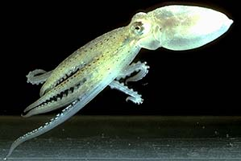

---
aliases:
- Achtfüßer
- ahtapot
- Astoņkāji
- Aštuonkojai
- Bạch tuộc
- Chiuⁿ-hî
- chobotnice
- Dogiga
- Grita
- Gurita
- Heştpê
- Hobotnica
- hobotnice
- Kaheksahaarmelised
- Kolkrabbi
- Kraaken
- Kraken
- Kugita
- Kuita
- Miilsaddeetoo
- Morgazh
- Mymba ijyva poapy
- Nawita
- Nipitchaq
- ochtapas
- Octopod
- Octopoda
- octopus
- Octopws
- Oktapodi
- Oktopieduloj
- Olagarro
- Osminoglar
- Osminoqlar
- Osmonohy
- Ottearmede blæksprutter
- ośmiornice
- Pieuvre
- polbo
- polp
- Polpo
- Polvo
- posena
- Prupu
- Pugita
- Pulpu
- Purpu
- Pweza
- Pyèv
- Seekat
- Solita
- sotong gurita
- tursaat
- wheke
- Åttaarmade bläckfiskar
- åttearmete blekkspruter
- Łóóʼ bigaan tseebíí
- χταπόδι
- Асткъахыг
- БархӀкогберг
- васьміногі
- восьминіг
- октопод
- октоподи
- Осьминогдор
- осьминоги
- Сегізаяқтылар
- хоботница
- Ութոտանիներ
- תמנונאים
- آکٹوپس
- أخطبوطيات
- اخطبوط
- اشکپوس
- اوْسمینوقلار
- رَندُکھ
- زايز
- هشتپا
- अक्टोपस
- अष्टपाद
- अष्टबाहु
- অক্টোপাস
- ਆਕਟੋਪਸ
- ଅକ୍ଟୋପସ
- பேய்க்கணவாய்
- ఆక్టోపస్
- ಆಕ್ಟೊಪಸ್
- നീരാളി
- หมึกสาย
- ཆུ་སྲིན་ལག་བརྒྱད།
- ရေဘဝဲ
- ᎠᏓᏢᎢᎯ
- ᱚᱠᱴᱚᱯᱚᱥ
- ẹja ẹlẹsẹ mẹjọ
- タコ目
- 八爪魚
- 八腕目
- 章魚
- 章魚目
- 章鱼目
- 문어목
has_id_wikidata: Q40152
title: Octopoda
uses:
- '[[_Standards/WikiData/WD~mimicry,192627]]'
- '[[_Standards/WikiData/WD~physical_object,223557]]'
- '[[_Standards/WikiData/WD~chromatophore,504699]]'
- '[[_Standards/WikiData/WD~memory,492]]'
- '[[_Standards/WikiData/WD~fine_motor_skill,46627]]'
parent_taxon: '[[_Standards/WikiData/WD~Octopodiformes,340867]]'
different_from:
- '[[_Standards/WikiData/WD~Octopus,611843]]'
- '[[_Standards/WikiData/WD~occiput,3321315]]'
- '[[_Standards/WikiData/WD~octopus_as_food,17118835]]'
described_by_source:
- '[[_Standards/WikiData/WD~Encyclopædia_Britannica_11th_edition,867541]]'
- '[[_Standards/WikiData/WD~Gujin_Tushu_Jicheng,1768721]]'
- "[[_Standards/WikiData/WD~Otto's_encyclopedia,2041543]]"
- '[[_Standards/WikiData/WD~Armenian_Soviet_Encyclopedia,2657718]]'
- '[[_Standards/WikiData/WD~New_Encyclopedic_Dictionary,19190511]]'
this_taxon_is_source_of: '[[_Standards/WikiData/WD~octopus_as_food,17118835]]'
has_part_s_: '[[_Standards/WikiData/WD~brain,1073]]'
instance_of: '[[_Standards/WikiData/WD~taxon,16521]]'
litter_size: 80000
taxon_rank: '[[_Standards/WikiData/WD~order,36602]]'
ITIS_TSN: 82589
image: http://commons.wikimedia.org/wiki/Special:FilePath/Octopus2.jpg
Dewey_Decimal_Classification: 564.56
Krugosvet_article_archived_: nauka_i_tehnika/biologiya/OSMINOGI.html
NBN_System_Key: NHMSYS0021055250
Commons_category: Octopoda
taxon_name: Octopoda
taxon_common_name:
- Achtfüßer
- åttearmete blekkspruter
- hobotnice
start_time: -323200000-01-01T00:00:00Z
dv_has_:
  name_:
    af: Seekat
    ami: Solita
    an: Octopoda
    ar: أخطبوطيات
    ary: زايز
    arz: اخطبوط
    ast: Octopoda
    az: Osminoqlar
    azb: اوْسمینوقلار
    ban: Grita
    bcl: Kugita
    be: васьміногі
    be_tarask: васьміногі
    bg: октоподи
    bi: Nawita
    bn: অক্টোপাস
    bo: ཆུ་སྲིན་ལག་བརྒྱད།
    br: Morgazh
    bs: Hobotnica
    ca: polp
    ce: БархӀкогберг
    ceb: Kugita
    chr: ᎠᏓᏢᎢᎯ
    cs: chobotnice
    cy: Octopws
    da: Ottearmede blæksprutter
    de: Kraken
    el: χταπόδι
    en: Octopoda
    en_gb: Octopoda
    eo: Oktopieduloj
    es: Octopoda
    et: Kaheksahaarmelised
    eu: Olagarro
    ext: Octopoda
    fa: هشتپا
    fi: tursaat
    fj: Kuita
    fr: Octopoda
    frr: Kraaken
    ga: ochtapas
    gl: polbo
    gn: Mymba ijyva poapy
    he: תמנונאים
    hi: अष्टबाहु
    hr: Hobotnica
    ht: Pyèv
    hu: Octopoda
    hy: Ութոտանիներ
    ia: Octopoda
    id: Gurita
    ie: Octopoda
    ik: Nipitchaq
    io: Polpo
    is: Kolkrabbi
    it: Octopoda
    ja: タコ目
    jv: Gurita
    kk: Сегізаяқтылар
    kn: ಆಕ್ಟೊಪಸ್
    ko: 문어목
    ks: رَندُکھ
    ku: Heştpê
    ky: Осьминогдор
    la: Octopus
    lfn: Polpo
    lt: Aštuonkojai
    lv: Astoņkāji
    lzh: 章魚
    mi: wheke
    mk: октопод
    ml: നീരാളി
    mr: अष्टपाद
    ms: sotong gurita
    mul: Octopoda
    my: ရေဘဝဲ
    mzn: اشکپوس
    na: Dogiga
    nan: Chiuⁿ-hî
    nb: åttearmete blekkspruter
    nds: Kraken
    ne: अक्टोपस
    nl: Octopoda
    nrm: Pieuvre
    nv: Łóóʼ bigaan tseebíí
    oc: Octopoda
    om: Miilsaddeetoo
    or: ଅକ୍ଟୋପସ
    os: Асткъахыг
    pa: ਆਕਟੋਪਸ
    pl: ośmiornice
    pt: Polvo
    pt_br: Octopoda
    qu: Pulpu
    ro: Octopoda
    ru: осьминоги
    sat: ᱚᱠᱴᱚᱯᱚᱥ
    sc: Prupu
    scn: Purpu
    sco: octopus
    sh: Hobotnica
    sk: Osmonohy
    sl: hobotnice
    sq: Oktapodi
    sr: хоботница
    su: Gurita
    sv: Åttaarmade bläckfiskar
    sw: Pweza
    ta: பேய்க்கணவாய்
    te: ఆక్టోపస్
    th: หมึกสาย
    tl: Pugita
    tr: ahtapot
    tw: posena
    uk: восьминіг
    ur: آکٹوپس
    uz: Osminoglar
    vi: Bạch tuộc
    vo: Octopoda
    war: Kugita
    wuu: 八腕目
    yo: ẹja ẹlẹsẹ mẹjọ
    yue: 八爪魚
    zh: 章魚目
    zh_cn: 章魚目
    zh_hans: 章鱼目
    zh_hant: 章魚目
    zh_hk: 章魚目
Unicode_character: 🐙
---
# [[Octopod]] 🐙 

Octopods or devilfishes 

#is_/same_as :: [[../../../../../../../../../WikiData/WD~Octopoda,40152|WD~Octopoda,40152]] 

 

The Octopoda contains about 200 species placed in two very different
groups.

## #has_/text_of_/abstract 

> An octopus (pl.: octopuses or octopodes) is a soft-bodied, eight-limbed mollusc of the order **Octopoda** (, ok-TOP-ə-də). The order consists of some 300 species and is grouped within the class Cephalopoda with squids, cuttlefish, and nautiloids. Like other cephalopods, an octopus is bilaterally symmetric with two eyes and a beaked mouth at the centre point of the eight limbs. An octopus can radically deform its shape, enabling it to squeeze through small gaps. They trail their appendages behind them as they swim. The siphon is used for respiration and locomotion (by water jet propulsion). Octopuses have a complex nervous system and excellent sight, and are among the most intelligent and behaviourally diverse invertebrates.
>
> Octopuses inhabit various ocean habitats, including coral reefs, pelagic waters, and the seabed; some live in the intertidal zone and others at abyssal depths. Most species grow quickly, mature early, and are short-lived. In most species, the male uses a specially-adapted arm to deliver sperm directly into the female's mantle cavity, after which he becomes senescent and dies, while the female deposits fertilised eggs in a den and cares for them until they hatch, after which she also dies. Strategies to defend themselves against predators include expelling ink, camouflage, and threat displays, the ability to jet quickly through the water and hide, and deceit. All octopuses are venomous, but only the blue-ringed octopuses are known to be deadly to humans.
>
> Octopuses appear in mythology as sea monsters such as the kraken of Norway and the Akkorokamui of the Ainu, and possibly the Gorgon of ancient Greece. A battle with an octopus appears in Victor Hugo's book Toilers of the Sea. Octopuses appear in Japanese shunga erotic art. They are eaten and considered a delicacy by humans in many parts of the world, especially the Mediterranean and Asia.
>
> [Wikipedia](https://en.wikipedia.org/wiki/Octopus) 

## Introduction

[Katharina M. Mangold (1922-2003), Richard E. Young, and Michael Vecchione]() 

Octopods have rather short, compact bodies and only eight arms; no trace
of the missing second arm pair remains even during embryonic
development. Many species are benthic (bottom-living) and crawl over the
ocean floor with the mouth facing the substratum. Others alternate
between a benthic and a pelagic (free-swimming) habitat and some species
are completely pelagic. The two suborders of Octopoda are very different
in appearance but there is little doubt that it is a natural group as
the monophyly of the Octopoda is supported by a large variety of
characters. The Cirrata is a group of deep-sea octopods commonly known
as the \"finned octopods\" due to their large, wing-like fins. The
Incirrata contain the common (benthic), shallow-water octopods as well
as many deep-sea benthic and pelagic species.

### Characteristics

1.  Head
    1.  Head and mantle fused in nuchal region.\
2.  Viscera
    1.  Visceropericardial coelom reduced.
    2.  Oviducal glands act, in part, as spermathecae.
    3.  Oviducts with oviducal glands subterminally located on oviducts.
    4.  Dorsal mantle cavity present.
    5.  Nuchal cartilage absent.\
3.  Arms
    1.  Sucker stalks are broad, muscular cylinders.\
4.  Photosensitive vesicles
    1.  Located on stellate ganglia.\
5.  Funnel valve
    1.  Absent.\
6.  Central nervous system
    1.  Inferior frontal lobe system present.
    2.  Superior buccal and posterior buccal lobes fused.
    3.  Suprabrachial commissure separate from brain (absent in
        **Japetella)**.

### Discussion of Phylogenetic Relationships

The monophyly of both suborders is well established. Young and Vecchione
(1996) found two apomorphic character states that defined the monophyly
of the Incirrata:

-   Presence of a cornea.
-   Hectocotylization of one of the third arms.

Another character can probably be added to the list of apomorphies
although it hasn\'t been included in a cladistic study:

-   Chorion of egg drawn out into a stalk (Young, *et al.*, 1999).

Young and Vecchione (1996) found three character states that defined the
monophyly of the Cirrata:

-   Spermatophores as sperm packets without ejaculatory apparatus.
-   Presence of horizontal arm septa.
-   Buccal position of posterior salivary glands.

Voight (1997) also found morphological, cladistic support for the
Cirrata and Incirrata but her study is controversial. Carlini (1998)
found molecular analyses supported the monophyly of both groups.

## Phylogeny 

-   « Ancestral Groups  
    -  [Octopodiformes](../Octopodiformes.md) 
    -  [Coleoidea](../../Coleoidea.md) 
    -  [Cephalopoda](../../../Cephalopoda.md) 
    -  [Mollusca](../../../../Mollusca.md) 
    -  [Bilateria](../../../../../Bilateria.md) 
    -  [Animals](../../../../../../Animals.md) 
    -  [Eukarya](../../../../../../../Eukarya.md) 
    -   [Tree of Life](../../../../../../../Tree_of_Life.md)

-   ◊ Sibling Groups of  Octopodiformes
    -   Octopoda
    -   [Vampyroteuthis         infernalis](Vampyroteuthis_infernalis)

-   » Sub-Groups
    -   [Cirrata](Octopod/Cirrata.md)
    -   [Incirrata](Octopod/Incirrata.md)

-   *[Cirrata](Octopod/Cirrata.md "go to ToL page")*[ Grimpe,1916]
-   *[Incirrata](Octopod/Incirrata.md "go to ToL page")*[ Grimpe,1916]

## Title Illustrations

--------------------------------------------------------------------------------

scientific_name ::   Octopus
location ::         Hawaii
Life Cycle Stage ::   young
copyright ::          © 1996 [Richard E. Young](http://www.soest.hawaii.edu/%7Eryoung/rey.html) 

## Confidential Links & Embeds: 

### #is_/same_as :: [[/_Standards/bio/bio~Domain/Eukarya/Animal/Bilateria/Mollusca/Cephalopoda/Coleoidea/Octopodiformes/Octopod|Octopod]] 

### #is_/same_as :: [[/_public/bio/bio~Domain/Eukarya/Animal/Bilateria/Mollusca/Cephalopoda/Coleoidea/Octopodiformes/Octopod.public|Octopod.public]] 

### #is_/same_as :: [[/_internal/bio/bio~Domain/Eukarya/Animal/Bilateria/Mollusca/Cephalopoda/Coleoidea/Octopodiformes/Octopod.internal|Octopod.internal]] 

### #is_/same_as :: [[/_protect/bio/bio~Domain/Eukarya/Animal/Bilateria/Mollusca/Cephalopoda/Coleoidea/Octopodiformes/Octopod.protect|Octopod.protect]] 

### #is_/same_as :: [[/_private/bio/bio~Domain/Eukarya/Animal/Bilateria/Mollusca/Cephalopoda/Coleoidea/Octopodiformes/Octopod.private|Octopod.private]] 

### #is_/same_as :: [[/_personal/bio/bio~Domain/Eukarya/Animal/Bilateria/Mollusca/Cephalopoda/Coleoidea/Octopodiformes/Octopod.personal|Octopod.personal]] 

### #is_/same_as :: [[/_secret/bio/bio~Domain/Eukarya/Animal/Bilateria/Mollusca/Cephalopoda/Coleoidea/Octopodiformes/Octopod.secret|Octopod.secret]] 

