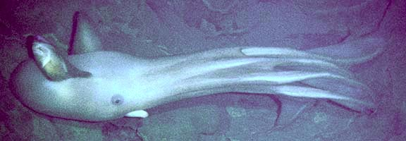
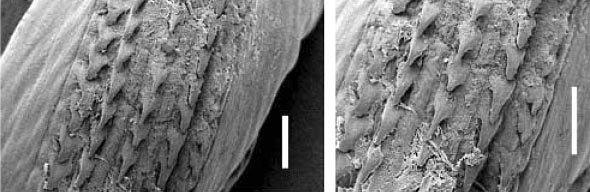
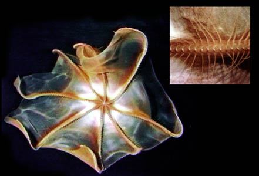
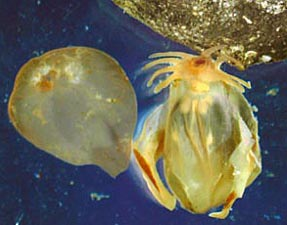
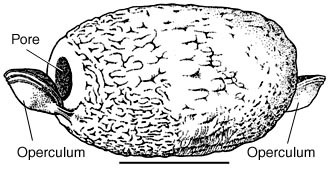

## Phylogeny 

-   « Ancestral Groups  
    -   [Octopod](../Octopod.md)
    -  [Octopodiformes](../../Octopodiformes.md))
    -  [Coleoidea](../../../Coleoidea.md))
    -  [Cephalopoda](../../../../Cephalopoda.md))
    -  [Mollusca](../../../../../Mollusca.md))
    -  [Bilateria](../../../../../../Bilateria.md))
    -  [Animals](../../../../../../../Animals.md))
    -  [Eukarya](../../../../../../../../Eukarya.md))
    -   [Tree of Life](../../../../../../../../Tree_of_Life.md)

-   ◊ Sibling Groups of  Octopoda
    -   Cirrata
    -   [Incirrata](Incirrata.md)

-   » Sub-Groups
    -   [Opisthoteuthidae](Cirrata/Opisthoteuthidae.md)
    -   [Cirroteuthidae](Cirrata/Cirroteuthidae.md)
    -   [Stauroteuthis](Stauroteuthis)

# Cirrata [Grimpe, 1916]

## Finned octopods 

[Michael Vecchione, Katharina M. Mangold (1922-2003), and Richard E. Young](http://www.tolweb.org/)

The Cirrata contains about 40 species many of which are poorly known and
of uncertain status.

Containing group: [Octopod](../Octopod.md)

## Introduction

The finned octopods are of medium to large size (up to 1.5 m total
length, although there is a photographic record of one estimated to be
over 4 m in total length: Voss, 1988). The body is usually gelatinous
and strongly foreshortened. The mantle opening is reduced and swimming
via jet propulsion seems to have been abandoned. Fins are present and
are the primary means of locomotion. The fins attach to and are
supported by the internal shell which has an unusual consistency (i.e.,
cartilage-like structure) and an unusual shape (i.e., a U, V or
saddle-shape). The arms have one series of suckers down the midline of
each arm and a series of cirri along each side of each arm (i.e., two
cirri per sucker). The cirri alternate with the suckers along the arm
length. The web is usually well developed and may reach the tip of the
arms. A hectocotylus is absent but the arms of some species exhibit
sexual modification; enlarged suckers are the most common modification.
The diameter of the largest of these suckers is a good external
indicator for maturity in males of some species. The spermatophores have
lost the entire ejaculatory apparatus and form sperm packets with an
operculum (Villanueva, 1992). The eggs are very large and enveloped in a
tough egg covering that is secreted by the oviducal gland. Where known,
eggs are laid singly on objects on the ocean floor.

### Characteristics

1.  Arms
    1.  Hectocotylization absent, sexual dimorphism of suckers present
        in some taxa.
    2.  Internal horizontal septa present.
    3.  Cirri present.
    4.  Suckers arranged in a single series.\
        \
2.  Eyes
    1.  Cornea absent.\
        \
3.  Fins
    1.  Present. \*Fins in cirrates are measured differently than in
        decapodiforms. See the glossary for details.\
        \
4.  Shell
    1.  Transversely elongate in U-, V- or saddle-shape.\
        \
5.  Viscera
    1.  Sperm packets present rather than typical spermatophores.
    2.  Posterior salivary glands often on or in buccal mass.
    3.  Right oviduct absent.
    4.  Radula often reduced or absent.\

        \
        **Figure**. Reduced radulas from two ***Grimpoteuthis boylei***.
        Photograph from Collins (2003).

    5.  Ink sac absent.
    6.  Anal flaps absent.

#### Comments

One of the most distinctive features of this group and the feature from
which it derives its name, is the presence of cirri. The oral view of
the arms and web of a cirrate below barely shows the cirri lining the
arms but the insert show the cirri clearly. The cirri are the long,
slender, muscular papillae lining the arm. The exact function of the
cirri is unknown but they are thought to play a role in feeding.

**Figure**. Oral view of a cirroteuthid cirrate photographed off Hawaii
from a submersible at 1100 m. Insert is a close-up photograph of the
same cirrate. Photographs courtesy of the Hawaii Undersea Research
Laboratory.

Hunt (1996) observed a small ***Grimpoteuthis*** in an aquarium over a
two month period. On occasion this cirrate apparently fed by trapping
brine shrimp nauplii by enclosing a volume of water that contained
nauplii with the web. The action of cirri, however, could not be
observed. Usually the cirrate collected adult brine shrimp with its
extended arms and web as the animal sank through the water and then
trapped them against the aquarium floor. Sometimes following this
trapping, individual brine shrimp were drawn under the skirt of the web
while the octopod was on the bottom. When a portion of the web was high
enough off the bottom, Hunt observed metachronal waves of moving cirri
with waves moving toward the mouth. He suggests that the cirri were
creating currents that were used in feeding. Vecchione and Young (1997)
found large glands in the lips that surround the beaks in the pelagic
cirrate, ***Stauroteuthis syrtensis***, and suggest that, in this
species at least, mucous also plays a role in the capture of small prey.

Note also the pigmentation of the large web (brown and white pattern) of
the cirrate in the above photograph which is peculiar for an animal
living in deep water where sunlight is absent. While luminous organs
have been found in only one cirrate species (***Stauroteuthis
syrtensis***; Johnsen, *et al.*, 1999), As yet unrecognized
bioluminescence could provide an explanations for the odd pigment
pattern.

### Nomenclature

O\'Shea (1999) proposed major changes to the classification of the
cirrate octopods. Unfortunately the Cirrata is still so poorly known
that a definitive classification is unattainable. We have dropped
O\'Shea\'s families Luteuthidae and Grimpoteuthidae and placed their
genera in the family Opisthoteuthidae. The Opisthoteuthidae may
eventually split into several families. However, this must await more
information on the group.

Hoyle (1904) described an unusual cirrate that he called ***Frokenia
clara***. Its most distinctive feature was the absence of a web. Such a
feature, if true, would be unique in the Cirrata. However, many cirrates
have very delicate webs that are easily damaged during capture. ***F.
clara*** was badly damaged and had lost most of the arm suckers and
cirri. We could safely assume that the web was lost as well if Nesis
(1982/87) hadn\'t indicated that he had seen a new species of this
genus. Perhaps Nesis, like Hoyle, was mislead by damage to his specimen.
We consider ***Frokenia clara*** to be a species dubia.

### Discussion of Phylogenetic Relationships

The families Stauroteuthidae and Cirroteuthidae appear to be closely
related and have often been placed together as a single family (e.g.,
Nesis, 1982). Both families have a secondary web, an elongated body,
very long cirri, armtips bare of cirri (sometimes suckers also), and
compaction of the accessory glands of the male sperm duct into a
spherical or somewhat flattened spherical mass. They differ from one
another, most dramatically, in the shape of the shell and the structure
of the mantle opening.

A phylogenetic study by Piertney, *et al*. (2003) on the mitochondrial
16S gene placed ***Stauroteuthis*** within the family
Cirroteuthidae.This study suggested that three families, in addition to
the Cirroteuthidae, be recognized: Opisthoteuthidae (contains
***Opisthoteuthis*** only), Grimpoteuthidae (contains
***Grimpoteuthis*** and ***Luteuthis**),* although this family had low
bootstrap suppport (52) and an unnamed family (contains
***Cirroctopus**).* We await confirmation via another gene before
adopting these changes.

Because of the deep-sea habitat of most species, very little is known
about the range of variation within families. The possibility exists
that intermediate forms between the presently recognized families or
genera may yet be discovered.

### Unusual features

The cirroteuthid ***Cirrothauma murrayi*** is essentially blind. The
eyes have no lens and the retina is degenerate but could still respond
to light (Aldred et al., 1983). This is the only cephalopod known to be
\"blind.\"

### Life history

Cirrates do not brood their young. Instead, they spawn large eggs in
tough egg cases (up to 24 mm in length) that, where known, are attached
to objects on the ocean floor, and the young presumably adopt the adult
mode of life immediately after hatching.

{width="287"}

**Figure**. **Left** - The broken egg case of an unknown cirrate taken
in a bottom trawl, where it was found among sponges, from the R/V Meteor
in the Angola Basin at a depth of 5400 m. The chorion can be seen
protruding on the right side. **Right** -  The empty chorion and the
advanced embryo, ca 10 mm from mouth to tip of mantle with very large
fins, that was removed from it. A portion of the egg case in remains in
the upper right.  Photographs by F. J. Cristobo, provided by U.
Piatkowski.

At least in ***Opisithoteuthis*** both males and females are mature over
a large range of size; the eggs in the ovary are of different size
classes; mature eggs are stored in the oviduct and the oviducal gland
with one to a few eggs released at any one time (Villanueva, 1992).
These features suggest that spawning is continuous and may last over
several years (Villanueva, 1992).

The [male reproductive system in cirrates](http://www.tolweb.org/accessory/Cirrate_Male_Reproductive_Tract?acc_id=1486)
differs greatly from the male system of Incirrates. The reproductive
modifications are related to the absence of typical spermatophores in
this group. In cirrates, the spermatophore is just a simple container,
sometimes called a sperm packet, filled with sperm. The ejaculatory
apparatus and cement body are absent.

**Figure**. Sperm packet (= spermatophore) from ***Opisthoteuthis
agassizii***. Drawing from Villanueva, 1992.
### Behavior

The animals swim by flapping their fins or by medusoid contraction of
the arm-web complex and not by mantle contraction (Vecchione and Young,
1997). These swimming modes may be energetically efficient but are slow.
A \"secondary\" web, present in some species, is formed by the fusion of
the aboral muscles of the web which are detached from the aboral
musculature of the arm. This allows the web to \"lift off\" the arm
except for the stretched oral side of the web that forms a septum (the
secondary web) between the web and the arm (Vecchione and Young, 1997).
This arrangement allows effective \"ballooning\" of the web in which the
web is inflated by surrounding a large volume of water. This behavior is
thought to have a defensive function (Boletzky, et al., 1992).
Opisthoteuthids lack the secondary web.

Cirrates are benthic (most Opisthoteuthidae) or bentho- bathypelagic
(Stauroteuthidae, Cirroteuthidae,and some Opisthoteuthidae). The
benthopelagic species often hover just above the ocean floor with arms
and web spread parallel to the substrate (Roper and Brundage, 1972).
Apparently, they slowly drift while attempting to detect and capture
prey with outstretched arms. Benthic opisthoteuthids feed on benthic
crustacean and polychaetes (Villanueva and Guerra, 1991) while the
pelagic cirrates feed, where known, mainly on pelagic copepods
(Vecchione, 1987).

### Distribution

Cirrates are deepsea octopods that live in all of the world\'s oceans.
They generally occupy depths from about 100 to over 5000 m although they
have been found in surface waters in Polar regions. Their maximum known
depth of occurrence is over 7,000m, the deepest record for any
cephalopod (Voss, 1988).

### References

Aldred, R. G., M. Nixon and J. Z. Young. 1983. *Cirrothauma murrayi*
Chun, A finned octopod. Phil. Trans. R. Soc. Lond. B, 301:1-54.

Boletzky, S. v. 1982. On eggs and embryos of cirromorph octopods.
Malacologia, 22: 197-204.

Boletzky, S. v., M. Rio and M. Roux. 1992. Octopod \"ballooning\"
response. Nature, London. 356: 199.

Collins, M. A. 2003. The genus *Grimpoteuthis* (Octopoda:
Grimpoteuthidae) in the North-east Atlantic, with descriptions of three
new species. Zool. Journ. Linnean Soc., 139: 93-127

Hunt, J. C. 1996. The behavior and ecology of midwater cephalopods from
Monterey Bay: Submersible and laboratory observations. Ph. D.
Dissertation, Univ. Calif. Los Angeles. 231 pp.

Johnsen, S., Balser, E. J., and E. A. Widder (1999). Light-emitting
suckers in an octopus. Nature, 398: 113-114.

Nesis, K. N. 1982/87. Abridged key to the cephalopod mollusks of the
world\'s ocean. 385+ii pp. Light and Food Industry Publishing House,
Moscow. (In Russian.). Translated into English by B. S. Levitov, ed. by
L. A. Burgess (1987), Cephalopods of the world. T. F. H. Publications,
Neptune City, NJ, 351pp.

O\'Shea, Steve. 1999. The Marine Fauna of New Zealand: Octopoda
(Mollusca: Cephalopoda). NIWA Biodiversity Memoir 112: 280pp.

Piertney, S. B., C. Hudelot, F. G. Hochberg, and M. A. Collins. 2003.
Phylogenetic relationships among cirrate octopods (Mollusca:
Cephalopoda) resolved using mitochondrial 16S ribosomal DNA sequences.
Molecular Phylogenetics and Evolution, 27: 348-353.

Robson, G. C. 1932. A monograph of the Recent Cephalopoda. Part II. The
Octopoda (excluding the Octopodinae). Brit. Mus. (Nat. Hist.), London.

Roper, C. F. E. and W. L. Brundage, Jr. 1972. Cirrate octopods with
associated deep-sea organisms: New biological data based on deep benthic
photographs (Cephalopoda). Smithson. Contr. Zool., No. 121: 1-45.

Vecchione, M. 1987. A multispecies aggregation of cirrate octopods
trawled from north of the Bahamas. Bull. Mar. Sci., 40: 78-84.

Vecchione, M. and R. E. Young. 1997. Aspects of the functional
morphology of cirrate octopods: locomotion and feeding. Vie Milieu,
47:101-110.

Villanueva, R. and A. Guerra. 1991. Food and prey detection in two
deep-sea cephalopods: Opisthoteuthis agassizii and O. vossi (Octopoda:
Cirrata). Bull. Mar. Sci. 49: 288-299.

Villanueva, R. 1992. Continuous spawning in the cirrate octopods
*Opisthoteuthis agassizii* and *O. vossi*: features of sexual maturation
defining a reproductive strategy in cephalopods. Mar. Biol. 114:265-275.

Voss, G. L. 1988. Evolution and phylogenetic relationships of deep-sea
octopods (Cirrata and Incirrata). P. 253-276. In: Clarke, M. R. and E.
R. Trueman (Eds.). The Mollusca. Vol. 12. Paleontology and Neontology of
Cephalopods. Academic Press, New York. 355pp.

Voss, G. L. and W. G. Pearcy. 1990. Deep-water octopods (Mollusca:
Cephalopoda) of the Northeastern Pacific. Proc. Calif. Acad. Sci., 47:
47-94.

Young, R. E. and M. Vecchione. 1996. Analysis of morphology to determine
primary sister taxon relationships within coleoid cephalopods. Bull.
Amer. Malac. Union., 12: 91-112.

## Title Illustrations

)

  ---------------------
  Scientific Name ::     Cirroteuthidae
  Location ::           off Hawaii
  Comments             photographed from submersible
  Specimen Condition   Live Specimen
  Copyright ::            © A. Malahoff, Hawaii Undersea Research Laboratory
  ---------------------

## Confidential Links & Embeds: 

### #is_/same_as :: [Cirrata](/_Standards/bio/bio~Domain/Eukarya/Animal/Bilateria/Mollusca/Cephalopoda/Coleoidea/Octopodiformes/Octopod/Cirrata.md) 

### #is_/same_as :: [Cirrata.public](/_public/bio/bio~Domain/Eukarya/Animal/Bilateria/Mollusca/Cephalopoda/Coleoidea/Octopodiformes/Octopod/Cirrata.public.md) 

### #is_/same_as :: [Cirrata.internal](/_internal/bio/bio~Domain/Eukarya/Animal/Bilateria/Mollusca/Cephalopoda/Coleoidea/Octopodiformes/Octopod/Cirrata.internal.md) 

### #is_/same_as :: [Cirrata.protect](/_protect/bio/bio~Domain/Eukarya/Animal/Bilateria/Mollusca/Cephalopoda/Coleoidea/Octopodiformes/Octopod/Cirrata.protect.md) 

### #is_/same_as :: [Cirrata.private](/_private/bio/bio~Domain/Eukarya/Animal/Bilateria/Mollusca/Cephalopoda/Coleoidea/Octopodiformes/Octopod/Cirrata.private.md) 

### #is_/same_as :: [Cirrata.personal](/_personal/bio/bio~Domain/Eukarya/Animal/Bilateria/Mollusca/Cephalopoda/Coleoidea/Octopodiformes/Octopod/Cirrata.personal.md) 

### #is_/same_as :: [Cirrata.secret](/_secret/bio/bio~Domain/Eukarya/Animal/Bilateria/Mollusca/Cephalopoda/Coleoidea/Octopodiformes/Octopod/Cirrata.secret.md)

