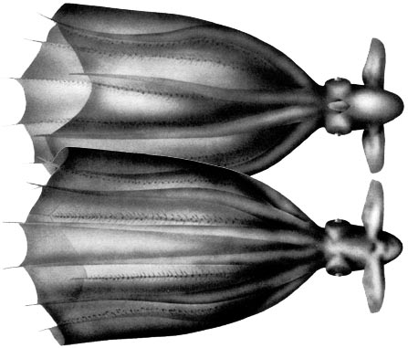
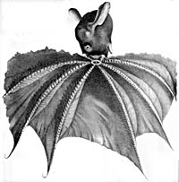
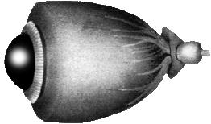
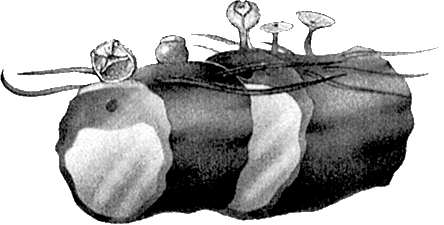

## Phylogeny 

-   « Ancestral Groups  
    -   [Cirrothauma](../Cirrothauma.md)
    -   [Cirroteuthidae](../../Cirroteuthidae.md)
    -   [Cirrata](../../../Cirrata.md)
    -   [Octopod](../../../../Octopod.md)
    -  [Octopodiformes](../../../../../Octopodiformes.md))
    -  [Coleoidea](../../../../../../Coleoidea.md))
    -  [Cephalopoda](../../../../../../../Cephalopoda.md))
    -  [Mollusca](../../../../../../../../Mollusca.md))
    -  [Bilateria](../../../../../../../../../Bilateria.md))
    -  [Animals](../../../../../../../../../../Animals.md))
    -  [Eukarya](../../../../../../../../../../../Eukarya.md))
    -   [Tree of Life](../../../../../../../../../../../Tree_of_Life.md)

-   ◊ Sibling Groups of  Cirrothauma
    -   Cirrothauma magna
    -   [Cirrothauma murrayi](Cirrothauma_murrayi)

-   » Sub-Groups 

# *Cirrothauma magna* [(Hoyle, 1885)] 

[Michael Vecchione and Richard E. Young](http://www.tolweb.org/)

Containing group: *[Cirrothauma](../Cirrothauma.md)*

## Introduction

 

***C. magna*** is a large (up to 1200 mm TL) but fragile deep-sea
cirrate that is known from 4 specimens captured from the Atlantic,
Pacific and Indian Oceans.

Diagnosis

A ***Cirrothauma*** \...

-   with normal eyes bearing lenses. 

### Characteristics

1.  Eyes

    1.  Functional eyes (eyes with lenses).

    

    **Figure**. Eye of ***C. magna***, male, 220 mm ML. At the far right
    of the drawing is the optic stalk that enters the optic lobe of the
    brain. From this the optic nerves pass through the white body and
    into the eyeball. Drawing from Guerra, *et al*., 1998.

2.  Suckers

    1.  Arms with 3 types of suckers (top figure; bottom figure shows
        the two more distal types).
    2.  Suckers nearest mouth: small, cyclindrical, closely spaced, with
        stout stalk.
    3.  Following suckers: larger and on long stalks; thin, broad,
        infundibulum with small openings (acetabulum, apparently, nearly
        absent); infundibulum can inflate or deflate to form a spherical
        (see middle sucker in bottom drawing), flattened or
        \"half-closed eyelid.\"
    4.  Suckers of distal third of arm: large, fleshy with bowl-like,
        amphora-like or barrel-like shape; sessile with rigid, muscular
        base (however see top figure where these suckers have long
        stalks).

    

    **Figure**. **Top** - Three sections of the arm, submature female of
    ***C. magna***, 140 mm ML. **Bottom** - Two sections of the arm,
    mature male, 220 mm ML. Drawings from Guerra, et al., 1998.

3.  Web
    1.  Distal web attachments to each arm asymmetrical.
    2.  Web nodules absent.

#### Comments

The above description is taken from Guerra *et al*., 1998. [Additional features of the description can be found here.](http://www.tolweb.org/accessory/Cirrothauma_magna_Description_Continued?acc_id=1503)

### Nomenclature

***C. magna*** was traditionally placed in ***Cirroteuthis*** although
Robson (1932) and Nesis (1987) questioned this placement. O\'Shea (1999)
noted the similarity of the shell to that of ***Cirrothauma*** and moved
the species to that genus.

Hoyle (1886) described a second but mutilated specimen along with his
redescription of the holotype. Robson (1932) suggested that this second
specimen belonged to a separate species which he named ***Cirroteuthis
hoylei***. The status of this latter species is uncertain.

### Distribution

Type locality: 46°46\'S, 45°31\'E, south Indian Ocean between Prince
Edward Island and the Crozets, 2557 m.

The specimens described by Guerra, et al. (1998) were taken at 15°29\'N,
46°34\'W in the central North Atlantic (male) and 23°00\'N, 17°34\'W in
the North Alantic off West Africa (female).

O\'Shea (1999) suspects that a specimen taken off New Zealand at
39°58\'S, 178°02\'E, 1450-1468 m, represents a new species.

### References

Guerra, R., R. Villanueva, K. N. Nesis and J. Bedoya. 1998.
Redescription of the deep-sea cirrate octopod Cirroteuthis magna Hoyle,
1885, and considerations on the genus Cirroteuthis (Mollusca:
Cephalopoda). Bull. Mar. Sci., 63: 51-81.

Hoyle, W. E. 1886. Report on the Cephalopoda. Rept. Sci. Res.
Challenger. 16 (44): 246 pp.

Voss, G. L. and W. G. Pearcy. 1990. Deep-water octopods (Mollusca:
Cephalopoda) of the Northeastern Pacific. Proc. Calif. Acad. Sci. 47:
47-94.

## Title Illustrations

)

  -------------------------------------------------------------------------------
  Scientific Name ::   Cirrothauma magna
  Reference          Guerra, R., R. Villanueva, K. N. Nesis and J. Bedoya. 1998. Redescription of the deep-sea cirrate octopod Cirroteuthis magna Hoyle, 1885, and considerations on the genus Cirroteuthis (Mollusca: Cephalopoda). Bull. Mar. Sci., 63: 51-81.
  Acknowledgements   Printed with permission from the Bulletin of Marine Science.
  Sex ::              Male
  Life Cycle Stage ::   Mature
  View               Ventral (top) and dorsal (bottom)
  Size               220 mm ML
  Copyright ::          © 1998 Bulletin of Marine Science
  -------------------------------------------------------------------------------
)

  --------------------------------
  Scientific Name ::  Cirrothauma magna
  Reference         Hoyle, W. E. 1886. Report on the Cephalopoda. Rept. Sci. Res. Challenger. 16 (44): 246 pp.
  View              Side
  Type              Holotype
  --------------------------------

## Confidential Links & Embeds: 

### #is_/same_as :: [magna](/_Standards/bio/bio~Domain/Eukarya/Animal/Bilateria/Mollusca/Cephalopoda/Coleoidea/Octopodiformes/Octopod/Cirrata/Cirroteuthidae/Cirrothauma/magna.md) 

### #is_/same_as :: [magna.public](/_public/bio/bio~Domain/Eukarya/Animal/Bilateria/Mollusca/Cephalopoda/Coleoidea/Octopodiformes/Octopod/Cirrata/Cirroteuthidae/Cirrothauma/magna.public.md) 

### #is_/same_as :: [magna.internal](/_internal/bio/bio~Domain/Eukarya/Animal/Bilateria/Mollusca/Cephalopoda/Coleoidea/Octopodiformes/Octopod/Cirrata/Cirroteuthidae/Cirrothauma/magna.internal.md) 

### #is_/same_as :: [magna.protect](/_protect/bio/bio~Domain/Eukarya/Animal/Bilateria/Mollusca/Cephalopoda/Coleoidea/Octopodiformes/Octopod/Cirrata/Cirroteuthidae/Cirrothauma/magna.protect.md) 

### #is_/same_as :: [magna.private](/_private/bio/bio~Domain/Eukarya/Animal/Bilateria/Mollusca/Cephalopoda/Coleoidea/Octopodiformes/Octopod/Cirrata/Cirroteuthidae/Cirrothauma/magna.private.md) 

### #is_/same_as :: [magna.personal](/_personal/bio/bio~Domain/Eukarya/Animal/Bilateria/Mollusca/Cephalopoda/Coleoidea/Octopodiformes/Octopod/Cirrata/Cirroteuthidae/Cirrothauma/magna.personal.md) 

### #is_/same_as :: [magna.secret](/_secret/bio/bio~Domain/Eukarya/Animal/Bilateria/Mollusca/Cephalopoda/Coleoidea/Octopodiformes/Octopod/Cirrata/Cirroteuthidae/Cirrothauma/magna.secret.md)

