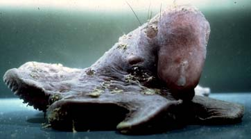
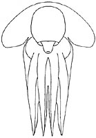
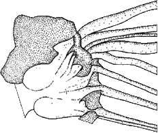
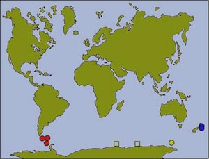

## Phylogeny 

-   « Ancestral Groups  
    -   [Opisthoteuthidae](../Opisthoteuthidae.md)
    -   [Cirrata](../../Cirrata.md)
    -   [Octopod](../../../Octopod.md)
    -  [Octopodiformes](../../../../Octopodiformes.md))
    -  [Coleoidea](../../../../../Coleoidea.md))
    -  [Cephalopoda](../../../../../../Cephalopoda.md))
    -  [Mollusca](../../../../../../../Mollusca.md))
    -  [Bilateria](../../../../../../../../Bilateria.md))
    -  [Animals](../../../../../../../../../Animals.md))
    -  [Eukarya](../../../../../../../../../../Eukarya.md))
    -   [Tree of Life](../../../../../../../../../../Tree_of_Life.md)

-   ◊ Sibling Groups of  Opisthoteuthidae
    -   Cirroctopus
    -   [Grimpoteuthis](Grimpoteuthis.md)
    -   [Luteuthis](Luteuthis.md)
    -   [Opisthoteuthis](Opisthoteuthis.md)

-   » Sub-Groups
    -   [Cirroctopus antarctica](Cirroctopus_antarctica)
    -   [Cirroctopus glacialis](Cirroctopus_glacialis)
    -   [Cirroctopus hochbergi](Cirroctopus_hochbergi)
    -   [Cirroctopus mawsoni](Cirroctopus_mawsoni)

# Cirroctopus 

[Michael Vecchione and Richard E. Young](http://www.tolweb.org/)

The following four species are included in the family.

-   *[Cirroctopus     antarctica](Cirroctopus_antarctica)*[
    (Kubodera & Okutani, 1986)]
-   *[Cirroctopus     glacialis](Cirroctopus_glacialis)*[
    (Robson, 1930)] [(Robson, 1930)]
-   *[Cirroctopus     hochbergi](Cirroctopus_hochbergi)*
    [O\'Shea, 1999]
-   *[Cirroctopus     mawsoni](Cirroctopus_mawsoni)*
    [(Berry, 1917)]

Containing group: [Opisthoteuthidae](../Opisthoteuthidae.md)

## Introduction

Members of this family are more muscular than is typical for cirrate
octopods. The fins are extremely large and the eyes tilt dorsally.
Members of the genus are restricted to high latitudes of the southern
hemisphere. **Cirroctopus** is probably the most distinctive of the four
opisthoteuthid genera.

### Characteristics

1.  Arms and web
    a.  Suckers not enlarged in males.
    b.  Cirrus length comparable to largest sucker diameter.
    c.  Web nodules absent.
2.  Fins
    a.  Fins long (greater than body width) and very broad.
3.  Mantle cavity
    a.  Mantle septum fused posteriorly with mantle wall. (This is a
        unique feature within the Octopoda.)
    b.  Gill (photograph above right) with half-orange appearance and
        with characteristic zig-zag arrangement of secondary lamellae.
4.  Digestive tract
    +---------+---------+---------+
    | a.  Caecum nearly     |  | digestive tract with  |
    |     stomach.          |                       | the complex           |
    | b.  Intestine long    |                       | orientation of the    |
    |     (ca. 2.5 times    |                       | intestine. The label  |
    |     esophagus length) |                       | \"bend\" indicates a  |
    |     with a variety of |                       | sharp bend in the     |
    |     right-angle       |                       | intestine toward the  |
    |     turns.            |                       | viewer that isn\'t    |
    | c.  Unilobular        |                       | otherwise clearly     |
    |     digestive gland.  |                       | apparent.             |
    +---------+---------+---------+
5.  Nephridial sacs
    a.  Nephridial sacs extensive.
    b.  Nephridial sacs with glandular lining on walls of sacs in
        additional to renal appendages.

Pigmentation

a.  Areolar spots present in young and near eyes and base of fins in
    adults.

White body, optic lobe and optic-nerve tract

+------------+------------+
| a.  White bodies meet in dorsal   |       |
|     midline.                      |                                   |
| b.  Numerous optic nerve bundles  |                                   |
|     penetrate white body.         |                                   |
| c.  Optic lobe kidney-shaped in   |                                   |
|     cross-section.                |                                   |
+------------+------------+

Shell

+---------+---------+---------+
|                       |  | left have been        |
|                       |                       | stained with          |
|                       |                       | methylene blue.       |
+---------+---------+---------+

#### Comments

The four species of the genus are poorly differentiated at present.
Although a few potentially differentiating characters are known,
identification must rely heavily on geographic location until the
species are better known.

### Diagnosis

Opisthoteuthids with:

+------------+------------+
| -   Arms without enlarged sucker  | -   Optic lobe kidney-shaped.     |
|     fields in males.              | -   Numerous optic nerve bundles  |
| -   Fins very large.              |     penetrate white body.         |
| -   Areolae present.              | -   Shell V-shaped.               |
|                                   | -   Sucker aperature without      |
|                                   |     tooth-like structures.        |
+------------+------------+

### Distribution

+------------+------------+
| Species of **Cirroctopus** are    |           |
| known only from Antarctic and     |                                   |
| Subantarctic waters.              |                                   |
|                                   |                                   |
| Blue dots: **C. hochbergi**\      |                                   |
| Red dots: **C. glacialis**\       |                                   |
| Yellow dot: **C. mawsoni**\       |                                   |
| Open squares: Cirrates identified |                                   |
| as **C. mawsoni** by O\'Shea      |                                   |
| (1999).                           |                                   |
+------------+------------+

### References

O'Shea, Steve. 1999. The Marine Fauna of New Zealand: Octopoda
(Mollusca: Cephalopoda). NIWA Biodiversity Memoir 112: 280pp.

Vecchione, M. and R. E. Young. 1997 Aspects of the functional morphology
of cirrate octopods: locomotion and feeding. Vie Milieu 47(2):101-110.

Voss, G. L. and W. G. Pearcy. 1990. Deep-water octopods (Mollusca:
Cephalopoda) of the Northeastern Pacific. Proc. Calif. Acad. Sci. 47:
47-94.

## Title Illustrations

**Grimpoteuthis** sp. (left, lateral view, photograph by E. McSweeny)
and **Grimpoteuthis glacialis** (right, ventral view, drawing from
Vecchione and Young, 1997).

#### Other illustrations

-   Diagram of **G. glacialis** with the ventral wall of the mantle
    cavity removed to show fusion of the mantle septum with the
    posterior mantle wall. Drawing from Vecchione and Young, 1997.
-   Ventral view of preserved gill of **G. glacialis**. Photograph by R.
    Young.
-   Lateral view of digestive system of **G. glacialis**. Drawing from
    Vecchione and Young, 1997.
-   Optic lobe with optic nerve bundles penetrating white body of **G.
    hochbergi**. Drawing from O\'Shea, 1999.
-   Dorsal and ventral views of the shell of **G. glacialis**.
    Photograph of stained, preserved shell by R. Young.
-   Distribution map. Modified slightly from O\'Shea (1999).
)

  ------
  Copyright ::   © E. McSweeny
  ------
)

  -----------------------------------------------------------------------
  Copyright ::   © 1997 [Michael Vecchione](mailto:vecchiom@si.edu) 
  -----------------------------------------------------------------------

## Confidential Links & Embeds: 

### #is_/same_as :: [Cirroctopus](/_Standards/bio/bio~Domain/Eukarya/Animal/Bilateria/Mollusca/Cephalopoda/Coleoidea/Octopodiformes/Octopod/Cirrata/Opisthoteuthidae/Cirroctopus.md) 

### #is_/same_as :: [Cirroctopus.public](/_public/bio/bio~Domain/Eukarya/Animal/Bilateria/Mollusca/Cephalopoda/Coleoidea/Octopodiformes/Octopod/Cirrata/Opisthoteuthidae/Cirroctopus.public.md) 

### #is_/same_as :: [Cirroctopus.internal](/_internal/bio/bio~Domain/Eukarya/Animal/Bilateria/Mollusca/Cephalopoda/Coleoidea/Octopodiformes/Octopod/Cirrata/Opisthoteuthidae/Cirroctopus.internal.md) 

### #is_/same_as :: [Cirroctopus.protect](/_protect/bio/bio~Domain/Eukarya/Animal/Bilateria/Mollusca/Cephalopoda/Coleoidea/Octopodiformes/Octopod/Cirrata/Opisthoteuthidae/Cirroctopus.protect.md) 

### #is_/same_as :: [Cirroctopus.private](/_private/bio/bio~Domain/Eukarya/Animal/Bilateria/Mollusca/Cephalopoda/Coleoidea/Octopodiformes/Octopod/Cirrata/Opisthoteuthidae/Cirroctopus.private.md) 

### #is_/same_as :: [Cirroctopus.personal](/_personal/bio/bio~Domain/Eukarya/Animal/Bilateria/Mollusca/Cephalopoda/Coleoidea/Octopodiformes/Octopod/Cirrata/Opisthoteuthidae/Cirroctopus.personal.md) 

### #is_/same_as :: [Cirroctopus.secret](/_secret/bio/bio~Domain/Eukarya/Animal/Bilateria/Mollusca/Cephalopoda/Coleoidea/Octopodiformes/Octopod/Cirrata/Opisthoteuthidae/Cirroctopus.secret.md)

