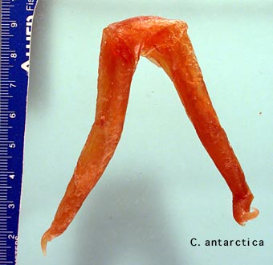

---
aliases:
  - antarctica
title: Cirroctopus antarctica
---

## Phylogeny 

-   « Ancestral Groups  
    -   [Cirroctopus](../Cirroctopus.md)
    -   [Opisthoteuthidae](../../Opisthoteuthidae.md)
    -   [Cirrata](../../../Cirrata.md)
    -   [Octopod](../../../../Octopod.md)
    -  [Octopodiformes](../../../../../Octopodiformes.md) 
    -  [Coleoidea](../../../../../../Coleoidea.md) 
    -  [Cephalopoda](../../../../../../../Cephalopoda.md) 
    -  [Mollusca](../../../../../../../../Mollusca.md) 
    -  [Bilateria](../../../../../../../../../Bilateria.md) 
    -  [Animals](../../../../../../../../../../Animals.md) 
    -  [Eukarya](../../../../../../../../../../../Eukarya.md) 
    -   [Tree of Life](../../../../../../../../../../../Tree_of_Life.md)

-   ◊ Sibling Groups of  Cirroctopus
    -   Cirroctopus antarctica
    -   [Cirroctopus glacialis](Cirroctopus_glacialis)
    -   [Cirroctopus hochbergi](Cirroctopus_hochbergi)
    -   [Cirroctopus mawsoni](Cirroctopus_mawsoni)

-   » Sub-Groups 

# *Cirroctopus antarctica* [(Kubodera & Okutani, 1986)] 

[Michael Vecchione and Richard E. Young](http://www.tolweb.org/)

Containing group: [Cirroctopus](../Cirroctopus.md)

## Introduction

***Cirroctopus antarctica*** was described from two octopods and is
known only from these animals.

### Characteristics

1.  Shell

    Kubodera and Okutani (1986) descrive the shell as follows: \"The
    \[shell\] is broadly U-shaped. both rami, particularly at
    postero-lateral portion, are widened The posteriormost connective of
    both rami seems to be weaker than the remaining area.\" The original
    drawing is seen below and a recent photograph of the same shell is
    seen on the right.

    
    **Figure**. The shell of ***C. antarctica***, paratype. **Left** -
    Drawing from Kubodera and Okutani, 1986. **Right** - Photograph
    by T. Kubodera.

2.  Pigmentation

    The title photographs suggests that the oral surface of ***C.
    antarctica*** has the same odd pigmentation as ***C. glacialis***.

3.  Measurements and counts
      ----------------- -----
      Characters: Measurements in mm            Holotype           Paratype
      Sex ::                                     ?                  Female
      Mantle length                             91; 94             180
      Mantle width                              95; 69             135
      Head width                                45                 100
      Fin length                                80; 67             70
      Fin width                                 40; 30             33
      Lengths and counts                        Left/Right         Left/Right
      Arms I                                    200/200; 232/245   310/300
      Arms II                                   220/220; 253/255   310/280
      Arms III                                  225/220; 235/231   320/350
      Arms IV                                   220/215; 236/230   300/260
      Web sector A                              110                140
      Web sector B                              105/95             160/160
      Web sector C                              110/100            150/160
      Web sector D                              110/105            160/155
      Web sector E                              55                 110
      Arm I sucker counts (right; left/right)   72; 55/65          76
      Arm II sucker counts                      73; 64/64          73
      Arm III sucker counts                     69; 58/65          78
      Arm IV sucker counts                      73; 55/63          55+
      ----------------- -----

    Measurements and counts to the left of the semicolon are from
    Kubodera and Okutani (1986) and those to the right of the semicolon
    are from O\'Shea (1999).

#### Comments

Kubodera and Okutani stated that this species differed from ***C.
mawsoni*** by having subequal arms (this character would also separates
it from all other members of the genus which have distinctly shorter
ventral arms). The two octopods in the type series of ***C.
antarctica*** were not in good condition and arm measurements can be
very inaccurate. Arm size, however, remains a possible distinguishing
character. The authors state that this species differs from ***C.
glacialis*** by the shell which is very broad in posterolateral regions
and the \"well chitinized\" beak. There appears to be no real difference
in beak chitinization. The shell, however, does pose a problem. A
photograph (see above) of the same gladius no longer, at least, appears
to be distinctive as originally described but does seem to differ in
some respects to the shell of ***C. glacialis*** (see above).
Unfortunately the degree of variation of the shell in both species is
unknown. O\'Shea (1999) considered this species to be a probable synonym
of ***C. glacialis***. We suspect that he is correct.

### Distribution

Type locality: 62° 59\'S, 62° 09\'W, 804 m depth. The paratype was
collected at 61° 23\'S, 55° 11\'W, 509-525 m depth.

### References

Kubodera, T. and T. Okutani. 1986. New and Rare Cephalopods from the
Antarctic Waters. Memoirs of National Institute of Polar Research,
Special Issue, 44:129-143.

O'Shea, Steve. 1999. The Marine Fauna of New Zealand: Octopoda
(Mollusca: Cephalopoda). NIWA Biodiversity Memoir 112: 280pp.

Vecchione, M., U. Piatkowski and A. L. Allcock. 1998. Biology of the
cirrate octopod *Grimpoteuthis glacialis* (Cephalopoda;
Opisthoteuthidae) in the South Shetland Islands, Antarctica. S. Afr. J.
Mar. Sci. 20: 421-428.

## Title Illustrations

)

  ------------
  Scientific Name ::  Cirroctopus antarcticus
  ------------
)

  -----------
  Scientific Name ::  Cirroctopus antarctica
  -----------

## Confidential Links & Embeds: 

### #is_/same_as :: [[/_Standards/bio/bio~Domain/Eukarya/Animal/Bilateria/Mollusca/Cephalopoda/Coleoidea/Octopodiformes/Octopod/Cirrata/Opisthoteuthidae/Cirroctopus/antarctica|antarctica]] 

### #is_/same_as :: [[/_public/bio/bio~Domain/Eukarya/Animal/Bilateria/Mollusca/Cephalopoda/Coleoidea/Octopodiformes/Octopod/Cirrata/Opisthoteuthidae/Cirroctopus/antarctica.public|antarctica.public]] 

### #is_/same_as :: [[/_internal/bio/bio~Domain/Eukarya/Animal/Bilateria/Mollusca/Cephalopoda/Coleoidea/Octopodiformes/Octopod/Cirrata/Opisthoteuthidae/Cirroctopus/antarctica.internal|antarctica.internal]] 

### #is_/same_as :: [[/_protect/bio/bio~Domain/Eukarya/Animal/Bilateria/Mollusca/Cephalopoda/Coleoidea/Octopodiformes/Octopod/Cirrata/Opisthoteuthidae/Cirroctopus/antarctica.protect|antarctica.protect]] 

### #is_/same_as :: [[/_private/bio/bio~Domain/Eukarya/Animal/Bilateria/Mollusca/Cephalopoda/Coleoidea/Octopodiformes/Octopod/Cirrata/Opisthoteuthidae/Cirroctopus/antarctica.private|antarctica.private]] 

### #is_/same_as :: [[/_personal/bio/bio~Domain/Eukarya/Animal/Bilateria/Mollusca/Cephalopoda/Coleoidea/Octopodiformes/Octopod/Cirrata/Opisthoteuthidae/Cirroctopus/antarctica.personal|antarctica.personal]] 

### #is_/same_as :: [[/_secret/bio/bio~Domain/Eukarya/Animal/Bilateria/Mollusca/Cephalopoda/Coleoidea/Octopodiformes/Octopod/Cirrata/Opisthoteuthidae/Cirroctopus/antarctica.secret|antarctica.secret]] 

