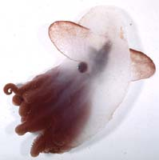
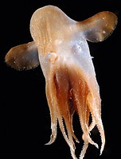
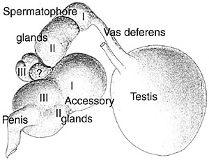
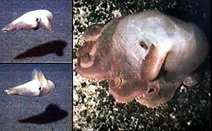
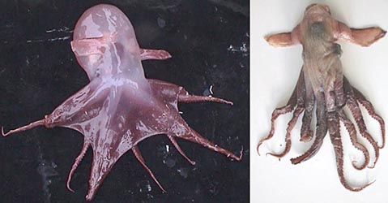

## Phylogeny 

-   « Ancestral Groups  
    -   [Opisthoteuthidae](../Opisthoteuthidae.md)
    -   [Cirrata](../../Cirrata.md)
    -   [Octopod](../../../Octopod.md)
    -  [Octopodiformes](../../../../Octopodiformes.md))
    -  [Coleoidea](../../../../../Coleoidea.md))
    -  [Cephalopoda](../../../../../../Cephalopoda.md))
    -  [Mollusca](../../../../../../../Mollusca.md))
    -  [Bilateria](../../../../../../../../Bilateria.md))
    -  [Animals](../../../../../../../../../Animals.md))
    -  [Eukarya](../../../../../../../../../../Eukarya.md))
    -   [Tree of Life](../../../../../../../../../../Tree_of_Life.md)

-   ◊ Sibling Groups of  Opisthoteuthidae
    -   [Cirroctopus](Cirroctopus.md)
    -   Grimpoteuthis
    -   [Luteuthis](Luteuthis.md)
    -   [Opisthoteuthis](Opisthoteuthis.md)

-   » Sub-Groups
    -   [Grimpoteuthis         abyssicola](Grimpoteuthis_abyssicola)
    -   [Grimpoteuthis         bathynectes](Grimpoteuthis_bathynectes)
    -   [Grimpoteuthis boylei](Grimpoteuthis_boylei)
    -   [Grimpoteuthis         challengeri](Grimpoteuthis_challengeri)
    -   [Grimpoteuthis         discoveryi](Grimpoteuthis_discoveryi)
    -   [Grimpoteuthis         hippocrepium](Grimpoteuthis_hippocrepium)
    -   [Grimpoteuthis         innominata](Grimpoteuthis_innominata)
    -   [Grimpoteuthis         meangensis](Grimpoteuthis_meangensis)
    -   [Grimpoteuthis megaptera](Grimpoteuthis_megaptera)
    -   [Grimpoteuthis pacifica](Grimpoteuthis_pacifica)
    -   [Grimpoteuthis plena](Grimpoteuthis_plena)
    -   [Grimpoteuthis tuftsi](Grimpoteuthis_tuftsi)
    -   [Grimpoteuthis umbellata](Grimpoteuthis_umbellata)
    -   [Grimpoteuthis wuelkeri](Grimpoteuthis_wuelkeri)

# *Grimpoteuthis* [Robson 1932] 

[Richard E. Young and Michael Vecchione](http://www.tolweb.org/)

The following 14 nominal species are included in the genus.

Containing group: [Opisthoteuthidae](../Opisthoteuthidae.md)

## Introduction

Most species of ***Grimpoteuthis*** are poorly known. They are somewhat
less compressed in the anterior-posterior axis than are members of
***Opisthoteuthis*** and they generally have relatively larger fins.
Species are closely associated with the deep-ocean floor and some
species, at least, alternate between sitting on the ocean bottom and
swimming above it while some others apear to be completely pelagic.

#### Diagnosis

Opisthoteuthids \...

-   without enlarged sucker fields on arms of males.
-   Areolae absent.
-   Optic lobe circular in cross-section.
-   One optic nerve bundle penetrates white body.
-   Shell U-shaped or slightly W-shaped.
-   Sucker aperature without tooth-like structures.

### Characteristics

\

1.  Arms and web
    1.  Suckers not greatly enlarged in males.
    2.  Sucker aperatures without tooth-like structures (see
        ***Luteuthis*** for tooth-like structures).
    3.  Cirrus length comparable to 3.5 times largest sucker diameter.
    4.  Single web nodules present (arrow).
2.  Shell
    1.  U-shaped, lateral walls of wings usually parallel to one
        another. Mid-saddle often with outer and inner surfaces convex
        but outer surface flat or concave in some species (eg, ***G.
        meangensis***).
    2.  Shoulders with or without shoulder blades.

#### Comments

The male reproductive tract shows considerable variation between species
and is frequently described for new species. However the amount of
variation within a species is unknown and therefore the specific value
of the structures of the tract is uncertain. In addition there is some
confusion regarding the identification of the various parts. Ebersbach
(1915) made a careful dissection of the digestive tract of a
***Grimpoteuthis*** that he believed was ***G. umbellata***. His
illustration, relabeled, is shown on the right. The proximal glands on
the sperm duct are often called \"seminal vesicles.\" However, as
Ebersbach pointed out, they are spermatophore-forming glands and should
be called \"spermatophore glands.\" A small gland (labeled \"?\") lies
between the spermatophore and accessory glands that Ebersbach called the
accessory spermatophore gland but may be Needham\'s sac.

**Figure**. Male reproductive tract of *Grimpoteuthis umbellata*. Figure
relabeled from Ebersbach (1915).\

**Species comparisons**

  ------ ---- ------- ---- --- ----- -----
  Species           No. arm   Sucker\   First\     Length:\          Salivary    Gill       Eye     Shell\      Shell\     Shell saddle Ocean
                    suckers   no. at\   cirrus\    cirrus/sucker;\   glands      lamellae   size    shoulder\   wings\     shape: Outer 
                              Arm I\    between\   Male, female                                     blades      expanded   surface      
                              nodule    suckers                                                                                         

  ***G.             77        32-34     4-6        2.5x              None        8          Large   No          Yes        Convex       South
  abyssicola***                                                                                                                         Pacific

  ***G.             47-58     26        3-4        1.1x, 1.3x        Posterior   7-9        Large   No          No         Convex?      North
  bathynectes***                                                                                                                        Pacific

  ***G. boylei\     55-58     31        4-7        1.9x, 2.2x        Ant., Post. 7-8        1/3 HW  Weak        No         Depressed    North
  ***                                                                                                                                   Atlantic

  ***G.             63-72     34        4-7        2.5x, 3.5x        Anterior    7-8        1/3 HW  Yes         No         Convex       North
  challengeri***                                                                                                                        Atlantic

  ***G.             56-61     31        3-5        1.2x, 1.6x        Anterior    6-8        1/3 HW  Weak        No         Convex       North
  discoveryi*\                                                                                                                          Atlantic
  **                                                                                                                                    

  ***G.             50,       25        4-5        ?                 ?           ?          ?       No          No         Flat?        E.
  hippocrepium***                                                                                                                       tropical
                                                                                                                                        Pacific

  ***G.             50-60     22-24     4-6        1x                None        7          large   Yes         Yes        Median ridge South
  innominata***                                                                                                                         Pacific

  ***G.             60-70     ?         4-7        ?                 ?           ?          ?       Yes         ?          Flat         W.
  meangensis***                                                                                                                         tropical
                                                                                                                                        Pacific

  ***G.             ?         ?         ?          2x                ?           ?          1/3 HW  ?           ?          ?            North
  megaptera***                                                                                                                          Atlantic

  ***G. pacifica*** 52        ?         6-8        2x                ?           ?          Large   ?           ?          ?            W.
                                                                                                                                        tropical
                                                                                                                                        Pacific

  ***G. plena***    55        ?         ?          1.2-1.6           ?           ?          small   ?           ?          ?            North
                                                                                                                                        Atlantic

  ***G. tuftsi***   63-75     ?         5-7        1.5-3.5           None        7-8        Large   Yes         No?        Transverse   North
                                                                                                                           groove       Pacific

  ***G.             65-68     ?         4-5        1.2x              ?           8          ?       ?           ?          ?            North
  umbellata***                                                                                                                          Atlantic

  ***G. wuelkeri*** 60-70     28        4-7        2.5x, 1.2x        Ant., post. 6-7        1/3 HW  Yes         No         Convex with  North
                                                                                                                           ridge        Atlantic
  ------ ---- ------- ---- --- ----- -----

### Nomenclature

Robson (1932) erected the genus ***Grimpoteuthis*** to include some
species formely placed in ***Cirroteuthis**.* He designated ***G.
umbellata*** (Fischer, 1883) as the type species.

### Behavior

Very little is known about the habits and behavior of species of
***Grimpoteuthis**.* These photographs taken off Hawaii show an unknown
species of ***Grimpoteuthis*** sitting on the ocean floor (right) and
swimming with its fins just above the ocean floor (left). Some species,
perhaps that in the title photograph, are very delicate and unlike the
species seen on the right, may be entire benthopelagic.

**Figure**. ***Grimpoteuthis*** sp. from Hawaiian waters. Photographs
modified from Young, et al., 1998.
### Distribution

Species appear to be associated with the deep ocean floor in all oceans
of the world.

### Preservation

Species of ***Grimpoteuthis**,* as with many other species of cirrates
undergo great shrinkage with fixation and preservation. The cirrate on
the left, identified as ***G. wuelkeri*** by Uwe Piatkowski, was
photographed directly after its capture. The photograph of the same
specimen, on the right, was taken after two years in ethanol. While the
relative sizes of the two have not been maintained here, note that the
eyes and fins appear relatively larger after preservation.

**Figure**. ***G. wuelkeri*** before and after preservation. Photographs
provided by U. Piatkowski.
### References

Collins, M. A. In press. The genus *Grimpoteuthis* (Octopoda:
Grimpoteuthidae) in the North-east Atlantic, with descriptions of three
new species.

Ebersbach, A. 1915. Zur Anatomie von *Cirroteuhtis umbellata* Fischer
und *Stauroteuthis* sp. Z. Wiss. Zool., 113:361-483.

O'Shea, Steve. 1999. The Marine Fauna of New Zealand: Octopoda
(Mollusca: Cephalopoda). NIWA Biodiversity Memoir 112: 280pp.

Robson, G. C. (1932). A monograph of the Recent Cephalopoda. Part II.
The Octopoda (excluding the Octopodinae). Brit. Mus. (Nat. Hist.),
London.

Villanueva, R. 1992. Continuous spawning in the cirrate octopods
*Opisthoteuthis agassizii* and *O. vossi*: features of sexual maturation
defining a reproductive strategy in cephalopods. Marine Biology,
114:265-275.

Voss, G. L. and W. G. Pearcy. 1990. Deep-water octopods (Mollusca:
Cephalopoda) of the Northeastern Pacific. Proc. Calif. Acad. Sci. 47:
47-94.

Young, R. E., M. Vecchione and D. Donovan. 1998. The evolution of
coleoid cephalopods and their present biodiversity and ecology. South
African Jour. Mar. Sci.., 20: 393-420.

## Title Illustrations

)

  ---------
  Scientific Name ::  Grimpoteuthis sp.
  Location ::        Antarctic waters
  Creator           E. McSweeny
  Copyright ::         © E. McSweeny
  ---------
)

  -------------------
  Scientific Name ::     Grimpoteuthis sp.
  Location ::           Central North Atlantic
  Comments             Photographed on R/V G. O. Sars, MARECO cruise.
  Specimen Condition   Live Specimen
  View                 Ventral
  Copyright ::            © [David Shale](mailto:david.shale@virgin.net)
  -------------------

## Confidential Links & Embeds: 

### #is_/same_as :: [Grimpoteuthis](/_Standards/bio/bio~Domain/Eukarya/Animal/Bilateria/Mollusca/Cephalopoda/Coleoidea/Octopodiformes/Octopod/Cirrata/Opisthoteuthidae/Grimpoteuthis.md) 

### #is_/same_as :: [Grimpoteuthis.public](/_public/bio/bio~Domain/Eukarya/Animal/Bilateria/Mollusca/Cephalopoda/Coleoidea/Octopodiformes/Octopod/Cirrata/Opisthoteuthidae/Grimpoteuthis.public.md) 

### #is_/same_as :: [Grimpoteuthis.internal](/_internal/bio/bio~Domain/Eukarya/Animal/Bilateria/Mollusca/Cephalopoda/Coleoidea/Octopodiformes/Octopod/Cirrata/Opisthoteuthidae/Grimpoteuthis.internal.md) 

### #is_/same_as :: [Grimpoteuthis.protect](/_protect/bio/bio~Domain/Eukarya/Animal/Bilateria/Mollusca/Cephalopoda/Coleoidea/Octopodiformes/Octopod/Cirrata/Opisthoteuthidae/Grimpoteuthis.protect.md) 

### #is_/same_as :: [Grimpoteuthis.private](/_private/bio/bio~Domain/Eukarya/Animal/Bilateria/Mollusca/Cephalopoda/Coleoidea/Octopodiformes/Octopod/Cirrata/Opisthoteuthidae/Grimpoteuthis.private.md) 

### #is_/same_as :: [Grimpoteuthis.personal](/_personal/bio/bio~Domain/Eukarya/Animal/Bilateria/Mollusca/Cephalopoda/Coleoidea/Octopodiformes/Octopod/Cirrata/Opisthoteuthidae/Grimpoteuthis.personal.md) 

### #is_/same_as :: [Grimpoteuthis.secret](/_secret/bio/bio~Domain/Eukarya/Animal/Bilateria/Mollusca/Cephalopoda/Coleoidea/Octopodiformes/Octopod/Cirrata/Opisthoteuthidae/Grimpoteuthis.secret.md)

