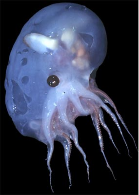
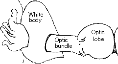

---
aliases:
  - Luteuthis
title: Luteuthis
---

## Phylogeny 

-   « Ancestral Groups  
    -   [Opisthoteuthidae](../Opisthoteuthidae.md)
    -   [Cirrata](../../Cirrata.md)
    -   [Octopod](../../../Octopod.md)
    -  [Octopodiformes](../../../../Octopodiformes.md))
    -  [Coleoidea](../../../../../Coleoidea.md))
    -  [Cephalopoda](../../../../../../Cephalopoda.md))
    -  [Mollusca](../../../../../../../Mollusca.md))
    -  [Bilateria](../../../../../../../../Bilateria.md))
    -  [Animals](../../../../../../../../../Animals.md))
    -  [Eukarya](../../../../../../../../../../Eukarya.md))
    -   [Tree of Life](../../../../../../../../../../Tree_of_Life.md)

-   ◊ Sibling Groups of  Opisthoteuthidae
    -   [Cirroctopus](Cirroctopus.md)
    -   [Grimpoteuthis](Grimpoteuthis.md)
    -   Luteuthis
    -   [Opisthoteuthis](Opisthoteuthis.md)

-   » Sub-Groups
    -   [Luteuthis dentatus](Luteuthis_dentatus)
    -   [Luteuthis shuishi](Luteuthis_shuishi)

# *Luteuthis* [O\'Shea 1999] 

[Richard E. Young and Michael Vecchione](http://www.tolweb.org/)

The genus contains a two poorly-known species.

-   *[Luteuthis     dentatus](Luteuthis_dentatus)*
    [(O\'Shea, 1999)]
-   *[Luteuthis     shuishi](Luteuthis_shuishi)*
    [(O\'Shea & Lu, 2002)]

Containing group: [Opisthoteuthidae](../Opisthoteuthidae.md)

## Introduction

***Luteuthis*** spp. are very fragile, gelatinous, presumably pelagic
cirrate octopods whose affinities are uncertain (see Nomenclature) The
two species in this genus are known from only three specimens.

#### Diagnosis

Opisthoteuthids \...

-   with distinctive shell. 

### Characteristics

1.  Shell
    1.  W-shaped.
    2.  Basal shelf deflected beneath saddle.
    3.  Lateral wings with keeled, in some species, inrolled margins.

    
    **Figure**. Digestive system of ***L. dentatus***. Drawing from
    O\'Shea, 1999.

#### Comments

The two distinctive features of ***Luteuthis*** are the tooth-like
structures on the suckers and the shape of the shell.

### Nomenclature

The genus ***Luteuthis*** was established by O\'Shea (1999) and placed
in its own family, the Luteuthidae. O\'Shea and Lu (2002) state that the
family is distinguished by the following features:

-   Presence of a radula.
-   W-shaped shell.
-   Suckers with tooth-like margins.
-   Linear arrangement of accessory glands in the male.

The presence of a radula is now known be we widely distributed in the
***Grimpoteuthis**.* The W-shaped shell is unusual but an intermediate
condition is seen in ***Grimpoteuthis tuftsiGrimpoteuthis**).* (O\'Shea
and Lu, 2002, consider this species to be in the Luteuthidae but
Collins, in press, considers it a typical The peculiar suckers appears
to be a unique feature. The arrangement of accessory glands needs
further evaluation. The arrangement of glands is unknown in many species
and where known the clear arrangement of the parts and, indeed, their
proper identification is often unclear.

We suggest that placing ***Luteuthis*** in its own family is premature
at present.

### References

O\'Shea, S. 1999. The marine fauna of New Zealand: Octopoda (Mollusca:
Cephalopoda). NIWA Biodiversity Memoir 112: 280pp.

O\'Shea, S. and C. C. Lu. 2002. A New Species of *Luteuthis* (Mollusca:
Cephalopoda: Cirroctopoda) from the South China Sea. Zoological Studies,
41: 119-126.

## Title Illustrations

)

  -----------------------------------------------------
  Scientific Name ::  Luteuthis shuichi
  Reference         O\'Shea, S. and C. C. Lu. 2002. A New Species of Luteuthis (Mollusca: Cephalopoda: Cirroctopoda) from the South China Sea. Zoological Studies, 41: 119-126.
  View              Side
  Type              Holotype
  Copyright ::         © 2002 S. O\'Shea and C.C. Lu
  -----------------------------------------------------

## Confidential Links & Embeds: 

### #is_/same_as :: [Luteuthis](/_Standards/bio/bio~Domain/Eukarya/Animal/Bilateria/Mollusca/Cephalopoda/Coleoidea/Octopodiformes/Octopod/Cirrata/Opisthoteuthidae/Luteuthis.md) 

### #is_/same_as :: [Luteuthis.public](/_public/bio/bio~Domain/Eukarya/Animal/Bilateria/Mollusca/Cephalopoda/Coleoidea/Octopodiformes/Octopod/Cirrata/Opisthoteuthidae/Luteuthis.public.md) 

### #is_/same_as :: [Luteuthis.internal](/_internal/bio/bio~Domain/Eukarya/Animal/Bilateria/Mollusca/Cephalopoda/Coleoidea/Octopodiformes/Octopod/Cirrata/Opisthoteuthidae/Luteuthis.internal.md) 

### #is_/same_as :: [Luteuthis.protect](/_protect/bio/bio~Domain/Eukarya/Animal/Bilateria/Mollusca/Cephalopoda/Coleoidea/Octopodiformes/Octopod/Cirrata/Opisthoteuthidae/Luteuthis.protect.md) 

### #is_/same_as :: [Luteuthis.private](/_private/bio/bio~Domain/Eukarya/Animal/Bilateria/Mollusca/Cephalopoda/Coleoidea/Octopodiformes/Octopod/Cirrata/Opisthoteuthidae/Luteuthis.private.md) 

### #is_/same_as :: [Luteuthis.personal](/_personal/bio/bio~Domain/Eukarya/Animal/Bilateria/Mollusca/Cephalopoda/Coleoidea/Octopodiformes/Octopod/Cirrata/Opisthoteuthidae/Luteuthis.personal.md) 

### #is_/same_as :: [Luteuthis.secret](/_secret/bio/bio~Domain/Eukarya/Animal/Bilateria/Mollusca/Cephalopoda/Coleoidea/Octopodiformes/Octopod/Cirrata/Opisthoteuthidae/Luteuthis.secret.md)

