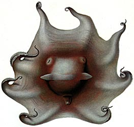
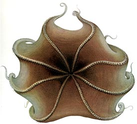
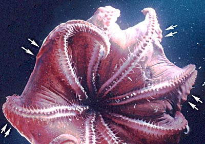
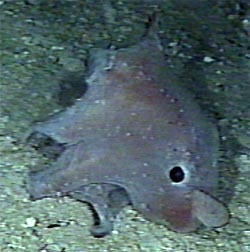

---
aliases:
  - Opisthoteuthis
title: Opisthoteuthis
---

## Phylogeny 

-   « Ancestral Groups  
    -   [Opisthoteuthidae](../Opisthoteuthidae.md)
    -   [Cirrata](../../Cirrata.md)
    -   [Octopod](../../../Octopod.md)
    -  [Octopodiformes](../../../../Octopodiformes.md) 
    -  [Coleoidea](../../../../../Coleoidea.md) 
    -  [Cephalopoda](../../../../../../Cephalopoda.md) 
    -  [Mollusca](../../../../../../../Mollusca.md) 
    -  [Bilateria](../../../../../../../../Bilateria.md) 
    -  [Animals](../../../../../../../../../Animals.md) 
    -  [Eukarya](../../../../../../../../../../Eukarya.md) 
    -   [Tree of Life](../../../../../../../../../../Tree_of_Life.md)

-   ◊ Sibling Groups of  Opisthoteuthidae
    -   [Cirroctopus](Cirroctopus.md)
    -   [Grimpoteuthis](Grimpoteuthis.md)
    -   [Luteuthis](Luteuthis.md)
    -   Opisthoteuthis

-   » Sub-Groups
    -   [Opisthoteuthis         agassizii](Opisthoteuthis_agassizii)
    -   [Opisthoteuthis         albatrossi](Opisthoteuthis_albatrossi)
    -   [Opisthoteuthis bruuni](Opisthoteuthis_bruuni)
    -   [Opisthoteuthis         californiana](Opisthoteuthis_californiana)
    -   [Opisthoteuthis calypso](Opisthoteuthis_calypso)
    -   [Opisthoteuthis         chathamensis](Opisthoteuthis_chathamensis)
    -   [Opisthoteuthis depressa](Opisthoteuthis_depressa)
    -   [Opisthoteuthis extensa](Opisthoteuthis_extensa)
    -   [Opisthoteuthis         grimaldii](Opisthoteuthis_grimaldii)
    -   [Opisthoteuthis hardyi](Opisthoteuthis_hardyi)
    -   [Opisthoteuthis massyae](Opisthoteuthis_massyae)
    -   [Opisthoteuthis         medusoides](Opisthoteuthis_medusoides)
    -   [Opisthoteuthis mero](Opisthoteuthis_mero)
    -   [Opisthoteuthis         persephone](Opisthoteuthis_persephone)
    -   [Opisthoteuthis philipii](Opisthoteuthis_philipii)
    -   [Opisthoteuthis pluto](Opisthoteuthis_pluto)
    -   [Opisthoteuthis robsoni](Opisthoteuthis_robsoni)

# *Opisthoteuthis* [Verrill 1883]

## Flapjack devilfishes 

[Roger Villanueva, Richard E. Young, and Michael Vecchione](http://www.tolweb.org/)

The following 17 nominal species are included in the genus.

-   *[Opisthoteuthis     agassizii](Opisthoteuthis_agassizii)*
    [Verrill, 1883]
-   *[Opisthoteuthis     albatrossi](Opisthoteuthis_albatrossi)*
    [(Sasaki, 1920)]
-   *[Opisthoteuthis     bruuni](Opisthoteuthis_bruuni)*
    [Voss, 1982]
-   *[Opisthoteuthis     californiana](Opisthoteuthis_californiana)*
    [Berry, 1949]
-   *[Opisthoteuthis     calypso](Opisthoteuthis_calypso)*
    [Villanueva, Collins, Sanchez and Voss 2002]
-   *[Opisthoteuthis     chathamensis](Opisthoteuthis_chathamensis)*
    [O\'Shea, 1999]
-   *[Opisthoteuthis     depressa](Opisthoteuthis_depressa)*
    [Ijima & Ikeda, 1895]
-   *[Opisthoteuthis     extensa](Opisthoteuthis_extensa)*
    [Thiele, 1915]
-   *[Opisthoteuthis     grimaldii](Opisthoteuthis_grimaldii)*
    [Joubin, 1903]
-   *[Opisthoteuthis     hardyi](Opisthoteuthis_hardyi)*
    [Villanueva, Collins, Sanchez and Voss 2002]
-   *[Opisthoteuthis     massyae](Opisthoteuthis_massyae)*
    [(Grimpe, 1920)]
-   *[Opisthoteuthis     medusoides](Opisthoteuthis_medusoides)*
    [Thiele, 1915]
-   *[Opisthoteuthis     mero](Opisthoteuthis_mero)* [O\'Shea,
    1999]
-   *[Opisthoteuthis     persephone](Opisthoteuthis_persephone)*
    [Berry, 1918]
-   *[Opisthoteuthis     philipii](Opisthoteuthis_philipii)*
    [Oommen, 1976]
-   *[Opisthoteuthis     pluto](Opisthoteuthis_pluto)* [Berry,
    1918]
-   *[Opisthoteuthis     robsoni](Opisthoteuthis_robsoni)*
    [O\'Shea, 1999]

Containing group: [Opisthoteuthidae](../Opisthoteuthidae.md)

## Introduction

Species of ***Opisthoteuthis*** are the most compressed, in the
anterior-posterior axis, of any cephalopod. This flattened appearance
(due sometimes to preservation) gives them the common name of flapjack
or pancake devilfish. Fresh specimens have ovoid form. Species are
thought to be primarily benthic although they are capable of swimming
and in some species the swimming may be an important component of their
pouncing on minute prey. As in other cirrates, most species are poorly
known.

#### Diagnosis

Opisthoteuthids \...

-   with one or two fields of enlarged suckers on arms of mature males.
-   with small fins.
-   with areolae present at least in young. (Needs confirmation.)
-   with kidney-shaped optic lobe.
-   with white body penetrated by two or more separate optic nerve
    bundles.
-   with U-shaped shell.
-   without tooth-like structures in sucker aperature.

### Characteristics

1.  Arms and web
    1.  Arms of males generally with modified suckers (i.e., enlarged
        and often with complex alignment) in one or two fields (proximal
        and distal).
    2.  Cirri short (in preserved animals).
    3.  Cirri may be retractile into pockets. The retractile (rather
        than just contractile) nature of the cirri has been suggested by
        several authors due to their appearance in preserved animals.
        However, this attribute remains uncertain.
    4.  Web nodules (= web supports; these are often difficult to
        detect) present as multiple or single nodules or absent. 

        
        **Figure**. Oral view of ***Opisthoteuthis grimaldii*** (?).
        Photograph shows multiple web nodules, some of which are
        indicated by the arrows. Also note the rather long cirri in this
        live ***Opisthoteuthis**.* Photograph from a submersible.

2.  Fins
    1.  Small, length approximately half mantle width.
3.  Gills
    1.  Half-orange appearance.
4.  Digestive tract
    1.  Intestine approximately 1.5 - 2.0 times esophagus (and crop) in
        length. Digestive tract not a simple loop (i.e., intestine makes
        lateral bends and/or loops.
    2.  Digestive gland bilobed or unilobed.
    3.  Radula absent.
5.  Eyes
    1.  Large, diameter often 60-70% of ML, 50% of head width.
6.  Optic nerve tract
    1.  Two or more bundles penetrate white body.
7.  Optic lobe
    1.  Kidney-shaped in cross-section.
8.  Shell
    1.  U-shaped, lateral walls of wings not parallel (i.e., spread
        between walls increases toward tips).
    2.  Outer surface of saddle usually with groove (narrow or broad,
        shallow or deep); outer surface rarely flat.
    3.  Wing frequently terminates as elongate, simple, pointed cone;
        termination complex in some species.
9.  Pigmentation
    1.  Areolar spots present. In some species these are difficult to
        detect or absent.

        
        **Figure**. Side view of **Opisthoteuthis agassizii**.
        Photograph from submersible. In this photograph, the lines of
        white areolar spots are easily seen, especially on the arms.

#### Species Comparisons

  ------------ --------------------------------------- --------- -------------
                          **Mature males**                                                                                                                                                              **Both sexes**                                                                               
  Species                 Arm I more robust   Prox. field: No. of suckers   Distal field: No. of suckers   Prox. field: Arm no.   Distal field: Arm no.   Distal field: Largest sucker, mean position   DESD\> PESD \*\*   Arm sucker counts   Funnel organ   Web supports   Digest. gland bilobed   Ocean
  ***O. agassizii***      No                  5                             7-8                            I-IV                   I-IV                    34-36                                         No/yes             58-80               V-shape        Multiple       No                      W.N. Atlantic
  ***O. albatrossi***     No                  0                             3                              None                   I                       ?                                             Yes                80                  ?              Single?        Yes                     N. Pacific
  ***O. bruuni***         No                  3                             2-3                            I-IV                   I-IV                    24-27\*                                       No                 ?                   2 pads         ?              ?                       E. S. Pacific
  ***O. californiana***   No                  8-10                          3-8                            I-IV                   I                       ca. 27                                        Yes                ?                   2 pads         ?              ?                       N. Pacific
  ***O. calypso***        No                  2-6                           2-3                            III                    I-IV                    26-27                                         Yes                47-58               2 pads         Single         No                      E. Atlantic
  ***O. chathamensis***   No                  5-7                           6-8                            I-IV                   I-IV                    ca 22                                         Equal?             41-55               V-shape        ?              Yes                     W. S. Pacific
  ***O. depressa***       No                  16                            0                              I-IV                   None                    \--                                           No                 50                  ?              Absent?        ?                       W. N. Pacific
  ***O. extensa***        ?                   ?                             ?                              ?                      ?                       ?                                             ?                  ?                   ?              ?              ?                       E. Indian
  ***O. grimaldii***      No                  4-11                          9-10                           I-IV                   I-IV                    29-31                                         No                 73-80               2 pads         Single         Yes                     E. Atlantic
  ***O. hardyi***         Slight              4-9                           9-14                           I-IV                   I-IV                    22-24                                         Equal              60-67               ?              Absent         No                      high S. Atlantic
  ***O. massyae***        Yes                 7-8                           9-11                           I-IV                   II-IV                   40-41                                         No                 81-106              2 pads         Multiple       Yes                     E. Atlantic
  ***O. medusoides***     ?                   ?                             ?                              ?                      IV                      ?                                             ?                  ?                   ?              ?              ?                       W. Indian
  ***O. mero***           No                  5-8                           ?                              I-IV                   None                    \--                                           No                 54-71               V-shape        ?              Yes                     W. S. Pacific
  ***O. persephone***     ?                   ?                             ?                              ?                      ?                       ?                                             ?                  93                  ?              ?              Yes                     Off S. Aust.
  ***O. philipii***       ?                   5-11                          ?                              ?                      ?                       ?                                             ?                  ?                   V-shape        Single         ?                       NW Indian
  ***O. pluto***          ?                   ?                             3-4                            ?                      II-IV                   ?                                             No?                80-85               2 pads         ?              Yes                     Off S. Aust.
  ***O. robsoni***        No                  7-8                           ?                              I-IV                   None                    \--                                           No                 74-89               V-shape        ?              No                      W. S. Pacific
  ------------ --------------------------------------- --------- -------------

\*From illustration. \*\* DESD = Distal field enlarged sucker diameter;
PESD = Proximal field enlarged sucker diameter. For the purposes of this
table, a distal field is considered to be absent if suckers there do not
show a distinct enlargement.

### Nomenclature

***Cirroteuthis caudani*** Joubin, 1896 appears to be a species of
***Opisthoteuthis*** \[probably ***O. grimaldii*** or ***O. massyae***
according to Martin Collins, pers. comm., 2002\] but the type is
apparently lost (Villanueva *et al.*, 2002)

### References

Chun, C. 1915. Die Cephalopoden. Myopsida, Octopoda. Wissenschaftliche
Ergebnisse der Deutschen Tiefsee-Expedition, \"Valdivia\" 1898-1899, 18
(2): 405-522 + Atlas.

O\'Shea, Steve. 1999. The Marine Fauna of New Zealand: Octopoda
(Mollusca: Cephalopoda). NIWA Biodiversity Memoir 112: 280pp.

Sweeney, M.J. 2001. [Current Classification of Recent Cephalopoda.](http://www.mnh.si.edu/cephs/newclass.pdf) pdf file, 59 pp.

Villanueva, R. 1992. Continuous spawning in the cirrate octopods
*Opisthoteuthis agassizii* and *O. vossi*: features of sexual maturation
defining a reproductive strategy in cephalopods. Marine Biology,
114:265-275.

Villanueva, R., Collins, M., Sanchez, P. and N. Voss. 2002. Systematics,
distribution and biology of the cirrate octopods of the genus
*Opisthoteuthis* (Mollusca, Cephalopoda) in the Atlantic Ocean, with
description of two new species. Bulletin of Marine Science
71(2):933-985.

Voss, G. L. and W. G. Pearcy. 1990. Deep-water octopods (Mollusca:
Cephalopoda) of the Northeastern Pacific. Proc. Calif. Acad. Sci. 47:
47-94.

## Title Illustrations

 

  ------------------------------------------------------------
  scientific_name ::  Opisthoteuthis extensa
  Reference         from Thiele in Chun, C. 1915. Die Cephalopoden. Myopsida, Octopoda. Wissenschaftliche Ergebnisse der Deutschen Tiefsee-Expedition, \"Valdivia\" 1898-1899, 18 (2): 405-522 + Atlas.
  View              Aboral
  Type              Holotype
  ------------------------------------------------------------
 

  ------------------------------------------------------------
  scientific_name ::  Opisthoteuthis extensa
  Reference         from Thiele in Chun, C. 1915. Die Cephalopoden. Myopsida, Octopoda. Wissenschaftliche Ergebnisse der Deutschen Tiefsee-Expedition, \"Valdivia\" 1898-1899, 18 (2): 405-522 + Atlas.
  View              Oral
  Type              Holotype
  ------------------------------------------------------------

## Confidential Links & Embeds: 

### #is_/same_as :: [[/_Standards/bio/bio~Domain/Eukarya/Animal/Bilateria/Mollusca/Cephalopoda/Coleoidea/Octopodiformes/Octopod/Cirrata/Opisthoteuthidae/Opisthoteuthis|Opisthoteuthis]] 

### #is_/same_as :: [[/_public/bio/bio~Domain/Eukarya/Animal/Bilateria/Mollusca/Cephalopoda/Coleoidea/Octopodiformes/Octopod/Cirrata/Opisthoteuthidae/Opisthoteuthis.public|Opisthoteuthis.public]] 

### #is_/same_as :: [[/_internal/bio/bio~Domain/Eukarya/Animal/Bilateria/Mollusca/Cephalopoda/Coleoidea/Octopodiformes/Octopod/Cirrata/Opisthoteuthidae/Opisthoteuthis.internal|Opisthoteuthis.internal]] 

### #is_/same_as :: [[/_protect/bio/bio~Domain/Eukarya/Animal/Bilateria/Mollusca/Cephalopoda/Coleoidea/Octopodiformes/Octopod/Cirrata/Opisthoteuthidae/Opisthoteuthis.protect|Opisthoteuthis.protect]] 

### #is_/same_as :: [[/_private/bio/bio~Domain/Eukarya/Animal/Bilateria/Mollusca/Cephalopoda/Coleoidea/Octopodiformes/Octopod/Cirrata/Opisthoteuthidae/Opisthoteuthis.private|Opisthoteuthis.private]] 

### #is_/same_as :: [[/_personal/bio/bio~Domain/Eukarya/Animal/Bilateria/Mollusca/Cephalopoda/Coleoidea/Octopodiformes/Octopod/Cirrata/Opisthoteuthidae/Opisthoteuthis.personal|Opisthoteuthis.personal]] 

### #is_/same_as :: [[/_secret/bio/bio~Domain/Eukarya/Animal/Bilateria/Mollusca/Cephalopoda/Coleoidea/Octopodiformes/Octopod/Cirrata/Opisthoteuthidae/Opisthoteuthis.secret|Opisthoteuthis.secret]] 

